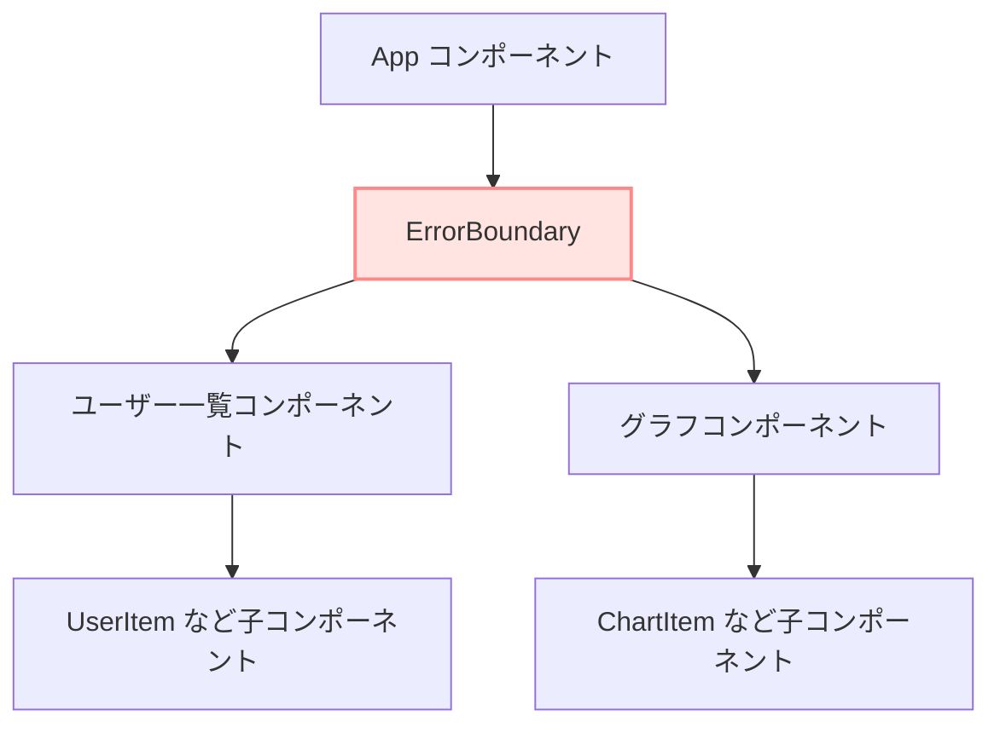
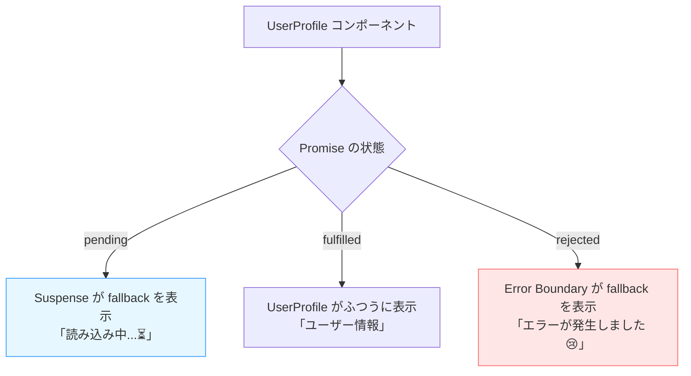

# 第119章：「エラーバウンダリ」の考え方

この章では、

* 「`try { ... } catch { ... }` じゃダメなエラー」って何？
* そのために「エラーバウンダリ（Error Boundary）」が必要になる理由
* `Suspense` や `use(Promise)` とエラーバウンダリの関係
* 画面のどこをエラーバウンダリで囲むと使いやすいか

を、ゆる〜くイメージできるようになるのがゴールです ✨

---

## 1️⃣ 普通のエラー vs React の「やっかいなエラー」

JavaScript ではふつう、

* 予想できそうなエラー → `try { ... } catch (e) { ... }` でなんとかする
* ネットワークエラー → `if (!res.ok) { ... }` みたいに分岐で処理

…という感じで、**「自分の書いた関数の中で」エラーを処理**しますよね。

でも React では、

* コンポーネントの **`return` の中（レンダー中）**
* フックの実行中（`use()` や他の Hook 内）

でエラーが起きることがあります。
こういうエラーは、普通の `try/catch` では **キャッチできません**。
React のレンダリングの仕組みの中で投げられているからです。([React][1])

そこで登場するのが **「エラーバウンダリ（Error Boundary）」** です 💥

---

## 2️⃣ エラーバウンダリってなに？🧱

ざっくりいうと、

> **「この部品より下の子コンポーネントでエラーが起きたら、
> ここで受け止めて、代わりの表示を出すよ〜」**

という「安全ネット」みたいなコンポーネントです。

公式の説明だと：

* 子コンポーネントの **レンダリング中**
* ライフサイクル（古いクラスコンポーネントのメソッド）
* コンストラクタ

で起きたエラーをキャッチして、
アプリ全体がクラッシュする代わりに**フォールバックUI**を表示してくれます。([React][2])

反対に、**キャッチしてくれないもの**もあります：

* クリックイベントの中のエラー（`onClick` の中）
* `setTimeout` の中で起きたエラー
* サーバーサイドレンダリング中のエラー など([React][2])

これらは、ふつうの `try/catch` や `.catch()` でちゃんと処理する世界です。

---

## 3️⃣ エラーバウンダリの「位置」イメージ図 🧠

「どの部分を守ってくれるのか？」をイメージで見てみましょう。



* `ErrorBoundary` より **下にぶら下がっているコンポーネント全部** が「守られている範囲」になります。
* その中でエラーが起きると、子どもたちの代わりに
  `ErrorBoundary` が「ごめん！エラーが起きちゃいました…」みたいな画面を出してくれます。([React][2])

逆にいうと、**範囲の外で起きたエラーは守ってくれない**ので、
「どの範囲を一緒にラップするか？」は設計ポイントになります 💡

---

## 4️⃣ `Suspense` と `use(Promise)` とエラーバウンダリの関係 🎭

React 19 では `use(Promise)` が正式に入って、

* **読み込み中** → `Suspense` が担当
* **エラー** → エラーバウンダリが担当

という役割分担が、かなりハッキリしました。([React][3])

### `use(Promise)` がやってること（ざっくり）

`use(somePromise)` を呼んだとき：

* **Promise が pending 中**
  → コンポーネントは「いまは描けません！」と言って一旦サスペンド
  → 一番近くの `<Suspense fallback={...}>` が「読み込み中UI」を出す
* **Promise が resolve した**
  → `use()` が値を受け取って、ふつうにレンダリング
* **Promise が reject した**
  → これは「エラー」として扱われ、
  一番近いエラーバウンダリまでエラーが「バブルアップ」して届く([Code With Seb Blog][4])

つまり、**`Suspense` + エラーバウンダリ** をセットで使うと、

* ローディング状態は `Suspense`
* 失敗したときのエラー表示はエラーバウンダリ

という、きれいな分担になります ✨

---

## 5️⃣ 状態ごとの流れを図で見てみる 🌊

`UserProfile` というコンポーネントが、`use()` でユーザー情報を読み込むケースを想像してみましょう。



ここで押さえておきたいのは：

* **ローディング** → `Suspense` の `fallback`
* **エラー** → エラーバウンダリの `fallback`

というふうに、「表示を切り替える担当が違う」ということです。([Code With Seb Blog][4])

---

## 6️⃣ どこに置く？よくある配置パターン 🧭

エラーバウンダリは、**どこを囲むか** で UX がかなり変わります。

### ❌ よくないパターン：アプリ全体を1個でラップ

```tsx
// App.tsx（ざっくりイメージ）
<ErrorBoundary fallback={<p>アプリでエラーが発生しました…</p>}>
  <Suspense fallback={<p>全部読み込み中…</p>}>
    <Header />
    <UserSection />
    <ProductsSection />
    <Footer />
  </Suspense>
</ErrorBoundary>
```

* どこか1つの API がコケただけで、**画面全体がエラー画面**に 😇
* どれか1箇所が遅いだけで、**全部「読み込み中…」になってしまう**

こういう「全部ひとまとめ」の配置は、UX 的にはあまりよくないと指摘されています。([Zenn][5])

### ✅ おすすめパターン：セクションごとにラップ

```tsx
<main>
  <Header />

  <section>
    <h2>ユーザー情報</h2>
    <ErrorBoundary fallback={<p>ユーザー情報の取得に失敗しました😢</p>}>
      <Suspense fallback={<p>ユーザー情報を読み込み中…⏳</p>}>
        <UserSection />
      </Suspense>
    </ErrorBoundary>
  </section>

  <section>
    <h2>商品一覧</h2>
    <ErrorBoundary fallback={<p>商品一覧の取得に失敗しました🙇‍♀️</p>}>
      <Suspense fallback={<p>商品を読み込み中…🛒</p>}>
        <ProductsSection />
      </Suspense>
    </ErrorBoundary>
  </section>

  <Footer />
</main>
```

こうしておくと：

* ユーザー情報だけエラー → 商品一覧は普通に使える
* 商品一覧だけ遅い → その部分だけ「読み込み中」にできる

というふうに、**エラーやローディングの影響範囲を小さくできる**ので、
ユーザー体験も、テストもしやすくなります。([Zenn][5])

---

## 7️⃣ ちょっとだけコードのイメージをつかもう 💻

この章は「考え方」がメインなので、実際の実装（クラスコンポーネントでの ErrorBoundary や、`react-error-boundary` ライブラリの使い方）は次の章・演習に回しますが、
**使う側のイメージ**だけ先に見ておきましょう。

### 🔹 App 側（使う側）のイメージ

```tsx
// App.tsx
import { Suspense } from "react";
import { UserProfile } from "./UserProfile";
import { ErrorBoundary } from "./ErrorBoundary";

export function App() {
  return (
    <main style={{ padding: "1rem" }}>
      <h1>プロフィール画面 🧑‍💻</h1>

      <ErrorBoundary fallback={<p>ユーザー情報の読み込みに失敗しました…😢</p>}>
        <Suspense fallback={<p>ユーザー情報を読み込み中です…⏳</p>}>
          <UserProfile />
        </Suspense>
      </ErrorBoundary>
    </main>
  );
}
```

ポイントは：

* `ErrorBoundary` コンポーネントは **「この中で起きたエラーをキャッチする係」**
* `Suspense` は **「この中で `use()` が待っているあいだのローディング表示をする係」**

というふうに、「重ねて」使っているところです。

### 🔹 エラーを投げる側のイメージ

```tsx
// UserProfile.tsx（イメージ）
import { use } from "react";

type User = {
  id: number;
  name: string;
};

function fetchUser(): Promise<User> {
  // ここではイメージとして Promise を返す関数だけ想像
  return fetch("/api/user").then((res) => {
    if (!res.ok) {
      // ここで throw すると、最終的にはエラーバウンダリに届く
      throw new Error("ユーザー取得に失敗しました");
    }
    return res.json() as Promise<User>;
  });
}

export function UserProfile() {
  const user = use(fetchUser()); // pending → Suspense / error → ErrorBoundary

  return (
    <section>
      <p>こんにちは、{user.name} さん 🌸</p>
    </section>
  );
}
```

* `fetchUser()` の中で `throw` されたエラーは、`use()` が呼ばれた時点で
  「レンダリング中のエラー」として扱われ、**一番近いエラーバウンダリに届きます**。([React][3])
* pending のあいだは `Suspense` が `fallback` を表示してくれます。

---

## 8️⃣ React 19 ならではのポイント ✨

React 19 では、

* フォーム送信を扱う **Actions**
* それに関連する `useActionState`, `useFormStatus`, `useOptimistic`

などが追加されましたが、
**Actions の中でエラーが起きたときも、近くのエラーバウンダリに伝わる**ようになっています。([it.react.dev][6])

つまり、React 19 世代では：

* データ読み込み → `use(Promise)` + `Suspense` + エラーバウンダリ
* フォーム送信 → Actions + エラーバウンダリ

という形で、
**「非同期処理の失敗は、最終的にはエラーバウンダリに集約して扱う」**
という設計がかなり自然になっています。

---

## 9️⃣ この章のまとめ ✅

👀 **おぼえておきたいポイント**

* `try/catch` では、レンダリング中や Hook の中で起きたエラーはキャッチできない
* そのために、React には **エラーバウンダリ** という「エラー専用の安全ネット」がある
* `use(Promise)` の **pending** は `Suspense` が、**エラー** はエラーバウンダリが担当
* エラーバウンダリは「どこをラップするか」で UX が大きく変わる

  * アプリ全体 1 個よりも
  * **セクションごとに分けてラップ** するほうが使いやすい

📝 **ミニ確認クイズ（心の中で答えてみてね）**

1. `Suspense` とエラーバウンダリ、それぞれ何の状態を担当していたっけ？
2. 「ユーザー情報」と「商品一覧」がある画面で、どんなふうにエラーバウンダリを配置するとよさそう？
3. `use(fetchUser())` で Promise が reject されたとき、最終的にどこがフォールバックUIを出してくれる？

次の **第120章** では、
ここで学んだ考え方をそのまま使って、
`Suspense` とエラーバウンダリを実際に組み合わせたコードを書いていきましょう 💻🌸

[1]: https://react.dev/reference/eslint-plugin-react-hooks/lints/error-boundaries?utm_source=chatgpt.com "error-boundaries"
[2]: https://legacy.reactjs.org/docs/error-boundaries.html?utm_source=chatgpt.com "Error Boundaries"
[3]: https://react.dev/reference/react/use?utm_source=chatgpt.com "use"
[4]: https://codewithseb.com/blog/react-suspense-tutorial-lazy-loading-async-rendering-data-fetching-react-18-19?utm_source=chatgpt.com "Lazy Loading, Async Rendering & Data Fetching (React 18/19)"
[5]: https://zenn.dev/mkt_engr/articles/20251012_error-boundary-suspense-storybook?utm_source=chatgpt.com "Error Boundary/Suspenseはどこに置く？ テスト・Storybook・ ..."
[6]: https://it.react.dev/blog/2024/12/05/react-19?utm_source=chatgpt.com "React v19"
