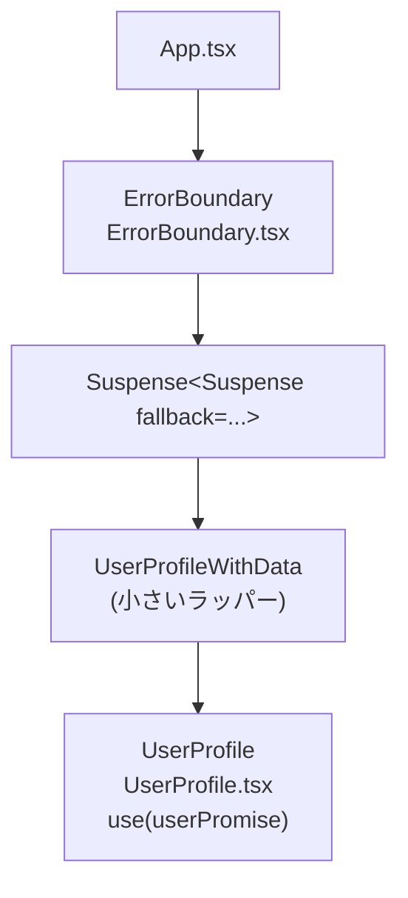
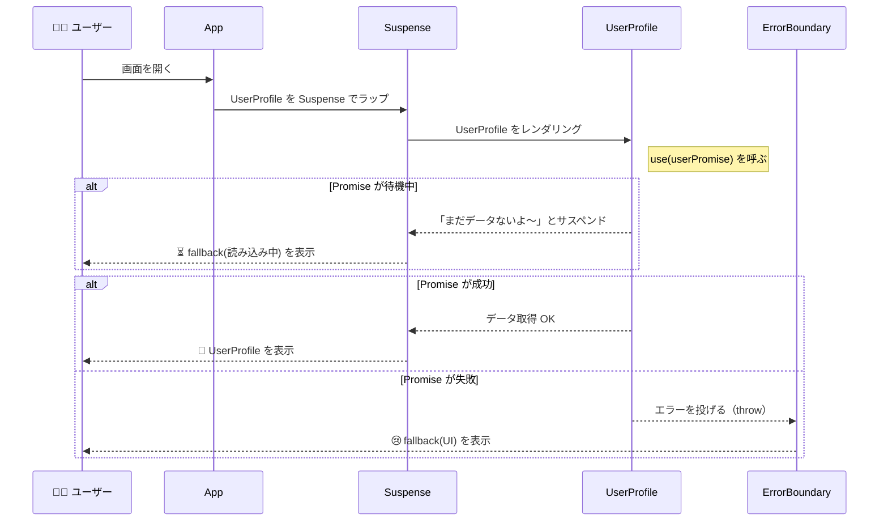

# 第120章：練習：`Suspense` とエラーバウンダリを組み合わせる

---

## 1️⃣ 今日のゴール 🎯

この章では、React 19 の

* `use(Promise)`（`use` フック）
* `<Suspense>`
* ErrorBoundary（エラーバウンダリ）

を**セットで動かす練習**をします 🧩

やりたいことはシンプル：

* 通信中 👉 「読み込み中…」の画面（`Suspense` のおしごと）
* エラー発生 👉 「ごめんね…」の画面（ErrorBoundary のおしごと）
* 成功 👉 ユーザー情報をふつうに表示（コンポーネント本体のおしごと）

React 19 では、`use(Promise)` が**Promiseが解決するまでコンポーネントを「サスペンド」**し、
待っている間は近くの `<Suspense>` の `fallback` が表示され、
エラーになったら近くの ErrorBoundary でキャッチされる、という流れで動きます。([React][1])

---

## 2️⃣ 全体イメージ図 🧠（コンポーネントの並び）

まずはコンポーネントの並びを図でイメージしてみます 👀



* 一番外側：`App`
* その中：`ErrorBoundary`（エラー用の安全ネット🫧）
* さらに中：`<Suspense>`（読み込み中の表示担当⏳）
* 一番奥：`UserProfile`（実際にデータを表示する子）

---

## 3️⃣ 作るファイル一覧 🗂

`src` フォルダの中に、こんな感じでファイルを用意します ✨

* `src/fakeApi.ts` …… データを返す「なんちゃってAPI」
* `src/ErrorBoundary.tsx` …… ErrorBoundary コンポーネント
* `src/UserProfile.tsx` …… `use(Promise)` でデータを読むコンポーネント
* `src/App.tsx` …… ぜんぶを組み合わせるメイン

※ プロジェクトは Vite + React + TS で作ってある前提です。（すでにこの教材で使っているプロジェクトを続けて使ってOK）

---

## 4️⃣ ステップ1：Promiseを返す「なんちゃってAPI」 ✨

`use(Promise)` と `Suspense` を試すには、「ちょっと待ってから結果を返す Promise」があるとちょうど良いです。

`src/fakeApi.ts` を作って、こう書いてみてください 💻

```ts
// src/fakeApi.ts
export type User = {
  id: string;
  name: string;
  bio: string;
};

export function loadUser(userId: string): Promise<User> {
  console.log('loadUser called for', userId);

  return new Promise((resolve, reject) => {
    setTimeout(() => {
      // エラー用のテスト：userId が "error" のときは失敗させる
      if (userId === 'error') {
        reject(new Error('ユーザー情報の取得に失敗しました'));
        return;
      }

      // ふつうに成功するパターン
      resolve({
        id: userId,
        name: 'React だいすきさん ✨',
        bio: 'カフェで TypeScript を書くのが生きがいです ☕️💻',
      });
    }, 1000); // 1秒だけわざと待たせて、読み込み中を再現
  });
}

// ✅ Suspense に渡すための Promise（モジュールの外側で1回だけ作る）
export const userPromise = loadUser('1');

// ❌になるテスト用の Promise（あとでエラー表示の確認に使う）
export const errorUserPromise = loadUser('error');
```

ポイント 👇

* `loadUser` は 1 秒後に `User` を返す（またはエラーを投げる）Promise
* `userPromise` …… 通常の成功パターン
* `errorUserPromise` …… わざと失敗するパターン
  → 後で「エラー画面」をテストするのに使います 💣

React 19 の `use` は、**Promise が解決するまで待ち、解決したら結果を返し、失敗したらエラーとして投げる**ように統合されています。([React][1])

---

## 5️⃣ ステップ2：ErrorBoundary コンポーネントを作る 🧯

ErrorBoundary は「この中でエラーが起きたら、アプリ全体を落とさずにエラーメッセージを出す役」みたいな子です。
React では**ErrorBoundary はクラスコンポーネントで作る**のが標準的なやり方です。([React][2])

`src/ErrorBoundary.tsx` を作って、こう書きます：

```tsx
// src/ErrorBoundary.tsx
import {
  Component,
  type ReactNode,
  type ErrorInfo,
} from 'react';

type ErrorBoundaryProps = {
  fallback: ReactNode;   // エラー時に表示したい UI
  children: ReactNode;   // 守ってあげる子どもたち
};

type ErrorBoundaryState = {
  hasError: boolean;
};

export class ErrorBoundary
  extends Component<ErrorBoundaryProps, ErrorBoundaryState> {
  constructor(props: ErrorBoundaryProps) {
    super(props);
    this.state = { hasError: false };
  }

  // 子のどこかでエラーが投げられるとここが呼ばれて hasError: true になる
  static getDerivedStateFromError() {
    return { hasError: true };
  }

  // ログを取りたいときはここでサービスに送ったりもできる
  componentDidCatch(error: unknown, info: ErrorInfo) {
    console.error('ErrorBoundary caught an error:', error, info);
  }

  render() {
    if (this.state.hasError) {
      // エラーが起きたら fallback を表示
      return this.props.fallback;
    }

    // ふつうは子どもたちをそのまま表示
    return this.props.children;
  }
}
```

ここではまだ「リトライ」処理は入れてません。
リトライは `key` を変えてコンポーネントを「作り直す」テクニックをあとで使います 🔁

---

## 6️⃣ ステップ3：`use(Promise)` でデータを読むコンポーネント 🧑‍💻

次は、React 19 の新しい `use` を使って、`Promise` からデータを読み取るコンポーネントを作ります。
`use` は

* Promise が**待機中** → コンポーネントを「サスペンド」させる（`<Suspense>` に制御が移る）
* Promise が**解決** → 返ってきた値をそのまま返す
* Promise が**失敗** → エラーを投げる（ErrorBoundary にキャッチされる）

というふるまいになっています。([React][1])

`src/UserProfile.tsx` を作ります：

```tsx
// src/UserProfile.tsx
import { use } from 'react';
import type { User } from './fakeApi';

type UserProfileProps = {
  userPromise: Promise<User>;
};

export function UserProfile({ userPromise }: UserProfileProps) {
  // ✨ ここがポイント：Promise を use に渡して値を読み取る
  const user = use(userPromise);

  return (
    <section style={{ padding: '1rem', border: '1px solid #ddd', borderRadius: '8px' }}>
      <h2 style={{ marginBottom: '0.5rem' }}>
        👤 {user.name}
      </h2>
      <p style={{ margin: 0 }}>{user.bio}</p>
    </section>
  );
}
```

ここではあえてローディングやエラー判定は**一切書いていません**。
「待ち」と「エラー」は全部、`Suspense` と ErrorBoundary に任せる作戦です 🪄

---

## 7️⃣ ステップ4：`App.tsx` でぜんぶ組み合わせる 🧅

いよいよメインの `App.tsx` です。
ここでやることはこんな感じ👇

* ✅ `useState` で「エラーテストモード」の ON/OFF を持つ
* ✅ ErrorBoundary の中に `<Suspense>` を入れる（この並びがオススメのパターン）([Code With Seb Blog][3])
* ✅ さらにその中に `UserProfileWithData` を置く

`src/App.tsx` を次の内容に差し替えてください：

```tsx
// src/App.tsx
import { Suspense, useState } from 'react';
import { ErrorBoundary } from './ErrorBoundary';
import { UserProfile } from './UserProfile';
import { userPromise, errorUserPromise } from './fakeApi';

type UserProfileWithDataProps = {
  useErrorTest: boolean;
};

// Promise の選択だけをやる、小さなラッパーコンポーネント
function UserProfileWithData({ useErrorTest }: UserProfileWithDataProps) {
  const promise = useErrorTest ? errorUserPromise : userPromise;
  return <UserProfile userPromise={promise} />;
}

export default function App() {
  const [useErrorTest, setUseErrorTest] = useState(false);

  return (
    <main style={{ fontFamily: 'system-ui, sans-serif', padding: '2rem', maxWidth: 600, margin: '0 auto' }}>
      <h1 style={{ fontSize: '1.6rem', marginBottom: '1rem' }}>
        React 19 ✨ Suspense × ErrorBoundary 練習
      </h1>

      <p style={{ marginBottom: '1rem' }}>
        ✅ 通常モード：ユーザー情報を読み込みます。<br />
        ⚠️ エラーテストモード：わざとエラーを発生させて、ErrorBoundary の動きを確認します。
      </p>

      <label style={{ display: 'inline-flex', alignItems: 'center', gap: '0.5rem', marginBottom: '1.5rem' }}>
        <input
          type="checkbox"
          checked={useErrorTest}
          onChange={(e) => setUseErrorTest(e.target.checked)}
        />
        エラーテストモードにする 💣
      </label>

      {/* key を変えることで、モードが変わったら ErrorBoundary を作り直してあげる */}
      <ErrorBoundary
        key={useErrorTest ? 'error-mode' : 'normal-mode'}
        fallback={
          <div style={{ padding: '1rem', borderRadius: '8px', backgroundColor: '#fff3f3' }}>
            <p style={{ marginBottom: '0.75rem' }}>
              😢 ユーザー情報の読み込みに失敗しちゃいました…
            </p>
            <button
              type="button"
              onClick={() => setUseErrorTest(false)}
              style={{
                padding: '0.5rem 1rem',
                borderRadius: '999px',
                border: 'none',
                cursor: 'pointer',
              }}
            >
              🔁 通常モードに戻す
            </button>
          </div>
        }
      >
        <Suspense
          fallback={
            <p style={{ padding: '0.75rem 0' }}>
              ⏳ ユーザー情報を読み込み中です…ちょっと待ってね…
            </p>
          }
        >
          <UserProfileWithData useErrorTest={useErrorTest} />
        </Suspense>
      </ErrorBoundary>
    </main>
  );
}
```

ポイントまとめ 💡

* `<ErrorBoundary>` の中に `<Suspense>` を置いています
  → 「待ち」は `Suspense`、**「失敗」**は ErrorBoundary に任せるきれいな分担 ✨
* `ErrorBoundary` に `key` を付けて、モードが変わると**コンポーネントを作り直す**ようにしています
  → 一度エラーになっても、モードを切り替えたらキレイな状態に戻る 🌱
* `fallback` には、ふつうの JSX をそのまま書けばOK（絵文字も書き放題）

---

## 8️⃣ 実行して動きをチェックしよう ▶️

ターミナルで

```bash
npm run dev
```

をしてブラウザで動かしてみましょう 👀

### ✅ 通常モード（チェック OFF）

1. 画面を開くと、最初は

   > ⏳ ユーザー情報を読み込み中です…

   が出る（`<Suspense>` の `fallback`）
2. 1秒くらい待つと、`UserProfile` の中身が表示される

   > 👤 React だいすきさん ✨
   > カフェで TypeScript を書くのが生きがいです ☕️💻

### ⚠️ エラーテストモード（チェック ON）

1. チェックを ON にして、もう一度画面が読み込まれると

   * `UserProfileWithData` が `errorUserPromise` を使う
   * `use(errorUserPromise)` が、**reject された Promise を受け取ってエラーを投げる**
2. そのエラーを、近くの ErrorBoundary がキャッチして

   * `fallback` の「😢 ユーザー情報の読み込みに失敗しちゃいました…」が表示される
3. 「🔁 通常モードに戻す」ボタンを押すと

   * `useErrorTest` が `false` になって `key` も変わる
   * ErrorBoundary が作り直され、ふつうのユーザー読み込みに戻る

---

## 9️⃣ 状態の流れをシーケンス図で見てみる 🌊

「成功」と「エラー」それぞれの流れを、Mermaid のシーケンス図で見ておきましょう 🎨



上の図みたいに、

* 「待つ」→ `Suspense`
* 「失敗する」→ ErrorBoundary

というふうに役割分担して考えるとスッキリします 🧼

---

## 🔟 仕上げミニ練習 ✍️（余裕があれば）

ちょっと手を動かして、理解をもう一段深くしてみましょう 💪

1. **メッセージと絵文字を変えてみる**

   * `Suspense` の `fallback` を

     * 「📡 サーバーとおしゃべり中…」みたいなテキストに変えてみる
   * ErrorBoundary の `fallback` を

     * 「📵 ネットワークが不安定みたい…もう一回試してみよ？」に変えてみる

2. **ErrorBoundary の `fallback` に「再読み込み」ボタンを追加**

   * 例：`onClick={() => window.location.reload()}` でページをまるごとリロードしてみる
     （あくまで練習用。実アプリではもう少し丁寧にやります）

3. **`UserProfile` に「ID表示」や「アイコン」などを足してみる**

   * `User` 型に `iconEmoji: string` を足してみて、
   * `👩‍💻` や `🧑‍🎓` など、好きな絵文字でユーザーアイコンを表示してみる

---

これで

* `use(Promise)`
* `<Suspense>` の `fallback`
* ErrorBoundary の `fallback`

を**まとめて体験する練習**ができました 🎉

次の章では、このパターンをより複雑な画面（複数の Suspense を並べる 等）にも応用していきましょう 🚀

[1]: https://react.dev/reference/react/use?utm_source=chatgpt.com "use"
[2]: https://legacy.reactjs.org/docs/error-boundaries.html?utm_source=chatgpt.com "Error Boundaries"
[3]: https://codewithseb.com/blog/react-suspense-tutorial-lazy-loading-async-rendering-data-fetching-react-18-19?utm_source=chatgpt.com "Lazy Loading, Async Rendering & Data Fetching (React 18/19)"
