# 第122章：【v19】Form Actions の考え方

`<form action={...}>` でフォーム送信を「おまかせ」スタイルにしよう 💌

---

### 1️⃣ この章でやること 🎯

この章では、

* 「Form Actions（フォーム・アクション）」って何者？🤔
* これまでの `onSubmit` スタイルと、v19の `<form action={...}>` スタイルの違い
* `action` に渡す関数が、どんな役割を持つのか

を **ざっくりイメージで理解する** のがゴールです 🌈
（コードは軽め・イメージ重視。詳しい実装は次の章からやっていきます 🧪）

---

### 2️⃣ これまでのフォーム vs v19 Form Actions 🥊

#### 🥺 これまでのフォーム（React 18 までメインだった考え方）

* `<form onSubmit={handleSubmit}>` を使う
* `handleSubmit(e)` の中で

  * `e.preventDefault()` を書いてブラウザのデフォルト送信を止める
  * `new FormData(e.currentTarget)` でデータを取り出す
  * `useState` で「送信中」「エラー」などの状態を自前で管理する

#### 😎 v19 の Form Actions の考え方

* `<form action={someAction}>` と書く
* `someAction` は「フォームが送信されたら実行される関数」
* React 19 が

  * フォーム送信のタイミング
  * 非同期処理（`async` 関数）
  * 送信中かどうか（pending）
  * エラーの扱い
    などを *Actions* という仕組みでかなりいい感じに扱いやすくしてくれる仕組みです ([React][1])

---

### 3️⃣ フォーム送信の流れを図で見てみる 🧠✨

Mermaid で、「ユーザーが入力 → Action 関数が走る → UI が更新される」までをざっくり図解してみます 🧩

```mermaid
flowchart LR
  A["ユーザーがフォームに入力 ✍️"]
  B["<form> を送信<br/>(Enter / ボタン) 🚀"]
  C["action 関数が呼ばれる 🧠"]
  D["サーバー通信や state 更新などを実行 💾"]
  E["React がUIを再描画 ✨"]

  A --> B --> C --> D --> E
```



ポイントは：

* **送信の起点はあくまで `<form>`**
* 「送信されたらこの関数（Action）を実行してね〜」と
  `<form action={myAction}>` で React にお願いするイメージです 🐣

---

### 4️⃣ 「昔ながらの書き方」と比べてみる 🔍

まずは「昔の書き方」をざっくり思い出してみます 🧃
（前の章の復習みたいな感じで眺めるだけでOK）

#### 🧵 旧スタイル：`onSubmit` + `event` でがんばるパターン

```tsx
import type { FormEvent } from "react";

export function ContactFormOld() {
  async function handleSubmit(event: FormEvent<HTMLFormElement>) {
    event.preventDefault(); // ← 自分で止める必要があった

    const formData = new FormData(event.currentTarget);
    const message = formData.get("message");

    // ここで fetch などでサーバーに送る
    console.log("送信メッセージ:", message);
  }

  return (
    <form onSubmit={handleSubmit}>
      <label>
        メッセージ：
        <input name="message" />
      </label>
      <button type="submit">送信</button>
    </form>
  );
}
```

やっていることは：

* `onSubmit` でイベントを受け取る
* `preventDefault()` を呼ぶ
* `FormData` を作る
* そのあと自分で `fetch` とか `setState` とかを組み立てる

「フォーム送信まわりの雑務」を自分で全部やっている感じです 🧹

---

### 5️⃣ v19スタイル：`<form action={...}>` に「おまかせ」する ✨

React 19 では、`<form>` の **`action` に “関数” を渡せる** ようになりました。
React の公式ドキュメントにも、このような形が載っています ([React][2])

#### 🌟 新スタイル：`<form action={saveMessage}>`

「フォーム送信のときに実行したい関数」を用意して、それを `action` に渡します。

```tsx
export function ContactForm() {
  async function saveMessage(formData: FormData) {
    // ← event じゃなくて FormData がそのまま来るのがポイント！
    const message = formData.get("message");

    if (typeof message !== "string" || message.trim() === "") {
      alert("メッセージを入力してね 😊");
      return;
    }

    // 本当はここでサーバーに送るイメージ
    await fakeApiSave(message);
    alert(`送信しました 💌: ${message}`);
  }

  return (
    <form action={saveMessage}>
      <label>
        メッセージ：
        <input name="message" />
      </label>
      <button type="submit">送信</button>
    </form>
  );
}

async function fakeApiSave(message: string) {
  // ダミーでちょっと待つだけ
  return new Promise<void>((resolve) => {
    setTimeout(() => resolve(), 800);
  });
}
```

👀 ここで大事なポイント：

* `onSubmit` ではなく **`action={saveMessage}`** を使っている
* `saveMessage` は `event` ではなく **`formData: FormData`** を受け取る
* `preventDefault()` は書いていない（React がいい感じにハンドリングしてくれる）([React][2])
* フォームの各フィールドは **`name` 属性** で識別する
  → `formData.get("message")` で値を取れる

---

### 6️⃣ Form Action の役割を言葉で整理してみる 📚

Form Action（ここでは `saveMessage` みたいなやつ）は、ざっくり言うと…

> 「フォーム送信されたときにやってほしいことを
> ひとまとめにした “お仕事関数”」 🧑‍💻

です。

もう少し分解すると、Action の中身はこんな役割を持てます：

* `FormData` から値を取り出す（`formData.get("name")` など）
* バリデーション（必須チェック・文字数チェックなど）
* サーバーとの通信（`fetch` や Server Function 呼び出し）
* 成功・失敗に応じて UI をどうするか決める
  → これは後の章で `useActionState` や `useFormStatus` と組み合わせます ([React][3])

---

### 7️⃣ クライアントだけ？サーバー側？ざっくりイメージ 🌐

Form Actions は、

* **クライアント側だけ** で完結させることもできる（Vite だけでもOK）
* **Server Functions と組み合わせて**
  「フォーム送信 → サーバーで処理 → 結果を返す」
  みたいなこともできる（Next.js などのフレームワーク環境）([React][2])

ただしこの章では、

* 「`<form action={...}>` に関数を渡して、フォーム送信をその関数におまかせする」
* 「その関数を React 19 の世界では Action と呼ぶ」

という **考え方** だけつかめばOKです 👍
具体的な「サーバーと組み合わせる書き方」は、もっと後の章やフレームワークの話で扱う想定です。

---

### 8️⃣ よくある疑問 Q&A 🤔💬

#### Q1. `onSubmit` と何が違うの？

**A.** 一番大きいのは、

* `onSubmit` は「イベント（`event`）を受け取るハンドラ」
* `action` は「フォームデータ（`FormData`）や状態を扱うための “Action 関数”」

という役割の違いです。

`onSubmit` では `preventDefault()` や `FormData` の生成など、
**細かい下回りを自分で書く必要がある** のに対して、
`action` は **「フォーム送信されたらこの関数を実行」** にフォーカスできます ✨([React][2])

---

#### Q2. `preventDefault()` は本当に要らないの？

**A.** はい、`<form action={fn}>` の場合は **原則書きません** ✋

React 19 側が、「このフォームは URL じゃなくて関数を `action` に持ってるね」と判断して、
その関数を呼び出す形でフォーム送信を扱ってくれます。([React][2])

---

#### Q3. HTML の `action="/api/..."` とどう違うの？

**A.**

* 普通の HTML：`action="/api/contact"` → **URL（文字列）** を指定
* React 19：`action={saveMessage}` → **関数** を指定

という違いがあります。

* URL を渡した場合 → ふつうの HTML フォームとして動く
* 関数を渡した場合 → React の Action として処理される（Transition の中で実行される）([React][2])

---

### 9️⃣ この章のまとめ 📝✨

この章で覚えておきたいポイントをキュッとまとめると…👇

* React 19 では `<form>` の `action` に **関数を渡せる** ようになった
* その「フォーム送信のときに呼ばれる関数」を **Action** と呼ぶ
* Action 関数は `FormData` を受け取って、サーバー通信やバリデーションなどを担当する
* `onSubmit` のときみたいに `preventDefault()` を手で書かなくていい
* この仕組みをベースにして、

  * `useActionState`
  * `useFormStatus`
  * `useOptimistic`
    などのフックで「送信中」「エラー」「楽観的更新」などを **超ラクに扱える** ようになる 🎉([React][3])

---

### 🔚 次の章へのチラ見せ 🔭

次の **第123章** では、

* 実際に `action` に渡す **非同期関数（`async` 関数）**
* その中で `FormData` をどう扱うか

を、具体的なコードでガッツリ書いていきます 💻✨

この章では「`<form action={...}>` って、そういう考え方なのね〜」くらいでOKです。
軽く復習してから、次の章へ進んでみてくださいね 🌸

[1]: https://react.dev/blog/2024/12/05/react-19?utm_source=chatgpt.com "React v19"
[2]: https://react.dev/reference/react-dom/components/form?utm_source=chatgpt.com "form"
[3]: https://react.dev/reference/react/useActionState?utm_source=chatgpt.com "useActionState"
