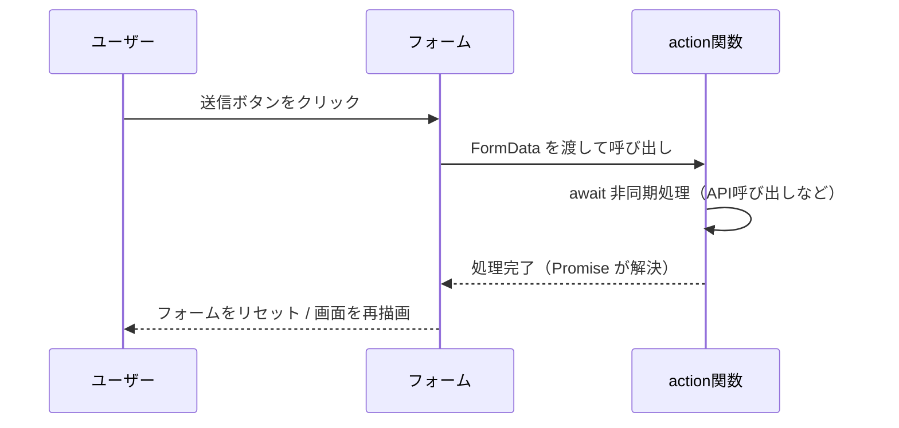

# 第123章：`action` に渡す非同期関数

この章では、React v19 の **フォーム Actions** の中でも、
「`action` に **非同期関数 (`async function`) を渡す」」ところだけにギュッとフォーカスしていきます 💌

---

## 🎯 この章のゴール

この章が終わるころには…

* `<form action={...}>` に **関数を渡すしくみ**がイメージできる 🧠
* `action` に渡す関数を **`async` / `await` 付きで書ける** ✍️
* TypeScript での **型 (`FormData`, `Promise<void>`) の付け方**がわかる ✅
* 簡単な「お問い合わせフォーム」くらいなら、自分で書けちゃう 🌟

---

## 1️⃣ まずはイメージ：何が変わったの？🤔

React 19 では、`<form>` の `action` に **URL じゃなくて「関数」**を渡せるようになりました。
その関数には、フォームの値がぎゅっと詰まった **`FormData` オブジェクト**が引数として渡されます。([React][1])

ざっくり比べると、こういう感じです👇

#### 🐢 昔ながらの書き方（イメージだけ見ればOK）

```tsx
import React from "react";

function OldStyleForm() {
  function handleSubmit(e: React.FormEvent<HTMLFormElement>) {
    e.preventDefault(); // 自分で止める
    const formData = new FormData(e.currentTarget);
    const name = formData.get("name");
    console.log("名前:", name);
    // ここで fetch してサーバーに送る…など
  }

  return (
    <form onSubmit={handleSubmit}>
      <input name="name" />
      <button type="submit">送信</button>
    </form>
  );
}
```

* `onSubmit` でイベント (`e`) を受け取る
* `e.preventDefault()` を自分で書く
* `new FormData(e.currentTarget)` で FormData を作る

---

#### 🚀 React 19 スタイル（この章の主役）

```tsx
function NewStyleForm() {
  function handleAction(formData: FormData) {
    const name = formData.get("name");
    console.log("名前:", name);
  }

  return (
    <form action={handleAction}>
      <input name="name" />
      <button type="submit">送信</button>
    </form>
  );
}
```

* `action` に **関数を直接渡す**
* React がよしなに `FormData` をつくって、関数に渡してくれる
* `preventDefault()` とか **もう書かなくてOK** ✨

しかも、この `handleAction` は **非同期関数 (`async`) にしてもいい**んです。
そのときにどう書くか、がこの章のテーマです 💪

---

## 2️⃣ 送信の流れを図で見る 🧠✨（Mermaid）

React がどんな順番で動いているか、かんたんなシーケンス図で見てみましょう。



ポイント 💡

* ユーザーが送信すると、React が **自動で FormData を作って action 関数を呼ぶ**
* 関数が `async` なら、**Promise が解決（`await` が終わる）まで待ってくれる**
* 処理が成功すると、**フォームの「非制御な入力欄」はリセットされる**([React][1])

---

## 3️⃣ いちばんシンプルな「非同期 action」✉️

まずは、**「1秒待ってからアラートを出すだけ」**の超シンプルな例からスタートします。

```tsx
export function SimpleAsyncForm() {
  // 🔑 React 19 の <form> action 用の非同期関数
  async function handleSubmit(formData: FormData): Promise<void> {
    const name = formData.get("name");

    if (typeof name !== "string" || name.trim() === "") {
      alert("名前を入れてね 🥺");
      return;
    }

    // 疑似的な「重い処理」🕐（API呼び出しの代わり）
    await new Promise((resolve) => setTimeout(resolve, 1000));

    alert(`こんにちは、${name} さん！🌸`);
  }

  return (
    <form action={handleSubmit}>
      <label>
        お名前：
        <input name="name" />
      </label>
      <button type="submit">送信する</button>
    </form>
  );
}
```

👀 見てほしいところ

* 関数の定義：

  ```ts
  async function handleSubmit(formData: FormData): Promise<void> { ... }
  ```

  * 引数は **必ず `FormData` 一個だけ**（`event` じゃないよ！）
  * `async` を付けると、`Promise<void>` を返す関数になる
* `FormData#get` の戻り値は `FormDataEntryValue | null` なので、
  型安全にしたいなら `typeof name === "string"` でチェックすると安心 🔒

---

## 4️⃣ もう一歩：APIっぽい処理を書く 🛰️

次は、**「お問い合わせ送信」っぽいフォーム**を書いてみます。
本物のサーバーの代わりに、ここではダミーの `fakePostContact` 関数に投げます。

```tsx
type ContactPayload = {
  name: string;
  message: string;
};

async function fakePostContact(payload: ContactPayload): Promise<void> {
  // 🕐 疑似的に 1.5 秒待つ（サーバー通信のつもり）
  await new Promise((resolve) => setTimeout(resolve, 1500));

  console.log("サーバーに送られたデータ:", payload);
  // ここで実際は fetch(...) したり、API クライアントを呼んだりするイメージ
}

export function ContactForm() {
  async function sendContact(formData: FormData): Promise<void> {
    const name = formData.get("name");
    const message = formData.get("message");

    if (typeof name !== "string" || typeof message !== "string") {
      alert("フォームの値の取得に失敗しました 🙇‍♀️");
      return;
    }

    if (name.trim() === "" || message.trim() === "") {
      alert("名前とメッセージの両方を書いてね ✍️");
      return;
    }

    await fakePostContact({ name, message });

    alert("お問い合わせを送信しました！📨 ありがとう〜");
  }

  return (
    <form action={sendContact}>
      <div>
        <label>
          お名前：
          <input name="name" />
        </label>
      </div>
      <div>
        <label>
          メッセージ：
          <textarea name="message" rows={4} />
        </label>
      </div>
      <button type="submit">送信する</button>
    </form>
  );
}
```

### 🌟 ここで学んでいること

* `action` に渡す関数を `async` にして、
  中で **`await` を使って非同期処理（API通信など）**を書けるようにする
* `FormData` から値を取り出したあと、
  型と中身をちょっとチェックしてから使う（堅めだけど安心）
* 非同期処理が終わると、React がフォームの入力欄をリセットしてくれる（非制御の場合）([React][1])

---

## 5️⃣ TypeScript 的な「型」もしっかり押さえよう 📘

`action` に渡す関数の型は、React 公式の `<form>` ドキュメント的にはざっくりこんなイメージです：([React][1])

> `action?: string | ((formData: FormData) => void | Promise<void>)`

つまり、**非同期にしたいときは `Promise<void>` を返す関数**を書けばOKです。

### ✅ 型をちゃんと書くバージョン

```tsx
type FormAction = (formData: FormData) => Promise<void>;

const sendContact: FormAction = async (formData) => {
  const name = formData.get("name");
  const message = formData.get("message");

  if (typeof name !== "string" || typeof message !== "string") {
    alert("フォームの値の取得に失敗しました 🙇‍♀️");
    return;
  }

  await fakePostContact({ name, message });
};
```

* こんな感じで **型エイリアス `FormAction`** を作っておくと、
  別ファイルでも統一した書き方ができてスッキリします ✨

（後の章で登場する `useActionState` や `useFormStatus` も、
この「Action 関数」の型をベースに動いています。([React][2])）

---

## 6️⃣ よくあるつまずきポイント 🥲 Q & A

### Q1. つい `event` を引数に書いちゃう…

```ts
function handleSubmit(e: React.FormEvent<HTMLFormElement>) { ... }
```

👉 React 19 の `<form action={...}>` では、
**引数は `FormData` だけ**です！

```ts
function handleSubmit(formData: FormData) { ... }
```

* `event.preventDefault()` は React がやってくれるので不要です 🙅‍♀️

---

### Q2. `await` を書いたらエラーになった…

```ts
function handleSubmit(formData: FormData) {
  const res = await fetch(...); // ← ここが怒られる
}
```

👉 関数の先頭に **`async` を付けるのを忘れている**パターンです。

```ts
async function handleSubmit(formData: FormData): Promise<void> {
  const res = await fetch("/api/contact", {
    method: "POST",
    body: formData,
  });
}
```

---

### Q3. `formData.get(...)` の型が `string | File | null` になってて気持ち悪い…

`FormData#get` の戻り値は `FormDataEntryValue | null` です。
文字列だけを想定している場合は、こうやってチェックするのが無難です ✅

```ts
const value = formData.get("title");
if (typeof value !== "string" || value.trim() === "") {
  // エラー処理
  return;
}
// ここから value は string 型として扱える
```

---

## 7️⃣ 手を動かす練習ミッション 🎮

自分の環境で試してみると、一気に理解が深まります ✨

### 📝 ミッション1：メールアドレス付きお問い合わせ

* `name`, `email`, `message` の 3 つの項目を持つフォームを作る
* `action` に非同期関数を渡して、`fakePostContact` にまとめて送る
* `email` が空のときは `alert("メールアドレスも入れてね")` を出して return する

---

### 🛜 ミッション2：実際に `fetch` を使ってみる（余裕があれば）

* `https://httpbin.org/post` などのテスト用エンドポイントに `fetch` してみる
* `method: "POST"`, `body: formData` で投げて、`console.log` でレスポンスを見る

---

### 🎨 ミッション3：送信中っぽい演出を入れてみる

* `sendContact` の中で 2 秒くらい `await` する
* その間に `console.log("送信中...")` を出してみる
* 後の章で `useFormStatus` を使うと、送信ボタンを「送信中...」にできるようになります 💫

---

## 8️⃣ この章のまとめ 🌈

* React 19 では `<form>` の `action` に **関数（Action）** を渡せる
* `action` 関数は `FormData` を 1 つだけ受け取り、
  **`void` または `Promise<void>` を返す**（非同期なら `Promise<void>`）([React][1])
* `async function handle(formData: FormData)` と書けば、
  中で `await fetch(...)` などの非同期処理を安全に書ける
* `FormData#get` の戻り値は `string` 確定ではないので、
  `typeof === "string"` で絞ってから使うと TypeScript 的にも安心 🔒

次の章（第124章）では、
ここで書いた **非同期 `action` 関数**を使って、
実際に「フォーム → アクション」の流れを完成させていきます 💌✨

おつかれさま〜！ここまでできれば、React 19 のフォーム革命の入り口はバッチリです 🎉

[1]: https://react.dev/reference/react-dom/components/form?utm_source=chatgpt.com "form"
[2]: https://react.dev/reference/react/useActionState?utm_source=chatgpt.com "useActionState"
