# 第124章：練習：`action` でシンプルなフォーム送信

---

### 1. 今日のゴール 🎯

この章では、**React 19 の `<form action={...}>` を使って、超シンプルなフォーム送信**を実際に作ってみます。

やりたいことはこんな感じ👇

* 入力欄にニックネームを入れる ✍️
* 送信ボタンを押す 🚀
* `action` に渡した関数が `FormData` を受け取って処理する
* 画面に「こんにちは、◯◯さん！」と表示される 🌸

React 19 では、`<form>` の `action` に **関数**を渡すと、フォーム送信時にその関数が呼ばれます。
そのとき、関数の引数として **`FormData` オブジェクト**が渡されます。さらに、送信が成功すると、フォーム内の**「制御していない（uncontrolled）」フィールドは自動でリセット**されます。([React][1])

今日はこれを、ちゃんと TypeScript で書いて動かしてみます 💪

---

### 2. ざっくりおさらい：Form Actions ってなに？💡

React 19 の `<form>` はこんなイメージです👇

* **昔のやり方**

  * `onSubmit={handleSubmit}`
  * `event.preventDefault()` を書く
  * `e.target.elements` から値を取る or `useState` で全部管理

* **React 19 の新しいやり方**

  * `action={formAction}` に **関数**を渡す
  * 関数の引数に `formData: FormData` が自動で渡される
  * `formData.get("name")` で値が取れる
  * `preventDefault()` は書かなくてOK
  * 成功すると、uncontrolled な入力欄は自動でリセット ✨([React][1])

React の公式ドキュメントにも、こんな感じの例があります👇([React][1])

* `function search(formData) { ... }`
* `<form action={search}> ... </form>`

今日は、この「`search` みたいな関数」を自分で作ってみる回です 🎉

---

### 3. 今回つくるミニアプリ 🧸

**「ニックネームあいさつフォーム」**を作ります。

* 入力欄：`ニックネーム`
* ボタン：`あいさつする`
* 送信したら：

  * `FormData` から `nickname` を取り出す
  * 画面に「こんにちは、◯◯さん！」と出す
  * 入力欄は自動で空になる（React 19 のおかげ）✨

---

### 4. プロジェクトの準備 👩‍💻

すでに Vite + React + TS プロジェクトがある前提で進めます。（`npm create vite@latest` → `react-ts` を選んだやつ）

1. プロジェクトフォルダを VS Code で開く

2. ターミナルで開いて…

   * 開発サーバーを起動

     * `npm run dev`
   * ブラウザで `http://localhost:5173` を表示

3. `src/App.tsx` を編集していきます ✍️

---

### 5. コードを書いてみよう：ニックネームフォーム ✨

`src/App.tsx` を **いったん全部消して**、次のコードに差し替えてください。

> ※ コピペしたら保存（Ctrl + S）して、ブラウザをリロードしてね 🔁

```tsx
import { useState } from "react";

type GreetingState = {
  nickname: string;
};

export default function App() {
  const [greeting, setGreeting] = useState<GreetingState>({
    nickname: "",
  });

  // ★ React 19 の Form Action 関数
  function handleGreet(formData: FormData) {
    // 1. FormData から値を取り出す
    const rawValue = formData.get("nickname");

    // 2. string だけを受け入れて、空白をトリム
    const nickname =
      typeof rawValue === "string" ? rawValue.trim() : "";

    if (!nickname) {
      alert("ニックネームを入力してね 🥺");
      // ここで return すると「成功扱い」にはなるので、
      // フォームは自動リセットされます
      return;
    }

    // 3. 画面に表示するための state を更新
    setGreeting({ nickname });

    // ✅ ここで何も throw しなければ「成功」
    //    uncontrolled な input の中身は React 19 が自動でリセットしてくれます
  }

  return (
    <main style={{ fontFamily: "system-ui", padding: "2rem" }}>
      <h1>第124章：action でシンプルなフォーム送信 ✉️</h1>

      <p style={{ marginBottom: "1rem" }}>
        ニックネームを入れて、ボタンを押してみてね 🌸
      </p>

      {/* ★ ここが今日の主役！ */}
      <form action={handleGreet}>
        <label>
          ニックネーム：
          <input
            name="nickname"
            placeholder="例：さくら"
            style={{ marginLeft: "0.5rem" }}
          />
        </label>
        <button
          type="submit"
          style={{ marginLeft: "0.75rem" }}
        >
          あいさつする
        </button>
      </form>

      {/* あいさつメッセージ表示 */}
      {greeting.nickname && (
        <p
          style={{
            marginTop: "1.5rem",
            fontSize: "1.25rem",
          }}
        >
          こんにちは、{greeting.nickname} さん！🌈
        </p>
      )}
    </main>
  );
}
```

---

### 6. 動きの流れを図で見てみよう 🧠✨

フォーム送信時の流れを Mermaid で図解してみます。

```mermaid
sequenceDiagram
  actor U as ユーザー
  participant F as <form>
  participant A as handleGreet()
  participant R as React 19

  U->>F: ニックネームを入力して送信ボタンをクリック
  F->>A: FormData を渡して action 関数を実行
  A->>R: state(setGreeting) を更新
  R->>F: 画面を再レンダリング & フォームの値を自動リセット
```



ポイントはこの2つ 💡

1. `handleGreet(formData: FormData)` が **フォーム送信時に自動で呼ばれる**
2. 処理が終わると、**uncontrolled な `<input>` の中身は自動で空になる**（成功した場合）([React][1])

---

### 7. コードの中身を順番に理解しよう 🔍

#### 7-1. `action={handleGreet}` が新しいキモ 🎯

```tsx
<form action={handleGreet}>
```

* React 19 から、`<form>` の `action` に **関数**を渡せるようになりました。([React][1])
* フォームが送信されると、この関数が呼ばれます。
* 関数の第1引数には **`FormData`** が渡されます。

```tsx
function handleGreet(formData: FormData) {
  // formData.get("nickname")
}
```

ここで注意したいのが：

* `FormData#get` の戻り値は
  `FormDataEntryValue | null` （＝ `string | File | null`）なので、
* TypeScript 的にはそのまま `trim()` できません。

なので今回は、

```tsx
const rawValue = formData.get("nickname");
const nickname =
  typeof rawValue === "string" ? rawValue.trim() : "";
```

というふうに、**`typeof rawValue === "string"` で絞り込んでから `trim()`** しています 🧼

#### 7-2. `name` 属性が超重要 ✨

```tsx
<input
  name="nickname"
  placeholder="例：さくら"
/>
```

`formData.get("nickname")` で値を取り出せるのは、
`input` 側の `name="nickname"` と **名前が一致しているから**です。

もし `name` を書き忘れると…

* 見た目は入力できるけど
* `FormData` には何も入らない
* `formData.get("nickname")` は `null` になる

という、ちょっと悲しい状態になります 🥲

フォームを作るときは：

> 「**必ず `name` を付ける！**」

というクセをつけておくといいです ✅

#### 7-3. state 更新と画面表示 🌈

```tsx
const [greeting, setGreeting] = useState<GreetingState>({
  nickname: "",
});

// ...

setGreeting({ nickname });

// ...

{greeting.nickname && (
  <p>こんにちは、{greeting.nickname} さん！🌈</p>
)}
```

* `FormData` から取り出した `nickname` を state に保存
* state に値が入ったら、条件付きレンダリングでメッセージを表示

ここは、これまでやってきた `useState` と同じノリなので、
「**フォームから来た値を、普通の state として使うだけ**」というイメージでOKです 👍

---

### 8. ミニ練習問題 📝（自分で手を動かしてみよう）

ここからは「ちょっとアレンジしてみる」コーナーです ✨
答えは次の章に出さなくてもOKなので、自分なりの回答で大丈夫！

#### 練習1：メッセージを変えてみよう 💌

* メッセージを

> `こんにちは、◯◯さん！🌈`

から

> `ようこそ、◯◯さん！React フォームの世界へ 🚪✨`

みたいな感じに変更してみてください。

> ヒント：
>
> * `setGreeting({ nickname })` のあとの表示部分だけ変えればOK

---

#### 練習2：メールアドレスも一緒に送信してみよう 📧

1. `input` をもう1つ増やして、`email` 入力欄を作る

   * `name="email"` を忘れずに！
2. `handleGreet` の中で

   ```ts
   const emailValue = formData.get("email");
   ```

   で値を取り出す
3. メッセージを

   > `こんにちは、◯◯さん！（メール：△△）`

   のように変更してみる

> 追加チャレンジ 🎮
> `typeof emailValue === "string"` でチェックしてから使うようにしてみよう！

---

#### 練習3：同期と非同期、両方試してみる ⏱️

今の `handleGreet` は **同期関数**ですが、
`async function handleGreet(formData: FormData)` と書いて **非同期関数**にもできます。

1. `async` を付ける
2. 中でダミーの `await` を入れてみる

```tsx
async function handleGreet(formData: FormData) {
  // 500ms 待つだけのダミー処理
  await new Promise((resolve) => setTimeout(resolve, 500));

  // あとはさっきと同じ
}
```

* それでもちゃんと動くか？
* フォームが送信されたあとに、ちゃんとリセットされるか？

を自分の目で確かめてみてください 👀✨
React 19 の `<form>` `action` は、**同期・非同期どちらの関数でもOK**です。([React][1])

---

### 9. 今日のまとめ 🎀

今日のポイントをおさらいしておきます 🧠

* React 19 では、`<form>` の `action` に **関数を渡せる** 💡([React][1])
* その関数は、フォーム送信時に
  `function action(formData: FormData) { ... }` の形で呼ばれる
* `FormData#get("name")` で、`name` 属性に対応した値が取れる
* 成功すると、**uncontrolled な入力欄は自動でリセット**される ✨([React][1])
* `useState` と組み合わせれば、

  * 「フォームから送られた値 ➜ state ➜ 画面表示」
  * という流れがシンプルに書ける

次の **第125章** では、
この `action` をさらにパワーアップさせる **`useActionState` フック**を使って、

* 「送信中…」状態
* エラーメッセージ

などを **型安全にまとめて管理**していきます 💪🔥

その前に、ぜひこの章のコードを自分でちょっといじってみて、

* 入力欄を増やす
* メッセージを変える
* 非同期処理を入れてみる

など、好きなだけ遊んでみてくださいね〜 🎮✨

[1]: https://react.dev/reference/react-dom/components/form "<form> – React"
