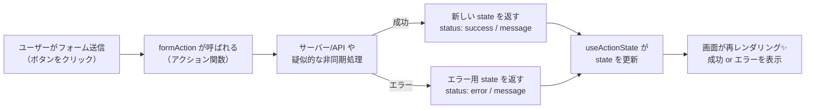

# 第125章：【v19フック】`useActionState`

---

## 1️⃣ 今日のゴール 🎯

この章のゴールは、React v19 で追加されたフック
**`useActionState` を使って「送信中」「エラー」「成功」の状態をまとめて管理できるフォーム**を作れるようになることです 💻💖

できるようになることはこんな感じ👇

* `useActionState` が **どんなフックかイメージできる**
* 従来の `useState` だらけフォームと何が違うかがわかる
* `isPending` を使って「送信中…」をボタンに表示できる
* エラーメッセージを **サーバー or アクション関数の戻り値から表示** できる

---

## 2️⃣ そもそも `useActionState` ってなに？🧐

React公式の説明を超ざっくり訳すと、

> **「フォーム用のアクション関数の結果にあわせて state を更新してくれるフック」** ([React][1])

という感じです。

もうちょっと具体的にいうと…

* `useActionState` に

  * 「フォーム送信時に呼びたい関数（アクション関数）」
  * 「最初の state」
    を渡すと
* 戻り値として

  1. **最新の state**
  2. **フォームに渡す用アクション関数**
  3. **`isPending`（まだ処理中かどうか）**

  が返ってきます。([React][1])

つまり、**「フォームの結果」「エラー」「読み込み中」を、1つのフックでまとめて管理できる」**イメージです ✨

---

## 3️⃣ ざっくり流れを図で見てみよう 🧠✨

`useActionState` を使うと、フォーム送信〜画面更新の流れはこんなイメージになります：



* 成功でもエラーでも、**最終的には「state を返す」だけ**
* その返り値を `useActionState` が受け取って、画面に反映してくれます 💡

---

## 4️⃣ まずは超シンプル版：カウンターで雰囲気をつかむ 🧮✨

フォームというと入力欄付きのものをイメージしがちですが、
まずは**ボタンだけのカンタンな例**で、`useActionState` の形に慣れましょ〜 💁‍♀️

### 🧩 例：ボタンを押した回数を数えるカウンター

📁 `src/chap125/CounterWithActionState.tsx`（名前はお好みでOK）

```tsx
import { useActionState } from "react";

type CountState = {
  count: number;
};

const initialState: CountState = {
  count: 0,
};

// アクション関数（ボタンが押されたときに呼ばれる）
async function increment(
  previousState: CountState,
  _formData: FormData
): Promise<CountState> {
  // ちょっとだけ待たせて「非同期っぽさ」を演出
  await new Promise((resolve) => {
    setTimeout(resolve, 500);
  });

  return {
    count: previousState.count + 1,
  };
}

export function CounterWithActionState() {
  const [state, formAction, isPending] = useActionState(
    increment,
    initialState
  );

  return (
    <form action={formAction}>
      <p>今のカウント：{state.count}</p>
      <button type="submit" disabled={isPending}>
        {isPending ? "カウント中..." : "1 加算する"}
      </button>
    </form>
  );
}
```

ポイント📝

* `increment` の引数は **`(previousState, formData)`**

  * `previousState` … 前回の state（最初は `initialState`）
  * `formData` … `<form>` 内の入力値（今回は使っていないので `_formData` にして無視）([React][1])
* `useActionState` から `[state, formAction, isPending]` が返ってくる
* `<form action={formAction}>` と書くことで

  * フォーム送信時に自動で `increment` が呼ばれる
* `isPending` が `true` の間はボタンを `disabled` にして「カウント中…」と表示

---

## 5️⃣ 本番！メッセージ送信フォームで「送信中」「エラー」を管理 💌

ここからがこの章の主役です ✨

### こんなフォームを作ります👇

* テキストエリアに「ひとことメッセージ」を入力
* 送信ボタンを押すと、

  * 入力が空 → エラーメッセージを表示
  * 疑似API呼び出し成功 → 「送信できました！」と表示
  * 処理中はボタンに **「送信中...」** と表示

---

### 5-1. `FormState` 型を決める 🧱

まず「フォームの状態」を1つのオブジェクトにまとめます。

📁 `src/chap125/MessageForm.tsx`（例）

```tsx
type FormState = {
  status: "idle" | "success" | "error";
  message: string;
};

const initialFormState: FormState = {
  status: "idle",
  message: "",
};
```

* `status` … 今の状態

  * `"idle"`    → まだ何もしてない
  * `"success"` → 成功メッセージを表示したい
  * `"error"`   → エラーメッセージを表示したい
* `message` … 実際に表示する文言

---

### 5-2. アクション関数を作る ✍️

次に、フォーム送信時に呼び出されるアクション関数を作ります。

```tsx
async function submitMessage(
  _previousState: FormState,
  formData: FormData
): Promise<FormState> {
  const value = formData.get("message");

  // 入力チェック（バリデーション）
  if (typeof value !== "string" || value.trim().length === 0) {
    return {
      status: "error",
      message: "メッセージを入力してね 😊",
    };
  }

  // 疑似的に「サーバーに送信中…」という前提で 1 秒待つ
  await new Promise((resolve) => {
    setTimeout(resolve, 1000);
  });

  // ここで本当は fetch などでサーバーに送信するイメージ
  const succeeded = true;

  if (!succeeded) {
    return {
      status: "error",
      message: "サーバーエラーが発生しちゃいました…😢 もう一度試してね。",
    };
  }

  // 成功したとき
  return {
    status: "success",
    message: "メッセージ送信できました！ありがとう 💖",
  };
}
```

ここがポイント✨

* `submitMessage` の**第1引数は前回の state**

  * 今回は使わないので `_previousState` にしています
* `FormData` から `message` を取り出してチェック
* エラーの場合は `status: "error"` の state を返すだけ
* 成功の場合も `status: "success"` の state を返すだけ

→ あとは `useActionState` がいい感じに画面に反映してくれます 🌸

---

### 5-3. `useActionState` でフォームコンポーネントを完成させる 🌟

ここまでのピースを組み合わせて、フォームコンポーネントを作ります。

```tsx
import { useActionState } from "react";

type FormState = {
  status: "idle" | "success" | "error";
  message: string;
};

const initialFormState: FormState = {
  status: "idle",
  message: "",
};

async function submitMessage(
  _previousState: FormState,
  formData: FormData
): Promise<FormState> {
  const value = formData.get("message");

  if (typeof value !== "string" || value.trim().length === 0) {
    return {
      status: "error",
      message: "メッセージを入力してね 😊",
    };
  }

  await new Promise((resolve) => {
    setTimeout(resolve, 1000);
  });

  return {
    status: "success",
    message: "メッセージ送信できました！ありがとう 💖",
  };
}

export function MessageForm() {
  const [formState, formAction, isPending] = useActionState(
    submitMessage,
    initialFormState
  );

  const isError = formState.status === "error";
  const isSuccess = formState.status === "success";

  return (
    <form action={formAction}>
      <label>
        あなたのひとことメッセージ 💌
        <br />
        <textarea
          name="message"
          rows={4}
          disabled={isPending}
          placeholder="今日あったこと、ひとことでもOK ✨"
        />
      </label>

      <div style={{ marginTop: "8px" }}>
        <button type="submit" disabled={isPending}>
          {isPending ? "送信中..." : "送信する"}
        </button>
      </div>

      <div style={{ marginTop: "8px" }}>
        {isError && (
          <p style={{ color: "red" }}>
            ❌ {formState.message}
          </p>
        )}
        {isSuccess && (
          <p style={{ color: "green" }}>
            ✅ {formState.message}
          </p>
        )}
      </div>
    </form>
  );
}
```

### ここでの `useActionState` おさらい 🧸

* `useActionState(submitMessage, initialFormState)`

  * `submitMessage` … アクション関数（フォームが送信されたら呼ばれる）
  * `initialFormState` … まだ送信していないときの初期値
* 戻り値 `[formState, formAction, isPending]`

  * `formState` … アクション関数の**最後の戻り値**
  * `formAction` … `<form action={...}>` や `<button formAction={...}>` に渡す用の関数 ([React][1])
  * `isPending` … アクションが実行中のあいだ `true` になるフラグ

---

## 6️⃣ 従来のフォームとの違いを感じてみよう 🏃‍♀️💨

React 18 までのフォーム実装だと、だいたいこんな感じで state が増えがちでした：

* `const [isSubmitting, setIsSubmitting] = useState(false);`
* `const [error, setError] = useState<string | null>(null);`
* `const [successMessage, setSuccessMessage] = useState("");`

送信時には…

1. `setIsSubmitting(true)`
2. `try { ... } catch { setError(...) } finally { setIsSubmitting(false) }`
3. うまくいったら `setSuccessMessage("...")`

という感じで、**状態がバラバラに散らばってしまう**ことが多かったと思います。([LogRocket Blog][2])

`useActionState` を使うと：

* **1つの `FormState` に集約**できる
* 「送信結果」を **そのまま state として返すだけ**
* `isPending` も自動で出てくる

ので、**フォーム用のロジックがすっきりまとまる**のが大きなメリットです ✨ ([Zenn][3])

---

## 7️⃣ TypeScript 的に気をつけたいポイント 👀

### ✅ ① アクション関数の引数の順番

`useActionState` でラップされたアクション関数は、

* **第1引数**：現在の state（最初は `initialState`）
* **第2引数以降**：通常のフォームアクションの引数（`FormData` など）

という順番になります。([React][1])

もともと：

```tsx
async function submit(formData: FormData) {
  // ...
}
```

だったものを `useActionState` で使いたいときは、

```tsx
async function submit(previousState: FormState, formData: FormData) {
  // ...
}
```

のように **引数を1つ追加する** のを忘れないようにしましょう 🧠

---

### ✅ ② `FormState` の型設計は「画面に出したい状態」を素直に書く

`FormState` は難しく考えなくてOKです。

* `status` に「どんな表示をしたいか」を簡単に表す
* `message` に実際に出したい文章を入れる

**「画面に何を出したいか？」から設計すると失敗しにくい**です 💡

---

## 8️⃣ 手を動かしてみようミニ課題 ✍️✨

ここまで読めば、`useActionState` の基本はバッチリです 🙆‍♀️
最後に、軽い課題で理解を固めてみましょう♪

### 📝 ミニ課題1：メッセージのリセット

* 送信が成功したあとに

  * `<textarea>` の中身を空にする
* ヒント：

  * `FormData` から読んだ値をそのまま state に入れるのではなく、
    「成功時にだけ textarea を空にする」ように工夫してみましょう

（やり方としては、`key` を変える / `useRef` で直接触る / 入力を `useState` 管理にする、などいろいろあります。どれを選ぶかは、今後の章で少しずつレベルアップしていきます✨）

---

### 📝 ミニ課題2：「もう一度送信」ボタン

* 成功したときだけ出る

  * 「もう一度送ってみる」ボタン を作ってみましょう
* そのボタンを押したら `FormState` を `initialFormState` に戻す

ヒント：

* `useActionState` で得られる `formState` は **普通の state** なので、
  それを見て条件分岐すればOKです ✅
* `onClick` ハンドラで `startTransition` を使って `formAction` を呼ぶ応用もありますが、
  まずはシンプルに「フォームをもう1回使う」イメージで考えてみてください 💭

---

## 9️⃣ まとめ 🍵

この章で覚えておいてほしいこと ✨

* `useActionState` は **「フォーム用の state + アクション + pending 状態」をまとめて扱えるフック**
* アクション関数の形は

  * `async function action(previousState, formData) { ... return newState; }`
* 戻り値は `[state, formAction, isPending]`
* エラーも成功も **「state を返す」だけで画面に反映できる**
* 従来の `useState` だらけフォームより、コードがスッキリ＆読みやすくなる 💕

次の章（第126章）では、
**`useActionState` で返したエラーを「きれいに表示する」パターン**を、実際のUIパターンと一緒に練習していきます ✨

「ふんわり分かったかも？」くらいで大丈夫なので、
ここで一息ついてから次に進みましょ〜 ☕️😊

[1]: https://react.dev/reference/react/useActionState "useActionState – React"
[2]: https://blog.logrocket.com/react-useactionstate/?utm_source=chatgpt.com "useActionState in React: A practical guide with examples"
[3]: https://zenn.dev/m0t0taka/articles/5de5cb152246e9?utm_source=chatgpt.com "React19で追加された 3 つの hook（useActionState, ..."
