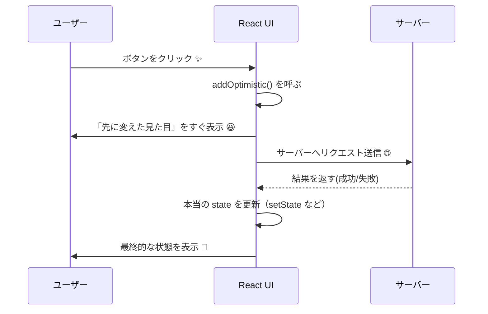

# 第129章：【v19フック】`useOptimistic`

「たぶん成功するっしょ！」で先に見た目だけ変えちゃうフック 🎉

---

### 1. まずはイメージから 🎨

SNSで「いいね❤️」を押した瞬間、すぐ数字が増えたり
チャットでメッセージ送信したら、すぐタイムラインに出てきたりしますよね？

でも実際には、
サーバーまで行って、保存して、レスポンスが返ってくるまで **ちょっと時間** がかかります。

そこで登場するのが **「楽観的UI (Optimistic UI)」** という考え方です ✨

> 「どうせ成功するでしょ〜 😎」と”楽観的”に考えて、
> サーバーの処理が終わる前に **成功後の見た目** を先に見せちゃう UI のこと。

React 19 の `useOptimistic` は、
この「楽観的UI」を **標準機能で簡単に書けるようにするフック** です。([React][1])

---

### 2. 普通のフォーム送信 vs 楽観的UI を図で見てみる 🧠

#### 🔁 今までのパターン（ちょっともっさり）

1. ユーザーが送信ボタンを押す
2. サーバーへリクエスト
3. レスポンスが返ってくる
4. そこでやっと画面を更新

#### ⚡ 楽観的UI + `useOptimistic` のパターン

1. ユーザーが送信ボタンを押す
2. **すぐに画面だけ先に更新（仮の状態）**
3. 裏でサーバーへリクエスト
4. 成功したら「本当のデータ」で上書きする
   （失敗したら、エラーメッセージ出したり、元の状態に戻したり）

Mermaid で流れを図にするとこんな感じです👇



---

### 3. `useOptimistic` の正体をチェック 👀

React公式では、`useOptimistic` はこう説明されています：

> `useOptimistic` は「非同期処理のあいだだけ別の状態を見せるためのフック」([React][1])

基本の形はこんな感じです👇

```tsx
import { useOptimistic } from "react";

const [optimisticState, addOptimistic] = useOptimistic(
  state,
  (currentState, optimisticValue) => {
    // 「楽観的な状態」をどう作るかをここで決める
    // currentState: 現在の「本当の」状態
    // optimisticValue: addOptimistic(...) に渡した値
    return currentState; // ここで新しい状態を返す
  }
);
```

* `state`

  * 「本当の状態」。`useState` で管理している配列やオブジェクトなどを渡します。([React][1])
* `optimisticState`

  * 画面に実際に表示する **「楽観的な状態」**
  * 通常は `state` と同じですが、**非同期処理が進行中だけ `updateFn` の結果に変わる** と思ってOK 💡([React][1])
* `addOptimistic(optimisticValue)`

  * 「ユーザーがこういう操作をしたよ！」という情報を渡す関数
  * それをもとに `updateFn(currentState, optimisticValue)` が呼ばれて
    **一時的な見た目用 state** を作ってくれます。([React][1])

TypeScript 目線で見ると：

* 「本当の state の型」
* 「optimisticValue（`addOptimistic` に渡す値）の型」

の **2つの型** が関係してくるイメージです 🧩

---

### 4. かんたん実例：メッセージ送信を「先に」画面に出す ✉️

「送信」ボタンを押した瞬間に、
メッセージをすぐタイムラインに出して、
実際のサーバー処理は裏でゆっくりやる…というよくある UI を作ってみます。

#### 4-1. メッセージ型を決める 🧾

```tsx
type Message = {
  id: number;
  text: string;
  sending?: boolean; // 送信中なら true
};
```

#### 4-2. ダミーのサーバー関数（本番では fetch など）🛰️

```tsx
async function postMessageToServer(text: string): Promise<Message> {
  // ネットワーク遅延のフリ（1秒待つだけ）
  await new Promise((resolve) => setTimeout(resolve, 1000));

  // 本当はここでサーバーから返ってきたデータを使う
  return {
    id: Date.now(),
    text,
  };
}
```

#### 4-3. `useOptimistic` を使ったフォームコンポーネント ✨

ポイントはここ 👇

* `messages`：本物のメッセージ一覧 (`useState`)
* `optimisticMessages`：画面に表示する用（楽観的なバージョン）
* `addOptimisticMessage`：ユーザー操作を受け取って「仮の見た目」を作る関数

```tsx
import { useState, useOptimistic } from "react";

type Message = {
  id: number;
  text: string;
  sending?: boolean;
};

async function postMessageToServer(text: string): Promise<Message> {
  await new Promise((resolve) => setTimeout(resolve, 1000));
  return {
    id: Date.now(),
    text,
  };
}

export function ChatWithOptimistic() {
  const [messages, setMessages] = useState<Message[]>([]);

  const [optimisticMessages, addOptimisticMessage] = useOptimistic(
    messages,
    (currentState: Message[], newText: string) => {
      const optimisticMessage: Message = {
        id: Date.now(), // 仮のID
        text: newText,
        sending: true,  // 「送信中」フラグ
      };

      // 新しいメッセージを先頭に追加した配列を返す
      return [optimisticMessage, ...currentState];
    }
  );

  // React 19 の <form action={...}> 用の関数
  async function formAction(formData: FormData) {
    const text = (formData.get("text") as string | null)?.trim();
    if (!text) return;

    // 1️⃣ まずは見た目だけ先に変える（楽観的UI）
    addOptimisticMessage(text);

    // 2️⃣ 本物のサーバー処理（ちょっと時間がかかる）
    const saved = await postMessageToServer(text);

    // 3️⃣ 本物の state を更新（ここで「sending: false」に）
    setMessages((prev) => {
      const next: Message[] = [
        { ...saved, sending: false },
        ...prev,
      ];
      return next;
    });
  }

  return (
    <div style={{ maxWidth: 480, margin: "0 auto" }}>
      <h2>💬 楽観的チャット</h2>

      <form action={formAction} style={{ marginBottom: "1rem" }}>
        <input
          name="text"
          placeholder="メッセージを入力..."
          style={{ width: "100%", padding: "0.5rem" }}
        />
        <button type="submit" style={{ marginTop: "0.5rem" }}>
          送信 🚀
        </button>
      </form>

      <ul>
        {optimisticMessages.map((m) => (
          <li key={m.id}>
            {m.text}{" "}
            {m.sending && <span style={{ color: "orange" }}>（送信中...）</span>}
          </li>
        ))}
      </ul>
    </div>
  );
}
```

#### ここで起きていること 🧩

* フォーム送信

  * 👉 `formAction` が `FormData` を受け取る（React 19 の `<form action={...}>` 機能）([React][2])
* `addOptimisticMessage(text)`

  * 👉 `useOptimistic` の `updateFn` が呼ばれて
    `sending: true` なメッセージを **即座に `optimisticMessages` に追加**
* ユーザーは

  * 👉 「送信中...」と表示されたメッセージをすぐに見ることができる（体感速度アップ）
* サーバー処理が終わったら

  * 👉 `setMessages` で **本物のメッセージ配列** を更新
  * 非同期処理が終わると `optimisticMessages` は
    「本物の `messages` と同じ値」に戻るので、
    `sending: false` の確定した状態だけが残ります。([React][1])

---

### 5. TypeScript 的にもう少しだけ深掘り 🔍

さっきの `useOptimistic` を、
型までちゃんと意識して書き直すとこんな感じにもできます👇

```tsx
const [optimisticMessages, addOptimisticMessage] = useOptimistic<Message[], string>(
  messages,
  (currentState, newText) => {
    const optimisticMessage: Message = {
      id: Date.now(),
      text: newText,
      sending: true,
    };

    return [optimisticMessage, ...currentState];
  }
);
```

* `Message[]` … 画面に表示する状態の型（本物の state の型）
* `string` … `addOptimisticMessage("テキスト")` の `"テキスト"` 部分の型

もちろん、型推論に任せて **ジェネリクスを書かなくてもOK** です 👍
でも「`State` と `OptimisticValue` の2種類の型があるんだな〜」と
頭の片隅で意識しておくと、後でかなり理解しやすくなります。

---

### 6. `useOptimistic` を使うときのコツ & 注意点 ⚠️

#### ✅ 向いている場面

* いいねボタン（押した瞬間に +1 してほしい）👍
* フォロー / フォロー解除ボタン
* TODOの追加・完了チェック ✅
* チャットの投稿 / コメント追加
* 「サーバーが失敗することもあるけど、**だいたい成功する**」ような操作

#### ⚠️ 気をつけたいポイント

* **必ず「本物の state」もどこかで更新する**

  * `useOptimistic` はあくまで「一時的な見た目」を作るだけ
  * 本物の `useState` やサーバーのデータもちゃんと更新しないと、
    次のレンダリングで「楽観状態」が消えてしまいます
* エラー処理も忘れずに

  * 失敗したら：

    * エラーメッセージを出す
    * 「送信中…」ラベルを「送信失敗💦」に変える など
* 大事な操作（お金が動くとか…）は慎重に 💰

  * 楽観的UIは便利だけど、
  * 「絶対にズレちゃ困る」ような場面では、
    サーバーの結果を待ってから画面を更新する方が安心です

---

### 7. ミニ練習問題 ✏️（自分で手を動かしてみよう）

最後に、軽いチャレンジ課題を置いておきます 💪

#### 📝 練習1：カンタン「いいねボタン」を楽観的に

1. 1つの投稿に「いいね数」を表示するコンポーネントを作る
2. `useState<number>` で本物の `likes` を管理
3. `useOptimistic` を使って、

   * ボタンを押した瞬間に `optimisticLikes` を +1 する
   * 裏で `fakeLikeOnServer()` を実行して、終わったら本物の `likes` を更新

→ 「ボタンを連打しても、気持ちよくサクサク増えるUI」を目指してみてね ❤️

#### ✅ 練習2（余裕があれば）：今まで作ったフォームに組み込む

* 第126〜128章で作ったフォーム（`useActionState` / `useFormStatus`）に

  * `useOptimistic` を足して、
  * 「送信中…」の間だけリストに仮アイテムを追加する
* 送信が成功したら

  * 本物の state を更新して、「仮アイテム」を本物に入れ替えるイメージで ✨

---

### まとめ 🌈

* `useOptimistic` は **「どうせ成功するでしょ！」と先に見た目を変えるためのフック** 🎉
* 「本物の state」と「楽観的な state」の2段構えで考えるのがコツ
* React 19 の `<form action={...}>` と組み合わせると、
  **フォーム送信の体験をめちゃくちゃ気持ちよくできる** 💌([React][1])

次の章（第130章）では、実際に TODO リストに `useOptimistic` を組み込んで
「追加した瞬間にリストに出てくる」体験を一緒に作っていきます ✨
お楽しみに〜！ 🎀

[1]: https://react.dev/reference/react/useOptimistic "useOptimistic – React"
[2]: https://react.dev/blog/2024/12/05/react-19?utm_source=chatgpt.com "React v19"
