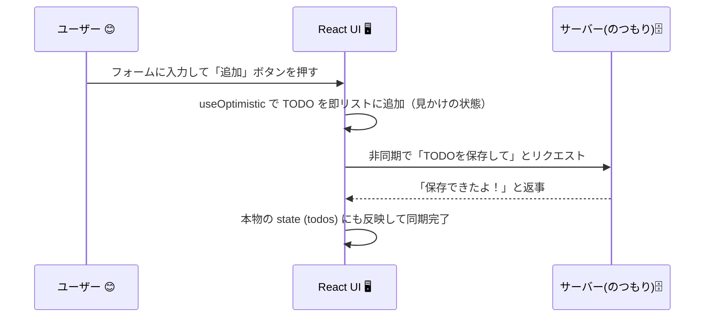

# 第130章：練習：`useOptimistic` でTODOリストに即時反映させる

`useOptimistic` で TODO リストに「即時反映」させよう ✅

---

この章のゴールはただひとつ 💪

> **フォームで TODO を送信した瞬間に、サーバーの完了を待たずにリストに表示される UI を作ること！**

いわゆる **「楽観的更新（optimistic update）」** を、`useOptimistic` と フォーム Action で実装してみます。
React 19 では `useOptimistic` が公式のフックとして追加されていて、
「非同期処理が終わるまでのあいだ、**一時的な“見かけの state”** を表示する」ために使えます。([React][1])

---

## 1️⃣ 全体の流れイメージ（図でざっくり）

`useOptimistic` を使った TODO 追加の流れを、ざっくり図解してみます ✨



ポイントはこの2つだけ ✍️

* 画面に出すのは **`optimisticTodos`（楽観的な配列）**
* 本物のデータは **`todos`（普通の state）** として別で持っておく

`useOptimistic(state, updateFn)` は、
「**本物の `state` を渡すと、そのコピーを“楽観的バージョン”として返してくれる**」フックです。([React][1])

---

## 2️⃣ 今日作るコンポーネントのイメージ 🧩

* 画面中央にシンプルな TODO リスト 📝
* 上にテキストボックス＋「追加」ボタン
* 送信した瞬間にリストに追加される
* 裏では `setTimeout` を使って「サーバーに保存中」を再現（ダミーの非同期処理）

ファイル構成イメージ（Vite + React-TS プロジェクト）：

* `src/App.tsx`
* `src/OptimisticTodoList.tsx` ← 今日作る！
* `src/index.css` ← ちょっとだけ見た目を整える

---

## 3️⃣ `OptimisticTodoList.tsx` の骨組みを作る 🦴

まずは **型と普通の state** だけ用意して、骨だけ作ります。

`src/OptimisticTodoList.tsx` を作って、こんな感じで書きます 👇

```tsx
import { useState, useOptimistic } from "react";

type Todo = {
  id: number;
  title: string;
};

// サーバーに送っている“つもり”のダミー関数
async function fakePostTodo(todo: Todo): Promise<void> {
  return new Promise((resolve) => {
    setTimeout(() => {
      console.log("サーバーに保存完了（という設定）", todo);
      resolve();
    }, 1000);
  });
}

function OptimisticTodoList() {
  // 本物の state（サーバーと同期させたいデータ）
  const [todos, setTodos] = useState<Todo[]>([]);

  // ここに useOptimistic をあとで追加するよ！✨

  return (
    <div className="todo-container">
      <h2>useOptimistic TODO 📝</h2>

      <form className="todo-form">
        <input
          name="title"
          placeholder="やることを入力してね"
          className="todo-input"
        />
        <button type="submit" className="todo-button">
          追加
        </button>
      </form>

      <ul className="todo-list">
        {/* TODO: ここに TODO を並べて表示する */}
      </ul>
    </div>
  );
}

export default OptimisticTodoList;
```

まだ `useOptimistic` は空っぽですが、まずは雰囲気だけ作りました 🎀

---

## 4️⃣ `useOptimistic` を追加しよう ✨

次に、いよいよ `useOptimistic` を使います。

公式の型はこんな感じ（ざっくり）です：([React][1])

> `const [optimisticState, addOptimistic] = useOptimistic<State, Update>(state, updateFn);`

* `State` → 楽観的に扱いたい state の型（ここでは `Todo[]`）
* `Update` → 「こういう変更を加えたいよ」という入力の型（ここでは `Todo`）

さっきのコンポーネントに、`useOptimistic` をこう追加します 👇

```tsx
function OptimisticTodoList() {
  const [todos, setTodos] = useState<Todo[]>([]);

  // useOptimistic を使って「楽観的な TODO リスト」を用意する
  const [optimisticTodos, addOptimisticTodo] = useOptimistic<Todo[], Todo>(
    todos,
    (currentTodos, newTodo) => [...currentTodos, newTodo]
  );

  // ...
}
```

ここでやっていること 💡

* `todos`

  * 本物の配列（サーバーと同期させたい真の state）
* `optimisticTodos`

  * 画面に表示するための「一時的に盛られた version」
  * フォーム送信後すぐに、ここに新しい TODO を差し込む
* `addOptimisticTodo(newTodo)`

  * `updateFn` を使って、`optimisticTodos` を更新してくれる関数

---

## 5️⃣ `<form action={...}>` の Action 関数を書く 🧾

React 19 では、`<form>` の `action` 属性に **非同期関数** をそのまま渡せます。
フォームが送信されると、その関数が呼ばれて `FormData` が渡ってきます。([React][2])

> ここではその Action 関数の中で
> ① `addOptimisticTodo` を呼んで画面を即更新
> ② ダミーのサーバー保存（`fakePostTodo`）
> ③ 成功したら本物の `todos` にも反映
> という流れにします 🌈

`OptimisticTodoList` の中身を、ここまでを全部つなげて完成形にします 👇

```tsx
import { useState, useOptimistic } from "react";

type Todo = {
  id: number;
  title: string;
};

async function fakePostTodo(todo: Todo): Promise<void> {
  return new Promise((resolve) => {
    setTimeout(() => {
      console.log("サーバーに保存完了（という設定）", todo);
      resolve();
    }, 1000);
  });
}

function OptimisticTodoList() {
  const [todos, setTodos] = useState<Todo[]>([]);

  const [optimisticTodos, addOptimisticTodo] = useOptimistic<Todo[], Todo>(
    todos,
    (currentTodos, newTodo) => [...currentTodos, newTodo]
  );

  // フォームが送信されたときに呼ばれる Action 関数
  async function addTodoAction(formData: FormData) {
    const title = formData.get("title");
    if (typeof title !== "string") {
      return;
    }

    const trimmed = title.trim();
    if (!trimmed) {
      return;
    }

    const newTodo: Todo = {
      id: Date.now(), // 簡単なID。実務ではもっとちゃんとしたIDを使うことが多いよ
      title: trimmed,
    };

    // ① 楽観的に画面だけ先に更新する ✨
    addOptimisticTodo(newTodo);

    try {
      // ② サーバーに送信している“つもり”の非同期処理
      await fakePostTodo(newTodo);

      // ③ 本物の state にも反映
      setTodos((prev) => [...prev, newTodo]);
    } catch (error) {
      console.error(error);
      alert("保存に失敗しました…😢");

      // エラー時は「本物の state」をそのまま再セットして
      // useOptimistic に「やっぱり元の状態で！」と伝えるイメージ
      setTodos((prev) => [...prev]);
    }
  }

  return (
    <div className="todo-container">
      <h2>useOptimistic TODO 📝</h2>

      {/* React 19 の Form Actions */}
      <form action={addTodoAction} className="todo-form">
        <input
          name="title"
          placeholder="やることを入力してね"
          className="todo-input"
        />
        <button type="submit" className="todo-button">
          追加
        </button>
      </form>

      <ul className="todo-list">
        {optimisticTodos.map((todo) => (
          <li key={todo.id} className="todo-item">
            {todo.title}
          </li>
        ))}
      </ul>
    </div>
  );
}

export default OptimisticTodoList;
```

👀 ここがポイント！

* **画面に表示しているのは `todos` ではなく `optimisticTodos`**
* `addTodoAction` の中で

  * 先に `addOptimisticTodo(newTodo)` → すぐ表示
  * あとで `setTodos` → 本物の state もあとから追いつく
* `todos` が変化すると、`useOptimistic` はそれをベースにして
  「楽観的状態」をリセット・再計算してくれます。([azukiazusa.dev][3])

---

## 6️⃣ `App.tsx` から呼び出す 🏠

`src/App.tsx` でこのコンポーネントを表示してあげます。

```tsx
import OptimisticTodoList from "./OptimisticTodoList";

function App() {
  return (
    <div>
      <h1 style={{ textAlign: "center" }}>React 19 Form Actions × useOptimistic ✨</h1>
      <OptimisticTodoList />
    </div>
  );
}

export default App;
```

---

## 7️⃣ ちょこっと CSS でかわいくする 🎀

`src/index.css` に、こんなスタイルを足してみてください（自由にアレンジしてOK！）

```css
.todo-container {
  max-width: 480px;
  margin: 2rem auto;
  padding: 1.5rem;
  border-radius: 16px;
  background-color: #f5f5ff;
  box-shadow: 0 10px 25px rgba(0, 0, 0, 0.06);
}

.todo-form {
  display: flex;
  gap: 0.5rem;
  margin-bottom: 1rem;
}

.todo-input {
  flex: 1;
  padding: 0.6rem 0.9rem;
  border-radius: 999px;
  border: 1px solid #d4d4ff;
  font-size: 0.95rem;
}

.todo-input:focus {
  outline: none;
  border-color: #6366f1;
  box-shadow: 0 0 0 2px rgba(99, 102, 241, 0.2);
}

.todo-button {
  padding: 0.6rem 1rem;
  border-radius: 999px;
  border: none;
  background-color: #6366f1;
  color: white;
  font-weight: 600;
  cursor: pointer;
}

.todo-button:hover {
  filter: brightness(1.05);
}

.todo-list {
  list-style: none;
  padding: 0;
  margin: 0;
}

.todo-item {
  padding: 0.5rem 0.75rem;
  margin-bottom: 0.4rem;
  border-radius: 8px;
  background-color: white;
}
```

---

## 8️⃣ 仕上げ：自分の手で改造してみようチャレンジ 💪🔥

ここからは「自分で考えて手を動かす」タイムです ⏱

### お題①：ローディングっぽさを出してみる

* TODO を追加したあと 1秒間、画面のどこかに
  **「サーバー保存中…⏳」** みたいな表示を出してみる
* ヒント：

  * `useState<boolean>` で `isSaving` を追加してみる
  * `addTodoAction` の中で

    * `setIsSaving(true);` → `await fakePostTodo` → `setIsSaving(false);`

---

### お題②：エラーのときに「元に戻る」UI にしてみる

* `fakePostTodo` の中で、たまに `throw new Error("エラー")` してみて、
  エラーが出たときに「楽観的 TODO を消す」挙動を試してみる
* ヒント：

  * エラー時に、`setTodos` で「エラー前の配列」を入れてあげる
  * そのタイミングで `useOptimistic` が **ベースの state を元に戻す**イメージ

---

### お題③：`useFormStatus` と組み合わせてみる（やれたら上級者✨）

* 以前の章で登場した `useFormStatus` を使って、
  送信ボタンのラベルを

  * 通常: 「追加」
  * 送信中: 「送信中...🚀」
    に切り替えてみる

---

## まとめ ✨

* `useOptimistic` は
  **「非同期処理のあいだだけ、UI を“いい感じの見かけ”にしておく」ためのフック** でした。([React][1])
* React 19 の `<form action={async (formData) => { ... }}>` と組み合わせると、
  **フォーム送信 → 楽観的更新 → サーバー完了** の流れがとてもシンプルに書けます。([React][2])
* この章の TODO リストは、実務で使うもっと大きなフォームの **ミニ版サンプル** だと思ってください 🌱

ここまで作れたら、
「**サーバー待ちで固まらない、気持ちのいいフォーム UI**」の第一歩クリアです 🎉👏

[1]: https://react.dev/reference/react/useOptimistic?utm_source=chatgpt.com "useOptimistic"
[2]: https://react.dev/blog/2024/12/05/react-19?utm_source=chatgpt.com "React v19"
[3]: https://azukiazusa.dev/blog/react-use-optimistic-hook?utm_source=chatgpt.com "楽観的更新を行うための React の useOptimistic フック"
