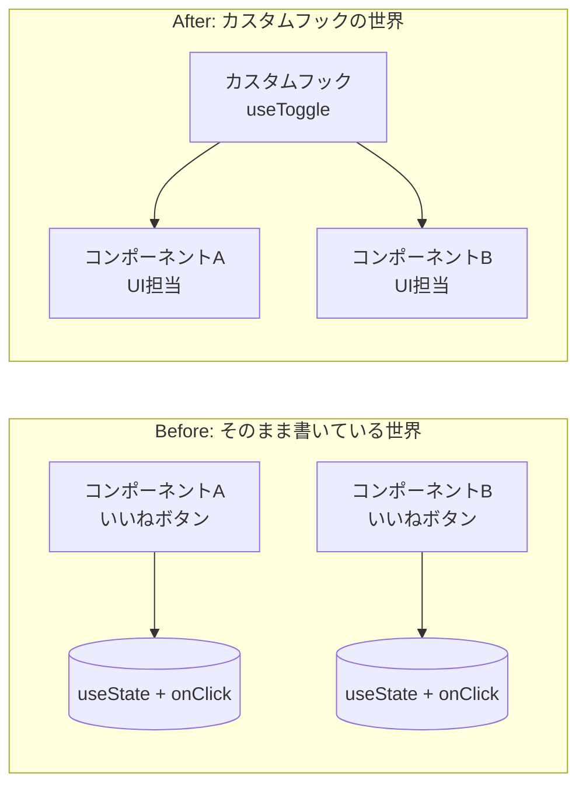

# 第131章：カスタムフックってなに？

「フック」はもういくつか触ってきましたよね（`useState`, `useEffect`, `useContext` など）。
この章では、そのフックたちを**自分でラッピングして再利用しやすくしたもの**＝**カスタムフック**を紹介します ✨

---

## 1. この章のゴール 🎯

この章を読み終わるころには、こんなことがわかります：

* 「カスタムフック」が何者なのかイメージできる 💡
* ただの関数と、カスタムフックの違いがわかる
* 「あ、ここはカスタムフックにするとスッキリしそうだな〜」と気づけるようになる
* 次の章以降で作る `useToggle`, `useWindowSize` などのイメージがつかめる

---

## 2. そもそも「フック」って？軽くおさらい 🔁

Reactのフックは、

* `useState`：状態を持つ
* `useEffect`：副作用（タイマー・API呼び出しなど）を扱う
* `useRef`：値やDOMを覚えておく  …など

**「コンポーネントの中で使う特別な関数」**でしたね。

```
ts
import { useState } from "react";

function Counter() {
  const [count, setCount] = useState(0); // ← フック

  return (
    <button onClick={() => setCount(count + 1)}>
      {count} 回クリックされたよ
    </button>
  );
}
```

ここまでは OK 👌 ですよね。

---

## 3. カスタムフックの正体は「フック入りの関数」🧪

**カスタムフック＝自分で作るフック**です。
と言っても、特別な魔法の構文があるわけじゃなくて、

> **「中で `useState` や `useEffect` を使っている、`use` で始まる普通の関数」**

だと思って大丈夫です ✨

ざっくりイメージ：

```
ts
import { useState } from "react";

// ✅ カスタムフックの例（イメージ）
export function useSomethingCool() {
  const [value, setValue] = useState(0);

  // ここに「再利用したいロジック」をまとめる
  const doSomething = () => {
    setValue((prev) => prev + 1);
  };

  // コンポーネント側に返したいものをまとめて return
  return { value, doSomething };
}
```

この `useSomethingCool` をコンポーネントから呼び出して使います。
**「JSXは返さない」「UIは持たない」のがポイント**です ✅

---

## 4. なんでカスタムフックが必要なの？コピペ地獄からの脱出 😇

よくあるパターン：

* 画面 A に「いいねボタン」がある
* 画面 B にも「いいねボタン」がある
  → どっちもほぼ同じ `useState` と `onClick` のロジックを書くことに…

### Before：それぞれのコンポーネントがロジックをバラバラに持っている

```
ts
import { useState } from "react";

type LikeButtonProps = {
  label: string;
};

export function LikeButtonA({ label }: LikeButtonProps) {
  const [liked, setLiked] = useState(false);

  const handleClick = () => {
    setLiked((prev) => !prev);
  };

  return (
    <button onClick={handleClick}>
      {label} : {liked ? "💖いいね！" : "♡ まだ"}
    </button>
  );
}

export function LikeButtonB({ label }: LikeButtonProps) {
  const [liked, setLiked] = useState(false); // ← また同じ！
  const handleClick = () => {
    setLiked((prev) => !prev); // ← これもまた同じ！
  };

  return (
    <button onClick={handleClick}>
      {label} : {liked ? "💖いいね！" : "♡ まだ"}
    </button>
  );
}
```

このままだと…

* 挙動を変えたくなったとき、**2ヶ所とも修正**しないといけない 😭
* バグが出たとき、「どのコンポーネントが本当の正解だっけ？」って迷う

### After：ロジックを「カスタムフック」にまとめて、見た目だけコンポーネントに任せる

```
ts
// useToggle.ts
import { useState } from "react";

// ✅ カスタムフック：ON/OFF を切り替えるロジックだけを担当
export function useToggle(initialValue: boolean = false) {
  const [value, setValue] = useState(initialValue);

  const toggle = () => {
    setValue((prev) => !prev);
  };

  return { value, toggle };
}
```

```
tsx
// LikeButton.tsx
import { useToggle } from "./useToggle";

type LikeButtonProps = {
  label: string;
};

export function LikeButton({ label }: LikeButtonProps) {
  const { value: liked, toggle } = useToggle(false);

  return (
    <button onClick={toggle}>
      {label} : {liked ? "💖いいね！" : "♡ まだ"}
    </button>
  );
}
```

こうすると：

* 「ON/OFF のロジック」は **`useToggle` の 1ヶ所に集中**
* 見た目（ボタンのテキストやレイアウト）は、**コンポーネント側におまかせ**

> 👉 ロジックとUIをキレイに分けられるから、読みやすく・直しやすく・再利用しやすい！

---

## 5. 図で見る「コンポーネント」と「カスタムフック」の関係 🧠

カスタムフックを使う前と後を、ざっくり図で見てみましょう ✍️



* **Before**：それぞれのコンポーネントが、**ロジックもUIも全部持っている**
* **After**：

  * `useToggle`：ON/OFFロジック担当（状態管理 & 切り替え関数）
  * 各コンポーネント：**見た目だけを考えればOK** 🎨

---

## 6. カスタムフックを作るときの「お作法」📜

カスタムフックには、Reactのルールがいくつかあります。ざっくり覚えておきましょう。

### ✅ ルール1：名前は必ず `use` で始める

* `useToggle`, `useWindowSize`, `useAuthUser`, `useLocalStorage` など
* React が「これはフックだな」と認識するための大事な決まりごとです

### ✅ ルール2：中で他のフックを使う

* カスタムフックの中では、普通に `useState`, `useEffect`, `useRef` などが使えます
* **「フックを使うロジック」をまとめるためのもの**なので、中でフックを使わないとあまり意味がないことが多いです

### ✅ ルール3：コンポーネントと同じように「トップレベルで」呼ぶ

* これは「フックのルール」と同じです

  * `if` の中だけで呼ぶ
  * `for` の中だけで呼ぶ
  * 関数の中で条件によって呼んだり呼ばなかったり
* …こういうことは **NG** です 🚫

> カスタムフックも「フックの仲間」なので、
> **「毎回同じ順番で呼ばれる」** ことが大切です。

---

## 7. カスタムフックが活躍するシチュエーション 🌈

どんなときに「カスタムフックにしようかな？」と考えるか、具体例を挙げてみます。

* ✅ 同じような `useState + useEffect` の組み合わせを、**2ヶ所以上で書いてしまったとき**
* ✅ ページをまたいで「ログインユーザー情報」を共有したいとき（`useAuthUser` みたいな感じ）
* ✅ フォームの入力・バリデーションのロジックをまとめておきたいとき
* ✅ スクロール位置・ウィンドウサイズ・タブのアクティブ状態など、「ブラウザの状態」をいろんな場所で使いたいとき

つまり、

> 「UIというより**“動き”や“状態管理”の方がメインの処理**」

を、まるっと1つの関数にして名前をつけてあげるイメージです 🎁

---

## 8. フォルダ構成のイメージ 🗂️

カスタムフックは、よく `hooks` フォルダを作ってまとめます。

```
text
src/
  components/
    LikeButton.tsx
    Header.tsx
    ...
  hooks/
    useToggle.ts
    useWindowSize.ts
    useLocalStorage.ts
    ...
```

* `components`：UI（見た目）担当 🧑‍🎨
* `hooks`：ロジック担当 🧑‍🔬

みたいに分けると、あとから読んだときも**役割が一目でわかってスッキリ**します ✨

---

## 9. この章のまとめ 📝

* カスタムフックは、**「フックを使ったロジックをまとめた、自作のフック」**
* 名前は必ず `use` で始める（`useToggle`, `useWindowSize` など）
* UI（JSX）は返さず、**値や関数を返すだけ**のことが多い
* 同じような `useState` / `useEffect` をあちこちで書き始めたら、**カスタムフックにまとめるチャンス** ✨
* フォルダを `hooks` と `components` に分けると、役割がハッキリして読みやすくなる

次の章では、ここで出てきた考え方を使って、
実際に **`useToggle` みたいなカスタムフックを自分の手で作っていきます** 💪🔥

「ロジックをまとめて名前をつける」感覚に慣れると、一気に“React上級者っぽさ”が出てきますよ〜！🌈
