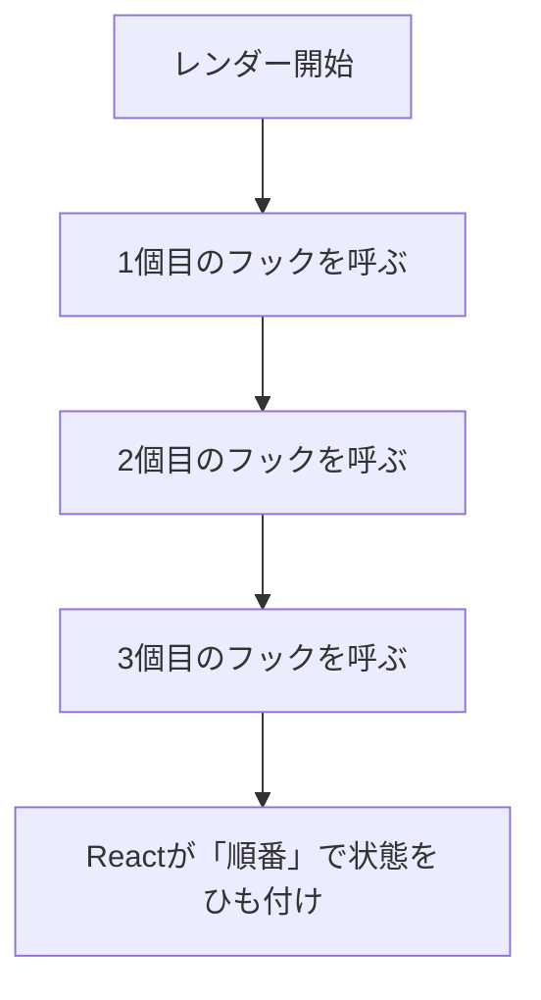
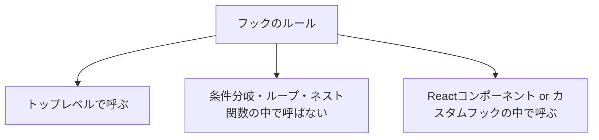

# 第132章：なぜ「ただの関数」じゃダメなの？🤔（フックを使ってるから！）

この章の結論だけ先に言うね👇
**フック（`useState` / `useEffect` など）を使う関数は、Reactの“ルールの中”で動く必要がある**から、ただの関数にしちゃうと事故りやすいのです😵‍💫💥
だから「**カスタムフック**」って形（`use`で始まる関数）にして、**安全に再利用**できるようにするよ〜✨

---

## 1) まず大事：Reactは「フックを呼んだ順番」で覚えてる🧠📌

Reactは、コンポーネントが描画されるたびに
「1個目のフックはこれ」「2個目のフックはこれ」って **順番で状態を管理**してるよ！



つまり…
✅ **毎回同じ順番でフックが呼ばれる**ことが超重要！

---

## 2) 「ただの関数」にしちゃうと起きがちな事故🚑💥

### ❌ 事故例：条件分岐の中でフックを呼ぶ（順番がズレる）

```tsx
import { useState } from "react";

function helper(flag: boolean) {
  if (flag) {
    const [x] = useState(0); // ❌ これ、順番が変わる可能性がある！
    return x;
  }
  return 0;
}

export function App() {
  const a = helper(true);
  return <div>{a}</div>;
}
```

**なにがヤバいの？😱**
`flag` が変わった瞬間に **呼ばれるフックの数・順番が変わる** → Reactが状態を取り違える可能性💥

---

## 3) じゃあ「カスタムフック」って何が偉いの？🌟

カスタムフックは一言でいうと👇
**“フックを安全に再利用するための、ルールに乗った関数”** だよ🙌✨

### ✅ カスタムフックにすると得すること

* **Reactのルール（同じ順番）を守りやすい**🧷
* **ESLint が「フックのルール違反」を検知してくれる**🔍（超大事！）
* **状態を持つロジックを部品みたいに使い回せる**🧩
* 命名が `use〇〇` だと「フックっぽい！」って一目でわかる😊

---

## 4) ここがポイント：実は「カスタムフックもただの関数」🫢✨

ちょっと意外なんだけど、**カスタムフック自体は普通の関数**だよ。
でも違いはここ👇

### ✅ 違いは「ルールに乗ってるか」＆「見分けがつくか」

* `use` で始まる → **フックだと分かる**
* ESLintが **“ここはフックを呼んでOKな場所”** と判断しやすい
* チーム開発でも事故りにくい👯‍♀️💕

---

## 5) 正しい形：カスタムフックにして安全にする🧁

### ✅ `useNumber`（例：数を持つだけのシンプルフック）

```tsx
import { useState } from "react";

export function useNumber(initialValue: number) {
  const [value, setValue] = useState(initialValue);

  const inc = () => setValue((v) => v + 1);
  const dec = () => setValue((v) => v - 1);

  return { value, inc, dec };
}
```

使う側（コンポーネント）はこう👇

```tsx
import { useNumber } from "./useNumber";

export function App() {
  const { value, inc, dec } = useNumber(10);

  return (
    <div>
      <p>いま：{value}</p>
      <button onClick={dec}>-1</button>
      <button onClick={inc}>+1</button>
    </div>
  );
}
```

これなら
✅ フックはコンポーネントのトップレベルで毎回同じ順番で呼ばれる
✅ しかもロジックを再利用できる
最高〜〜〜！🎉😆

---

## 6) 「フックのルール」最低限これだけ覚えよ📚✨



覚え方（ゆるく）👇

* **フックは毎回同じ順で呼ぶ**🧘‍♀️
* **フックは“特別な場所”でだけ呼ぶ**🏠（コンポーネント or `use〇〇`）

---

## 7) ミニ練習🎮：2つのコンポーネントで同じロジックを共有しよ！

### やること💪✨

* `useToggle` を作る（ON/OFF）
* 2つの別コンポーネントで使う

`useToggle.ts`

```ts
import { useState } from "react";

export function useToggle(initial = false) {
  const [on, setOn] = useState(initial);
  const toggle = () => setOn((v) => !v);
  const setTrue = () => setOn(true);
  const setFalse = () => setOn(false);

  return { on, toggle, setTrue, setFalse };
}
```

`A.tsx`

```tsx
import { useToggle } from "./useToggle";

export function A() {
  const { on, toggle } = useToggle(false);

  return (
    <section>
      <h2>Aちゃん</h2>
      <p>{on ? "ON 🌞" : "OFF 🌙"}</p>
      <button onClick={toggle}>切り替え</button>
    </section>
  );
}
```

`B.tsx`

```tsx
import { useToggle } from "./useToggle";

export function B() {
  const { on, setTrue, setFalse } = useToggle(true);

  return (
    <section>
      <h2>Bちゃん</h2>
      <p>{on ? "ON 🔥" : "OFF 🧊"}</p>
      <button onClick={setTrue}>ONにする</button>
      <button onClick={setFalse}>OFFにする</button>
    </section>
  );
}
```

`App.tsx`

```tsx
import { A } from "./A";
import { B } from "./B";

export function App() {
  return (
    <div>
      <A />
      <hr />
      <B />
    </div>
  );
}
```

🎉 できたら大成功！
「同じロジックを2回書かずに済んだ」＝カスタムフックの勝ち💖😆

---

## まとめ🧁✨

* Reactは **フックを呼んだ順番**で状態を管理してるよ🧠
* だからフックは **順番が変わる場所（if/for/ネスト）で呼ぶと危険**💥
* “フックを使う再利用ロジック”は **カスタムフック（`use〇〇`）** にするのが安全＆読みやすい🎀

次の章（第133章）で「名前は `use` で始める」ルールをもっと気持ちよく整理していこう〜！😊✨
