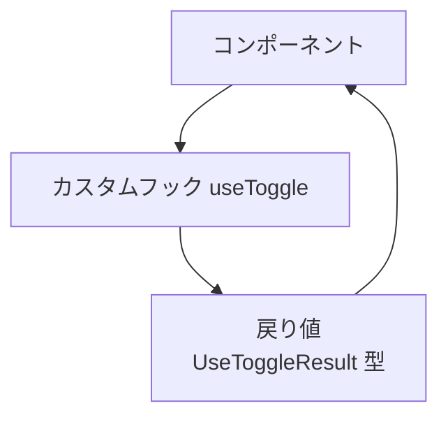

# 第135章：カスタムフックの「戻り値」に型を付ける！

「カスタムフックって便利そうだけど、戻り値の型ってどう書けばいいの…？😇」
この章では、そこをスッキリさせます！

---

### 1️⃣ この章でできるようになること

この章のゴールはこんな感じです👇

* カスタムフックに **「戻り値の型」** をしっかり付けられる 🎯
* `type` で「戻り値専用の型」を作れる
* 「配列（タプル）で返す型」と「オブジェクトで返す型」のイメージがつかめる
* VS Code がいい感じに補完してくれて、コーディングがラクになる ✨

---

### 2️⃣ カスタムフックの「戻り値」ってそもそも何？ 🤔

カスタムフックは、ざっくり言うと

> 「**中のごちゃごちゃしたロジックを隠して**、
> コンポーネント側には **使いやすいセットだけ渡す** 関数」

でしたよね 🧠

例えば前の章で作った `useToggle` なら、

* 中で `useState` とか `setValue` みたいな処理をしておいて
* コンポーネントには

  * 今の状態（`boolean`）
  * それを切り替える関数（`() => void`）

だけを渡してあげる、みたいなイメージです。

つまり、カスタムフックにはいつも

* **「受け取る引数の型」**
* **「返す値（戻り値）の型」**

この2つがセットで存在します ✅
この章では特に **「返す方（戻り値）の型」** にフォーカスします。

---

### 3️⃣ まずは「型なし」カスタムフックを見てみよう 👀

型を付ける前の `useToggle` を、ざっくりこんな感じだとします。

```ts
// useToggle.ts
import { useState } from "react";

export function useToggle(initialValue = false) {
  const [value, setValue] = useState(initialValue);

  const toggle = () => {
    setValue((prev) => !prev);
  };

  return [value, toggle];
}
```

これでも動きはしますが…

* `initialValue` の型も
* `return` で返している配列の中身の型も

**TypeScript がなんとな〜く推論しているだけ**の状態です。

VS Code で使う側を書くときに、

* 「`value` は boolean だっけ？ string だっけ？」
* 「`toggle` の引数って必要だったっけ？」

みたいなのが、**パッと見で分かりにくい**んですよね 🥲

---

### 4️⃣ 戻り値の型を `type` で用意してあげよう ✏️

そこで登場するのが「戻り値専用の型」です。

#### 🧩 ステップ1：戻り値の型だけを先に作る

今回の `useToggle` の戻り値は、

* `boolean`（今の状態）
* `()` → `void` な関数（切り替え）

の2つを **配列で返している** ので、こんな `type` を用意します👇

```ts
// useToggle.ts
import { useState } from "react";

// ✅ 戻り値の型だけを先に定義しておく
type UseToggleResult = [boolean, () => void];
```

`[boolean, () => void]` という書き方は、
**「長さ2のタプル（順番と型が決まった配列）」** を意味します。

* 1番目：`boolean`
* 2番目：`() => void`（引数なしで何も返さない関数）

という決まりになります 📦

#### 🧩 ステップ2：関数の戻り値の型として使う

さっき定義した `UseToggleResult` を、
カスタムフックの戻り値の型としてくっつけます。

```ts
// useToggle.ts
import { useState } from "react";

type UseToggleResult = [boolean, () => void];

export function useToggle(initialValue: boolean = false): UseToggleResult {
  const [value, setValue] = useState(initialValue);

  const toggle = () => {
    setValue((prev) => !prev);
  };

  return [value, toggle];
}
```

ポイントはここです👇

* `initialValue: boolean = false`

  * 引数にもちゃんと `boolean` を付ける
* `): UseToggleResult { ... }`

  * `)` の後ろに **戻り値の型** を書く

これで、

* 「`useToggle` を呼ぶと、**必ず `[boolean, () => void]` を返すんだな〜**」
* というのが、コードを見ただけで一瞬で伝わるようになります ✨

---

### 5️⃣ 使う側でのメリット 💻

次に、この `useToggle` をコンポーネント側から使ってみます。

```tsx
// ToggleExample.tsx
import { useToggle } from "./useToggle";

export function ToggleExample() {
  const [isOpen, toggleIsOpen] = useToggle(false);

  return (
    <div>
      <button onClick={toggleIsOpen}>
        {isOpen ? "閉じる" : "開く"}
      </button>
      {isOpen && <p>開いてます〜✨</p>}
    </div>
  );
}
```

ここで VS Code の上にマウスを乗せてみると…

* `isOpen` → `boolean` と表示される
* `toggleIsOpen` → `() => void` と表示される

などなど、**型情報がちゃんと見える**ようになります 👀

さらに、

* `toggleIsOpen(123)` みたいに変な引数を渡そうとすると

  * 「引数いらないよ！」と TypeScript が怒ってくれる
* `isOpen.toUpperCase()` みたいに文字列メソッドを呼ぼうとすると

  * 「これは boolean なのでそんなメソッドないよ！」と怒ってくれる

という感じで、**バグをかなり早い段階で止めてくれる**ようになります 🚨✨

---

### 6️⃣ オブジェクトで返すパターンの型 🧺

今までは「配列（タプル）」で返す例でしたが、
カスタムフックの戻り値は **オブジェクトでもOK** です。

#### 🌟 オブジェクト版 `useToggle`

```ts
// useToggleObject.ts
import { useState } from "react";

type UseToggleObjectResult = {
  value: boolean;
  toggle: () => void;
};

export function useToggleObject(
  initialValue: boolean = false
): UseToggleObjectResult {
  const [value, setValue] = useState(initialValue);

  const toggle = () => {
    setValue((prev) => !prev);
  };

  return { value, toggle };
}
```

使う側はこんな感じ👇

```tsx
// ToggleObjectExample.tsx
import { useToggleObject } from "./useToggleObject";

export function ToggleObjectExample() {
  const { value: isOpen, toggle } = useToggleObject(false);

  return (
    <div>
      <button onClick={toggle}>
        {isOpen ? "閉じる" : "開く"}
      </button>
      {isOpen && <p>オブジェクト版も動いてます〜🎉</p>}
    </div>
  );
}
```

#### 📝 「タプル」vs「オブジェクト」どっちがいいの？

ざっくりした目安はこんな感じです👇

* ✅ **タプルで返すとき**

  * 中身が2〜3個くらい
  * 使う側で `[value, toggle]` みたいに「順番」で扱うのが自然なとき

* ✅ **オブジェクトで返すとき**

  * 返したいものが多い（4つ以上とか）
  * `value`, `loading`, `error` みたいに「名前」で扱いたいとき

どちらを選んでもOKですが、

* **「型を付けておく」こと自体がめちゃくちゃ大事** 💎
* `type` で戻り値の型を分けておくと、あとから戻り値を増やしたりするときも楽

というメリットがあります。

---

### 7️⃣ カスタムフックと戻り値の型の関係を図でイメージ 🧠✨

カスタムフックのイメージを、図でサクッと見てみましょう。



* コンポーネントは `useToggle()` を呼ぶだけ
* 中のロジックは全部カスタムフックの中
* コンポーネントは **「UseToggleResult 型のセット」** だけを受け取る

という流れになっています 💫

---

### 8️⃣ ミニ演習 🧪 やってみよう！

ここで、ちょっとだけ手を動かしてみましょう ✍️

#### 🔰 演習1：自分の `useToggle` に戻り値の型を付ける

1. 前の章で作った `useToggle` を開く

2. ファイルの上の方に、こんな `type` を追加する

   * タプル版なら：

   ```ts
   type UseToggleResult = [boolean, () => void];
   ```

   * オブジェクト版なら：

   ```ts
   type UseToggleResult = {
     value: boolean;
     toggle: () => void;
   };
   ```

3. 関数の定義に戻り値の型をつける

   ```ts
   export function useToggle(initialValue: boolean = false): UseToggleResult {
     // ...
   }
   ```

4. コンポーネント側で、マウスホバーして型が見えるかチェックしてみる 👀

#### 🔰 演習2：「戻り値の型」を自分で考えてみる

次の章では `useWindowSize` を作る予定でした。
一足先に「戻り値の型」だけ考えてみましょう ✨

* どんな情報を返したい？

  * 例：`width`, `height`
* 配列で返す？ オブジェクトで返す？

たとえば、オブジェクトで返すならこんな `type` になりそうです👇

```ts
type UseWindowSizeResult = {
  width: number;
  height: number;
};
```

「**どんな情報を、どんな形でコンポーネントに渡したいか？**」
を考えるのが、戻り値の型設計の第一歩です 💡

---

### 9️⃣ まとめ 🎀

この章で学んだポイントをおさらいします 👇

* カスタムフックには「引数の型」だけでなく **「戻り値の型」** も超大事
* 戻り値の型は `type` で先に定義しておくとスッキリ ✨

  * 例：`type UseToggleResult = [boolean, () => void];`
* 戻り値は

  * 少ないなら「タプル（配列）」でもOK
  * 多くなってきたら「オブジェクト」が読みやすい
* 型をつけることで

  * VS Code の補完が賢くなる
  * 間違った使い方を TypeScript が止めてくれる

次の章では、実際に `useWindowSize` などの **実用カスタムフック** を作りながら、
今学んだ「戻り値の型」をどんどん使っていきますよ〜 📏📱✨

おつかれさまでした！🍵💖
