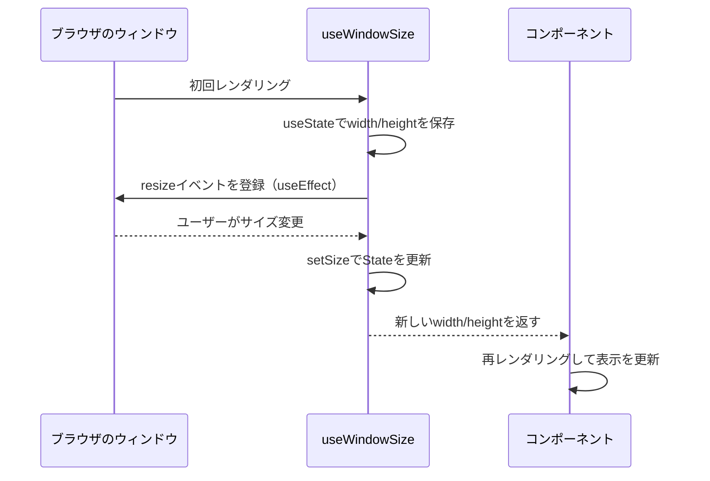

# 第136章：練習：`useWindowSize`

---

この章では、「**ブラウザのウィンドウサイズをいつでも教えてくれるカスタムフック**」
`useWindowSize` を一緒に作っていきます 🎉

* 画面幅によってレイアウトを変えたい 📱💻
* 「今の幅って何pxなんだっけ？」をいつでも知りたい
* せっかくなら **TypeScript できっちり型もつけたい**

こういうときに大活躍してくれるフックです ✨

---

## 1️⃣ 今日のゴール ✨

この章のゴールはこの3つです：

1. `useWindowSize` という **カスタムフックのファイルを作る**
2. `window.addEventListener("resize", ...)` と `useEffect` で
   **リサイズを監視して `useState` を更新できるようにする**
3. 作ったフックをコンポーネントから呼び出して、
   **ウィンドウサイズを画面に表示 & レイアウトを切り替える**

---

## 2️⃣ ファイルを用意しよう 🗂️

Vite + React + TS プロジェクトがある前提で進めます。

まずは、**カスタムフック用のフォルダ**を作りましょう：

* `src/hooks/useWindowSize.ts`

こんな感じの構成になります：

```text
src/
  main.tsx
  App.tsx
  components/
  hooks/
    useWindowSize.ts  ← 今日作る！
```

---

## 3️⃣ まずは「型」から考える 👓

`useWindowSize` は「**幅と高さを返すフック**」です。

なので、まずは返り値の型を決めちゃいましょう ✏️

👉 `src/hooks/useWindowSize.ts` に、次のコードを書きます：

```ts
import { useEffect, useState } from "react";

export type WindowSize = {
  width: number;
  height: number;
};
```

ここまでで、

* `WindowSize` 型は

  * `width`: ウィンドウの幅（px）
  * `height`: ウィンドウの高さ（px）

を表す「形」になりました ✅

---

## 4️⃣ フックの骨組みを作る 🦴

次は、`useWindowSize` 関数の「形」だけ先に作ります。

```ts
export function useWindowSize(): WindowSize {
  // ここに実装を書いていく！
  // 最後に WindowSize 型のオブジェクトを return する予定
  return {
    width: 0,
    height: 0,
  };
}
```

今は仮で `0` を返していますが、あとでちゃんと
「本物のウィンドウサイズ」を返すようにします 💪

---

## 5️⃣ `useState` でサイズを保存する 📦

リサイズされるたびに値が変わるので、
**状態 (State)** で持つのがぴったりです。

`useState<WindowSize>` を使います：

```ts
export function useWindowSize(): WindowSize {
  const [size, setSize] = useState<WindowSize>(() => ({
    width: window.innerWidth,
    height: window.innerHeight,
  }));

  return size;
}
```

ポイント 💡

* `useState<WindowSize>(...)`
  → State の型が **`WindowSize` だよ！** と宣言している
* 初期値として `window.innerWidth` / `window.innerHeight` を入れている
* これで `size.width` と `size.height` を使えるようになります

でも今はまだ、「リサイズしても値が変わらない」状態です。
ここに `useEffect` と `resize` イベントを足していきます 🔧

---

## 6️⃣ `resize` イベントを監視する 👀

ブラウザのウィンドウサイズが変わったときには、
`window` で `resize` イベントが発生します。

普通の JavaScript だと、こんな感じ：

```js
window.addEventListener("resize", () => {
  console.log(window.innerWidth, window.innerHeight);
});
```

React＋TS ではこれを
**`useEffect` の中で登録して、お片付け（解除）もする**のが大事です ✨

---

## 7️⃣ `useEffect` を組み合わせて完成させる 🧩

では、全部まとめて `useWindowSize` を完成させましょう！

👉 `src/hooks/useWindowSize.ts` の最終形はこんな感じです：

```ts
import { useEffect, useState } from "react";

export type WindowSize = {
  width: number;
  height: number;
};

export function useWindowSize(): WindowSize {
  const [size, setSize] = useState<WindowSize>(() => ({
    width: window.innerWidth,
    height: window.innerHeight,
  }));

  useEffect(() => {
    const handleResize = () => {
      setSize({
        width: window.innerWidth,
        height: window.innerHeight,
      });
    };

    // ウィンドウサイズの変化を監視
    window.addEventListener("resize", handleResize);

    // 念のため、初回にも一度呼んでおく（ブラウザによる差をなくす用）
    handleResize();

    // クリーンアップ（コンポーネントが消えるときに監視を解除）
    return () => {
      window.removeEventListener("resize", handleResize);
    };
  }, []);

  return size;
}
```

ポイントまとめ ✍️

* `useState<WindowSize>(...)`
  → TS が `width` と `height` の型をちゃんと覚えてくれる
* `useEffect(..., [])`
  → **最初にマウントされたとき**だけイベントを登録する
* `return () => { ... }`
  → コンポーネントが消えるときに `removeEventListener` する（お片付け）
* 最後に `size` を返すので、呼び出した側は `{ width, height }` を受け取れる

---

## 8️⃣ `useWindowSize` の動きを図で見てみよう 🧠✨

`useWindowSize` のざっくりした流れを Mermaid で図解してみます。



イメージとしては、

1. コンポーネントが `useWindowSize()` を呼ぶ
2. フックが **現在のサイズを覚える + 監視を開始**
3. リサイズが起きるたびに `setSize` で更新
4. コンポーネントが新しいサイズで描き直される

という流れです 💃

---

## 9️⃣ 実際にコンポーネントから使ってみよう 🧪

次は、このフックを **画面から使ってみるデモ** を作ります。

### 9-1. デモ用コンポーネントを作成

`src/components/WindowSizeDemo.tsx` を作ります。

```tsx
import { useWindowSize } from "../hooks/useWindowSize";

export function WindowSizeDemo() {
  const { width, height } = useWindowSize();

  const isSmall = width < 768;

  return (
    <div className="window-size-demo">
      <h1>🪟 Window Size Demo</h1>
      <p>
        現在のサイズ：<strong>{width}</strong> px ×{" "}
        <strong>{height}</strong> px
      </p>
      <p>
        画面判定：
        {isSmall ? "スマホ・タブレットっぽい 📱" : "PCっぽいレイアウト 💻"}
      </p>
    </div>
  );
}
```

ポイント 💡

* `const { width, height } = useWindowSize();`
  → カスタムフックから `width` と `height` を受け取る
* `const isSmall = width < 768;`
  → 簡単なブレークポイント（768px 未満なら「小さい画面」）

### 9-2. `App.tsx` から表示してみる

`App.tsx` からこのデモを呼び出しましょう：

```tsx
import { WindowSizeDemo } from "./components/WindowSizeDemo";

function App() {
  return (
    <div>
      <WindowSizeDemo />
    </div>
  );
}

export default App;
```

そのうえで、ターミナルで：

```bash
npm run dev
```

ブラウザで画面を開いて、
ウィンドウをぐいぐい横に伸ばしたり縮めたりしてみてください 🧪
テキストがちゃんと変われば成功です 🎉

---

## 🔟 ちょこっとだけスタイルを付けてみる 🎨

最低限のスタイルだけ足して、
見た目をちょっとだけかわいくしましょう 🍰

`src/index.css` に追記（または自分のCSSファイルでOK）：

```css
.window-size-demo {
  max-width: 480px;
  margin: 40px auto;
  padding: 24px;
  border-radius: 16px;
  border: 1px solid #ddd;
  text-align: center;
  font-family: system-ui, -apple-system, BlinkMacSystemFont, "Segoe UI", sans-serif;
}

.window-size-demo h1 {
  font-size: 1.4rem;
  margin-bottom: 16px;
}

.window-size-demo p {
  margin: 8px 0;
}
```

これでだいぶ「コンポーネントっぽい見た目」になります ✨

---

## 1️⃣1️⃣ 発展：こんな工夫もできるよ 🧠

余裕があれば、次のような改造にもチャレンジしてみてください！

### ✅ 発展アイデア

1. **サイズに応じて背景色を変える**

   * `width` が小さいときは淡いピンク、大きいときは淡いブルーなど 🌸💙

2. **「スマホ／タブレット／PC」みたいに3段階に分ける**

   * `width < 640` → スマホ
   * `width < 1024` → タブレット
   * それ以上 → PC

3. **フックの戻り値に「isSmall」などのフラグも含めてみる**

   * 例えば：

     ```ts
     export type WindowSize = {
       width: number;
       height: number;
       isSmall: boolean;
     };
     ```

   こうすると、呼び出し側のコンポーネントが
   もっとシンプルに書けるようになります ✨

---

## まとめ 🎀

この章で学んだこと：

* カスタムフック `useWindowSize` を **型付きで** 作った ✅
* `useState` でウィンドウサイズを状態として保存した ✅
* `useEffect` で `resize` イベントを監視し、
  クリーンアップで `removeEventListener` もした ✅
* フックをコンポーネントで呼び出して、
  「ウィンドウサイズに応じた表示」を作った ✅

`useWindowSize` みたいなカスタムフックは、
**「よく使うロジックをまとめる」いい練習**になります ✨

次の `useLocalStorage` も、
「よく使う処理をフックにまとめる」という同じ流れなので、
今回と同じ感覚で進めていきましょう〜 📦💾
