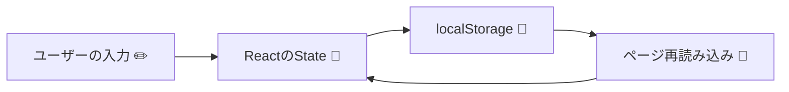

# 第137章：練習：`useLocalStorage`

「ページをリロードしたら、入力した内容ぜんぶ消えた〜〜😇」
…みたいな経験、たぶん一度はあるはず。

この章では、**ブラウザの `localStorage` を使って、「リロードしても消えないState」を作るカスタムフック** `useLocalStorage` を一緒に作っていきます ✨

---

### 🎯 この章のゴール

この章が終わるころには、こんなことができるようになります 👇

* `localStorage` がどんなものかイメージできる
* TypeScript で **型付きの `useLocalStorage` フック** を自作できる
* 自作フックをコンポーネントから呼び出して
  「リロードしても残る入力フォーム」などを作れる
* 最後に、自分でちょっとしたアプリを作るミニ課題も出します 📝

---

## 1️⃣ `localStorage` ってなに？ざっくりイメージ 💡

`localStorage` は、**ブラウザの中にある、ちっちゃいメモ帳**みたいなものです ✍️
「キー（名前）」と「文字列」をペアで保存しておけます。

JavaScriptだけで書くと、こんな感じになります：

```ts
// データを保存する
localStorage.setItem("userName", "Akiko");

// データを取り出す
const name = localStorage.getItem("userName");
console.log(name); // "Akiko"
```

ポイントは２つだけ 👍

* **保存するとき**：`setItem(キー, 文字列)`
* **読むとき**：`getItem(キー)` で文字列 or `null` が返る

配列・オブジェクトはそのままだと保存できないので、
`JSON.stringify` / `JSON.parse` を使います。

```ts
const todos = ["React 勉強", "レポート書く"];

// 保存するとき（文字列に変換）
localStorage.setItem("todos", JSON.stringify(todos));

// 読むとき（配列に戻す）
const stored = localStorage.getItem("todos");
const parsed = stored ? JSON.parse(stored) : [];
```

---

## 2️⃣ 図で見る：State と `localStorage` の関係 📊

React の State と `localStorage` の関係を、ざっくり図にするとこんな感じです：



1. ユーザーが入力 → React の State が更新される
2. State が変わったら、その値を `localStorage` に保存する
3. ページを開いたとき（リロードしたとき）には
   → `localStorage` から値を読んで、**最初の State に使う**

これを**毎回コンポーネント側に手書き**するのは面倒なので、
「よく使うパターン」を **`useLocalStorage` というカスタムフックにまとめる**、というのが今回のゴールです ✨

---

## 3️⃣ まずは「どんなフックにしたいか」設計しよう 🎨

先に「呼ぶ側のコード（理想形）」から考えてみます。

たとえば、**ユーザー名を保存しておくフォーム**を作りたいとします。

```tsx
const [name, setName] = useLocalStorage<string>("user-name", "");
```

こう書けたら嬉しくないですか？😊

* 第1引数：`"user-name"` → `localStorage` に保存するときのキー名
* 第2引数：`""` → 保存されてなかったときの初期値
* 戻り値：`[value, setValue]`（`useState` と同じ形）

型推論も使いたいので、実際の呼び出しはこんな感じにもしたいです 👇

```tsx
const [darkMode, setDarkMode] = useLocalStorage("dark-mode", false);
// T は boolean だと推論される
```

👉 つまり、フックの型はこんな感じを目指します。

```ts
function useLocalStorage<T>(key: string, initialValue: T): readonly [T, React.Dispatch<React.SetStateAction<T>>]
```

* `T`：保存したいデータの型（string / boolean / 配列 / オブジェクトなど）
* 戻り値：`[value, setValue]` のペア（`useState` と同じノリ）

---

## 4️⃣ フォルダを用意して、ファイルを作る 🗂️

Vite + React + TS プロジェクトを前提に進めます 💻

1. `src` フォルダの中に `hooks` フォルダを作る
   （もう作ってあるならそのままでOK）
2. その中に `useLocalStorage.ts` を作ります。

```
src/
  hooks/
    useLocalStorage.ts  ← 今から書く！
  App.tsx
  main.tsx
  ...
```

---

## 5️⃣ `useLocalStorage` を実装してみよう ✍️

`useLocalStorage.ts` に、まずはシンプルな完成形を書きます。

```ts
// src/hooks/useLocalStorage.ts
import { useEffect, useState } from "react";

export function useLocalStorage<T>(key: string, initialValue: T) {
  // 🔹 初期値を決めるロジックを関数として用意
  const readValue = () => {
    try {
      const stored = window.localStorage.getItem(key);

      if (stored === null) {
        // まだ何も保存されてない
        return initialValue;
      }

      // JSON文字列 → 元の型Tに戻す
      return JSON.parse(stored) as T;
    } catch (error) {
      console.error("useLocalStorage: 読み込みに失敗しました", error);
      return initialValue;
    }
  };

  // 🔹 useState の初期値に「関数」を渡す（初回だけ実行される）
  const [value, setValue] = useState<T>(readValue);

  // 🔹 value が変わるたびに localStorage に保存
  useEffect(() => {
    try {
      const json = JSON.stringify(value);
      window.localStorage.setItem(key, json);
    } catch (error) {
      console.error("useLocalStorage: 保存に失敗しました", error);
    }
  }, [key, value]);

  // 🔹 useStateと同じ形で返す
  return [value, setValue] as const;
}
```

### 🔍 コードのポイント解説

#### ✅ ① `readValue` 関数

```ts
const readValue = () => {
  try {
    const stored = window.localStorage.getItem(key);

    if (stored === null) {
      return initialValue;
    }

    return JSON.parse(stored) as T;
  } catch (error) {
    console.error("useLocalStorage: 読み込みに失敗しました", error);
    return initialValue;
  }
};
```

* 最初に「すでに保存されている値があるか？」をチェック
* あったら `JSON.parse` でパースして `T` として返す
* なかったり、壊れたJSONだった場合は `initialValue` に戻す
  → 「壊れててもアプリが落ちない」ようにしてあげるのが優しさ 🥹

#### ✅ ② `useState<T>(readValue)`

```ts
const [value, setValue] = useState<T>(readValue);
```

* `useState` に **関数** を渡すと、「初回レンダー時にだけ実行」されます。
* これで毎レンダーごとに `localStorage.getItem` しなくて済むので、ちょっと効率いい ✨

#### ✅ ③ `useEffect` で自動保存

```ts
useEffect(() => {
  try {
    const json = JSON.stringify(value);
    window.localStorage.setItem(key, json);
  } catch (error) {
    console.error("useLocalStorage: 保存に失敗しました", error);
  }
}, [key, value]);
```

* `value` が変わるたびに `JSON.stringify` して `localStorage` に保存
* `key` も依存配列に入れているので、もしキーを変えたらちゃんと新しいキーで保存されます

#### ✅ ④ 戻り値の型：`as const`

```ts
return [value, setValue] as const;
```

* `[value, setValue]` をそのまま返すと、型が `(T | Dispatch)[]` みたいに広がりがち…
* `as const` を付けることで、「**長さ2のタプル**として扱ってね！」とTSに教えてます
* `useState` とほぼ同じ使いごこちになります 💕

---

## 6️⃣ 実際に使ってみよう 🎮：ニックネーム保存フォーム

次に、このフックを実際のコンポーネントで使ってみましょう！

例として、**ユーザーのニックネームを保存しておくフォーム**を作ります。

`src/App.tsx` を次のように書き換えてみてください：

```tsx
// src/App.tsx
import { ChangeEvent } from "react";
import { useLocalStorage } from "./hooks/useLocalStorage";

function App() {
  const [name, setName] = useLocalStorage<string>("user-name", "");

  const handleChange = (e: ChangeEvent<HTMLInputElement>) => {
    setName(e.target.value);
  };

  return (
    <main style={styles.main}>
      <h1 style={styles.title}>✨ ニックネームを保存してみよう ✨</h1>

      <label style={styles.label}>
        ニックネーム：
        <input
          style={styles.input}
          value={name}
          onChange={handleChange}
          placeholder="好きな名前を入れてね"
        />
      </label>

      <p style={styles.text}>
        {name
          ? `こんにちは、${name} さん🌸`
          : "まだニックネームが設定されていません😉"}
      </p>

      <p style={styles.small}>
        このページをリロードしても、ニックネームが残っているか試してみてね 🔄
      </p>
    </main>
  );
}

const styles = {
  main: {
    minHeight: "100vh",
    padding: "2rem",
    fontFamily: "system-ui, sans-serif",
    background: "#fdf2ff",
  },
  title: {
    fontSize: "1.8rem",
    marginBottom: "1.5rem",
  },
  label: {
    display: "block",
    marginBottom: "1rem",
  },
  input: {
    marginLeft: "0.5rem",
    padding: "0.4rem 0.6rem",
    borderRadius: "4px",
    border: "1px solid #ccc",
    minWidth: "220px",
  },
  text: {
    fontSize: "1.2rem",
    marginTop: "0.5rem",
  },
  small: {
    marginTop: "1.5rem",
    fontSize: "0.9rem",
    color: "#666",
  },
} as const;

export default App;
```

### 🔁 動作チェック！

1. `npm run dev` を実行してブラウザで開く
2. ニックネームを入力してみる
3. ページをリロードしても、入力したニックネームが残っているか確認！

ちゃんと残っていたら、大成功です 🎉🎉🎉

---

## 7️⃣ 型をちょっとパワーアップしてみる 💪（オプション）

ちょっと余裕があれば、**初期値を「関数」でも渡せるように**してみましょう。

```ts
useLocalStorage("counter", () => {
  // ここでちょっと重い計算をして初期値を決める…とかもできる
  return 0;
});
```

その場合は、フックの定義を少し変えます：

```ts
// 初期値は「値」か「値を返す関数」のどちらでもOKにする
type InitialValue<T> = T | (() => T);

export function useLocalStorage<T>(key: string, initialValue: InitialValue<T>) {
  const readValue = () => {
    try {
      const stored = window.localStorage.getItem(key);

      if (stored === null) {
        // initialValue が関数なら呼び出す、値ならそのまま返す
        return typeof initialValue === "function"
          ? (initialValue as () => T)()
          : initialValue;
      }

      return JSON.parse(stored) as T;
    } catch (error) {
      console.error("useLocalStorage: 読み込みに失敗しました", error);
      return typeof initialValue === "function"
        ? (initialValue as () => T)()
        : initialValue;
    }
  };

  const [value, setValue] = useState<T>(readValue);

  useEffect(() => {
    try {
      const json = JSON.stringify(value);
      window.localStorage.setItem(key, json);
    } catch (error) {
      console.error("useLocalStorage: 保存に失敗しました", error);
    }
  }, [key, value]);

  return [value, setValue] as const;
}
```

「関数かもしれないし、そうじゃないかもしれない」を
**型で表現する**、いい練習になりますね ✨

---

## 8️⃣ ありがちなハマりポイント 🔥

`useLocalStorage` を使う時に、よくある注意点もまとめておきます。

* `localStorage` は **文字列しか保存できない** → 必ず `JSON.stringify` / `JSON.parse`
* `JSON.parse` はエラーを投げることがある
  → `try/catch` で守ってあげる
* 保存したいデータは、**シリアライズしやすい形**がオススメ
  （関数・クラスインスタンスはやめて、素直なオブジェクト/配列などに）

※ Next.js みたいな **SSR** 環境だと、`window` が存在しないタイミングがあるので
`typeof window === "undefined"` のチェックが必要になります。
今は Vite + SPA 前提なので、軽く頭の片隅に置いとくくらいでOKです 😉

---

## 9️⃣ ミニ課題 🎓（余力があればぜひ！）

最後に、**自分の手を動かして完成させる課題**を用意しました ✨

### 📝 課題1：ダークモードを保存する

* 画面の背景色を「白 / 黒」で切り替える `DarkModeToggle` コンポーネントを作る
* `useLocalStorage<boolean>("dark-mode", false)` を使って、

  * トグルボタンでオン/オフ
  * リロードしても設定が残るようにする

### 📝 課題2：TODOリストを `useLocalStorage` 対応にする

* 以前作った TODO リスト（もしあれば）を思い出すか、簡単に作る
* `useState` を `useLocalStorage` に置き換えてみる

  * キー名は `"todos"` など好きな名前でOK
  * 型定義例：`type Todo = { id: number; title: string; done: boolean };`
* リロードしても TODO が残るようにする

### 📝 課題3：最後に開いたタブを記憶する

* タブ切り替え UI（「プロフィール」「設定」など）を作って、

  * タブ名を `useLocalStorage<string>("active-tab", "profile")` で保存
  * リロード後も、最後に選んだタブが開くようにする

---

## 🔚 まとめ ✨

この章では、

* `localStorage` の基本的な使い方
* 型付きの `useLocalStorage<T>` フックの実装
* 実際のコンポーネントでの使い方
* ちょっとした発展（初期値の関数対応）

まで一気にやってみました 🏃‍♀️💨

`useLocalStorage` は、
**「ユーザーの設定」や「簡単なデータ」を保存するのにめちゃくちゃ便利**なので、
今後のミニアプリでもどんどん使い回してみてください 💕

次の章では、カスタムフックまわりのデバッグに役立つ **`useDebugValue`** を見ていきます 👀🔍
