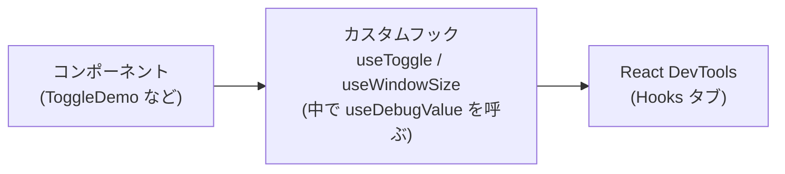

# 第138章：【フック】`useDebugValue`

---

この章では、**カスタムフック専用の「デバッグ用フック」**である
`useDebugValue` を使えるようになるのがゴールです ✨

---

## 1️⃣ `useDebugValue`ってなに？ざっくりイメージ

`useDebugValue` は、React が用意してくれている**公式フック**で、

* ✅ **カスタムフックの中だけ**で使える
* ✅ **React DevTools 上の表示をわかりやすくするラベル**を付けられる
* ✅ 画面の見た目は一切変わらない（**開発者用のメガネ**だけ）
* ✅ 本番（production）のパフォーマンスにはほぼ影響しない設計💡([React][1])

という、**開発者向けのお助けフック**です。
React公式ドキュメントでは「主にライブラリ作者向けのフック」のグループに入っています。([React][2])

---

## 2️⃣ どこで何が見えるの？👀

`useDebugValue` の効果は **React DevTools** で確認します。

React DevTools でコンポーネントを選ぶと、Hooks の一覧が出てきますよね？
通常はこんな感じの表示です：

* `State`
* `Effect`
* `CustomHookName`
* などなど…

ここに **カスタムフック用のラベル＋値** を表示してくれるのが `useDebugValue` です。([React][1])

例えば `useOnlineStatus` というフックの中で

* `"Online"` / `"Offline"` みたいなラベルを出したり、
* `width x height` の文字列を出したり、

といった「人間に優しい表示」にできます ✨

---

## 3️⃣ ルール：どこで使えるの？⚠️

`useDebugValue` には、ちょっと大事なルールがあります：

1. **カスタムフックの中でだけ使う**

   * `function useSomething(...) { ... }` の中
   * ふつうのコンポーネントの中に書いても DevTools には出ません([LogRocket Blog][3])

2. **フックのトップレベルで呼ぶ**

   * `useState` や `useEffect` と同じで、
     if 文やループの中に書かない（Hooks のルール）

3. **返り値はない**

   * `useDebugValue` 自体は **何も返さない**
   * 画面にも何も表示されない（DevTools専用）([React][1])

---

## 4️⃣ いちばんシンプルな例：`useToggle` にラベルを付ける🎚️

まずは、ON/OFF を切り替えるだけのカスタムフックを思い出しつつ、
そこに `useDebugValue` を足してみます。

#### 🔧 カスタムフック側

```tsx
import { useState, useDebugValue } from "react";

type UseToggleReturn = [boolean, () => void];

export function useToggle(initialValue = false): UseToggleReturn {
  const [value, setValue] = useState<boolean>(initialValue);

  // 🔍 DevTools 用のラベルを付ける
  useDebugValue(value ? "Toggle: ON 🔆" : "Toggle: OFF 🌙");

  const toggle = () => {
    setValue((prev) => !prev);
  };

  return [value, toggle];
}
```

#### 🧩 使う側のコンポーネント

```tsx
import { useToggle } from "./useToggle";

export function ToggleDemo() {
  const [isOn, toggle] = useToggle();

  return (
    <button onClick={toggle}>
      {isOn ? "ON 🔆" : "OFF 🌙"}
    </button>
  );
}
```

画面上はただのボタンですが、React DevTools で `ToggleDemo` を選ぶと
Hooks の一覧に、だいたいこんな感じの表示が入ります：

* `useToggle: "Toggle: ON 🔆"`
  or
* `useToggle: "Toggle: OFF 🌙"`

※正確な文言やフォーマットは DevTools のバージョンによって少し違う場合がありますが、
**「カスタムフック名」と「useDebugValue で渡した値」** がセットで見えるイメージです。([React][1])

---

## 5️⃣ React DevTools で確認してみよう手順（Windows想定）🖥️

1. `npm run dev` でアプリを起動する
2. ブラウザで `http://localhost:5173`（Vite のデフォルト）を開く
3. F12 / Ctrl+Shift+I で開発者ツールを開く
4. 上部のタブから **`React`** を選ぶ（React DevTools 拡張）
5. 左側で `ToggleDemo` コンポーネントを選択
6. 右側の **Hooks** のところを見る →
   `useToggle` の行に、さっきの `"Toggle: ON 🔆"` などが表示される 🎉

**ポイント：**

* `console.log` を増やさなくても、
  「今このカスタムフック、内部的にはどういう状態？」が
  ざっくり一目で分かるようになります 💡

---

## 6️⃣ 第2引数 `format` で「重い処理」をあと回しにする🧠

`useDebugValue` は、実は **第2引数** を取ることができます：([React][1])

```ts
useDebugValue(value, formatFunction);
```

* `value`: DevTools に渡したい元データ（なんでもOK）
* `formatFunction`: `value` を受け取って、**表示用の形に変換する関数**

React DevTools でそのカスタムフックを**実際にクリックして展開したときだけ**
この `formatFunction` が呼ばれるので、
**「重い計算」はここに閉じ込めておく**のがコツです。([React][1])

### 📏 例：`useWindowSize` に見やすいラベルを付ける

```tsx
import { useEffect, useState, useDebugValue } from "react";

type WindowSize = {
  width: number;
  height: number;
};

export function useWindowSize(): WindowSize {
  const [size, setSize] = useState<WindowSize>({
    width: window.innerWidth,
    height: window.innerHeight,
  });

  useEffect(() => {
    const handleResize = () => {
      setSize({
        width: window.innerWidth,
        height: window.innerHeight,
      });
    };

    window.addEventListener("resize", handleResize);

    // クリーンアップ
    return () => {
      window.removeEventListener("resize", handleResize);
    };
  }, []);

  // 🧾 DevTools のためのフォーマット関数
  useDebugValue(size, (value) => {
    return `WindowSize: ${value.width} x ${value.height}`;
  });

  return size;
}
```

* 通常のレンダリング中は、ただ `size` のオブジェクトを持っておくだけ
* DevTools でこのフックを展開したときにだけ
  `WindowSize: 1920 x 1080` みたいな文字列を計算して表示してくれます ✨

---

## 7️⃣ 図で見る：`useDebugValue` の位置づけ（Mermaid）🧭

カスタムフック・コンポーネント・DevTools の関係を簡単に図にしてみます 🌈



* コンポーネント → カスタムフックを呼ぶ
* カスタムフック → `useDebugValue` を介して DevTools に「分かりやすいラベル」を提供
* ふつうのユーザーはまったく知らない世界、**開発者だけの補助線**です 💫

---

## 8️⃣ もう少し実践：`useLocalStorage` にデバッグ表示を足す📦

前の章で作ったような `useLocalStorage` を想定して、
**「今このキーにはどんな値が入ってるの？」** を DevTools に出してみます。

### 🧠 サンプル実装（簡略版）

```tsx
import { useState, useEffect, useDebugValue } from "react";

type UseLocalStorageOptions<T> = {
  key: string;
  initialValue: T;
};

type UseLocalStorageReturn<T> = [T, (value: T) => void];

export function useLocalStorage<T>({
  key,
  initialValue,
}: UseLocalStorageOptions<T>): UseLocalStorageReturn<T> {
  const [value, setValue] = useState<T>(() => {
    if (typeof window === "undefined") {
      return initialValue;
    }

    try {
      const stored = window.localStorage.getItem(key);
      if (stored == null) return initialValue;
      return JSON.parse(stored) as T;
    } catch {
      return initialValue;
    }
  });

  useEffect(() => {
    try {
      window.localStorage.setItem(key, JSON.stringify(value));
    } catch {
      // 本番ならエラーログ出したりしてもOK
    }
  }, [key, value]);

  // 🧊 DevTools 用のラベル（フォーマット関数付き）
  useDebugValue(value, (v) => {
    const preview =
      typeof v === "string" ? v : JSON.stringify(v).slice(0, 30);
    return `localStorage[${key}] = ${preview}`;
  });

  const update = (next: T) => {
    setValue(next);
  };

  return [value, update];
}
```

React DevTools で、このフックを使っているコンポーネントを選ぶと、
たとえばこんな感じの情報が見えます：

* `useLocalStorage: "localStorage[userName] = Alice"`
* `useLocalStorage: "localStorage[todoList] = [{\"id\":1,...]"`（途中まで）

「今 localStorage に何が入ってるのか」を、
**コンソールを開かずにサッと確認できる**のがうれしいポイントです 💖

---

## 9️⃣ いつ使う？いつ使わない？バランス感覚📊

### ✅ 使うと便利な場面

* ロジックが **ちょっと複雑なカスタムフック**

  * `useLocalStorage`, `useFetch`, `useFormState` など
* いろいろな画面から再利用される「共通フック」
* チーム開発で、

  * 「このフック、内部的に何してるの？」と聞かれがちなもの

こういうフックに `useDebugValue` が入っていると、
**React DevTools を開くだけで説明書きが見える**ようなイメージです。([Medium][4])

### 🚫 あまりオススメしない場面

* めちゃシンプルなフック（状態ひとつだけ等）で、

  * DevTools を見ても混乱しないもの
* プロジェクト内だけでちょっと使う程度の一時的なフック
* 全てのカスタムフックに惰性的に入れる（情報過多になって逆に見づらい）

公式ドキュメントでも、
「すべてのカスタムフックに付ける必要はなく、**共有ライブラリ的なフックで特に有用**」
と言われています。([React][5])

---

## 🔚 この章のまとめ 🎉

* `useDebugValue` は **カスタムフック用のデバッグ専用フック**
* 画面ではなく **React DevTools の Hooks 表示をわかりやすくする**
* 第2引数にフォーマット関数を渡すと、

  * DevTools で展開されたときだけ実行されるので、
  * 重い計算をそこに閉じ込めておける
* `useToggle` / `useWindowSize` / `useLocalStorage` などに付けると
  **「今の状態」が一瞬で把握できて超便利** ✨

---

## 🎓 ミニ練習問題

時間があるときに、VSCode で実際に試してみてください 💪

1. **練習①：`useToggle` を改造**

   * `useToggle` の `useDebugValue` を

     * `"ON"` / `"OFF"` だけでなく、
     * `初期値が true だったかどうか` も一緒にラベルに入れてみる
       例：`"Toggle(初期値: true) → 現在: OFF"` みたいな感じ

2. **練習②：`useLocalStorage` のキー名だけを一覧にしたい**

   * `useLocalStorage` フックを2つ以上使っている画面を作る
   * それぞれのフックで、`useDebugValue` のフォーマットを工夫して
     **「どのキーがよく使われているか」** を DevTools からパッと分かるようにしてみる

---

次の章では、`useDebugValue` とは別系統の「データ更新をラクにしてくれるフック」たちも見ていきます 🚀
まずは、**自分のカスタムフックに 1か所だけ `useDebugValue` を試しに入れてみる**ところから始めてみてくださいね〜！😊💻✨

[1]: https://react.dev/reference/react/useDebugValue?utm_source=chatgpt.com "useDebugValue"
[2]: https://react.dev/reference/react/hooks?utm_source=chatgpt.com "Built-in React Hooks"
[3]: https://blog.logrocket.com/improve-custom-hook-debugging-with-usedebugvalue/?utm_source=chatgpt.com "Improve custom Hook debugging with useDebugValue"
[4]: https://medium.com/%40dezsays/enhancing-debugging-with-usedebugvalue-hook-a-practical-tool-for-react-developers-caff4779be77?utm_source=chatgpt.com "Enhancing Debugging with useDebugValue Hook"
[5]: https://legacy.reactjs.org/docs/hooks-reference.html?utm_source=chatgpt.com "Hooks API Reference"
