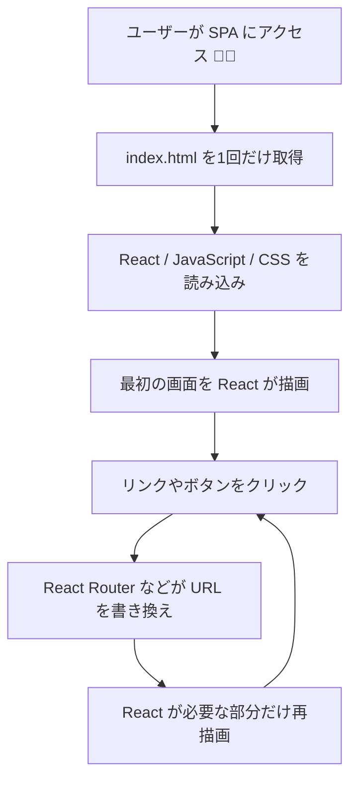
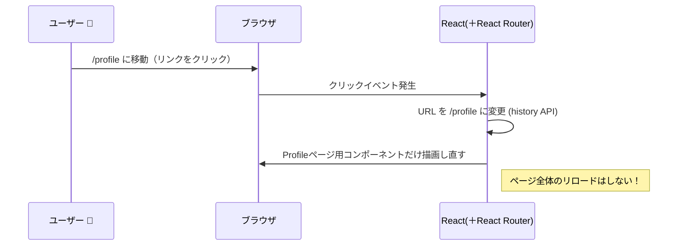

# 第141章：SPA（シングルページアプリ）ってなに？

---

#### 🎯 この章のゴール

この章を読み終わるころには…

* 「SPA（シングルページアプリ）」って何者か説明できる ✨
* 普通のWebサイトとの違いをざっくり言える 💬
* 「なんでReactでルーティング（`react-router-dom`）が必要なのか」がイメージできる 🧠
* これから作るアプリの“全体像”がなんとなく分かる 🗺️

---

## 1. まずは「ふつうのWebサイト」の動き方から 🐢

まず、よくある従来のWebサイト（ブログとか会社サイトとか）をイメージしてね。

* 1ページ = 1つのHTMLファイル
* メニューのリンクをクリックするたびに
  → **ブラウザがサーバーに新しいHTMLを取りに行く**
  → 画面が「パッ」と全部切り替わる

たとえば：

* `index.html`（トップページ）
* `about.html`（このサイトについて）
* `contact.html`（お問い合わせ）

メニューを押すたびに、ページ全体が「ガシャーン」と入れ替わる感じだよね。

このような作り方をよく **MPA（Multi Page Application / マルチページアプリ）** と呼んだりするよ。

---

## 2. SPA（シングルページアプリ）のざっくり定義 💡

それに対して **SPA（Single Page Application）** は名前の通り、

> **基本的には「1つのページ」で完結するアプリ**

という考え方のWebアプリだよ。

* 最初に **`index.html` を1回だけ** 取りに行く
* そのときに **JavaScript（React）も一緒に読み込む**
* あとはユーザーの操作に合わせて
  → Reactが画面の一部だけをどんどん書き換えていく
  → URLは変わるけど、ページ全体のリロードはしない

ブラウザはページ全体を描き直さずに、
**必要な部分だけを入れ替えていくから、動きがアプリっぽくてサクサク**に感じられるんだ。([ウィキペディア][1])

---

## 3. 図で見る：SPAの流れ 🧭

SPAのざっくりした流れをMermaidで図にしてみるね 🌈



ポイントはここ👇

* **ページ全体を入れ替えない**
* ブラウザ上ではずっと同じ `index.html` が表示されている
* 画面の中身（コンポーネント）をReactが差し替えている

---

## 4. MPA vs SPA をざっくり比較してみる 🔍

文章だけだとイメージしづらいので、簡単に比べてみよう ✨

| 項目         | MPA（従来のサイト）     | SPA（シングルページアプリ）        |
| ---------- | --------------- | ---------------------- |
| HTML       | ページごとに別ファイル     | 基本は `index.html` が1つ   |
| 画面切り替え     | ページ全体を再読み込み     | 必要な部分だけを書き換え           |
| 体感速度       | ページ切り替えでもっさりしがち | サクサク動きやすい              |
| 作り方        | サーバー側でHTMLを返す   | クライアント側（ブラウザ）でReactが描画 |
| JavaScript | なくても動く場合も多い     | ほぼ必須（JSが止まるときつい）       |

「アプリっぽく、ぬるぬる動くWebサービス」は、だいたいこのSPAの考え方で作られてることが多いよ 📱💻([ウィキペディア][1])

---

## 5. React と SPA の関係 💙

React 自体は「UIを作るためのライブラリ」だけど、
**SPAとの相性がめちゃくちゃ良い**と言われているよ。([ウィキペディア][2])

理由はこんな感じ👇

* 画面を **コンポーネント** という小さい部品に分けられる
* それぞれのコンポーネントが **自分の状態（State）** を持てる
* 状態が変わったら、Reactが「変わったところだけ」描き直してくれる

さらに、

* **React Router（`react-router-dom`）** というライブラリを使うと
  → URLに応じて
  → 「今どのコンポーネントを表示するか」を切り替えられる
  → なのにページ全体はリロードしない、というSPA的な動きができる

このReact Routerは、**ReactでSPAを作るときの“ルーティング担当”**だと思えばOK 🙆([DEV Community][3])

（詳しい使い方は、**第142章以降**でがっつりやるね！）

---

## 6. もうちょっと深掘り：SPAのメリット・デメリット ⚖️

### 🌈 メリット（いいところ）

* ✅ 画面切り替えが速くて、アプリっぽい体験
* ✅ ページ切り替え時に「真っ白になって一瞬止まる」が起きにくい
* ✅ フロント側（React）で状態を持てるので、リッチなUIが作りやすい
* ✅ コンポーネントの再利用がしやすい

こういう理由で、**ダッシュボード系・SNS・管理画面**などはSPAで作られることが多いよ。([Teams][4])

### 🧩 デメリット（ちょっと大変なところ）

* ⚠️ 最初の読み込み（初回ロード）が重くなりやすい

  * JSのファイルが大きくなりがち
* ⚠️ JavaScriptがオフの環境だと、ほぼ何も動かない
* ⚠️ SEO（検索エンジン対策）は、MPAより工夫が必要なこともある
* ⚠️ ブラウザの戻るボタン・URL管理などをちゃんと設計しないと、挙動がややこしくなる

これらの課題もあって、最近は

* **SPA** と
* **SSR（Server Side Rendering）** / **ハイブリッド**

を組み合わせたフレームワーク（Next.js や React Router v7 のフレームワークモードなど）が使われることも多いよ。([Semaphore][5])

（この講座ではまず、**素のReact + React Router**でSPAの基本を身につけるイメージだよ 💪）

---

## 7. React Router で「ページっぽさ」を作るイメージ 🛣️

「1枚の`index.html`で動いている」とは言っても、ユーザーからすると

> `/`, `/about`, `/users/123` みたいな URL ごとに
> **別のページがあるように見える**

状態を作りたいよね？

その“ページっぽさ”を作るのが、**React Router** のお仕事。

Mermaidでイメージ図を書いてみるね 👀



ユーザーから見ると：

* URLはちゃんと変わる
* 戻るボタンも使える
* でも実際には、**Reactが表示するコンポーネントを切り替えているだけ**

…というのがSPA＋React Routerの世界だよ ✨

---

## 8. 実際のプロジェクトでどこを見れば「SPAっぽい」か？ 🔍

Viteで React + TS のプロジェクトを作ったとき、
`index.html` を開いてみるとこんな感じになっているはず 👇

（※プロジェクトによって多少違うけど雰囲気だけ）

```html
<!doctype html>
<html lang="en">
  <head>
    <meta charset="UTF-8" />
    <title>React SPA</title>
  </head>
  <body>
    <div id="root"></div>
    <script type="module" src="/src/main.tsx"></script>
  </body>
</html>
```

ポイントはここ 🧷

* 画面の中身は全部 **`<div id="root"></div>` の中に描かれる**
* `main.tsx` / `main.tsx` の中で

  * Reactが `root` にアプリ全体を描画している
* ルーティングを入れると

  * この`root`の中で、URLに応じて表示コンポーネントを変えていく

つまり：

> **「1つのHTML＋1つの`root`」の上に、たくさんの“画面”をReactで乗せていく**

これが、React SPAの基本スタイルだよ 🏗️

---

## 9. ミニチェック ✅（理解度セルフテスト）

軽く、自分の理解をチェックしてみよう ✍️

### Q1. SPAとはどんなアプリのこと？

A. ページごとにファイルを分けて、リンクを押すたびにHTMLを全部取り直すアプリ
B. **基本1つのHTMLで、画面の中身をJavaScriptが差し替えながら動かすアプリ**
C. CSSを使わずに作るアプリ

👉 正解：**B** 🎉

---

### Q2. ReactでSPAを作るとき、「ページごとの切り替え」を担当するライブラリはどれ？

* 1: `react-router-dom`
* 2: `axios`
* 3: `lodash`

👉 正解：**1: `react-router-dom`** 🚗

---

### Q3. SPAの「弱点」に近いものはどれ？

* A: JavaScriptに依存するので、JSがオフだときつい
* B: 絶対に高速で、遅くなることはない
* C: HTMLファイルが100枚ないと作れない

👉 正解：**A**
（初回ロードが重くなったり、SEOに工夫が必要だったりするのもSPAの特徴だよ）

---

## 10. この章のまとめ 🌟

* SPAは **「1つのページ（index.html）をベースに、Reactが中身をどんどん入れ替える」** スタイルのアプリ 💻
* 従来型のサイト（MPA）は、リンクをクリックするたびに新しいHTMLを取りに行って、ページ全体を再読み込みする 🐢
* Reactはコンポーネントと状態管理のおかげで、SPAとの相性がとてもいい 💙([ウィキペディア][2])
* `react-router-dom` を使うと、**URLに応じて表示コンポーネントを切り替えつつ、ページリロードなしで動かせる** 🌈

---

### 🔜 次の章（第142章）では…

いよいよ実際に

* `react-router-dom` をインストールして
* `BrowserRouter` でアプリ全体を包んで
* 本物の「SPAっぽい」画面切り替え

を作っていくよ 🚀

「SPAって、1ページの上でたくさんの画面が動いてるんだな〜」
というイメージだけ、しっかり持っておいてくれたらバッチリです 👍✨

[1]: https://en.wikipedia.org/wiki/Single-page_application?utm_source=chatgpt.com "Single-page application"
[2]: https://en.wikipedia.org/wiki/React_%28software%29?utm_source=chatgpt.com "React (software)"
[3]: https://dev.to/seyedahmaddv/react-router-and-its-benefits-in-developing-single-page-applications-spas-4p9?utm_source=chatgpt.com "React Router and Its Benefits in Developing Single Page ..."
[4]: https://teams.pk/blog/react-single-page-application/?utm_source=chatgpt.com "React Single Page Application (SPA) - A Complete Guide"
[5]: https://semaphore.io/blog/routing-layer-react?utm_source=chatgpt.com "How to Build a Routing Layer in React and Why You Need It"
