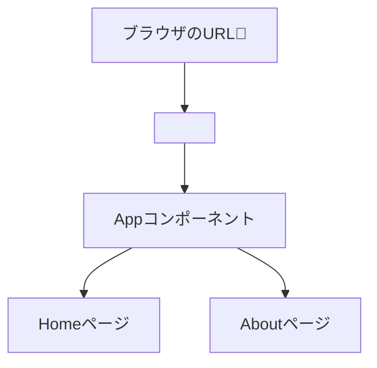

# 第143章：`BrowserRouter` でアプリを囲む

この章では、**「ルーティングの土台」**を作ります。
一言で言うと…

> `App` を `<BrowserRouter> ... </BrowserRouter>` で包んで、
> 「このアプリはSPAとして、URLでページを切り替えますよ〜」と宣言する 🌐

っていう作業をやります。

---

## 143-1 🏁 この章のゴール

この章が終わると…

* `src/main.tsx` の中で `BrowserRouter` が使えるようになる
* アプリ全体が `<BrowserRouter>` に包まれた状態になる
* 次の章（`Routes` / `Route` でページを作る）へスムーズに進める

見た目はほとんど変わらないけど、**アプリの「骨組み」が一段階アップグレード**されます💪

---

## 143-2 🌐 `BrowserRouter` ってそもそも何者？

React は「画面を組み立てる」ライブラリだけで、
**「URLによってページを切り替える」機能は元々入っていません**。

そこで登場するのが **React Router**。
Web向けに使うときは `react-router-dom` を使います。([syncfusion.com][1])

その中でも主役級なのが **`<BrowserRouter>` コンポーネント**。

ざっくりいうと：

* アプリ全体に「ルーティングの仕組み」を提供する親コンポーネント
* 内部で **HTML5 History API** を使って、URL を書き換えながらページ遷移を実現している([iimon TECH BLOG][2])
* `<Routes>` / `<Route>` / `<Link>` / `useNavigate` など、
  ルーティング関係の機能はこの中でしか動けない

イメージとしては、こんな感じ👇



`BrowserRouter` が、
**「URL」と「どのコンポーネントを表示するか」をつなぐ司令塔**
だと思っておけばOKです✨

---

## 143-3 🗂 どのファイルを編集するの？

Vite + React + TypeScript テンプレート（`react-ts`）で作ったプロジェクトだと、

* React アプリの**入口**は `src/main.tsx`

になっています。
前の章までに、ファイルの中身は大体こんな形になっているはずです👇

```tsx
// src/main.tsx（変更前のイメージ）
import React from 'react'
import ReactDOM from 'react-dom/client'
import App from './App.tsx'
import './index.css'

ReactDOM.createRoot(document.getElementById('root') as HTMLElement).render(
  <React.StrictMode>
    <App />
  </React.StrictMode>,
)
```

この `App` の周りに **`<BrowserRouter>` を巻きつける** のが
この章のミッションです💫

---

## 143-4 🛠 手順：`BrowserRouter` でアプリを包む

### ① `react-router-dom` が入っているか確認

前の「第142章」でインストールしている前提ですが、
念のため `package.json` をチラ見してみましょう 👀

* `dependencies` の中に
  `"react-router-dom": "^7.x.x"` のような項目があればOKです。([React Router][3])

もし入ってなさそうだったら（おさらいとして）：

```bash
npm install react-router-dom
```

で入れておいてください。

---

### ② `BrowserRouter` を import する

`src/main.tsx` を開いて、
先頭の import に次の1行を追加します👇

```tsx
// src/main.tsx
import React from 'react'
import ReactDOM from 'react-dom/client'
import { BrowserRouter } from 'react-router-dom'   // ← これを追加 ✨
import App from './App.tsx'
import './index.css'
```

ポイント 💡

* `BrowserRouter` は **`react-router-dom` から import** します
* `react-router` からではないので注意（Web向けなので `dom` の方！）([syncfusion.com][1])

---

### ③ `App` を `<BrowserRouter>` で包む

次に、`render` している部分を書き換えます。

#### 🔁 変更前（イメージ）

```tsx
ReactDOM.createRoot(document.getElementById('root') as HTMLElement).render(
  <React.StrictMode>
    <App />
  </React.StrictMode>,
)
```

#### ✅ 変更後（`BrowserRouter` 追加）

```tsx
// src/main.tsx（完成版）
import React from 'react'
import ReactDOM from 'react-dom/client'
import { BrowserRouter } from 'react-router-dom'
import App from './App.tsx'
import './index.css'

ReactDOM.createRoot(document.getElementById('root') as HTMLElement).render(
  <React.StrictMode>
    <BrowserRouter>
      <App />
    </BrowserRouter>
  </React.StrictMode>,
)
```

やっていることはすごくシンプルで：

* もともと `App` だけだったところを
* `<BrowserRouter>` で「ぎゅっ」と包んだだけ、です 🫶

---

## 143-5 👀 動作確認してみよう

1. ターミナルを開く（VSCode のターミナルでもOK）

2. プロジェクトのフォルダにいることを確認

3. まだ立ち上げてなければ：

   ```bash
   npm run dev
   ```

4. ブラウザで表示（多分 `http://localhost:5173/` など）

見た目は**ほとんど変わらない**はずです。
「え、何が起きたの？🤔」って感じだと思うんですが、それで正解！

今はまだ

* `Routes`
* `Route`
* `Link`

などを使ってないので、
**「ルーティングの準備だけ整った状態」** だと思ってください ✨

次の章（144章）から、いよいよ「ページ」を増やしていきます 🏠➡️📄➡️📄

---

## 143-6 🧠 `BrowserRouter` のイメージをもう少しだけ

頭の中を整理するために、
`BrowserRouter` を**人間キャラ風**にイメージしてみましょう 🧙‍♀️

* ブラウザ「今のURLは `/about` だよ〜」
* `BrowserRouter`
  「OK！ `/about` なら Aboutページを表示しよう✨」
* URL が `/` になったら
  「トップページ（Home）を出してあげよう🏠」

みたいに、**URLと表示するコンポーネントを仲介してくれる司令塔**です。

React Router v7 は、React 18/19 どちらでも
これまで通りの `BrowserRouter` の使い方で動いて、
しかも React 19 向けの新しい機能とも相性よく設計されています。([React Router][3])

---

## 143-7 🫶 よくあるハマりポイント

最初にルーティングを触るときに、
つまずきがちなポイントも先にチェックしておきましょう 👇

### ❌ 1. `import` を書き忘れる

```tsx
// BrowserRouter を使っているのに…
// import { BrowserRouter } from 'react-router-dom'
// を書き忘れているパターン

<BrowserRouter>
  <App />
</BrowserRouter>
```

→ その場合、コンパイルエラー（`BrowserRouter is not defined` 的なやつ）が出ます。
**エラーが出たらまず import 文を疑う**クセをつけておくと、後々かなり楽になります 👍

---

### ❌ 2. `BrowserRouter` を `App.tsx` の中に書いちゃう

たとえば、こんな感じ：

```tsx
// App.tsx の中
export default function App() {
  return (
    <BrowserRouter>
      {/* ここにページごとのルーティングを書く */}
    </BrowserRouter>
  )
}
```

実はこれでも**動きはする**のですが、
この教材では

* **入口（`main.tsx`）でアプリ全体をまとめて包む**

というスタイルで進めていきます。

理由は：

* どのページから見ても「ルーティングはアプリ全体に効いている」と分かりやすい
* 後でコンテキストやレイアウトを組むときに設計しやすい

からです 😊

---

### ❌ 3. `<BrowserRouter>` を二重に書く

たとえば、

* `main.tsx` にも
* `App.tsx` にも

それぞれ `<BrowserRouter>` がある、という状態。

ルーターが二重になると、
URL やナビゲーションの挙動がややこしくなるので、**基本は1つだけ**にします。

> 🔑 ルール：
> **「アプリ全体を包む `BrowserRouter` は1つ」**
> と覚えておけばOKです。

---

## 143-8 📝 ミニ練習問題 ✨

最後に、手を動かしながら確認してみましょう。

### Q1. `React.StrictMode` の外に置いたらどうなる？

今はこうなっています👇

```tsx
<React.StrictMode>
  <BrowserRouter>
    <App />
  </BrowserRouter>
</React.StrictMode>
```

これを、あえてこう書き換えて動かしてみてください👇

```tsx
<BrowserRouter>
  <React.StrictMode>
    <App />
  </React.StrictMode>
</BrowserRouter>
```

* 実際の動作に大きな違いがあるか？
* コンソールに何か警告が出ていないか？

を観察してみてください 🔍
（どちらの配置も動きますが、教材では最初の書き方で統一していきます）

---

### Q2. `App.tsx` の中に `BrowserRouter` を移してみる

* 一度 `main.tsx` から `BrowserRouter` を消して
* 代わりに `App.tsx` の中に書いてみる

その上で、

* どこに置くのが一番しっくりくるか？
* 「入口はシンプルな方が好きかも」「全部Appに任せたいかも」など、自分の好み

も考えてみてください 😊
（この教材では、設計が見えやすいように入口で包むスタイルを採用してます）

---

## 143-9 🎉 まとめ

この章でやったことを、さらっと復習すると…

* `BrowserRouter` は
  👉 **URL と画面表示をつないでくれる「ルーティングの司令塔」**
* Vite プロジェクトでは
  👉 `src/main.tsx` でアプリ全体を `<BrowserRouter>` で包む
* これで準備が整って
  👉 次の章から `Routes` / `Route` / `Link` で本格的に「ページ」を作れる

次の **第144章「`Routes` と `Route` でページの行き先を決める」** から、
いよいよ **「/」「/about」みたいなURLごとのページ」を実際に作っていきます 💻🚀

おつかれさま！この章が終わったあなたのアプリは、
すでに「ちゃんとしたSPA」への一歩を踏み出してますよ〜🌸

[1]: https://www.syncfusion.com/blogs/post/react-router-vs-react-router-dom?utm_source=chatgpt.com "React Router vs. React Router DOM: Understanding the ..."
[2]: https://tech.iimon.co.jp/entry/2025/12/10/?utm_source=chatgpt.com "React Router v7を使ったルーティングを体験してみた"
[3]: https://reactrouter.com/?utm_source=chatgpt.com "React Router Official Documentation"
