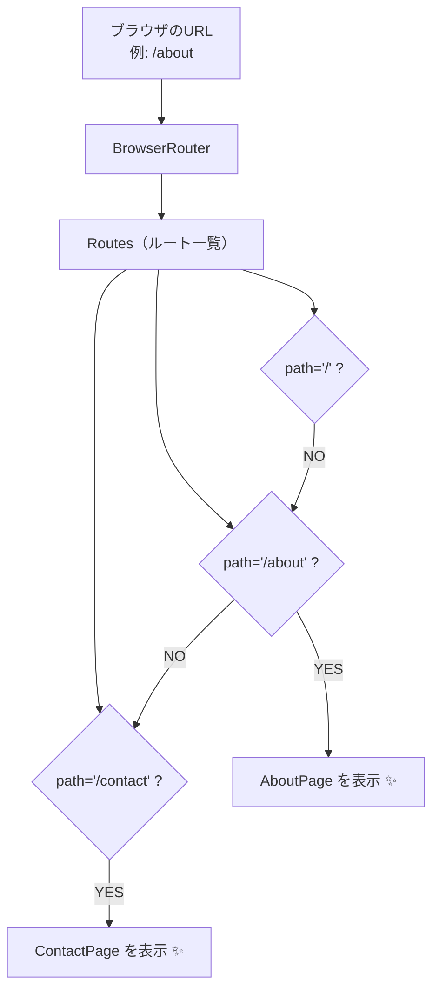

# 第144章：`Routes` と `Route` でページの行き先を決める

この章では、**「URLごとにどの画面を出すか」** を決める、
React Router の主役コンビ **`<Routes>` と `<Route>`** をちゃんと使えるようにしていきます 🎓

---

## 0. 今日のゴール 🎯

この章が終わるころには…

* `App.tsx` の中で
  **「`/` はホーム」「`/about` は自己紹介ページ」** みたいに
  ルーティングを自分で書ける ✅
* `<Routes>` と `<Route>` の**役割の違い**がわかる ✅
* ブラウザのURL欄に `/about` などを打って、
  ページを切り替えられる ✅

> ※ナビゲーション用の `<Link>` は **次の第145章** でやるので、
> 今日は「行き先の定義」に集中します 💡

---

## 1. `Routes` と `Route` はそれぞれ何者？🕵️‍♀️

React Router では、こんな感じの役割分担になっています：([hygraph.com][1])

* **`<BrowserRouter>`**
  → 「ルーター本体」。
  URL を監視して、React Router 全体を動かす 💻
* **`<Routes>`**
  → 「ルーティング一覧表」。
  どのURLに、どの画面を見せるかを**まとめて管理する場所** 🗂️
* **`<Route>`**
  → 1 行ずつのルール。
  「`path="/about"` のときは `AboutPage` を見せてね」みたいな指示 ✍️

イメージ図（Marmaid：ルーティングの構造イメージ）👇

```mermaid
graph TD;
  A[BrowserRouter<br/>(アプリ全体を包む)] --> B[Routes<br/>(ルート一覧)];
  B --> C[Route<br/>path="/" → HomePage];
  B --> D[Route<br/>path="/about" → AboutPage];
  B --> E[Route<br/>path="/contact" → ContactPage];
```

---

## 2. まずは前提：`main.tsx` で `BrowserRouter` を包んでおく 🧺

第143章でやったはずですが、
`main.tsx` はこんな感じになっている前提で進めます（ざっくりおさらい）👇

```tsx
// src/main.tsx
import React from "react";
import ReactDOM from "react-dom/client";
import { BrowserRouter } from "react-router-dom";
import App from "./App";

ReactDOM.createRoot(document.getElementById("root")!).render(
  <React.StrictMode>
    <BrowserRouter>
      <App />
    </BrowserRouter>
  </React.StrictMode>
);
```

> ⚠️ `BrowserRouter` で包んでないと、
> `Routes` や `Route` は**エラーになって動きません**。

---

## 3. `App.tsx` に `Routes` と `Route` を書いてみよう ✍️

次は `App.tsx` を編集して、
**3ページ分のルート** を作ってみます。

* `/` → ホームページ
* `/about` → 自己紹介ページ
* `/contact` → お問い合わせページ

まずはシンプルに、`App.tsx` の中に
ページ用コンポーネントを**まとめて書いてしまう**パターンでいきます（あとでフォルダ分けしてもOK）💡

```tsx
// src/App.tsx
import { Routes, Route } from "react-router-dom";

const HomePage = () => {
  return <h1>ホームページ 🏠</h1>;
};

const AboutPage = () => {
  return <h1>このサイトについて 👩‍💻</h1>;
};

const ContactPage = () => {
  return <h1>お問い合わせ ✉️</h1>;
};

function App() {
  return (
    <Routes>
      {/* ① ルートパス "/" のとき */}
      <Route path="/" element={<HomePage />} />

      {/* ② "/about" のとき */}
      <Route path="/about" element={<AboutPage />} />

      {/* ③ "/contact" のとき */}
      <Route path="/contact" element={<ContactPage />} />
    </Routes>
  );
}

export default App;
```

### ポイント解説 💡

* `import { Routes, Route } from "react-router-dom";`
  → v7 系の React Router でも、この書き方でOK 🙆‍♀️
  React 19 でもそのまま使える書き方です。([npm][2])

* `<Routes> ... </Routes>`
  → **中に `<Route>` をズラッと並べる箱**みたいなイメージ。

* `<Route path="/about" element={<AboutPage />} />`

  * `path`：どのURLにマッチさせるか（文字列）
  * `element`：そのURLのときに**表示したいコンポーネント**

---

## 4. 実際に動かしてみる 👟

1. ターミナルを開いて、Vite の dev サーバーを起動します：

   ```bash
   npm run dev
   ```

2. ブラウザで表示されるURL（たぶん `http://localhost:5173/`）を開く
   → `HomePage` の内容（「ホームページ 🏠」）が出てくるはず！

3. ブラウザの **URL欄** を手で書き換えて試してみる：

   * `http://localhost:5173/` → ホーム
   * `http://localhost:5173/about` → 自己紹介ページ
   * `http://localhost:5173/contact` → お問い合わせページ

   それぞれのURLで、ちゃんと表示が切り替わればOKです ✨

> まだ `<Link>` は使っていないので、
> **URLを手で打ち替える**スタイルで確認します。
> （次の章で「クリックでページ移動」にレベルアップします💫）

---

## 5. `path` の基本ルールを整理しよう 📏

React Router v6 / v7 系での `path` は、基本としてこんな感じです：([hygraph.com][1])

* 先頭に `/` をつけると「絶対パス」

  * 例：`path="/"`, `path="/about"`, `path="/contact"` など
* URL は **小文字・大文字が違うと別物**（基本は全部小文字で書くのが無難）
* 1つの `path` には、**1つの画面（コンポーネント）** を割り当てるイメージ
* 同じ `path` を重複して書かない方が安全（どれが使われるのかわかりにくくなるため）

さらに、これも頭の片すみに 👀

* `element` には **JSX（コンポーネント）** を渡す

  * `element={<HomePage />}` ← この `<HomePage />` が表示される中身

---

## 6. ありがちミス＆チェックリスト ✅

### ❌ よくあるつまずき 1：`BrowserRouter` で包んでない

```tsx
// ❌ NG: main.tsx で BrowserRouter を使っていない
<App />; // だけ
```

こうなっていると、`Routes` を使ったときに
**「Router の外で使ってるよ！」** みたいなエラーになります。

→ **必ず `BrowserRouter` で App を包む**こと 👍

---

### ❌ よくあるつまずき 2：`Routes` じゃなくて `Route` だけ書いてる

```tsx
// ❌ NG
function App() {
  return (
    <>
      <Route path="/" element={<HomePage />} />
      <Route path="/about" element={<AboutPage />} />
    </>
  );
}
```

これもエラーになります。
**`Route` は必ず `Routes` の「中」に入れる**必要があります。

```tsx
// ✅ OK
function App() {
  return (
    <Routes>
      <Route path="/" element={<HomePage />} />
      <Route path="/about" element={<AboutPage />} />
    </Routes>
  );
}
```

---

### ❌ よくあるつまずき 3：`path` のつづりミス

```tsx
<Route path="/abot" element={<AboutPage />} />  // "about" のつもりが "abot" になってる
```

URL に `/about` と打っても、
そもそもパスが違うので表示されません 🥲

> 迷ったら、`Route` に書いた `path` を**コピペ**して
> そのままURL欄に貼り付けるのが安全です ✨

---

## 7. ちょっとイメトレ：URL → 画面の流れ 🧠

`Routes` & `Route` でのルーティングの流れを、
もう一度 Marmaid でイメージしてみましょう 🧭



なんとなく「URL を見て、
`Routes` の中の `Route` を上からチェックして、
**一番よく合うものを表示している**、
みたいなイメージが持てればOKです 🙆‍♀️

---

## 8. ミニ練習問題 💪

余裕があれば、こんな練習もしてみてください 🌟

### 練習 1：ページを1つ増やしてみる

* 新しく `BlogPage` コンポーネントを追加して、

  * `/blog` にアクセスすると表示されるようにする
* 表示内容はシンプルでOK（例：`<h1>ブログページ📝</h1>`）

ヒント：

* App.tsx の中に新しくコンポーネントを追加
* `<Route path="/blog" element={<BlogPage />} />` を `Routes` の中に足す

---

### 練習 2：ページタイトルと絵文字を工夫してみる

* 各ページで、`h1` のテキスト＋絵文字を
  自分っぽくアレンジしてみる 🎀
* たとえば：

  * ホーム：`ようこそ！React練習サイトへ ✨`
  * アバウト：`開発者について 👩‍🎓`
  * お問い合わせ：`気軽にメッセージ送ってね 💌`

---

## 9. まとめ 🧸

この章でおさえたこと ✅

* `BrowserRouter` でアプリ全体を包む（第143章のおさらい）
* ページの行き先は **`<Routes>` と `<Route>`** で宣言的に書く
* `path` でURLを指定し、`element` で表示するコンポーネントを決める
* devサーバーを動かして、URL欄に `/about` などを打って確認できる

次の **第145章** では、
ついに **`<Link>` を使って「クリックでページ移動」** を実現していきます 💃✨

「行き先（Routes & Route）」と
「移動手段（Link）」が揃うと、
一気に「それっぽいWebアプリ」感が出てくるのでお楽しみに〜！🚀

[1]: https://hygraph.com/blog/routing-in-react?utm_source=chatgpt.com "Your complete guide to routing in React"
[2]: https://www.npmjs.com/package/react-router-dom?utm_source=chatgpt.com "react-router-dom"
