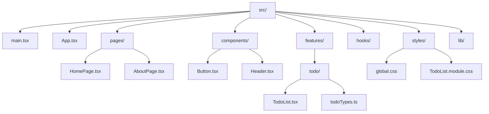

# 第148章：フォルダの分け方

この章では、
「`src` フォルダの中がごちゃごちゃしてきた…😭」
という未来の自分を救うために、**フォルダ構成の考え方**をまとめていきます。

> フォルダの分け方に「唯一の正解」はありません。
> でも「よく使われる型・考え方」はあります 🧩

この章のゴールはこんな感じです👇

* 「よくある React プロジェクトのフォルダ構成」をイメージできる 🎨
* 「小さめなアプリならこのくらいでOK」が分かる ✅
* 「大きくなってきたら、こう整理する」が分かる 📁
* 自分のプロジェクトに、軽くフォルダ整理をかけてみる ✂️

---

## 1️⃣ まずは全体イメージ：よくあるフォルダ構成

いきなり細かい話をする前に、**ざっくり全体像**を見ちゃいましょう。
React + TypeScript（Vite）で、よくある基本パターンの一例です。([NashTech Blog][1])

#### ✅ よくある「ベース構成」のイメージ



👀 ポイントだけざっくり言うと…

* `pages/`
  ルーティングで出てくる「ページ単位」のコンポーネントを置く場所。
* `components/`
  いろいろなところで使い回す「汎用コンポーネント（ボタン、ヘッダーなど）」置き場。
* `features/`
  「TODO 機能」「ユーザー機能」みたいに、**機能ごと**にまとめる場所。
* `hooks/`
  再利用したいカスタムフックたち。
* `styles/`
  `global.css` とか `*.module.css` など CSS 関係。
* `lib/`
  「日付フォーマット」「API クライアント」など、**どこからでも使う便利関数**たち。

もちろん、最初から全部作らなくても大丈夫です。
小さいアプリのうちは、**必要になったら足していく**スタイルでOKです✨

---

## 2️⃣ ２つの考え方：「種類」で分ける vs 「機能」で分ける

みんながよく話題にするのは、この２パターンです👇([DEV Community][2])

1. **ファイルの種類ごとに分ける**（レイヤー別）
2. **機能ごとに分ける**（フィーチャー別）

順番に、イメージだけ掴みましょう。

---

### 🧩 パターンA：ファイルの「種類」で分ける

#### イメージ例

```plaintext
src/
  components/   ← いろんな画面で使い回すボタン・カードなど
  pages/        ← ルーティングの「ページ」
  hooks/        ← カスタムフック
  styles/       ← CSS
  lib/          ← ユーティリティ系（共通の関数）
  main.tsx
  App.tsx
```

#### ✅ よいところ

* 直感的で分かりやすい（「コンポーネントは components だよね〜」的な）
* 小〜中規模のアプリでは、これだけでも結構いける
* 初学者にはかなり取り組みやすい構成

#### ⚠️ 弱点

* 大きくなってくると
  「この機能のファイル、どこに散らばってるんだっけ？」となりがち
* １つの画面に関係するコードが
  `pages/` と `components/` と `hooks/` などにバラける

---

### 🧩 パターンB：「機能（フィーチャー）」ごとに分ける

ある程度アプリが大きいときに人気なのが、
**「機能ごと」にフォルダをまとめる**パターンです。([Tiep Phan — Lập Trình Thật Kỳ Diệu][3])

#### イメージ例

```plaintext
src/
  features/
    todo/
      components/
        TodoList.tsx
        TodoItem.tsx
      hooks/
        useTodo.ts
      todoTypes.ts
      api.ts
    user/
      components/
        UserProfile.tsx
      hooks/
        useUser.ts
  components/   ← 完全に汎用なボタン・モーダルなど
  pages/
  hooks/
  styles/
  lib/
```

#### ✅ よいところ

* 「TODO 機能のコードは、とりあえず `features/todo` 見ればOK！」となる
* 機能単位で切り離しやすい（将来、別プロジェクトに持っていくなど）
* チーム開発で「この機能担当の人」が分けやすい

#### ⚠️ 弱点

* 小さいアプリだと、ちょっとフォルダが大げさに見えるかも
* 最初に考えることが少し増える（どこまでを 1 機能とするか…など）

---

## 3️⃣ この講座でオススメする「ハイブリッド構成」

この講座の雰囲気だと、**次みたいな「ゆるめのハイブリッド」構成**がオススメです 🥰

> 基本は「種類」で分けつつ、
> 特に大きくなる機能だけ `features/` にまとめるスタイル。

#### 🌸 小〜中規模アプリ向けサンプル構成

```plaintext
src/
  main.tsx
  App.tsx

  pages/          ← ルーティングで使う「ページ」コンポーネント
    HomePage.tsx
    TodoPage.tsx

  components/     ← いろんな画面で使える「共通UI」
    layout/
      Header.tsx
      Footer.tsx
    ui/
      Button.tsx
      Card.tsx

  features/       ← 大きくなりそうな「機能」だけここにまとめる
    todo/
      TodoList.tsx
      TodoItem.tsx
      todoTypes.ts
      useTodo.ts

  hooks/          ← 完全に共有したいカスタムフック
    useWindowSize.ts
    useLocalStorage.ts

  styles/
    global.css
    TodoPage.module.css

  lib/
    apiClient.ts
    formatDate.ts
```

**ここだけ押さえればOK👇**

* `pages/` … ページそのもの（ルーティングの行き先）
* `components/` … どのページでも使い回せる UI 部品
* `features/` … 「TODO」「ユーザー」など、機能単位で大きくなりそうなところ
* `hooks/` … ほんとに汎用的なカスタムフック
* `lib/` … ロジック系の便利関数

> 「迷ったら `pages` or `components` に置く。
> 大きくなってきたら `features` に引っ越す」くらいのノリでOKです ✨

---

## 4️⃣ 実践：あなたのプロジェクトを軽く整理してみよう 🧹

ここからは、実際に Vite で作ったプロジェクトを少しだけ整理してみるステップです。
（すでに作ってあるものに「ちょい足し」するイメージでやります）

---

### ✅ ステップ1：`pages` フォルダをつくる

1. `src` フォルダの中に `pages` フォルダを作成します。
2. React Router で使っている「画面コンポーネント」を `pages` に移動します。

たとえば、今まで：

```plaintext
src/
  App.tsx
  Home.tsx
  About.tsx
```

だったとしたら、こうします👇

```plaintext
src/
  App.tsx
  pages/
    HomePage.tsx
    AboutPage.tsx
```

💡 名前のつけ方の小ネタ：

* ルーティングの「ページ」は `HomePage`, `TodoPage` みたいに
  **「〜Page」**を付けておくと、自分でも後で分かりやすいです。

---

### ✅ ステップ2：`components` フォルダをつくる

次に、**いろんな画面から使い回したいコンポーネント**を `components` に集めます。

例：

* ヘッダー
* フッター
* 共通ボタン
* 共通カード

```plaintext
src/
  components/
    layout/
      Header.tsx
      Footer.tsx
    ui/
      Button.tsx
      Card.tsx
  pages/
    HomePage.tsx
    AboutPage.tsx
  App.tsx
  main.tsx
```

> 「このコンポーネント、他の画面でも使いそう〜」と思ったら
> `components` 行きにする、くらいのゆるさで大丈夫です 💄

---

### ✅ ステップ3：`features` を 1 個だけ試してみる

次に、実験的に **1 機能だけ `features` にまとめてみる**ステップです。

例として、「TODO 機能」があるとします。

#### Before（ちょっと散らばってる状態）

```plaintext
src/
  TodoPage.tsx
  TodoList.tsx
  TodoItem.tsx
  useTodo.ts
  todoTypes.ts
```

#### After（`features/todo` にお引っ越し）

```plaintext
src/
  pages/
    TodoPage.tsx       ← ルーティングのページ本体
  features/
    todo/
      TodoList.tsx
      TodoItem.tsx
      useTodo.ts
      todoTypes.ts
```

* `TodoPage.tsx` は「ページ」なので `pages/`
* `TodoList.tsx` などは「TODO 機能専用」なので `features/todo/`

👉 こうしておくと、

* TODO 関係のコードを触りたいとき → とりあえず `features/todo` を見る
* ページのレイアウトや構成を変えたいとき → `pages/TodoPage.tsx` を見る

みたいに頭の中が整理されやすくなります 🧠✨

---

## 5️⃣ フォルダ分けの「ゆるルール集」📏

最後に、「こうしておくと後でラクだよ〜」という**ゆるルール**を何個かまとめます。

### 💡 ルール1：1 ファイルが 300 行超えたら引っ越しを検討

* `App.tsx` がモンスター級に大きくなってきたら、

  * 一部を `components/` や `features/` に切り出す
* 「このコンポーネント、そろそろ 1 ファイルにしては重いな…」と思ったら、

  * 専用フォルダを作ってもOKです👇

```plaintext
components/
  ui/
    Button/
      index.tsx
      Button.module.css
```

---

### 💡 ルール2：「ページ」と「共通UI」は分ける

* `pages/` … ルーティングで表示される「画面」
* `components/` … 画面の中で使う「部品」

この 2 つを分けておくだけでも、
「どこ見ればいいの？」問題がかなり減ります 🌈([Max Rozen][4])

---

### 💡 ルール3：将来「再利用しそうか？」で置き場所を決める

* **この機能専用で終わりそう** → `features/` の中
* **他のページでも使いそう** → `components/`
* **どこからでも呼び出したいロジック** → `lib/` or `hooks/`

> 「再利用できそう感」で置き場所を決めると、
> プロジェクトが大きくなっても迷子になりにくいです 🧭

---

## 6️⃣ ミニ課題 🎓（やってみよー）

軽く手を動かす用のミニ課題です。
全部やらなくても、「できそうなものだけ」でOKです ✨

1. **自分のプロジェクトに `pages/` と `components/` を作る**

   * ルーティングで使っている画面コンポーネントを `pages/` に移動
   * ヘッダーやボタンなど、共通っぽいものを `components/` に移動

2. **1 つだけ `features/` フォルダを作る**

   * 今ある機能の中で、一番ボリュームがありそうなものを選ぶ（例：TODO）
   * その機能専用のコンポーネント・フック・型定義を `features/◯◯` にまとめてみる

3. **README に「フォルダのルール」を 3 行だけ書く**

   * 例：

     * ページは `src/pages`
     * 共通UIは `src/components`
     * 機能ごとのコードは `src/features/機能名`

---

## まとめ 🌈

この章で覚えておきたいのは、たったこれだけです：

* フォルダ構成に**絶対の正解はない**、でも**よく使われる型**はある
* 小さいうちは「種類で分ける」だけでもOK
* 大きくなってきたら「機能ごと」にまとめると頭がスッキリ
* 迷ったら：

  * ページ → `pages/`
  * 共通UI → `components/`
  * 特定機能専用 → `features/◯◯`

次の **第149章「絶対パスインポート（../../ 地獄からの脱出）」**では、
今日作ったフォルダたちを **もっと使いやすく読み込むテク**を見ていきます 🚀

おつかれさまでした〜！🍰☕

[1]: https://blog.nashtechglobal.com/how-to-organize-a-react-project-folder-structure-101/?utm_source=chatgpt.com "How to Organize a React Project: Folder Structure 101"
[2]: https://dev.to/itswillt/folder-structures-in-react-projects-3dp8?utm_source=chatgpt.com "⚛️ Folder Structures in React Projects"
[3]: https://www.tiepphan.com/practical-react-project-structure-2024/?utm_source=chatgpt.com "React Project Structure 2024 — Lập Trình Thật Kỳ Diệu"
[4]: https://maxrozen.com/guidelines-improve-react-app-folder-structure?utm_source=chatgpt.com "Guidelines to improve your React folder structure"
