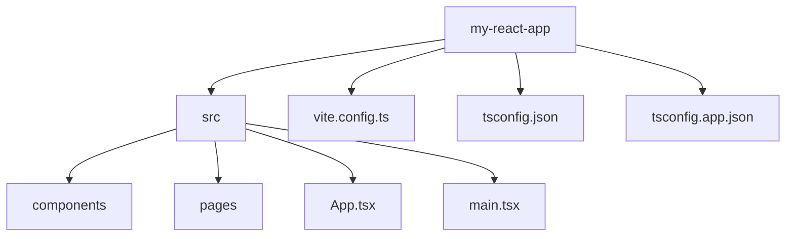

# 第149章：絶対パスインポート

「`import Header from '../../../../../components/Header'`」
こんなインポート、見たことありますか？🥹

ページが増えるほど `../` が増えていって、

* どこからどこを辿ってるのか分からない…
* 1個フォルダ増やしただけで全部パス書き換え…
* コピペしたらパスだけ地味にズレてバグ…

みたいな **`../../` 地獄** が起きます。

この章では、

> `@/components/Header`

みたいな **「絶対パスインポート（パスエイリアス）」** を設定して、
`../../` から解放されるのがゴールです ✨

---

## 1. まずはイメージ：相対パス vs 絶対パス 😈🤍

### 😈 相対パスインポートの例

`src/pages/dashboard/UserProfile.tsx` から
`src/components/user/UserCard.tsx` を読みたいとします。

````
```ts
// before（よくあるやつ）
import { UserCard } from '../../components/user/UserCard'
```
````

フォルダを1個ネストしただけで、すぐ合わなくなりがちです…。

---

### 🤍 絶対パスインポートの例（パスエイリアス）

同じ場所から、**エイリアス `@` を「`src` フォルダ」だと決めておく**と：

````
```ts
// after（理想形✨）
import { UserCard } from '@/components/user/UserCard'
```
````

* どのファイルから書いても **常に同じ書き方** 🎯
* フォルダ構成を整理しても、`@/` から下だけ直せばOK
* 「このファイルどこにあるんだ…？」が減る

React や Vite では、
**`@` を `src/` に対応させるスタイルがかなり一般的**です。([Vue School][1])

---

## 2. プロジェクト構造を図で確認してみよう 🗂️

今までの章で作ってきたイメージを、ざっくり図にするとこんな感じ👇



この章でやりたいのは：

* `@` 👉 `src` を指すように設定して
* どこからでも `@/components/...` と書けるようにする

という **ルールをプロジェクト全体に教えてあげる**ことです 💡

---

## 3. 「絶対パスインポート」の正体は **パスエイリアス** 🎭

ここでいう「絶対パス」は、

* OS の `/Users/...` みたいなガチ絶対パスではなく、
* **「プロジェクトの中でのショートカット」** です。

具体的には：

* `@/` 👉 `./src/`
* 将来的に `~/` 👉 プロジェクトルート、みたいなエイリアスも追加できる

みたいな **ニックネーム（エイリアス）を付ける**イメージです。

ただし、ここで注意ポイントがひとつ⚠️

> Vite（バンドラー）と TypeScript は、
> **別々に「パスの解決」をやっている**

なので、

* Vite 用：`vite.config.ts` に設定
* TypeScript / エディタ用：`tsconfig` に設定

の **2ヶ所をちゃんと揃える必要がある**んです。([blog.openreplay.com][2])

---

## 4. TypeScript 側の設定（`tsconfig`）を直す 💻

### 4-1. どの `tsconfig` を触るか？

最近の Vite + React + TS テンプレート（`react-ts`）だと、だいたいこうなっています👇([Medium][3])

* `tsconfig.json`
* `tsconfig.app.json`
* `tsconfig.node.json`

`tsconfig.json` は「親」で、
**実際にブラウザ側のコードに効いているのは `tsconfig.app.json`** です。([Speaker Deck][4])

なので：

* `tsconfig.app.json` がある → **そっちを編集**
* ない → `tsconfig.json` を編集

という方針にします ✨

### 4-2. `baseUrl` と `paths` を追加する

`tsconfig.app.json` を開いて、
`"compilerOptions"` の中に、**次の2行を追加**します。

> すでに `"compilerOptions"` があるはずなので、
> その中に足すだけでOKです（丸ごと書き換えないようにだけ注意🐣）

````
```jsonc
{
  "compilerOptions": {
    // もともと入っている設定いろいろ...

    // ここから追加 ✨
    "baseUrl": ".",
    "paths": {
      "@/*": ["./src/*"]
    }
    // ここまで追加 ✨
  }
}
```
````

これで TypeScript 的には：

* `@/components/Button`
  👉 `./src/components/Button` を探す

というルールが伝わります 🎉

> 💡 メモ
> VS Code や TypeScript は、
> **この `paths` 設定を見て補完やジャンプをしてくれます。**
> なので、ここが間違っているとエディタだけ赤くなったりします。

---

## 5. Vite 側の設定（`vite.config.ts`）に alias を書く ⚙️

つぎは **Vite 本体** にも「`@` は `src` ね」と教えます。

Vite の設定ファイル `vite.config.ts` を開いてください。
`create vite@latest` で作ったままなら、たぶんこんな雰囲気 👇([note.shiftinc.jp][5])

````
```ts
import { defineConfig } from 'vite'
import react from '@vitejs/plugin-react'

export default defineConfig({
  plugins: [react()],
})
```
````

ここに **`resolve.alias` を追加**します。
さらに、Node の `fileURLToPath` / `URL` を使って、
`@` が `./src` を指すようにしてあげます。([Vue School][1])

````
```ts
import { defineConfig } from 'vite'
import react from '@vitejs/plugin-react'
import { fileURLToPath, URL } from 'node:url' // ← 追加

export default defineConfig({
  plugins: [react()],
  resolve: {
    alias: {
      '@': fileURLToPath(new URL('./src', import.meta.url)),
    },
  },
})
```
````

### 5-1. `@types/node` が必要なこともあるかも？ 🤔

もし `vite.config.ts` で、

* 「`node:url` が見つからない」
* 「`fileURLToPath` がなんちゃら…」

みたいな **TypeScript のエラー（赤線）** が出たら、
`@types/node` を devDependencies に入れてあげると直ることが多いです。([Zenn][6])

````
```bash
npm install -D @types/node
```
````

（テンプレートによっては最初から入っていることもあります👌）

---

## 6. 実際にインポートを `@/` に書き換えてみよう ✏️

設定ができたので、試しに1か所だけでも書き換えてみましょう！

### Before：相対パス地獄バージョン 😵

`src/pages/dashboard/UserProfile.tsx` から、
`src/components/user/UserCard.tsx` を読み込む例：

````
```ts
// src/pages/dashboard/UserProfile.tsx
import { UserCard } from '../../components/user/UserCard'

export function UserProfile() {
  return (
    <section>
      <h1>ユーザープロフィール</h1>
      <UserCard />
    </section>
  )
}
```
````

### After：エイリアスすっきりバージョン ✨

````
```ts
// src/pages/dashboard/UserProfile.tsx
import { UserCard } from '@/components/user/UserCard'

export function UserProfile() {
  return (
    <section>
      <h1>ユーザープロフィール</h1>
      <UserCard />
    </section>
  )
}
```
````

パスを見ただけで、

> 「あ、`src/components/user/UserCard.tsx` ね」

と一発で分かるようになります 💖

---

## 7. うまく動かないときのチェックリスト ✅

「設定したのに動かないよ〜😢」というときは、
次のチェックリストを順番に確認してみてください。

1. **開発サーバーを一回止めて、再起動した？**

   * `npm run dev` を再実行してみる

2. **`tsconfig` と `vite.config.ts` で同じルールになっている？**

   * どちらも `@/*` 👉 `./src/*` / `./src` になっているか

3. **`tsconfig.app.json` を編集すべきなのに `tsconfig.json` だけ直してない？**

   * `react-ts` テンプレだと、実際にアプリに効いているのは `tsconfig.app.json` 側です ([Speaker Deck][4])

4. **VS Code を再読み込みしてみた？**

   * たまに TypeScript サーバーが古い設定を握ったままのこともあります
   * コマンドパレットから「TypeScript: Restart TS Server」でもOK

5. **インポートの書き方が `@/components/...` になっている？**

   * 途中で `./@/components/...` みたいに混ざっていないかチェック

それでもダメなときは、
`[vite] Failed to resolve import "@/..."` みたいなエラー文をよく読むと、
ヒントが書いてあることが多いです 👀

---

## 8. ミニ練習 🎓（やってみよう）

最後に、**自分のプロジェクトで手を動かす練習**です。

### 📝 やることリスト

1. `tsconfig.app.json`（なければ `tsconfig.json`）に
   `baseUrl` / `paths` を追加して、`@/*` 👉 `./src/*` にする。
2. `vite.config.ts` に `resolve.alias` を追加して、
   `@` 👉 `./src` を指すようにする。
3. `src/pages` 配下のファイルのうち、
   相対パスインポートをしているものを **2〜3個だけ** 選んで、

   * `../../components/...` を
   * `@/components/...` に書き換える。
4. ブラウザで動作を確認 👀
   画面がちゃんと出ていれば成功です 🎉

---

## まとめ 🎀

この章では、

* `../../` だらけの **相対パス地獄** を
* `@/components/...` という **絶対パスインポート（パスエイリアス）** で救済する
* そのために **`tsconfig` と `vite.config.ts` の両方を設定する**

という流れをやりました。

次の第150章では、
この **絶対パスインポート** と相性バツグンな

> `index.ts`（バレルファイル）でさらにインポートをスッキリさせるテクニック

をやっていきます ✨

ここまで来たあなたのプロジェクト、
だんだん「プロっぽい構成」になってきてますよ〜💪💕

[1]: https://vueschool.io/articles/vuejs-tutorials/import-aliases-in-vite/?utm_source=chatgpt.com "Import Aliases in Vite - Vue School Articles"
[2]: https://blog.openreplay.com/vite-fix-failed-to-resolve-import-path-aliases/?utm_source=chatgpt.com "Vite: Fix \"Failed to resolve import\" (path aliases)"
[3]: https://medium.com/%40robinviktorsson/complete-guide-to-setting-up-react-with-typescript-and-vite-2025-468f6556aaf2?utm_source=chatgpt.com "Complete Guide to Setting Up React with TypeScript and ..."
[4]: https://speakerdeck.com/uhyo/tsconfig-dot-jsonnozui-jin-noxin-ji-neng-huairupasubian?utm_source=chatgpt.com "tsconfig.jsonの最近の新機能 ファイルパス編"
[5]: https://note.shiftinc.jp/n/n9c5fcd207680?utm_source=chatgpt.com "ViteでTypeScript×Reactの開発環境を構築してみた【前編】"
[6]: https://zenn.dev/akira108/articles/30d13d4496e65a "Vite + TypeScript + React + Tailwindcss + shadcn/ui のプロジェクトを作る"
