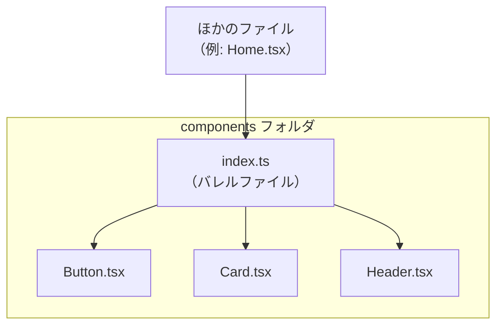

# 第150章：`index.ts` (バレルファイル) でスッキリさせる

この章では「`index.ts` を使って、フォルダごとに出口を1つにまとめるテクニック」をやっていきます 💪
キーワードは **バレルファイル（barrel file）** っていう考え方です。

---

### 1️⃣ そもそも「バレルファイル」ってなに？🤔

まず用語からいきましょう。

* **バレルファイル（barrel file）**
  → そのフォルダにある部品たちを、**まとめて再エクスポートするファイル** のこと。
  → だいたいファイル名は **`index.ts`** や `index.tsx` にすることが多いよ 🎯

イメージとしては…

* コンポーネントたち：`Button.tsx`, `Card.tsx`, `Header.tsx` など
* それらをまとめる代表：`index.ts`

> 「このフォルダの中の部品は、とりあえず全部 `index.ts` 経由で出入りしてね〜」
> っていう **受付係ちゃん** みたいな存在です 🧍‍♀️📮

---

### 2️⃣ 図でイメージしてみよう 🧠🗺️

フォルダと `index.ts` の関係を、カンタンな図にしてみます 💡



* 外のファイルたち（`Home.tsx` とか）は、
  👉 `components/index.ts`（＝`components`）から必要な部品をもらうだけでOK 🎁
* 中身が増えても、外から見ると **入口が1つのまま** なのでスッキリします✨

---

### 3️⃣ `index.ts` がない場合の import 🧵

まずは、**バレルファイルを使わない** パターンから見てみましょう。

フォルダ構成例：

```text
src/
  components/
    Button.tsx
    Card.tsx
    Header.tsx
  pages/
    Home.tsx
```

`Home.tsx` からコンポーネントを使いたいとき、よくこう書きますよね：

```ts
// src/pages/Home.tsx
import { Button } from '../components/Button';
import { Card } from '../components/Card';
import { Header } from '../components/Header';

export function Home() {
  return (
    <div>
      <Header />
      <Card>
        <p>カードの中身です〜</p>
      </Card>
      <Button>押してね</Button>
    </div>
  );
}
```

ファイルが増えるほど、**import 行がどんどん増えていく** のがちょっとダルい感じ…😇

---

### 4️⃣ `index.ts` を置くとどう変わる？✨

同じフォルダ構成で、`components` フォルダの中に `index.ts` を1つ追加します。

```text
src/
  components/
    Button.tsx
    Card.tsx
    Header.tsx
    index.ts   ← NEW!!
  pages/
    Home.tsx
```

`index.ts` の中身は、**コンポーネントをまとめて再エクスポート** するだけ：

```ts
// src/components/index.ts
export { Button } from './Button';
export { Card } from './Card';
export { Header } from './Header';
```

すると、`Home.tsx` の import はこうなります👇

```ts
// src/pages/Home.tsx
import { Button, Card, Header } from '../components';

export function Home() {
  return (
    <div>
      <Header />
      <Card>
        <p>カードの中身です〜</p>
      </Card>
      <Button>押してね</Button>
    </div>
  );
}
```

✨ ポイント

* import が **1行だけ** になってスッキリ！
* `components` フォルダにファイルが増えても、外からは
  👉 `../components` さえ見ておけばOK 🥳

---

### 5️⃣ `export * from ...` との書き方の違い 🧾

`index.ts` の書き方は、だいたいこの2パターンがあります。

#### パターンA：名前をハッキリ書く ✏️

```ts
// src/components/index.ts
export { Button } from './Button';
export { Card } from './Card';
export { Header } from './Header';
```

メリット：

* 何を外に出しているのかが **一目でわかる** 👀
* 途中で「これは外に出したくないな〜」とか調整しやすい

#### パターンB：`export * from` を使う 🌟

```ts
// src/components/index.ts
export * from './Button';
export * from './Card';
export * from './Header';
```

メリット：

* とにかく楽。**そのファイルの全部を外に流す** イメージ
* 小さいプロジェクトや検証コードならこれでサクッとOK

この教材では、

> 「最初はパターンA（名前をちゃんと書く）」

をおすすめします 👍
慣れてきたら `export * from` も使ってみてね。

---

### 6️⃣ default export のコンポーネントをまとめる場合 🧸

もしコンポーネントを **default export** している場合は、
`index.ts` でこんなふうに書きます。

```ts
// src/components/Button.tsx
import type { ReactNode } from 'react';

type ButtonProps = {
  children: ReactNode;
  onClick?: () => void;
};

export default function Button({ children, onClick }: ButtonProps) {
  return (
    <button onClick={onClick}>
      {children}
    </button>
  );
}
```

```ts
// src/components/index.ts
export { default as Button } from './Button';
export { default as Card } from './Card';
export { default as Header } from './Header';
```

こうすると、外からは **全部「名前付き」で使える** ようになります👇

```ts
import { Button, Card, Header } from '../components';
```

> 「中では default、外からは全部名前付き」
> みたいなスタイルもよく使われるよ 🙆‍♀️

---

### 7️⃣ 前の章とつながる話：絶対パスインポートとの相性💘

149章でやった **絶対パスインポート**（例：`@/components`）と合わせると、さらに気持ちよくなります。

* `tsconfig.json` の `paths` 設定で
  `@/components` → `src/components` を指すようにしておけば…

`Home.tsx` からこう書けます：

```ts
// src/pages/Home.tsx
import { Button, Card, Header } from '@/components';

export function Home() {
  return (
    <div>
      <Header />
      <Card>
        <p>こんにちは〜</p>
      </Card>
      <Button>押してね</Button>
    </div>
  );
}
```

* `../components` みたいな相対パスともサヨナラできるし
* `index.ts` があるから、**フォルダをまたいでも import がいつも同じ書き方** になります 🎉

---

### 8️⃣ `index.ts` を使う時の「お約束」⚠️

便利なバレルファイルですが、**ちょっとした注意点** もあります。

#### ⚠️ お約束1：同じフォルダの中では `index.ts` を使わない

**NG 例：**

```ts
// src/components/Button.tsx
import { Card } from './'; // ← これは index.ts を読んでしまう
```

こうすると、

* `index.ts` がまた `Button` を export していたりして
* **循環参照（ぐるぐる依存）** になる危険があります 🌀

👉 同じフォルダ内では、**素直に直接ファイルを指定** しましょう。

```ts
// src/components/Button.tsx
import { Card } from './Card'; // ← こっちが安全
```

#### ⚠️ お約束2：とりあえず「よく使うもの」だけまとめる

なんでもかんでも `index.ts` に全部出すと、

* 「このフォルダ、何が外に出てるんだっけ？」ってわかりにくくなったり
* あまり使わない部品までいつも読み込まれそうな気持ちになったり（実際にはツリーシェイキングで整理されるけど、気分的に…）

なので最初は：

* ページからよく使うコンポーネント
* 共通レイアウト
* よく使うUIパーツ

くらいをまとめる感じでOKです 🧸

---

### 9️⃣ やってみよう！ミニ演習 ✍️✨

小さめの演習で、実際に `index.ts` を書いてみましょう。

#### ✅ ステップ1：フォルダを用意

`src/components` に、こんなファイルがあるとします：

* `PrimaryButton.tsx`
* `SecondaryButton.tsx`
* `SectionTitle.tsx`

#### ✅ ステップ2：それぞれを名前付き export にする

例）`PrimaryButton.tsx`

```tsx
// src/components/PrimaryButton.tsx
import type { ReactNode } from 'react';

type PrimaryButtonProps = {
  children: ReactNode;
  onClick?: () => void;
};

export function PrimaryButton({ children, onClick }: PrimaryButtonProps) {
  return (
    <button className="primary-button" onClick={onClick}>
      {children}
    </button>
  );
}
```

（`SecondaryButton.tsx` も同じように `export function SecondaryButton(...)` でOK）

#### ✅ ステップ3：`src/components/index.ts` を作る

```ts
// src/components/index.ts
export { PrimaryButton } from './PrimaryButton';
export { SecondaryButton } from './SecondaryButton';
export { SectionTitle } from './SectionTitle';
```

#### ✅ ステップ4：どこかのページから使ってみる

```tsx
// src/pages/ExamplePage.tsx
import { PrimaryButton, SecondaryButton, SectionTitle } from '@/components';
// ↑ 149章でやった絶対パス設定を使っている想定

export function ExamplePage() {
  return (
    <main>
      <SectionTitle>ボタンたちのページ</SectionTitle>
      <PrimaryButton onClick={() => alert('Primary!')}>
        メインのボタン
      </PrimaryButton>
      <SecondaryButton>
        サブのボタン
      </SecondaryButton>
    </main>
  );
}
```

これで、

* import 文が1行になってスッキリ 🌈
* 新しい共通コンポーネントを作ったら、`index.ts` に1行足すだけで
  どこからでも同じ書き方で使えるようになります 🎉

---

### 🔚 まとめ：`index.ts` は「出口を1つにする魔法」🪄

この章で覚えておきたいポイントはココ👇

* `index.ts`（バレルファイル）は、**フォルダの出口を1つにまとめるファイル**
* 外からは `import { Something } from '@/components';` みたいに書けて超スッキリ ✨
* 中身が増えても、**外から見るインターフェースは変えずに済む**
* 同じフォルダ内では `index.ts` から import しない（循環参照に注意！）

次の大きなテーマに進む前に、
自分のプロジェクトの中で **「共通パーツのフォルダ + `index.ts`」** を1つ作ってみてくださいね 💻💖

「フォルダごとに“受付担当の `index.ts`” を置いてあげる」
そんなイメージを持てたら、この章はクリアです〜 ✅✨
