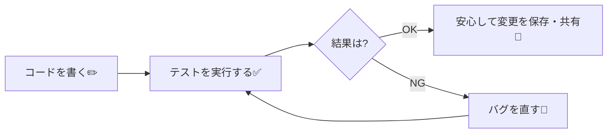

# 第151章：なんでテストするの？

*(未来の自分をめちゃくちゃ助けるお守り編)*

---

## 1️⃣ 「テスト」ってそもそもなに？🤔

プログラミングの世界でいう「テスト」は、

> **「このコード、本当に思ったとおりに動いてる？」を機械にチェックしてもらうこと**

だよ〜✨

ふつうのチェックだと：

* 自分でブラウザ開く
* ボタンをポチポチ押す
* 入力して、結果を目で見る

みたいに、**人間が手で確認**するよね。
これも立派なテストなんだけど、だんだんこうなる👇

* パターンが増えてきてめんどくさい😇
* 同じことを何回も繰り返して、だんだん雑になる😵
* 「前は動いてたのに、いつのまにか壊れてた…」🫠

そこで登場するのが **「自動テスト」** ✨

* テスト用のコードを書いておく
* コマンド（例：`npm test`）をポンッと実行するだけで
* たくさんのチェックを **一気に & 正確に & 何回でも** やり直せる ✅

---

## 2️⃣ 未来の自分を助ける「安全ネット」🕸️💖

React アプリって、作っているうちに…

* コンポーネントが増える
* Props が増える
* 画面のパターンも増える

とにかく**「つながり」**が多くなっていくのね 🧩

ここで、ある日あなたはこう思います。

> 「この表示、ちょっと変えたいな〜。ここをサクッと書き換えよ♪」

で、ちょっと書き換えた結果：

* 表示は一見うまくいってるように見える
* でも別のページで **こっそりバグが生まれてる** 🐛

…ということがめちゃくちゃ起こりやすい😇

---

### テストがある世界 vs ない世界 🪄

**テストがない世界：**

* 変更するたびに

  * 「このページも確認」
  * 「あっちのページも確認」
  * 「あれ？このケースは見たっけ？」
* 不安 & 手動チェックの沼にハマる🌀

**テストがある世界：**

* コードを書き換える
* テストを `npm test` で実行 ✅
* ✅ ぜんぶ緑 → 「よし、今回も壊してないっぽい！」
* ❌ 赤になったテスト → 「ここ直したらOKだな」と場所がすぐ分かる

つまりテストは、

> **「過去の自分が、未来の自分のために残したチェックリスト」**

みたいなものなんだよね💌

---

## 3️⃣ TypeScriptがあってもテストは必要？🧠➡️🧪

TypeScript も、もちろんめちゃくちゃ頼もしい相棒✨

* 型のおかげで「ありえない使い方」は防いでくれる
* たとえば `number` に文字列入れようとしたら怒ってくれる

でも、TypeScript が守ってくれるのはあくまで **「型の間違い」** まで。

例：

```ts
function calcPrice(price: number, taxRate: number) {
  // 本当は price * taxRate したかったのに…
  return price - taxRate; // ← ロジックが間違ってる😇
}
```

これ、**TypeScript 的には OK** なのね。
「`number - number` は別に合法だよ〜」って感じで。

でも、人間的には ✨アウト✨ じゃん？
こういう **「意味としての間違い」** を見つけるのがテストの仕事だよ🕵️‍♀️

---

## 4️⃣ 手動テスト vs 自動テストのイメージ図 🧭

React 開発のループを、ざっくり図にしてみるね👇



このループがちゃんと回るようになると、

* 「ちょっと書き換えるの怖いな…」😨 → 「テスト通ってるし大丈夫やろ！」😎
* 「どこが壊れたのか分からない…」→ 「赤くなったテストが教えてくれる」🔍

みたいに、**開発のメンタルがめっちゃ楽**になるよ✨

---

## 5️⃣ どんなテストがあるの？ざっくりマップ🗺️

ここでは、ざっくりイメージだけつかめばOK！
React の世界では、テストにもいくつか「レベル」があるよ。

* 🧱 **単体テスト（Unit Test）**
  1つの小さな部品・関数だけをチェック

  * 例：`calcPrice()` 関数だけをテスト

* 🧩 **結合テスト（Integration Test）**
  部品同士がつながった状態でチェック

  * 例：フォーム入力 → ボタン → メッセージ表示 までをまとめて確認

* 🌐 **E2Eテスト（End-to-End）**
  ユーザーが実際に触るのと同じ動きをブラウザで再現

  * 例：本物のブラウザを動かして、「ログイン → 投稿 → ログアウト」までをチェック

この講座ではまず、

> 🧱 **「コンポーネントやロジックのテスト（Unit / Component Test）」**

を中心にやっていくよ。
「アプリ全体のテスト」より、**小さくて現実的で、勉強にもなる**からね ✨

---

## 6️⃣ React アプリでテストを書くメリット 🥳

React でテストを書くと、こんな良いことがあるよ👇

* ✅ **デザインを変えても、動きが壊れてないか確認できる**
  → 見た目の CSS はガンガン変えてOK。動きはテストで守る。

* ✅ **リファクタリング（書き直し）が怖くなくなる**
  → 中身のコードを整理しても、「前と同じ動きをしてる？」をテストがチェック。

* ✅ **共同開発でも安心**
  → 自分以外の人が書き換えても、テストが赤くなれば「そこ違うよ〜」とお知らせ。

* ✅ **仕様のメモ代わりになる**
  → 「このコンポーネントは、こういう入力をしたら、こういう表示になる」
  → テストコードを読めば、挙動がわかる📚

---

## 7️⃣ このあと何をするの？👀（この章の位置づけ）

この **第151章** は、

> 「テストってそもそもなんで大事なの？」
> 「TypeScriptあるのに、まだテスト要るの？」

みたいなモヤモヤをスッキリさせるための章だよ🌈

次の章からは、いよいよ実際に：

* 🧪 **Vitest**（テストを実行するツール）
* 🧪 **React Testing Library**（Reactコンポーネントをテストするための便利ツール）

を使って、

* コンポーネントをテストの世界に呼び出して
* ボタンを「テストの中で」クリックさせたり
* 画面に表示されるテキストをチェックしたり

…みたいな、**実践テスト**を一緒に書いていくよ💪✨

---

## 8️⃣ この章で覚えておいてほしい3つ🌟

1. **テストは、未来の自分（とチーム）を助ける安全ネット**だよ🕸️
2. **TypeScript は型のミスを防ぐけど、「意味のミス」は防げない** → だからテストが必要🧪
3. **React アプリは部品が多くてつながりだらけ**だから、テストがあると安心して育てていける👶➡️🧑

ここまで理解できていれば、この章はバッチリ👌
次の章から、実際にテストツールを使っていこうね〜！🧪✨
