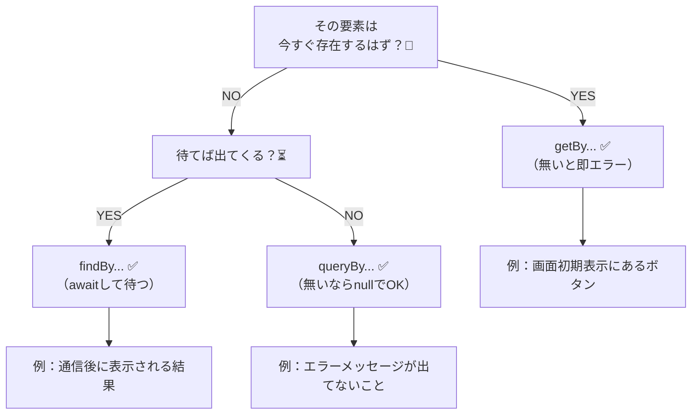
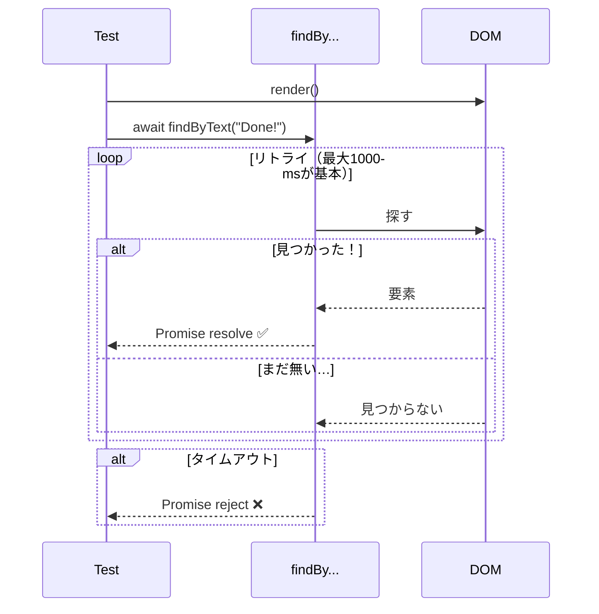

# 第154章：`getBy...` `findBy...` `queryBy...` の違い

## 今日のゴール 🎯

テストで要素を探すときに、
「今あるはず？」「あとで出てくる？」「無いことを確かめたい？」を見分けて、**3つを迷わず選べる**ようになるよ😊

---

## まず結論：3つの性格を一言で 🧠💡

* **`getBy...`**：*「あるはず！」* → **無いと即エラー**😤
* **`queryBy...`**：*「無いかも」* → **無いと`null`**（平和）🕊️
* **`findBy...`**：*「そのうち出るはず！」* → **待って探す（Promise）**⏳

（Testing Library公式でも、この3タイプの違いは「エラーを投げるか」「Promiseでリトライするか」と説明されてるよ）([testing-library.com][1])

---

## ちゃんと整理：戻り値・エラー・待つかどうか 📌

| 種類           |              見つかった |            見つからない |    複数見つかった | 待つ？ |
| ------------ | -----------------: | ----------------: | ---------: | --: |
| `getBy...`   |              要素を返す |           **エラー** |    **エラー** |   ❌ |
| `queryBy...` |              要素を返す |        **`null`** |    **エラー** |   ❌ |
| `findBy...`  | **Promiseが解決して要素** | **タイムアウトでreject** | **reject** |   ✅ |

デフォルトのタイムアウトは **1000ms** だよ（公式）([testing-library.com][1])

---

## 使い分けフローチャート（これだけ見ればOK）🗺️✨



---

## まず覚える「型」：全部 “By何々” の前に付くだけ 🧩

`getByRole` / `queryByText` / `findByLabelText` みたいに、**前半（get/query/find）だけが性格の違い**で、後半（Role/Text/LabelText…）は「探し方」だよ😊
（公式でも `getBy...` / `queryBy...` / `findBy...` という型で説明されてる）([testing-library.com][1])

---

## 例で体に入れよう 💪💕（`screen` を使うのが基本）

`screen` を使うのがおすすめだよ（公式でも推奨）([testing-library.com][1])

### サンプル部品：最初は「Loading...」→あとで「Done!」になる 🐣

```tsx
// LoadingSample.tsx
import { useEffect, useState } from "react";

export function LoadingSample() {
  const [done, setDone] = useState(false);

  useEffect(() => {
    const id = setTimeout(() => setDone(true), 50);
    return () => clearTimeout(id);
  }, []);

  return (
    <div>
      {!done ? <p>Loading...</p> : <p>Done!</p>}
    </div>
  );
}
```

---

## 1) `getBy...`：**今あるはず**を取る ✅😤

「最初に Loading は見えるはず！」みたいなとき。

```ts
import { render, screen } from "@testing-library/react";
import { LoadingSample } from "./LoadingSample";

test("最初は Loading... が見える", () => {
  render(<LoadingSample />);

  const el = screen.getByText("Loading...");
  expect(el).toBeInTheDocument();
});
```

ポイント💡：`getBy...` は「無いと即エラー」だから、**そこが失敗したらテストも即落ちる**よ([testing-library.com][1])

---

## 2) `findBy...`：**あとで出てくるはず**を待つ ✅⏳✨

「Done! はちょっと待てば出る！」みたいなとき。

```ts
import { render, screen } from "@testing-library/react";
import { LoadingSample } from "./LoadingSample";

test("しばらくすると Done! が見える", async () => {
  render(<LoadingSample />);

  const el = await screen.findByText("Done!");
  expect(el).toBeInTheDocument();
});
```

`findBy...` は **待ってリトライして探す**（`getBy...` + `waitFor` の合体）って公式に書いてあるよ🪄([testing-library.com][1])

---

## 3) `queryBy...`：**無いことを確認**する ✅🕵️‍♀️

「Done! が最初から出てたらおかしい！」とか、
「エラー表示が出てないはず！」みたいなとき。

```ts
import { render, screen } from "@testing-library/react";
import { LoadingSample } from "./LoadingSample";

test("最初は Done! はまだ無い", () => {
  render(<LoadingSample />);

  expect(screen.queryByText("Done!")).not.toBeInTheDocument();
});
```

`queryBy...` は **無いと`null`**を返すから、「無いのが正解」なテストで超便利だよ🙆‍♀️([testing-library.com][1])

---

## よくあるハマりどころ集 🧯😵‍💫

### ❌ 1) “待つべき場面” で `getBy...` を使う

通信後に出るUIを `getBy...` で探すと、**まだ無い**ので即エラーになりがち😇
→ **`findBy...`** にしよっ✅([testing-library.com][2])

### ❌ 2) “無いことを確認したい” のに `getBy...`

無いのが正解なのに、`getBy...` は無いと怒る💥
→ **`queryBy...`** にしよっ✅([testing-library.com][1])

### ❌ 3) “複数ある” のに `getBy...` / `queryBy...`

1個用は **複数マッチでもエラー**だよ⚠️
→ 複数なら `getAllBy...` / `queryAllBy...` / `findAllBy...` を使う（公式）([testing-library.com][1])

---

## ちょい発展：待ち方のイメージ図 🧠⏳



（デフォルトタイムアウト 1000ms などは公式の説明どおりだよ）([testing-library.com][1])

---

## ミニ練習（5分）✍️🌸

次の「どれ使う？」を答えてみてね😊

1. 画面に「保存」ボタンが**最初からある** → ✅（　　　　）
2. API取得後に「ユーザー名」が**あとで出る** → ✅（　　　　）
3. 初期表示では「エラー表示」が**出てないはず** → ✅（　　　　）
4. 「タグ」が3つ並ぶのを取りたい（複数） → ✅（　　　　）

答え👇
1: `getBy...` / 2: `findBy...` / 3: `queryBy...` / 4: `getAllBy...`（待つなら `findAllBy...`）([testing-library.com][1])

---

## まとめ 🎀

* **あるはず** → `getBy...` 😤
* **無いのが正解** → `queryBy...` 🕊️
* **あとで出る** → `findBy...` ⏳✨

次の第155章は、これを使って **カウンターアプリのテスト**を書いていく流れだよ〜！🧪💖

[1]: https://testing-library.com/docs/queries/about/ "About Queries | Testing Library"
[2]: https://testing-library.com/docs/dom-testing-library/api-async/ "Async Methods | Testing Library"
