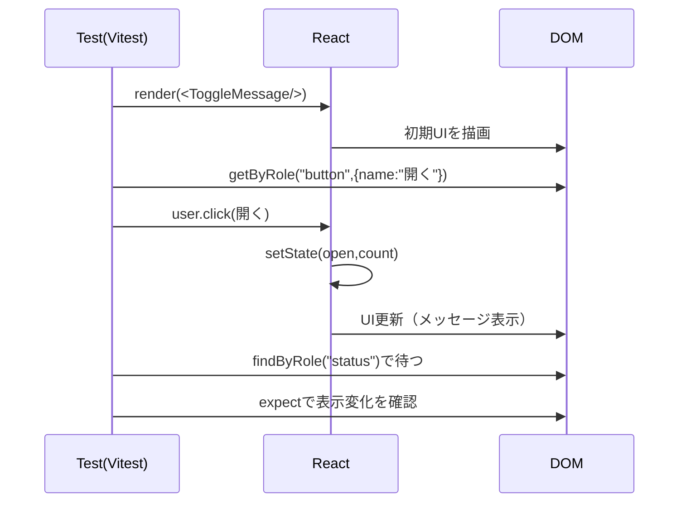

# 第157章：練習：クリック操作と、画面が変わったかどうかのテスト

この章では「ボタンをクリックしたら表示が変わる」みたいな **いちばん基本で超大事なUIテスト** を、React Testing Library + user-event で書けるようにします😊💕

---

## この章で作るもの 🎁

* 「開く / 閉じる」ボタンをクリックすると…

  * メッセージが **表示されたり** ✅
  * **消えたり** ✅
  * ボタンの文字も変わったり ✅

---

## テストの流れ（図解）🗺️

```mermaid
flowchart TD
  A[テスト開始] --> B[render()で部品を表示]
  B --> C[初期状態を確認]
  C --> D[user.click()でクリック]
  D --> E[Stateが更新される]
  E --> F[画面が再レンダリング]
  F --> G[表示が変わったか検証]
  G --> H[テスト終了]
```

---

## 1) コンポーネントを作ろう（クリックで表示が切り替わる）🧩

`src/components/ToggleMessage.tsx` を作成👇

```tsx
import { useState } from "react";

type Props = {
  initialOpen?: boolean;
};

export function ToggleMessage({ initialOpen = false }: Props) {
  const [open, setOpen] = useState(initialOpen);
  const [count, setCount] = useState(0);

  function handleClick() {
    setOpen((v) => !v);
    setCount((c) => c + 1);
  }

  return (
    <section>
      <button type="button" onClick={handleClick}>
        {open ? "閉じる" : "開く"}
      </button>

      <p>クリック回数: {count}</p>

      {open && <p role="status">やった！表示できたよ✨</p>}
    </section>
  );
}
```

ポイント💡

* `role="status"` を付けておくと、テストで探しやすい＆アクセシブルで良きです🙆‍♀️✨

---

## 2) テストを書こう（クリックして画面が変わるか？）🧪

`src/components/ToggleMessage.test.tsx` を作成👇

```tsx
import { render, screen, waitForElementToBeRemoved } from "@testing-library/react";
import userEvent from "@testing-library/user-event";
import { ToggleMessage } from "./ToggleMessage";

test("初期状態：メッセージは表示されていない🙅‍♀️", () => {
  render(<ToggleMessage />);

  expect(screen.queryByRole("status")).not.toBeInTheDocument();
  expect(screen.getByRole("button", { name: "開く" })).toBeInTheDocument();
  expect(screen.getByText("クリック回数: 0")).toBeInTheDocument();
});

test("クリックすると：メッセージが表示されて、ボタン文字も変わる✅", async () => {
  const user = userEvent.setup();
  render(<ToggleMessage />);

  const button = screen.getByRole("button", { name: "開く" });
  await user.click(button);

  // 画面変化を待ってから確認（Reactの更新は“すぐ”とは限らないので安全✨）
  const message = await screen.findByRole("status");
  expect(message).toHaveTextContent("やった！表示できたよ✨");

  expect(screen.getByRole("button", { name: "閉じる" })).toBeInTheDocument();
  expect(screen.getByText("クリック回数: 1")).toBeInTheDocument();
});

test("もう一回クリックすると：メッセージが消える✅", async () => {
  const user = userEvent.setup();
  render(<ToggleMessage />);

  await user.click(screen.getByRole("button", { name: "開く" }));
  const message = await screen.findByRole("status");

  await user.click(screen.getByRole("button", { name: "閉じる" }));

  // 消えるのを待つテク（見た目の変化をちゃんと待てる🧠✨）
  await waitForElementToBeRemoved(message);

  expect(screen.queryByRole("status")).not.toBeInTheDocument();
  expect(screen.getByRole("button", { name: "開く" })).toBeInTheDocument();
  expect(screen.getByText("クリック回数: 2")).toBeInTheDocument();
});
```

---

## クリックテストのイメージ（図解）🖱️➡️🖥️



---

## 3) テスト実行（Windows）▶️💨

VS Code のターミナルで👇

```bash
npm run test
```

もし監視モード（変更したら自動で回るやつ）を使う設定なら👇（環境によるけどよく使う✨）

```bash
npm run test -- --watch
```

---

## よくあるミス集 🥲➡️😊

* **`screen.getBy...` で “ないもの” を探してしまう**

  * ❌ `getByText("ない文字")` → エラーで落ちる
  * ✅ “存在しないこと” を確認したいなら `queryBy...` を使う✨

* **クリック後の変化を待たずに assert しちゃう**

  * ✅ `await user.click(...)`
  * ✅ `findBy...` や `waitForElementToBeRemoved` を使う
    → これで安定度がグッと上がるよ🥰

---

## 練習問題（ミニ課題）✍️🎓

1. ✅「開く」→「閉じる」→「開く」って **ボタン文字が戻る** テストを書いてみてね✨
2. ✅ クリック回数が **連打しても正しく増える** テストを書いてみてね🔥
3. 🌟（余裕あれば）メッセージ文言を Props で受け取れるようにして、テストも更新してみよ😉

---

次の第158章では、いよいよ `npm run build` で本番用ファイルを作ります🏗️✨
続けていこ〜！😊💖
