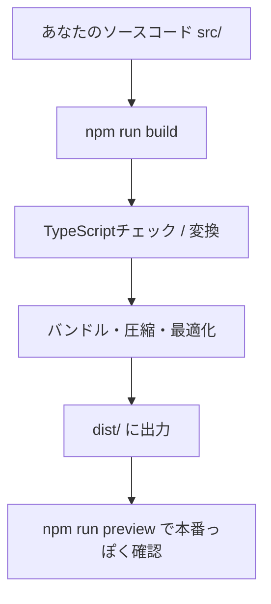

# 第158章：`npm run build`

今日は「**本番用（公開用）にギュッとまとめたファイル**」を作るコマンド、`npm run build` をやるよ〜！🥳💻
これができると、次の章（`dist`の中身チェック）や、最終章の公開にスムーズに進めるよ！🚀🌈

---

## まず結論：`npm run build` で何が起きるの？🤔💡

* 開発中のコード（`.tsx`）を、ブラウザで速く動く形に**変換＆最適化**してくれる✨
* `dist` フォルダに、公開に必要なファイル一式が出力される📦
* JS/CSSが**圧縮**されて軽くなる🪶
* 画像やCSSなどのファイル名が、キャッシュ対策で**ハッシュ付き**になったりする🧁

---

## 図でイメージしよ〜（Mermaid）🗺️✨



---

## 1) いったん開発サーバーを止めよう 🛑⌨️

もし `npm run dev` を動かしてるなら、ターミナルで

* `Ctrl + C`（止める）

しておこう！🙂

---

## 2) ビルドしてみよう！🏗️🎉

プロジェクトのフォルダでこれを実行：

```bash
npm run build
```

うまくいくと、だいたいこんな雰囲気のログが出るよ（環境で少し違うよ）👀✨

* `dist` に出力しました〜
* 各ファイルのサイズが出る（gzip後サイズとか）

---

## 3) `build` が失敗したときに見るポイント 🔥🧯

### ✅ よくある原因①：TypeScriptのエラー（型ミス）🧩

Viteのテンプレによっては、`build` の中で **`tsc`（TypeScriptのチェック）** が走ることがあるよ！
その場合、型エラーがあると **ビルドが止まる** 🙅‍♀️💥

* エラーメッセージの **ファイル名** と **行番号** を見て直そう🔎

---

### ✅ よくある原因②：importパス間違い / ファイル名違い 🧭

Windowsだとファイル名の大小文字が通ってしまって、公開先（Linux）で死ぬパターンもあるよ😵
`UserCard.tsx` を `userCard.tsx` で import してた…みたいなやつ！

---

## 4) `dist` ができたか確認しよう 📁✨

ビルド成功したら、プロジェクト直下に `dist` フォルダができるよ！

ざっくりこんな感じ👇

```text
dist/
  index.html
  assets/
    index-xxxxx.js
    index-xxxxx.css
    ...
```

---

## 5) 超大事：`npm run preview` で本番っぽく動作チェック ✅🌟

`dist` ができたら、**必ずプレビュー**しよ！
開発中は動くのに、本番で壊れる系を早めに潰せるよ👊✨

```bash
npm run preview
```

* ブラウザで表示されるURL（例：`http://localhost:4173`）にアクセス🚪🌐
* 画面がちゃんと出るか、画面遷移、フォーム、API取得など確認しよう🧪💕

> ⚠️ `preview` は「`dist` を配信する」ので、公開時に近い状態でチェックできるのがポイントだよ〜！

---

## 6) ちょいハマり：サブフォルダ公開する予定なら `base` に注意 🧠📌

たとえば将来、
`https://example.com/myapp/` みたいな **サブパス** に置くなら、Viteの `base` 設定が必要なことがあるよ！

`vite.config.ts` の例（サブパスが `/myapp/` の場合）👇

```ts
import { defineConfig } from "vite";
import react from "@vitejs/plugin-react";

export default defineConfig({
  plugins: [react()],
  base: "/myapp/",
});
```

---

## ミニ練習（5分）⏱️🍩

1. `npm run build` を実行
2. `dist` ができたか確認
3. `npm run preview` を実行
4. 本番っぽく動くか、1つ操作して確認（ボタン押す、ページ移動する、など）🎮✨

---

## まとめ 🎀

* `npm run build` は **公開用の完成品（dist）を作るコマンド** 🏗️✨
* 成功したら `dist/` ができる📦
* `npm run preview` で **本番っぽく最終チェック** ✅🌈
* 失敗したらまず **TSエラー** と **importパス** を疑う🔎🧯

---

次の「第159章：`dist` フォルダの中身」では、**生成物が何を意味してるのか**を一緒にのぞいていこうね👀💕
