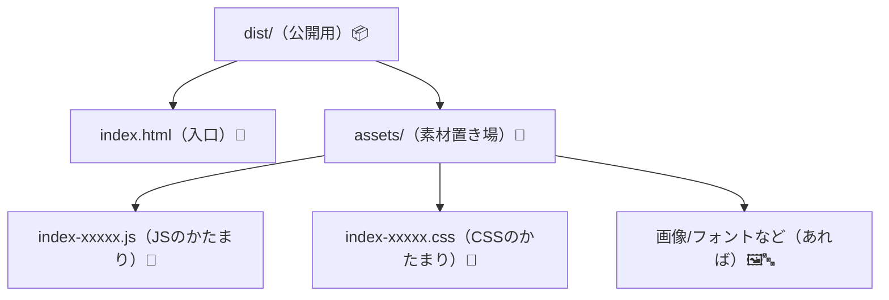
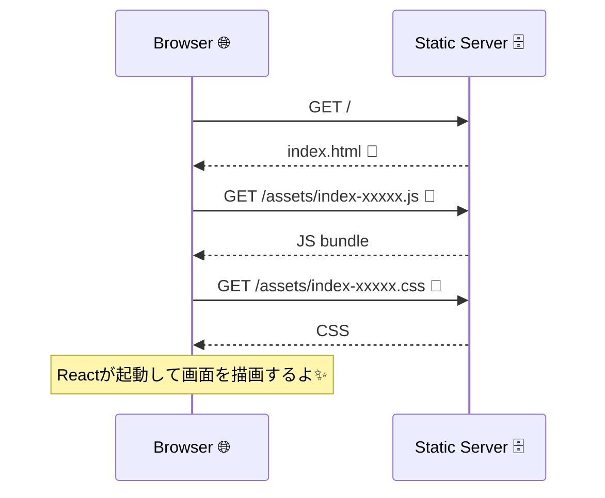

# 第159章：`dist` フォルダの中身を見てみる

第158章で `npm run build` をしたら、プロジェクト直下に **`dist`** フォルダができたはず！
この `dist` は「**公開用に完成した成果物置き場**」だよ〜🙌🎉（静的ホスティングにそのまま置ける形） ([vitejs][1])

---

## 1) まずは `dist` を“目で見る”👀✨

### Windowsのターミナルで確認（プロジェクト直下で）

```bash
npm run build
dir dist
tree dist /f
```

`tree dist /f` が特におすすめ！🌳✨
フォルダ構造が一気に見えるよ〜！

---

## 2) `dist` のだいたいの中身はこんな感じ📁✨

Viteの標準だと、基本はこの形が多いよ👇（※ハッシュは毎回変わる）

```text
dist/
  index.html
  assets/
    index-xxxxxx.js
    index-xxxxxx.css
    （画像やフォントがあればここに一緒に入る）
```

図で見るとこう！🧠✨



---

## 3) `index.html` は「入口」🚪✨

`dist/index.html` を開くと、だいたいこんな役目をしてるよ👇

* 最初に読み込まれるHTML（**アプリの玄関**）🚪
* `<script ... src="/assets/index-xxxxx.js">` みたいに、**ビルドされたJS**を読み込む
* `<link ... href="/assets/index-xxxxx.css">` みたいに、**ビルドされたCSS**を読み込む

つまり **「index.html → assetsのJS/CSS → Reactが起動」** の順番で動く！✨



---

## 4) `assets` の “ハッシュ付きファイル名”って何？🔐✨

`index-**xxxxx**.js` の **xxxxx** みたいなのは、だいたい **内容に応じて変わる目印（ハッシュ）**だよ！

* 中身が変わる → ファイル名も変わる
* だからブラウザが古いのをキャッシュしてても、**新しいファイルを確実に取りに行ける**🙆‍♀️💖（キャッシュ対策）
  Viteでも「参照されたアセットはハッシュ付きになる」って説明されてるよ。 ([vitejs][2])

---

## 5) `dist/index.html` をダブルクリックで開いちゃダメ？🙅‍♀️💦

開けることもあるけど、**本番に近い形でチェックするなら `preview` が正解**✅✨
Viteは `dist` を配信するローカルサーバを起動できるよ〜！

```bash
npm run preview
```

デフォルトだと `http://localhost:4173` で確認できるよ🌈✨ ([vitejs][3])

---

## 6) ここ超大事！`dist` は編集しない✋😺

`dist` は「焼き上がったケーキ」🍰みたいなもの！

* 直す場所：`src/` の中（TSXやCSS）
* 直したら：また `npm run build`

`dist` を直接いじると、次のビルドで上書きされて消えちゃうよ〜😵‍💫💦

---

## 7) ちょい知識：ソースマップ `.map` が出ることもある🕵️‍♀️

設定で `build.sourcemap` を有効にすると、本番用に `.map` が出る場合があるよ（デフォルトは `false`）。 ([vitejs][4])
※本番で配るかはチーム方針次第！

---

## ミニ練習（5分）🧸📝✨

1. `tree dist /f` で、`dist` の構造を確認🌳
2. `dist/index.html` をエディタで開いて、`/assets/...` の参照を見つける🔎
3. `npm run preview` で本番っぽく動くのを確認✅✨ ([vitejs][3])

---

次の第160章で、いよいよ **Vercel / Cloudflare Pages にアップ**して「ネットに公開！」だね〜〜！🚀🌍✨

[1]: https://vite.dev/guide/build?utm_source=chatgpt.com "Building for Production"
[2]: https://vite.dev/guide/assets?utm_source=chatgpt.com "Static Asset Handling"
[3]: https://vite.dev/guide/static-deploy?utm_source=chatgpt.com "Deploying a Static Site"
[4]: https://ja.vite.dev/config/build-options?utm_source=chatgpt.com "build.target - ビルドオプション"
