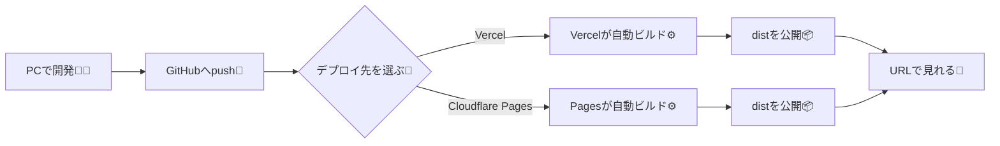
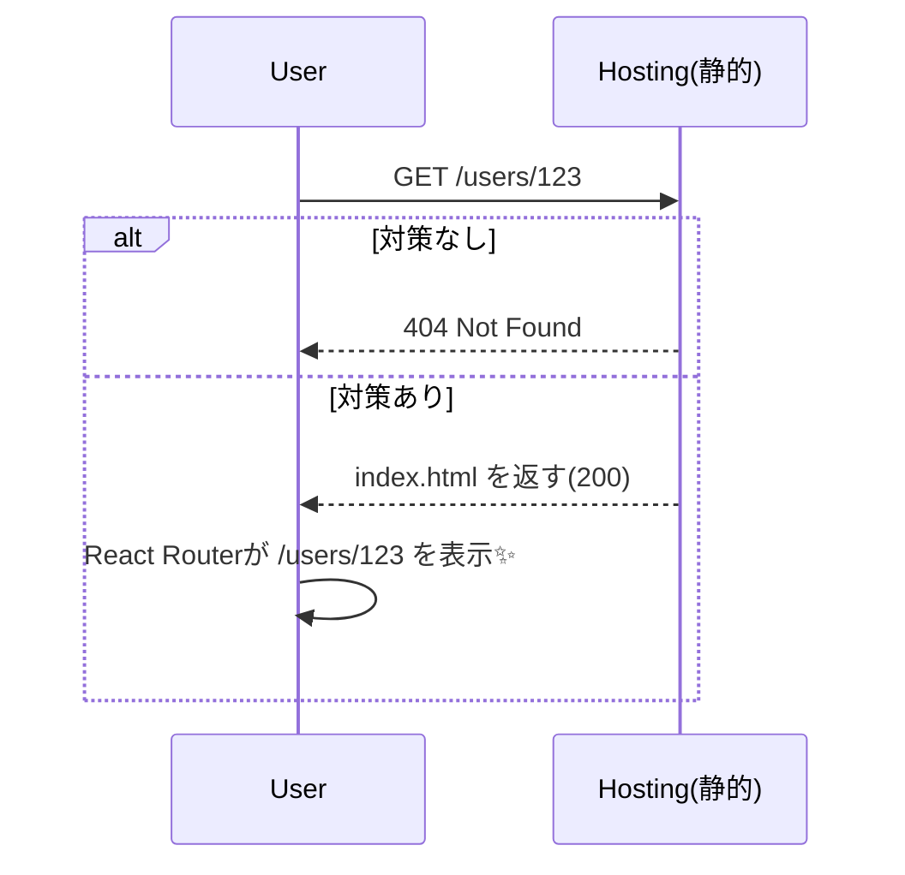

# 第160章：Vercel / Cloudflare Pages でネットに公開！

この章のゴールは「**いま作ってるReactアプリを、URLで誰でも見られる状態にする**」ことだよ〜！✨
（Viteで作ったReactアプリ前提で進めるね）

---

## 公開までの全体像（ざっくり）🗺️✨



---

## 0) 公開前チェック（超大事）✅🔍

1. まずローカルでビルドできる？

```bash
npm run build
```

2. 本番っぽい表示をローカルで確認（超おすすめ）👀

```bash
npm run preview
```

* ここで表示が崩れるなら、公開しても崩れる可能性高いよ〜！😭

---

## A) Vercelで公開する手順🚀▲

### 1) GitHubにpushする（まだなら）🐙

プロジェクトのルートで：

```bash
git init
git add .
git commit -m "first deploy"
```

GitHubにリポジトリ作って、案内どおりに `git remote add ...` → `git push` までやってね✨

---

### 2) VercelでImportしてデプロイ🌟

* Vercelのダッシュボードで **Add New → Project**
* GitHub連携してリポジトリ選ぶ
* だいたい自動で「Vite」判定してくれるよ 👍（VercelはVite向けガイドも用意してるよ） ([Vercel][1])
* Build Command は基本 `npm run build`
* Output Directory は基本 `dist`

デプロイできたら、URLが発行されるよ〜！🎊

---

## B) Cloudflare Pagesで公開する手順🌩️📄

Cloudflare公式の「ViteプロジェクトをPagesにデプロイ」ガイド通りにいくのが一番安全✨ ([Cloudflare Docs][2])

### 1) Pagesプロジェクト作成🧰

* Cloudflare Dashboard → **Workers & Pages**
* **Create application → Pages → Import from Git**
* GitHubリポジトリ選択
* 設定で👇

  * Build command: `npm run build`
  * Build output directory: `dist` ([Cloudflare Docs][2])

保存してデプロイ！
`<プロジェクト名>.pages.dev` がもらえるよ🎉 ([Cloudflare Docs][2])

---

## ⚠️ 罠：React Router を使ってると「直URL/更新」で404になりがち 😭🔁

例えば `/users/123` を **直で開く** or **更新** すると…静的ホスティングは「そんなファイル無いよ？」ってなりがち💦



### ✅ Vercelでの対策：全ルートを `index.html` にリライト

Vercelは「SPAだとdeep linkingがそのままだと動かないことがある」って説明してて、設定ファイルで対応する流れだよ ([Vercel][1])

プロジェクト直下に `vercel.json` を作って👇

```json
{
  "rewrites": [{ "source": "/(.*)", "destination": "/index.html" }]
}
```

これで `/(なんでも)` に来ても `index.html` を返して、React Routerにバトンタッチできる💪✨

---

### ✅ Cloudflare Pagesでの対策：`_redirects` を置く（SPA向け）

Cloudflare Pagesは `_redirects` っていうファイルでルールを書けるよ（置き場所や書式も公式に説明あり） ([Cloudflare Docs][3])

`public/_redirects` を作って、1行だけ👇

```text
/* /index.html 200
```

* `public/` に置くと、ビルド後に `dist/` にコピーされやすいから楽ちん（公式も「public/staticに置くのが良い」って流れ） ([Cloudflare Docs][3])

---

## 環境変数（ちょい大人の話）🔐✨

Viteは **`VITE_` で始まる環境変数だけ** がフロントに公開される仕様だよ（安全のため！） ([vitejs][4])

例：`.env`（ローカル用）

```env
VITE_APP_NAME=My Super App
```

使う側：

```ts
console.log(import.meta.env.VITE_APP_NAME);
```

* Vercel / Cloudflare Pages でも、ダッシュボードから環境変数を設定できるよ
* ただし！フロントに入れた時点で「秘密」にはできないので、APIキー系は基本置かないでね🙅‍♀️💦（置くならサーバー側が必要）

---

## ミニ課題（ゴールの儀式🏁🎀）

1. いままで作ったアプリを **Vercel か Pages のどっちか**で公開する🎉
2. React Router使ってるなら、`/some/path` を直打ちしても開けることを確認する🔁✅
3. `VITE_APP_NAME` を設定して、画面のヘッダーに表示してみてね✨🪄

---

## おつかれさま！第160章クリア！🎊🥳✨

ここまで来たら、もう「作る → テスト → 公開」まで一通りできる人だよ〜！えらい！🫶🌸

[1]: https://vercel.com/docs/frameworks/frontend/vite "Vite on Vercel"
[2]: https://developers.cloudflare.com/pages/framework-guides/deploy-a-vite3-project/ "Vite 3 · Cloudflare Pages docs"
[3]: https://developers.cloudflare.com/pages/configuration/redirects/ "Redirects · Cloudflare Pages docs"
[4]: https://vite.dev/guide/env-and-mode "Env Variables and Modes | Vite"
