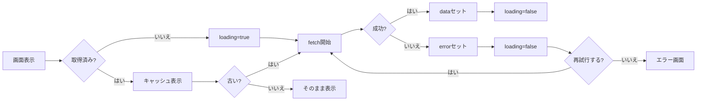
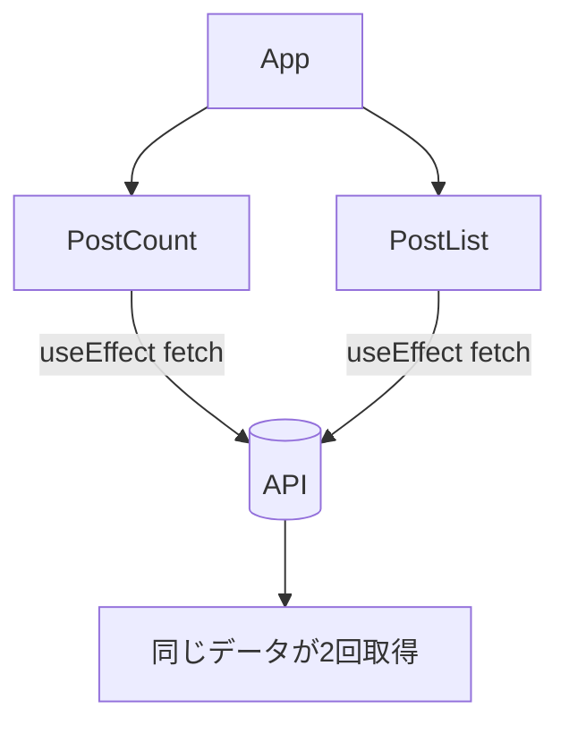

# 第161章：「データ取得」の悩みどころ

（ロード中管理・キャッシュ・二重送信…手動はツライ！）

この章は「TanStack Query を入れる前に、まず“手動でやると何がしんどいか”を体験して、納得してから次へ進む」回だよ〜😊✨
※次の第162章で一気に楽になるから、ここは「つらさの正体」をつかむのが目的！💪🧠

---

## 今日のゴール 🎯

* 手動 `fetch + useEffect` が **どんどん増殖して地獄になる理由**がわかる 😇➡️😇😇😇
* 「キャッシュ」「二重リクエスト」「ロード中」「エラー」「再取得」…このへんの悩みが **全部つながってる**って理解できる 🔗✨

---

## まず結論：手動データ取得で起きがちな問題たち 🧨

よくある“しんどい”を並べるとこんな感じ👇

* ⏳ **ロード中の管理**：どのタイミングで `loading` を true/false にするの…？
* 💥 **エラーの管理**：失敗したら？再試行は？表示は？
* 🔁 **二重送信・二重取得**：同じAPIを複数コンポーネントが叩いてしまう
* 🧊 **キャッシュがない**：戻ったらまた取得、タブ切り替えたら古い、など
* 🧪 **状態が増えすぎる**：`data/loading/error` だけじゃ足りなくなる
* 🧹 **キャンセル（中断）**：画面移動したのに fetch が帰ってきて setState…警告〜😭
* 🕰️ **最新データに保つ仕組み**：いつ再取得する？手動で？
* 🧷 **同じデータを全画面で共有**：Props地獄 or Context地獄 or 自作キャッシュ地獄

---

## 図で見る：手動 fetch は「状態マシン」になりがち 🤖⚙️（Mermaid）

「データ取得」って実は、こういう分岐だらけの“状態管理”なんだよね😵‍💫



これを毎回、自分で書いて維持するのがキツい…って話！😇🧯

---

## 体験：わざと“手動地獄”を作ってみる 😈🧪

ここでは、**同じデータを2つのコンポーネントが別々に取得**して、二重リクエストを目で見てみよ〜👀📡

### 1) プロジェクトが無ければ作る（あるならスキップでOK）🛠️

PowerShell で👇

```bash
npm create vite@latest react-query-pain -- --template react-ts
cd react-query-pain
npm install
npm run dev
```

---

## 2) まずは “API関数” を作る 📄✨

`src/api/posts.ts` を作って、これを書いてね👇

```ts
export type Post = {
  id: number;
  title: string;
};

export async function fetchPosts(signal?: AbortSignal): Promise<Post[]> {
  const res = await fetch("https://jsonplaceholder.typicode.com/posts", { signal });

  if (!res.ok) {
    throw new Error(`HTTP Error: ${res.status}`);
  }

  const data = (await res.json()) as Array<{ id: number; title: string }>;
  return data.slice(0, 10).map((p) => ({ id: p.id, title: p.title }));
}
```

---

## 3) “二重取得” が起きる構成を作る 🥲🥲

`src/App.tsx` を丸ごとこれに置き換え👇

```tsx
import { useEffect, useState } from "react";
import { fetchPosts, type Post } from "./api/posts";

function PostList() {
  const [posts, setPosts] = useState<Post[] | null>(null);
  const [loading, setLoading] = useState(false);
  const [error, setError] = useState<string | null>(null);

  useEffect(() => {
    const controller = new AbortController();

    setLoading(true);
    setError(null);

    fetchPosts(controller.signal)
      .then((data) => {
        setPosts(data);
      })
      .catch((e: unknown) => {
        // Abort はエラー表示しない（こういう分岐も地味に増える…😇）
        if (e instanceof DOMException && e.name === "AbortError") return;
        setError(e instanceof Error ? e.message : "Unknown error");
      })
      .finally(() => {
        setLoading(false);
      });

    return () => controller.abort();
  }, []);

  if (loading) return <p>PostList: 読み込み中…⏳</p>;
  if (error) return <p>PostList: エラー😭 {error}</p>;
  if (!posts) return <p>PostList: データなし🫥</p>;

  return (
    <div>
      <h2>PostList 📝</h2>
      <ul>
        {posts.map((p) => (
          <li key={p.id}>{p.title}</li>
        ))}
      </ul>
    </div>
  );
}

function PostCount() {
  const [count, setCount] = useState<number | null>(null);
  const [loading, setLoading] = useState(false);
  const [error, setError] = useState<string | null>(null);

  useEffect(() => {
    const controller = new AbortController();

    setLoading(true);
    setError(null);

    fetchPosts(controller.signal)
      .then((data) => {
        setCount(data.length);
      })
      .catch((e: unknown) => {
        if (e instanceof DOMException && e.name === "AbortError") return;
        setError(e instanceof Error ? e.message : "Unknown error");
      })
      .finally(() => {
        setLoading(false);
      });

    return () => controller.abort();
  }, []);

  if (loading) return <p>PostCount: 読み込み中…⏳</p>;
  if (error) return <p>PostCount: エラー😭 {error}</p>;
  if (count === null) return <p>PostCount: データなし🫥</p>;

  return <p>PostCount: 件数は {count} 件です📦</p>;
}

export default function App() {
  return (
    <div style={{ padding: 16 }}>
      <h1>第161章：手動 fetch のしんどさ体験 😵‍💫</h1>
      <PostCount />
      <hr />
      <PostList />
    </div>
  );
}
```

---

## 4) ここで確認！👀📡（超たいせつ）

ブラウザの DevTools を開いて（F12）👉 Network タブを見ると…

* **同じURLが2回**呼ばれてるはず！😇
  `PostCount` と `PostList` が **別々に fetch** してるからね💥

これが「二重取得」問題の第一歩👣
コンポーネントが増えるほど、同じAPIが何回も飛びます😵‍💫💦

---

## さらに地獄が深くなるポイント 🔥（あるある）

今のコード、まだ序盤の“かわいい地獄”で…ここから増える😇

* 🔁 **再取得ボタン**を付けたくなる
* 🧊 **前回結果をキャッシュ**したくなる（戻ったら即表示したい）
* 🕐 **何秒ごとに自動更新**したくなる（チャット/株価/通知など）
* 🧠 **同じデータを画面全体で共有**したくなる
* 🧷 **「古い/新しい」の基準**が欲しくなる（いつをもって古い？）
* 🎯 **同時に押された時の二重送信防止**が欲しくなる（フォーム送信とか）

---

## 図で見る：二重取得が起きる理由 🧩（Mermaid）

「部品ごとに useEffect で取りに行く」構造だと、こうなるよ〜😭



---

## チェックポイント✅（理解できたら勝ち✌️）

次のうち「手動 fetch がしんどい理由」として正しいのはどれ？（複数OK）🙂

1. ⏳ ロード中の状態が必要
2. 🧊 キャッシュを自分で作ると大変
3. 🔁 同じデータが複数回取得されがち
4. 🌈 React はデータ取得が禁止されている

答え：**1, 2, 3** ✅（4はウソだよ〜🤣）

---

## 次章の予告 🎁✨

第162章では、今日の地獄を「ほぼ1行」の世界に持っていくよ😆💖

* ロード中/エラー/データ
* キャッシュ
* 二重取得の防止
* 再取得
  このへんが **まとめて解決**しはじめる🔥

---

もしよければ、次の第162章に入る前にひとつだけ宿題📝✨
DevTools の Network で「同じURLが2回」出てるスクショを撮るつもりで眺めてみてね👀📡
「あ、これを毎回手動で直すの無理だ…」って気持ちになれたら満点です💯🤣
