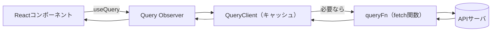
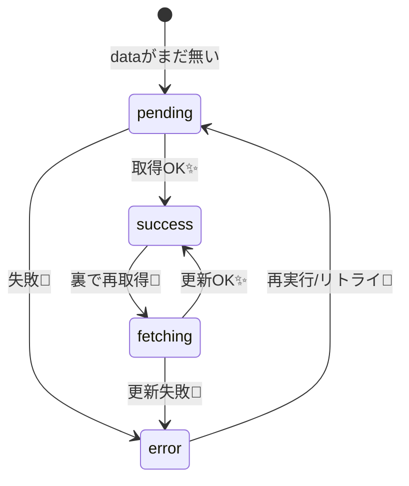

# 第162章：TanStack Query の導入と `useQuery`

この章のゴール🎯

* TanStack Query（旧 React Query）をプロジェクトに入れる
* アプリ全体に `QueryClientProvider` を設定する
* `useQuery` で「ロード中/成功/失敗」をキレイに分けて表示できるようになる✨
  （公式の基本形は `useQuery({ queryKey, queryFn })` だよ〜！）([tanstack.com][1])

---

## まず、TanStack Queryって何がうれしいの？😊📦

**サーバーから取ってくるデータ（= server state）**って、手作業だとこうなりがち👇

* ロード中の表示どうする？⏳
* エラーの表示どうする？🥺
* 何回も同じAPI叩いちゃう…💸
* 画面戻ったらまた取り直し…🙃

TanStack Queryはそれを「いい感じに」まとめて面倒見てくれるライブラリだよ✨([tanstack.com][2])

---

## 図でイメージ🌈（キャッシュが主役！）



---

## 1) インストールする（Windowsでも同じだよ🪟）

プロジェクトのフォルダで👇

```bash
npm i @tanstack/react-query
```

公式のインストール方法だよ✅([tanstack.com][3])

---

## 2) `QueryClientProvider` をアプリ全体にセットする🧠🧩

これを忘れると **「QueryClientが無いよ！」** って怒られます🥺（あるある）

`src/main.tsx` をこうする👇

```tsx
import React from 'react'
import ReactDOM from 'react-dom/client'
import App from './App.tsx'
import './index.css'

import { QueryClient, QueryClientProvider } from '@tanstack/react-query'

const queryClient = new QueryClient()

ReactDOM.createRoot(document.getElementById('root')!).render(
  <React.StrictMode>
    <QueryClientProvider client={queryClient}>
      <App />
    </QueryClientProvider>
  </React.StrictMode>,
)
```

「アプリを `QueryClientProvider` で囲む」のが基本形だよ✅([tanstack.com][1])

---

## 3) `useQuery` の最小セットを覚える（これが第162章の核心🔥）

`useQuery` は基本 **この2つが必須**👇

* `queryKey`：キャッシュの住所🏠（同じ住所なら同じデータを共有）
* `queryFn`：Promiseを返す関数（成功ならデータ、失敗なら throw）

公式も「最低これ！」って言ってるよ✅([tanstack.com][2])
しかも `queryFn` は **「必ず resolve か throw」**（`undefined`返しちゃダメ）ってルールもあるよ⚠️([tanstack.com][4])

---

## 4) 実際に1本作ろう🍰（ユーザー一覧を取って表示）

### (A) まず「取得する関数」を作る📡

`src/api/users.ts`

```ts
export type User = {
  id: number
  name: string
  email: string
}

export async function fetchUsers(): Promise<User[]> {
  const res = await fetch('https://jsonplaceholder.typicode.com/users')
  if (!res.ok) {
    throw new Error(`HTTP ${res.status}`)
  }
  const data: User[] = await res.json()
  return data
}
```

ポイント👉

* `res.ok` チェックして、ダメなら `throw` 🥺
* 返す型を `Promise<User[]>` にして、TypeScriptに勝たせる💪✨

---

### (B) `useQuery` で呼び出す💡

`src/components/UsersList.tsx`

```tsx
import { useQuery } from '@tanstack/react-query'
import { fetchUsers, type User } from '../api/users'

export function UsersList() {
  const { data, isPending, isError, error, isFetching, refetch } = useQuery<User[], Error>({
    queryKey: ['users'],
    queryFn: fetchUsers,
  })

  if (isPending) {
    return <p>読み込み中…⏳</p>
  }

  if (isError) {
    return (
      <div>
        <p>エラーだよ…🥺</p>
        <pre>{error.message}</pre>
        <button onClick={() => refetch()}>もう一回やってみる🔁</button>
      </div>
    )
  }

  if (!data) {
    return <p>データが空っぽ…🤔</p>
  }

  return (
    <section>
      <h2>ユーザー一覧👩‍💻</h2>

      <button onClick={() => refetch()} disabled={isFetching}>
        {isFetching ? '更新中…🔄' : '手動で更新🔁'}
      </button>

      <ul>
        {data.map((u) => (
          <li key={u.id}>
            {u.name}（{u.email}）📮
          </li>
        ))}
      </ul>
    </section>
  )
}
```

ここで使ってる `isPending / isError` は v5で特に大事な考え方だよ✨（statusが `pending` になった流れ）([tanstack.com][5])
（`isLoading` もあるけど、意味が少し違うのでまずは `isPending` からでOK！）([tanstack.com][5])

---

### (C) App に置く🏠

`src/App.tsx`

```tsx
import { UsersList } from './components/UsersList'

function App() {
  return (
    <main>
      <h1>TanStack Query デビュー🎉</h1>
      <UsersList />
    </main>
  )
}

export default App
```

---

## 5) 状態のイメージ（ロード中/成功/失敗）🎢



TanStack Query的には「クエリは key と結びついた非同期データの依存関係」って感じだよ🧠([tanstack.com][2])

---

## よくあるつまづき集（先回りで回避💣➡️✅）

* **画面が “No QueryClient set…” で落ちた** 😭
  → `QueryClientProvider` で `App` を囲むの忘れがち！([tanstack.com][1])

* **ロード中の条件がわからない** 🤯
  → まずは `isPending` を見ればOK（「まだデータが無い」状態）([tanstack.com][2])

* **fetchが失敗しても成功扱いっぽい…** 🙃
  → `fetch` は HTTP 404/500 でも例外を投げないので、`res.ok` を見て `throw` しようね⚠️([tanstack.com][4])

---

## ミニ練習✍️✨（5分でできる！）

1. `queryKey: ['users']` を `['users', 'list']` に変えてみる🏷️
2. URLを `https://jsonplaceholder.typicode.com/posts` に変えて、`Post` 型を作って表示してみる📝
3. `refetch()` ボタンを押したとき、`isFetching` がどう変わるか観察👀🔄（次章のDevToolsがあるともっと楽しいよ！）

---

## まとめ🎀（この章の合言葉）

* `useQuery({ queryKey, queryFn })` でデータ取得が「型安全＆ラク」になる✨([tanstack.com][2])
* `queryFn` は **resolve か throw**（`undefined`禁止）⚠️([tanstack.com][4])
* 状態分岐はまず `isPending / isError` でOK🙆‍♀️([tanstack.com][2])

次の **第163章** は DevTools で「キャッシュの裏側」を覗いてニヤニヤする回だよ😎🔍

[1]: https://tanstack.com/query/v5/docs/react/quick-start "Quick Start | TanStack Query React Docs"
[2]: https://tanstack.com/query/v5/docs/react/guides/queries "Queries | TanStack Query React Docs"
[3]: https://tanstack.com/query/v5/docs/react/installation "Installation | TanStack Query React Docs"
[4]: https://tanstack.com/query/v5/docs/react/reference/useQuery "useQuery | TanStack Query React Docs"
[5]: https://tanstack.com/query/v5/docs/react/guides/migrating-to-v5 "Migrating to TanStack Query v5 | TanStack Query React Docs"
