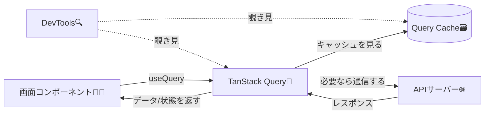

# 第163章：DevTools で「データの裏側」を覗く

# 第163章：DevToolsで「データの裏側」を覗く 👀🔍✨

この章はひとことで言うと…
**「TanStack Query が今どう動いてるか」を“見える化”して、安心してデータ取得できるようになる回**だよ〜！🧠💡

---

## 1) DevToolsってなに？🧰🌿

TanStack QueryのDevToolsは、アプリの中で動いてる **クエリ（取得）** や **ミューテーション（更新）** の状態を、パネルで確認できる便利ツールだよ✨（v5からミューテーションも観測できるよ）([tanstack.com][1])

「いま通信してる？」「キャッシュある？」「古い？新しい？」が一発で分かるのが最高〜！😆

---

## 2) ざっくり全体図（Mermaid）🗺️✨



---

## 3) DevToolsを入れる（Windows / Vite）💻⚡

### 3-1. インストール

PowerShellでプロジェクトフォルダに移動して👇

```bash
npm i @tanstack/react-query @tanstack/react-query-devtools
```

DevToolsは別パッケージとして入れる感じだよ〜([tanstack.com][1])

---

## 4) DevToolsを表示してみよう 😎🪄

### 4-1. `src/main.tsx` をこうする（QueryClientProviderの中にDevTools！）

```tsx
import React from 'react'
import ReactDOM from 'react-dom/client'
import App from './App'
import './index.css'

import { QueryClient, QueryClientProvider } from '@tanstack/react-query'
import { ReactQueryDevtools } from '@tanstack/react-query-devtools'

const queryClient = new QueryClient()

const rootElement = document.getElementById('root')
if (!rootElement) {
  throw new Error('root 要素が見つからないよ 😵')
}

ReactDOM.createRoot(rootElement).render(
  <React.StrictMode>
    <QueryClientProvider client={queryClient}>
      <App />
      <ReactQueryDevtools initialIsOpen={false} buttonPosition="bottom-left" />
    </QueryClientProvider>
  </React.StrictMode>,
)
```

* `initialIsOpen` や `buttonPosition` などのオプションがあるよ🧩([tanstack.com][1])
* DevToolsの開閉状態は **localStorageに保存されて次回も覚えてくれる** よ📦([tanstack.com][1])
* そして基本は **development のときだけバンドルに入る**（本番は気にしなくてOK）🫶([tanstack.com][1])

---

## 5) “見える化”用のサンプルクエリを作ろう 🧪📡

### 5-1. `src/Posts.tsx` を作成

```tsx
import { useQuery } from '@tanstack/react-query'

type Post = {
  id: number
  title: string
}

async function fetchPosts(): Promise<Post[]> {
  const url = 'https://jsonplaceholder.typicode.com/posts?_limit=5'
  const res = await fetch(url)

  if (!res.ok) {
    throw new Error('通信に失敗したよ 🥲')
  }

  const data = (await res.json()) as Post[]
  return data
}

export default function Posts() {
  const query = useQuery({
    queryKey: ['posts', { limit: 5 }],
    queryFn: fetchPosts,
    staleTime: 5000, // 5秒だけ「新鮮（Fresh）」扱いにして観察しやすくするよ👀
  })

  if (query.isPending) {
    return <p>読み込み中…⏳</p>
  }

  if (query.isError) {
    return <p>エラーだよ…😭 {query.error.message}</p>
  }

  return (
    <div>
      <h2>Posts ✨</h2>
      <ul>
        {query.data.map((p) => (
          <li key={p.id}>{p.title}</li>
        ))}
      </ul>
    </div>
  )
}
```

* `staleTime` のデフォルトは **0（つまり取得直後にすぐstale扱い）** だから、観察しやすいように少し伸ばしてるよ👀([tanstack.com][2])

### 5-2. `src/App.tsx` で表示

```tsx
import Posts from './Posts'

export default function App() {
  return (
    <div style={{ padding: 16 }}>
      <h1>TanStack Query DevTools 観察🔍🌿</h1>
      <Posts />
    </div>
  )
}
```

---

## 6) DevToolsの見どころ（ここ見て！）👀✨

### ✅ 左側：Queries一覧 🧾

* `queryKey` がズラッと並ぶよ（`['posts', { limit: 5 }]` が見えるはず）🏷️
* “いま何個クエリある？”が一瞬で分かる！🙌

### ✅ 右側：Query Details（詳細）🧠

だいたいここが楽しいポイント😍

* **Fresh / Stale**：データが新鮮かどうか🍞
* **Observers**：いまそのクエリを見てるコンポーネントがいるか👀
* **Actions（Refetch / Invalidate / Reset / Remove など）**：ボタンで挙動を試せる🎮

「staleTimeを2秒にしたら、2秒後にFresh→Staleに変わる」みたいに、DevTools上の表示で体感できるよ〜⏱️([アールエフェクト][3])

---

## 7) ちいさな実験（この順でやると楽しい）🧪🎉

1. `npm run dev` で起動 ▶️
2. 画面の端に出るTanStackアイコンをクリック🌿
3. `posts` を選んで詳細を見る👀
4. **5秒待つ** → Fresh が切れて Stale っぽくなるのを観察⏳
5. ブラウザのタブを別にして戻る（設定次第で再取得が起きる）🔄
6. Actionsの **Invalidate / Refetch** を押して違いを感じる🎮✨

---

## 8) ちなみに：ブラウザ拡張もあるよ 🧩🦊🌐

アプリ内DevToolsとは別に、Chrome/Firefox/Edge向けの拡張もあるよ〜（好みで！）([tanstack.com][1])

---

## 9) まとめ 🍀

* DevToolsは **クエリの状態・キャッシュの中身・更新タイミング** を見える化してくれる神ツール🔍✨([tanstack.com][1])
* `staleTime` をちょっと付けると **Fresh→Stale** の変化が分かりやすい⏱️([tanstack.com][2])
* 「なんか動き変…？」って時、まずDevTools見ると解決が速いよ🚀💨

次の **第164章：`queryKey` の設計** は、DevToolsで見える“住所（キー）”をどう決めるかの超重要回だよ🏷️✨

[1]: https://tanstack.com/query/v5/docs/react/devtools "Devtools | TanStack Query React Docs"
[2]: https://tanstack.com/query/v5/docs/react/guides/caching?utm_source=chatgpt.com "Caching Examples | TanStack Query React Docs"
[3]: https://reffect.co.jp/react/tanstack-query-v5?utm_source=chatgpt.com "初めてでも安心TanStack Query v5の基本的な設定方法と動き ..."
