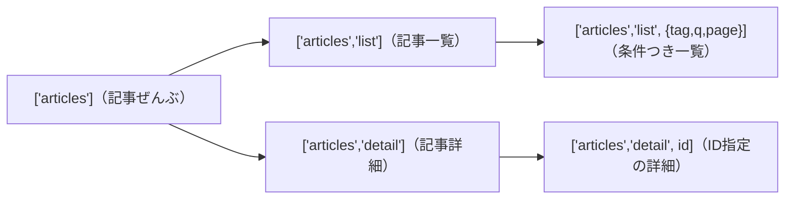
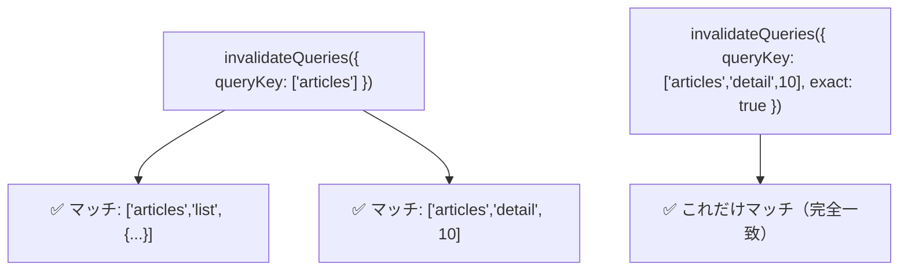

# 第164章：`queryKey` の設計

## 1) 今日のゴール🎯

* `queryKey` が何のためにあるか分かる😊
* 「迷わない `queryKey` の付け方ルール」を持てる🧭
* 後で `invalidateQueries`（キャッシュ更新）するときに困らない設計ができる💪

`queryKey` は **TanStack Query のキャッシュを区別するための “住所”** だよ🏡
住所がぐちゃぐちゃだと、キャッシュが迷子になります🥺
（公式：`queryKey` は配列が基本で、`JSON.stringify` でシリアライズ可能＆データに対してユニークである必要があるよ📌） ([tanstack.com][1])

---

## 2) `queryKey` は「住所」🏠（たとえで理解しよ😊）

たとえば「記事一覧」を取るとして…

* 記事一覧（全部）📚
* 記事一覧（タグが React のだけ）🏷️
* 記事詳細（ID=10）🔎

これ、**全部 “別のデータ”** だよね？
だから **別の住所（`queryKey`）** が必要なの✨ ([TkDodo][2])

---

## 3) `queryKey` 設計ルール（これだけ守ればOK✅）😺

### ルール①：先頭は「大分類」🥇

最初はだいたい **リソース名** が鉄板✨
例：`'articles'`, `'users'`, `'todos'`

### ルール②：「一覧」と「詳細」を分ける📄🔍

* 一覧：`['articles', 'list', ...]`
* 詳細：`['articles', 'detail', id]`

### ルール③：結果が変わる条件は “全部” 入れる🧩

検索ワード `q`、ページ `page`、タグ `tag`…
**1つでも違ったら別住所！**

### ルール④：パラメータは最後に「まとめオブジェクト」がおすすめ📦

`['articles', 'list', { tag, q, page }]` みたいにすると見た目がキレイ😍
（`queryKey` は `JSON.stringify` 可能な形が前提だよ） ([tanstack.com][1])

### ルール⑤：後で “まとめて無効化” できる形にしておく🧹

たとえば `['articles']` を親にしておくと…

* `invalidateQueries({ queryKey: ['articles'] })` で **記事系ぜんぶ** を更新対象にできる✨ ([tanstack.com][3])

---

## 4) 図でイメージしよ🗺️（Mermaid）✨



「親 → 子」みたいに階層を作ると、あとがラクだよ〜😊💕

---

## 5) 実戦：`queryKey` を “工場” で作る（Key Factory）🏭✨

手で `['articles', 'list', ...]` を毎回書くと、タイプミスが起きがち🥺
だから **関数で統一** しよっ💡

### `src/queryKeys/articles.ts`

```ts
export type ArticleListParams = {
  tag?: string
  q?: string
  page?: number
}

export const articleKeys = {
  all: ['articles'] as const,

  lists: () => [...articleKeys.all, 'list'] as const,
  list: (params: ArticleListParams) => [...articleKeys.lists(), params] as const,

  details: () => [...articleKeys.all, 'detail'] as const,
  detail: (id: number) => [...articleKeys.details(), id] as const,
}
```

ポイント😍

* `as const` があると、TypeScript が **「このキーはこの形！」** って賢く扱ってくれるよ✨
* “住所の形式” が統一されて、DevTools で見ても読みやすい🧠💕

---

## 6) 使ってみよう🎮（一覧と詳細の例）

### 記事一覧：`useQuery`

```ts
import { useQuery } from '@tanstack/react-query'
import { articleKeys, type ArticleListParams } from '../queryKeys/articles'

type Article = { id: number; title: string; tag: string }

async function fetchArticles(params: ArticleListParams): Promise<Article[]> {
  const url = new URL('https://example.com/api/articles')
  if (params.tag) url.searchParams.set('tag', params.tag)
  if (params.q) url.searchParams.set('q', params.q)
  if (params.page) url.searchParams.set('page', String(params.page))

  const res = await fetch(url)
  if (!res.ok) throw new Error('Failed to fetch')
  return res.json()
}

export function useArticleList(params: ArticleListParams) {
  return useQuery({
    queryKey: articleKeys.list(params),
    queryFn: () => fetchArticles(params),
  })
}
```

ここで大事なのは…
✅ **`params` が変わったら `queryKey` も変わる** → 別キャッシュになる✨

---

## 7) “部分一致” と “完全一致” を理解しよう😼

TanStack Query は、`invalidateQueries` / `refetchQueries` などで **`queryKey` を部分一致でマッチ** させられるよ✨
さらに `exact: true` を付けると “完全一致だけ” にできるよ🧷 ([tanstack.com][3])



---

## 8) よくある事故あるある💥（ここ超大事！）

### 事故①：同じ `queryKey` で “別の意味” のデータを取っちゃう😵‍💫

例：

* `['articles']` を「一覧」にも「詳細」にも使う
  → キャッシュが混ざる😭

**対策**：`list` / `detail` を必ず分ける✅

### 事故②：`useQuery` と `useInfiniteQuery` で同じキーを使う🌀

キャッシュ構造が違うから、同じキー共有は危険だよ⚠️（ベストプラクティスでも注意されがち） ([Zenn][4])

### 事故③：`queryKey` にシリアライズできない値を入れる🚫

関数、クラスインスタンス、`BigInt` などは要注意💦
（基本は `JSON.stringify` できる形にするのが前提） ([tanstack.com][1])

補足：オブジェクトは内部で安定してハッシュ化される（キー順も安定化する）実装になってるよ、という説明もあるよ🧠 ([Stack Overflow][5])
でも、できるだけ「素直な値」で作るのが安心だよ😊

---

## 9) ちいさな練習問題✍️💖

次のデータの `queryKey` を考えてみてね👇

1. ユーザー一覧（ページあり）
2. ユーザー詳細（id）
3. ユーザーの投稿一覧（userId と sort）

### 解答例（ひとつの正解✨）

```ts
export const userKeys = {
  all: ['users'] as const,

  lists: () => [...userKeys.all, 'list'] as const,
  list: (params: { page?: number }) => [...userKeys.lists(), params] as const,

  details: () => [...userKeys.all, 'detail'] as const,
  detail: (id: number) => [...userKeys.details(), id] as const,

  posts: () => [...userKeys.all, 'posts'] as const,
  postsByUser: (params: { userId: number; sort?: 'new' | 'old' }) =>
    [...userKeys.posts(), params] as const,
}
```

---

## 10) まとめチェック✅✨

* `queryKey` は **配列**＆**データに対してユニーク** 🧠 ([tanstack.com][1])
* 一覧と詳細は分ける（`list` / `detail`）📄🔍
* 条件（tag/q/page…）は全部 `queryKey` に入れる🧩
* “あとで消しやすい階層” を意識する（`['articles']` を親に）🧹 ([tanstack.com][3])
* Key Factory 化でミス激減🏭💕

---

次の第165章（ウィンドウフォーカスで自動更新✨）に進む前に、いま作った `articleKeys` を DevTools で眺めて「住所が読みやすいか」チェックすると最高だよ〜😊🔎

[1]: https://tanstack.com/query/v5/docs/react/guides/query-keys?utm_source=chatgpt.com "Query Keys | TanStack Query React Docs"
[2]: https://tkdodo.eu/blog/effective-react-query-keys?utm_source=chatgpt.com "Effective React Query Keys"
[3]: https://tanstack.com/query/v5/docs/reference/QueryClient "QueryClient | TanStack Query Docs"
[4]: https://zenn.dev/hrbrain/articles/1202f4d107d890?utm_source=chatgpt.com "私の考えるReact Queryベストプラクティス"
[5]: https://stackoverflow.com/questions/73295707/how-does-reactquery-monitor-complex-query-key-changes-by-value-and-or-reference?utm_source=chatgpt.com "How does ReactQuery monitor complex Query Key ..."
