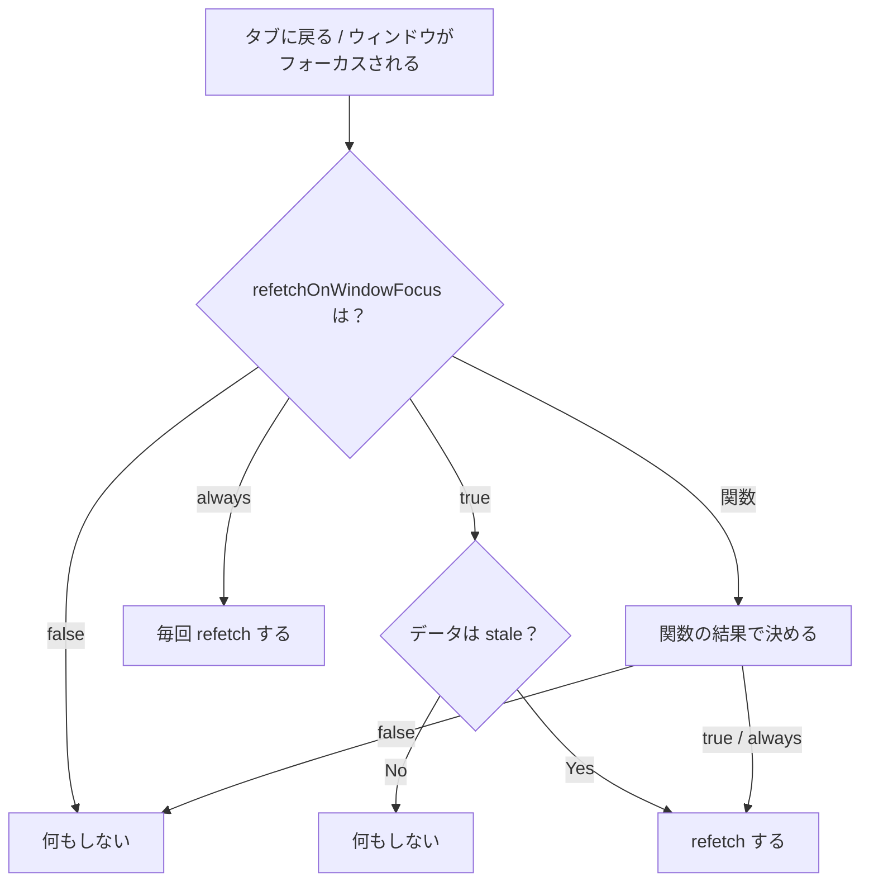

# 第165章：ウィンドウフォーカスで自動更新

この章では、TanStack Query の「**タブを切り替えて戻ってきたら自動で最新データに更新してくれる**」機能を体験します🔄
これ、地味だけどめちゃ便利です…！🥹💕

---

## 1) どういう機能？🤔💡

ブラウザで別タブを見て、またアプリのタブに戻った瞬間に…

* もし **キャッシュが古い（stale）** なら 👉 **自動で refetch（再取得）**
* 設定で **オフ**にもできる
* さらに **毎回必ず更新（always）** もできる

という仕組みです✨
「戻ったら最新になってる」体験が、ほぼ設定だけで作れます🪄
（`refetchOnWindowFocus` のデフォルトは `true` です）([TanStack][1])

---

## 2) 図でイメージしよ〜🧠🗺️（Mermaid）



ポイントはここ👇
✅ `true` のときは「**stale なら** refetch」([TanStack][2])
✅ `always` は「**stale じゃなくても**毎回 refetch」([TanStack][2])

---

## 3) まずは体験！フォーカスで数字が変わるデモ🎲🔄

### ✅ `FocusRefetchDemo.tsx` を作ろう

`src/FocusRefetchDemo.tsx` を作って、これを貼ってね👇

```tsx
import { useQuery } from '@tanstack/react-query'

const sleep = (ms: number) => new Promise((r) => setTimeout(r, ms))

type FocusData = {
  time: string
  random: number
}

async function fetchFocusData(): Promise<FocusData> {
  await sleep(500) // 通信っぽくする演出⏳
  return {
    time: new Date().toLocaleTimeString(),
    random: Math.random(),
  }
}

export function FocusRefetchDemo() {
  const query = useQuery({
    queryKey: ['focus-demo'],
    queryFn: fetchFocusData,

    // 第165章の主役✨
    refetchOnWindowFocus: true,

    // ここが超大事：0だと「すぐ stale」になりやすい
    staleTime: 0,
  })

  return (
    <section style={{ padding: 16, border: '1px solid #ccc', borderRadius: 12 }}>
      <h2 style={{ marginTop: 0 }}>フォーカス自動更新デモ👀✨</h2>

      {query.isPending ? (
        <p>読み込み中…⏳</p>
      ) : query.isError ? (
        <p>エラーだよ…😭</p>
      ) : (
        <>
          <p>取得した時刻：{query.data.time} 🕒</p>
          <p>ランダム：{query.data.random.toFixed(5)} 🎲</p>
        </>
      )}

      <p style={{ marginTop: 12, fontSize: 12, opacity: 0.8 }}>
        dataUpdatedAt：{new Date(query.dataUpdatedAt).toLocaleTimeString()} 🔄
      </p>

      <p style={{ fontSize: 12, opacity: 0.8 }}>
        👉 別タブへ → 戻る、でランダムが変わったら成功！
      </p>
    </section>
  )
}
```

### ✅ `App.tsx` に置こう

```tsx
import { FocusRefetchDemo } from './FocusRefetchDemo'

export default function App() {
  return (
    <main style={{ padding: 24 }}>
      <FocusRefetchDemo />
    </main>
  )
}
```

### ✅ 動かし方🎮

1. `npm run dev` で起動🚀
2. ブラウザで **別タブ**へ移動
3. またアプリのタブへ戻る
4. **ランダム値が変わったら**「フォーカスで refetch」成功🎉

---

## 4) 「戻っても更新されない…」の理由ランキング🧐💦

### 🥇 データが stale じゃない（まだ新鮮）

`refetchOnWindowFocus: true` は「**stale のときだけ**」更新します([TanStack][2])
なので、`staleTime` を長くしてると「戻っても更新されない」ことがあります🙂

例：10秒は新鮮扱いにする👇

```tsx
staleTime: 10_000
```

### 🥈 `refetchOnWindowFocus: false` にしてた

オフなら当然更新されません🙅‍♀️([TanStack][2])

### 🥉 そもそもそのクエリが画面にいない（非アクティブ）

コンポーネントがアンマウントされてると、そもそも「戻った瞬間に更新」が見えません💡

---

## 5) 設定パターン3つ🌈（ここ超よく使う！）

### A) ページによってオフにする🙅‍♀️

「更新いらない」「通信重い」みたいな画面に👍

```tsx
useQuery({
  queryKey: ['xxx'],
  queryFn,
  refetchOnWindowFocus: false,
})
```

### B) 戻ってきたら毎回必ず更新したい🔁

「株価」「チャット一覧」「監視ダッシュボード」みたいなやつに強い！

```tsx
useQuery({
  queryKey: ['xxx'],
  queryFn,
  refetchOnWindowFocus: 'always',
})
```

（`always` も公式に用意されてます）([TanStack][2])

### C) “条件付き”で更新したい🧠✨

「30秒以上たってたら更新」みたいな賢いルール！

```tsx
useQuery({
  queryKey: ['xxx'],
  queryFn,
  refetchOnWindowFocus: (query) => {
    // 30秒以上前のデータなら、フォーカスで更新する
    return Date.now() - query.state.dataUpdatedAt > 30_000
  },
})
```

（関数もOKです）([TanStack][2])

---

## 6) アプリ全体で一括設定（QueryClient）🧰✨

「基本はオフにしたい」みたいなときはこれが便利！
`main.tsx`（または `QueryClient` 作ってる場所）で👇([TanStack][1])

```tsx
import { QueryClient } from '@tanstack/react-query'

export const queryClient = new QueryClient({
  defaultOptions: {
    queries: {
      refetchOnWindowFocus: false, // 全体でオフ
    },
  },
})
```

逆に「全体は true、特定の画面だけ false」みたいに **上書き**もできます👍

---

## 7) ミニ課題🎯（5〜10分でOK✨）

1. `staleTime: 0` のまま → タブ戻るたび更新されるのを確認🔄🎲
2. `staleTime: 10_000` にして → 10秒以内は更新されにくいのを確認⏱️
3. `refetchOnWindowFocus: 'always'` にして → 毎回更新されるのを確認🔁
4. “30秒ルール”の関数版にして → 条件付きで動くのを確認🧠✨

---

次の章（第166章）は、この仕組みを「記事詳細ページ」みたいな実戦っぽい画面に入れて、**キャッシュの効き方を体験**していく感じだよ〜📚🔥

[1]: https://tanstack.com/query/v5/docs/react/guides/window-focus-refetching?utm_source=chatgpt.com "Window Focus Refetching | TanStack Query React Docs"
[2]: https://tanstack.com/query/v5/docs/react/reference/useQuery?utm_source=chatgpt.com "useQuery | TanStack Query React Docs"
