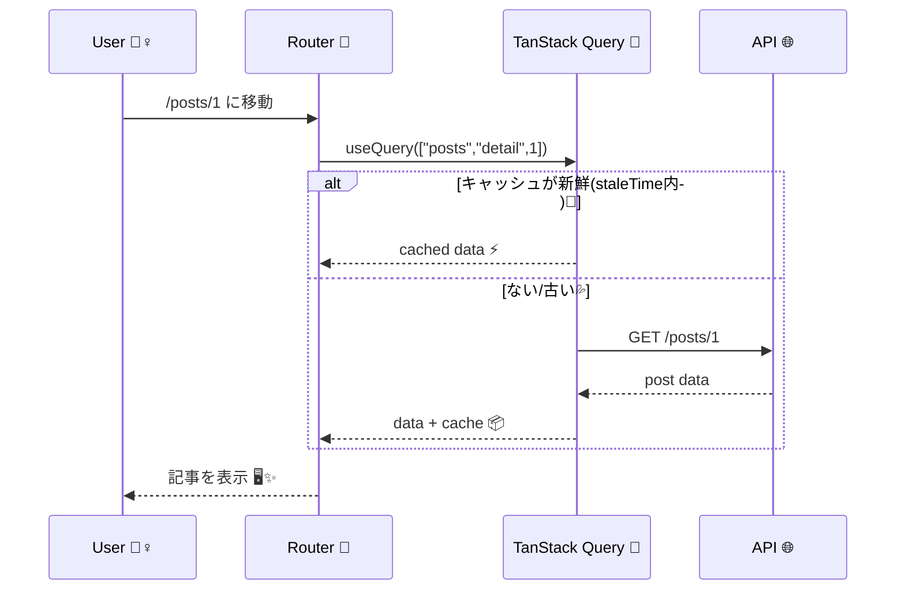

# 第166章：練習：記事詳細ページのデータ取得とキャッシュ体験

この章では「記事一覧 → 記事詳細」みたいなよくある画面を作って、**TanStack Query のキャッシュがどれだけ気持ちいいか**を体験します 😆🧠💾
（同じ記事をもう一回開くと…速い！⚡）

---

## この章でできるようになること ✅🎯

* 記事詳細ページで `useQuery` を使ってデータ取得 🛠️
* `queryKey` を「記事IDごと」に分けてキャッシュする 🗝️
* いったん見た記事を、もう一回開いた時の **爆速表示** を体験する ⚡💖
* DevTools で「今キャッシュどうなってる？」を覗く 👀🧪

---

## まずはイメージ図 🗺️（Mermaid）

※Mermaidの定番構文に沿って書いてあります（ここでは実レンダリングはできないけど、文法的に破綻しない形にしてるよ）🙌

```mermaid
flowchart TD
  A[記事詳細ページを開く 🖱️] --> B{キャッシュに\nこの記事ある？ 💾}
  B -- ない --> C[queryFnでfetch 🌐] --> D[キャッシュに保存 📦]
  B -- ある --> E{新鮮？\n(staleTime内？) 🥗}
  E -- はい --> F[キャッシュを即表示 ⚡]
  E -- いいえ --> C
  D --> G[画面に表示 🖥️]
  F --> G
```

---

## 1) 使うパッケージを入れる 📦✨

TanStack Query本体 + DevTools を入れます。DevTools は別パッケージです 🧰
（公式ドキュメントにそのまま書いてあるやつだよ） ([TanStack][1])

```bash
npm i @tanstack/react-query @tanstack/react-query-devtools
```

記事一覧→詳細へ移動するために、ルーティングがまだならこれも：

```bash
npm i react-router-dom
```

---

## 2) QueryClient をアプリ全体にセットする 🧠🔌

`src/main.tsx` をこうします（DevToolsも付けちゃう👀）

```tsx
// src/main.tsx
import React from "react";
import ReactDOM from "react-dom/client";
import { QueryClient, QueryClientProvider } from "@tanstack/react-query";
import { ReactQueryDevtools } from "@tanstack/react-query-devtools";
import { BrowserRouter } from "react-router-dom";
import App from "./App";
import "./index.css";

const queryClient = new QueryClient({
  defaultOptions: {
    queries: {
      // ★体験しやすいようにちょい長め
      staleTime: 30_000, // 30秒は「新鮮」扱い🥗
      gcTime: 5 * 60_000, // 使われなくなって5分でお片付け🗑️
      refetchOnWindowFocus: true, // タブ戻ったら更新（前章の復習）👀
    },
  },
});

// v5では cacheTime が gcTime に名前変更されたよ（考え方は同じ） :contentReference[oaicite:1]{index=1}

ReactDOM.createRoot(document.getElementById("root")!).render(
  <React.StrictMode>
    <QueryClientProvider client={queryClient}>
      <BrowserRouter>
        <App />
      </BrowserRouter>

      <ReactQueryDevtools initialIsOpen={false} />
    </QueryClientProvider>
  </React.StrictMode>
);
```

### 🍱 `staleTime` と `gcTime` の感覚（超ざっくり）

* `staleTime`：**冷蔵庫の「賞味期限」**🥗（期限内なら取りに行かない）
* `gcTime`：**ゴミ箱に捨てるまでの猶予**🗑️（使われてないデータをいつ消すか）

---

## 3) 画面を用意する（一覧 → 詳細）🧭🖥️

### `src/App.tsx`

```tsx
// src/App.tsx
import { Routes, Route, Link } from "react-router-dom";
import PostsPage from "./pages/PostsPage";
import PostDetailPage from "./pages/PostDetailPage";

export default function App() {
  return (
    <div style={{ padding: 16, maxWidth: 720, margin: "0 auto" }}>
      <header style={{ display: "flex", gap: 12, alignItems: "center" }}>
        <h1 style={{ margin: 0 }}>記事アプリ 📰✨</h1>
        <Link to="/">一覧へ</Link>
      </header>

      <hr />

      <Routes>
        <Route path="/" element={<PostsPage />} />
        <Route path="/posts/:id" element={<PostDetailPage />} />
      </Routes>
    </div>
  );
}
```

---

## 4) API関数と型を作る 🧩🧪

今回は **JSONPlaceholder** を使います（ダミーAPIで超有名）
`/posts/{id}` で記事1件が取れます ([JSONPlaceholder][2])

### `src/api/posts.ts`

```ts
// src/api/posts.ts
export type Post = {
  userId: number;
  id: number;
  title: string;
  body: string;
};

export async function fetchPosts(limit = 10): Promise<Post[]> {
  const res = await fetch(`https://jsonplaceholder.typicode.com/posts?_limit=${limit}`);
  if (!res.ok) throw new Error("記事一覧の取得に失敗したよ💦");
  return res.json();
}

export async function fetchPostById(id: number): Promise<Post> {
  const res = await fetch(`https://jsonplaceholder.typicode.com/posts/${id}`);
  if (!res.ok) throw new Error("記事詳細の取得に失敗したよ💦");
  return res.json();
}
```

---

## 5) 一覧ページ：タイトルを並べる 🗂️📄

### `src/pages/PostsPage.tsx`

```tsx
// src/pages/PostsPage.tsx
import { Link } from "react-router-dom";
import { useQuery } from "@tanstack/react-query";
import { fetchPosts, Post } from "../api/posts";

export default function PostsPage() {
  const { data, isPending, isError, error, refetch } = useQuery({
    queryKey: ["posts", "list", 10],
    queryFn: () => fetchPosts(10),
  });

  if (isPending) return <p>一覧よみこみ中…📦⌛</p>;

  if (isError) {
    return (
      <div>
        <p>一覧でエラー😢：{(error as Error).message}</p>
        <button onClick={() => refetch()}>もう一回 🔁</button>
      </div>
    );
  }

  return (
    <div>
      <h2>記事一覧 📰</h2>
      <ul style={{ lineHeight: 1.8 }}>
        {data!.map((p: Post) => (
          <li key={p.id}>
            <Link to={`/posts/${p.id}`}>#{p.id} {p.title}</Link>
          </li>
        ))}
      </ul>

      <p style={{ opacity: 0.7 }}>
        💡同じ記事を何度か開いて、DevToolsでキャッシュが育つのを見よう！
      </p>
    </div>
  );
}
```

---

## 6) 本命：記事詳細ページ（キャッシュ体験）⚡💾

ここが今日の主役！🎉
`queryKey` を `["posts","detail", id]` にすることで、**idごとに別キャッシュ**になります 🗝️✨

さらに「前へ/次へ」で id を切り替えるとき、**前のデータを一瞬表示**してチラつきを減らすために `placeholderData` を使います。
v5では `keepPreviousData: true` じゃなくて `placeholderData` 側でやる形だよ ([TanStack][3])

### `src/pages/PostDetailPage.tsx`

```tsx
// src/pages/PostDetailPage.tsx
import { useMemo } from "react";
import { Link, useNavigate, useParams } from "react-router-dom";
import { keepPreviousData, useQuery } from "@tanstack/react-query";
import { fetchPostById } from "../api/posts";

export default function PostDetailPage() {
  const params = useParams<{ id: string }>();
  const navigate = useNavigate();

  const postId = useMemo(() => Number(params.id), [params.id]);

  const { data, isPending, isError, error, isFetching } = useQuery({
    queryKey: ["posts", "detail", postId],
    queryFn: () => fetchPostById(postId),
    enabled: Number.isFinite(postId) && postId > 0,
    placeholderData: keepPreviousData, // ★切り替え時に前データを一瞬使う✨
  });

  if (!Number.isFinite(postId) || postId <= 0) {
    return (
      <div>
        <p>URLの id が変だよ😵‍💫（例：/posts/1）</p>
        <Link to="/">一覧へ戻る</Link>
      </div>
    );
  }

  if (isPending) return <p>記事よみこみ中…📰⌛</p>;

  if (isError) {
    return (
      <div>
        <p>詳細でエラー😢：{(error as Error).message}</p>
        <Link to="/">一覧へ戻る</Link>
      </div>
    );
  }

  return (
    <div>
      <div style={{ display: "flex", gap: 12, alignItems: "center" }}>
        <h2 style={{ margin: 0 }}>記事詳細 🧾✨</h2>
        {isFetching && <span style={{ fontSize: 12 }}>更新チェック中…🔄</span>}
      </div>

      <p style={{ opacity: 0.7, marginTop: 6 }}>id: {data!.id} / userId: {data!.userId}</p>
      <h3>{data!.title}</h3>
      <p style={{ whiteSpace: "pre-wrap" }}>{data!.body}</p>

      <hr />

      <div style={{ display: "flex", gap: 8 }}>
        <button onClick={() => navigate(`/posts/${postId - 1}`)} disabled={postId <= 1}>
          ◀ 前へ
        </button>

        <button onClick={() => navigate(`/posts/${postId + 1}`)}>
          次へ ▶
        </button>

        <Link to="/" style={{ marginLeft: "auto" }}>
          一覧へ戻る 🏠
        </Link>
      </div>

      <p style={{ marginTop: 12, opacity: 0.7 }}>
        💡ポイント：同じ id を開き直すと、キャッシュから即表示されるよ（staleTime内なら特に⚡）
      </p>
    </div>
  );
}
```

---

## 7) キャッシュ体験ミッション（ここが楽しい）😆🎮

DevTools を開きながらやると最高です 👀✨（画面右下とかに出るはず）

### ミッションA：爆速リピート体験 ⚡💾

1. 一覧で「#1」を開く 🖱️
2. 一覧に戻る 🏠
3. もう一回「#1」を開く 🖱️
   👉 **2回目は速い！**（キャッシュがいるから）💖

### ミッションB：キャッシュが「新鮮」か「古い」か 🥗🧪

* 30秒以内に開き直す → だいたい「新鮮」扱いで取りに行かないことが多い
* 30秒超えて開く → **表示はキャッシュ**だけど、裏で更新チェックが走ることがある（`isFetching` が光る🔄）

---

## 仕組みをもう一枚（Mermaid）🧠✨



---

## まとめ 🎀

* `queryKey` に **記事ID** を入れると、記事ごとにキャッシュが分かれる 🗝️
* 一度取った記事は **キャッシュから即表示**できて体験が気持ちいい ⚡💖
* `staleTime` をちょい長めにすると「同じ記事を行ったり来たり」が特に快適 🥗
* DevTools で “キャッシュ育成ゲーム” ができる 👀🎮

---

次の章（第167章）では、更新（投稿・いいね・保存みたいな）を `useMutation` で気持ちよくやっていくよ 💉✨

[1]: https://tanstack.com/query/v5/docs/react/devtools?utm_source=chatgpt.com "Devtools | TanStack Query React Docs"
[2]: https://jsonplaceholder.typicode.com/guide/?utm_source=chatgpt.com "Guide - JSONPlaceholder"
[3]: https://tanstack.com/query/v5/docs/react/guides/migrating-to-v5?utm_source=chatgpt.com "Migrating to TanStack Query v5"
