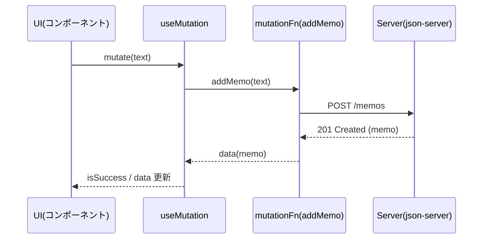
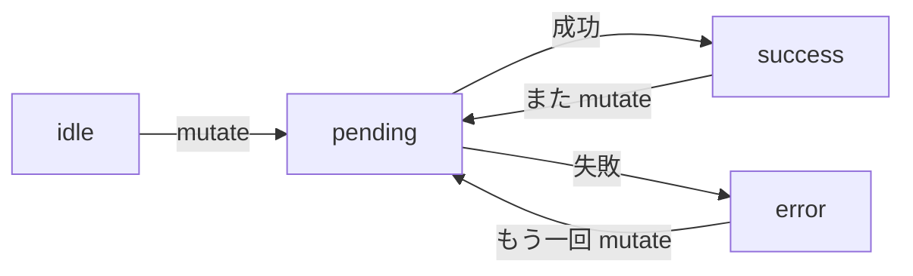

# 第167章：`useMutation` でデータを更新する

この章では **「送信（POST / PATCH / DELETE）」を気持ちよく管理する** `useMutation` をやっていくよ〜！😊
（次の第168章で「更新後にキャッシュを無効化して再取得」＝超大事な話につながるよ🔥）

---

## 1) `useMutation` ってなに？🤔💡

`useQuery` が「取得（GET）」担当なら、
`useMutation` は「更新（POST/PUT/PATCH/DELETE）」担当！✍️✨

* 送信中…を `isPending` で判定できる（ボタン連打防止にも便利）🛑
* 成功・失敗の状態も持ってる（`isSuccess`, `isError`）✅❌
* 成功したら入力欄を空にする、失敗したらメッセージ出す、などがラクになる🎉

v5（現行）では **`isLoading` じゃなくて `isPending`** が基本だよ〜📝 ([TanStack][1])
（`status` も `pending/success/error/idle` って感じ！）([TanStack][2])

---

## 2) 今日作るもの：メモ送信フォーム📝➡️📦

* 入力して「追加」ボタン
* 送信中はボタンを無効化＆表示も変える
* 成功したら「作成されたメモ」を画面に表示
* 失敗したらエラー表示

---

## 3) ローカルAPI（json-server）を用意しよう🧪🛠️（Windows）

### 3-1) 依存を入れる📦

プロジェクトのルートで：

```bash
npm i @tanstack/react-query
npm i -D json-server
```

### 3-2) `db.json` を作る（ルート直下）📄

```json
{
  "memos": []
}
```

### 3-3) `package.json` にスクリプト追加🏃‍♀️💨

```json
{
  "scripts": {
    "dev": "vite",
    "build": "vite build",
    "preview": "vite preview",
    "api": "json-server --watch db.json --port 3001"
  }
}
```

### 3-4) ターミナル2つで起動🔥

* ターミナルA：

```bash
npm run dev
```

* ターミナルB：

```bash
npm run api
```

これで API は `http://localhost:3001/memos` になるよ！🚀

---

## 4) TanStack Query の準備（QueryClientProvider）🧠✨

もう作ってあるなら読み飛ばしてOK！👍

`src/main.tsx`

```tsx
import React from "react";
import ReactDOM from "react-dom/client";
import App from "./App.tsx";
import { QueryClient, QueryClientProvider } from "@tanstack/react-query";

const queryClient = new QueryClient();

ReactDOM.createRoot(document.getElementById("root")!).render(
  <React.StrictMode>
    <QueryClientProvider client={queryClient}>
      <App />
    </QueryClientProvider>
  </React.StrictMode>
);
```

---

## 5) API関数を作る（送信用）📡

`src/api/memos.ts`

```ts
export type Memo = {
  id: number;
  text: string;
  createdAt: string;
};

export async function addMemo(text: string): Promise<Memo> {
  const res = await fetch("http://localhost:3001/memos", {
    method: "POST",
    headers: { "Content-Type": "application/json" },
    body: JSON.stringify({
      text,
      createdAt: new Date().toISOString(),
    }),
  });

  if (!res.ok) {
    throw new Error("メモの追加に失敗しました…🥲");
  }

  return res.json();
}
```

---

## 6) `useMutation` を使って送信する🎯✨

`src/components/MemoForm.tsx`

```tsx
import { useState } from "react";
import { useMutation } from "@tanstack/react-query";
import type { Memo } from "../api/memos";
import { addMemo } from "../api/memos";

export function MemoForm() {
  const [text, setText] = useState("");

  const mutation = useMutation<Memo, Error, string>({
    mutationFn: addMemo,

    onSuccess: () => {
      // 成功したら入力欄を空にする✨
      setText("");
    },
  });

  const canSubmit = text.trim().length > 0 && !mutation.isPending;

  return (
    <div style={{ maxWidth: 520, margin: "24px auto", padding: 16 }}>
      <h2>メモ追加フォーム 📝✨</h2>

      <div style={{ display: "flex", gap: 8, marginTop: 12 }}>
        <input
          value={text}
          onChange={(e) => setText(e.target.value)}
          placeholder="ここにメモを書いてね😊"
          style={{ flex: 1, padding: 10 }}
        />

        <button
          disabled={!canSubmit}
          onClick={() => mutation.mutate(text)}
          style={{ padding: "10px 14px", cursor: canSubmit ? "pointer" : "not-allowed" }}
        >
          {mutation.isPending ? "送信中…⏳" : "追加 ➕"}
        </button>
      </div>

      {/* 状態表示ゾーン */}
      <div style={{ marginTop: 12 }}>
        {mutation.isError && (
          <p style={{ color: "crimson" }}>
            {mutation.error.message} ❌
          </p>
        )}

        {mutation.isSuccess && (
          <p style={{ color: "green" }}>
            追加できたよ！✅ ID: {mutation.data.id} 🎉
          </p>
        )}
      </div>

      {/* 直近作成データを見せる */}
      {mutation.data && (
        <div style={{ marginTop: 12, padding: 12, border: "1px solid #ddd", borderRadius: 8 }}>
          <div style={{ fontWeight: "bold" }}>作成されたメモ 📦</div>
          <div>ID: {mutation.data.id}</div>
          <div>text: {mutation.data.text}</div>
          <div>createdAt: {mutation.data.createdAt}</div>
        </div>
      )}
    </div>
  );
}
```

`src/App.tsx`

```tsx
import { MemoForm } from "./components/MemoForm";

export default function App() {
  return <MemoForm />;
}
```

---

## 7) 図でイメージする（送信の流れ）🗺️✨



状態の遷移もこんな感じだよ〜😊



（`status` や `isPending/isSuccess/isError` は公式の整理がこの感覚！）([TanStack][2])

---

## 8) `mutate` と `mutateAsync` の違い🍣✨

* `mutate(variables)`：普通に呼ぶ（結果は `mutation.data` を見る）
* `mutateAsync(variables)`：**Promiseが返る**から `await` できる 😳✨

公式でも `mutateAsync` は「Promise を返して await できる」って説明だよ〜([TanStack][2])

例：`await` したい版👇

```tsx
const onClick = async () => {
  try {
    const memo = await mutation.mutateAsync(text);
    console.log("作れた！", memo);
  } catch (e) {
    console.log("失敗…", e);
  }
};
```

---

## 9) よく使うコツ（超実戦）🧠🔥

### ✅ 連打防止は `isPending` でOK

`disabled={mutation.isPending}` だけでかなり事故が減る！🛑✨
（v5では `isPending` が基本だよ〜）([TanStack][1])

### ✅ コールバックは “どこに書くか” がポイント🎯

* `useMutation({ onSuccess })` に書く → **毎回共通で動く**
* `mutate(text, { onSuccess })` に書く → **その1回だけ動く**

連続で mutate する時の挙動に注意、ってガイドでも触れられてるよ📝([TanStack][3])

### ✅ 非同期は「返ってくる順番」が入れ替わることがある😵‍💫

早く投げたのが遅く返ってくる…とか普通に起きる！
（公式も「完了順は呼び出し順と違うかも」って注意してる）([TanStack][3])

---

## 10) ミニ課題（10〜20分）🏋️‍♀️✨

### 課題A：文字数チェック✍️

* 3文字未満なら送信できないようにしてみよう（例：`text.trim().length >= 3`）😊

### 課題B：リセットボタン追加🔄

* `mutation.reset()` を使って
  「成功表示・エラー表示を消す」ボタンを作ってみてね✨

```tsx
<button onClick={() => mutation.reset()}>
  表示をリセット 🔄
</button>
```

---

## 次の章の予告（第168章）🚀💥

この章では「送信自体」はできたけど、
**“更新後に一覧を最新化する”** がまだだよね？👀

次の第168章でいよいよ
✅ `invalidateQueries`（キャッシュ無効化→再取得）
をやって、**アプリっぽさ爆上がり**させるよ〜！🎉✨

[1]: https://tanstack.com/query/v5/docs/react/guides/migrating-to-v5?utm_source=chatgpt.com "Migrating to TanStack Query v5"
[2]: https://tanstack.com/query/v5/docs/react/reference/useMutation?utm_source=chatgpt.com "useMutation | TanStack Query React Docs"
[3]: https://tanstack.com/query/v5/docs/react/guides/mutations?utm_source=chatgpt.com "Mutations | TanStack Query React Docs"
