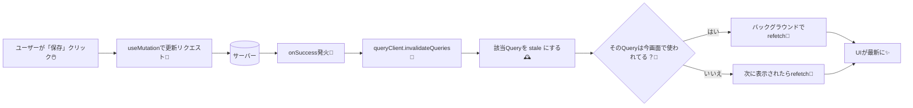
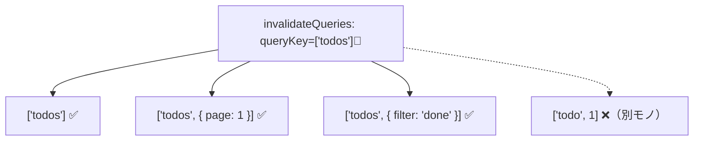

# 第168章：更新後の「キャッシュ無効化」

更新ボタン押したのに、画面が古いまま…😇💦
今日はそれを一発で直す **TanStack Query の「invalidate（無効化）」** をやるよ〜！💪🌟

---

## 今日のゴール🎯

* ✅ 更新（Mutation）のあとに、**古いキャッシュを“古いよ！”って宣言**できるようになる
* ✅ 一覧・詳細みたいに **複数のクエリをまとめて最新化**できるようになる
* ✅ `invalidateQueries` の「どれが対象？」がわかるようになる

TanStack Query の `invalidateQueries` は、該当クエリを **stale（古い）扱い**にして、**画面で使われてたら自動で裏で再取得**までしてくれるよ〜！✨
しかもこの “stale 扱い” は `staleTime` を上書きするのがポイント！😳💡 ([TanStack][1])

---

## まず図でイメージつかも！🧠📌（Mermaid）



この挙動は公式ガイドでもこう説明されてるよ👇

* stale にする（`staleTime` より強い）
* 画面で使われてたら refetch も走る ([TanStack][1])

---

## 「どのキャッシュを無効化するの？」＝ queryKey で決まる🏷️✨

`invalidateQueries({ queryKey: ['todos'] })` って書くと、
**queryKey が `['todos']` で始まるもの全部**が対象になるよ！😺🧺 ([TanStack][1])



---

## 実践：更新したら「一覧」を最新にする📝✨

### 1) 例の“なんちゃってサーバー”を用意（学習用）🍳

```ts
// src/fakeApi/todos.ts
export type Todo = { id: number; title: string; done: boolean };

let todos: Todo[] = [
  { id: 1, title: "レポート出す📄", done: false },
  { id: 2, title: "カフェ行く☕", done: false },
];

const wait = (ms: number) => new Promise((r) => setTimeout(r, ms));

export async function fetchTodos(): Promise<Todo[]> {
  await wait(400);
  return [...todos];
}

export async function updateTodo(input: { id: number; title: string }): Promise<Todo> {
  await wait(400);
  todos = todos.map((t) => (t.id === input.id ? { ...t, title: input.title } : t));
  return todos.find((t) => t.id === input.id)!;
}
```

### 2) 一覧を表示して、更新したら invalidate！🧹✨

```tsx
// src/TodoApp.tsx
import { useQuery, useMutation, useQueryClient } from "@tanstack/react-query";
import { fetchTodos, updateTodo, Todo } from "./fakeApi/todos";
import { useState } from "react";

export function TodoApp() {
  const queryClient = useQueryClient();

  const { data: todos = [], isPending } = useQuery({
    queryKey: ["todos"],
    queryFn: fetchTodos,
    staleTime: 60_000, // わざと長め（invalidate の効果が分かりやすい✨）
  });

  const [editingId, setEditingId] = useState<number | null>(null);
  const [title, setTitle] = useState("");

  const mutation = useMutation({
    mutationFn: updateTodo,
    onSuccess: async () => {
      // ✅ 更新が成功したら「一覧は古い！」と宣言🧹
      await queryClient.invalidateQueries({ queryKey: ["todos"] });
    },
  });

  if (isPending) return <p>読み込み中…🐣</p>;

  return (
    <div style={{ padding: 16 }}>
      <h2>TODO一覧📝</h2>

      <ul>
        {todos.map((t) => (
          <li key={t.id} style={{ marginBottom: 8 }}>
            {t.title}{" "}
            <button
              onClick={() => {
                setEditingId(t.id);
                setTitle(t.title);
              }}
            >
              編集✏️
            </button>
          </li>
        ))}
      </ul>

      {editingId !== null && (
        <div style={{ marginTop: 16 }}>
          <h3>編集モード✏️✨</h3>
          <input
            value={title}
            onChange={(e) => setTitle(e.target.value)}
            style={{ width: 240 }}
          />
          <button
            onClick={() => mutation.mutate({ id: editingId, title })}
            disabled={mutation.isPending}
          >
            {mutation.isPending ? "保存中…💾" : "保存💾"}
          </button>
          <button onClick={() => setEditingId(null)} style={{ marginLeft: 8 }}>
            閉じる🙈
          </button>
        </div>
      )}
    </div>
  );
}
```

これで、保存した瞬間に **`['todos']` のキャッシュが無効化 → 一覧が再取得**されるよ！🔄✨
Mutation 成功時に invalidate する流れは公式ガイドでも定番パターンだよ〜！ ([TanStack][2])

---

## 一覧 + 詳細みたいに「複数」無効化したいとき🧺✨

たとえば queryKey がこうだとするね👇

* 一覧：`['todos']`
* 詳細：`['todo', id]`

更新後は両方古い可能性あるよね？😵‍💫
そんなときはこれ！

```tsx
onSuccess: async (_updated, variables) => {
  await Promise.all([
    queryClient.invalidateQueries({ queryKey: ["todos"] }),
    queryClient.invalidateQueries({ queryKey: ["todo", variables.id] }),
  ]);
},
```

公式の例でも `Promise.all` で複数 invalidate やってるよ🧡 ([TanStack][2])

---

## ちょい設定：refetchType で「再取得する範囲」を変えられる🎚️✨

* `refetchType: 'active'`（デフォ）👉 **今画面で使われてるやつだけ**裏で再取得
* `refetchType: 'none'` 👉 **stale にするだけ**（通信はしない）
* `refetchType: 'all'` 👉 **使われてないやつも含めて**再取得 ([TanStack][3])

例：

```tsx
await queryClient.invalidateQueries({
  queryKey: ["todos"],
  refetchType: "none",
});
```

---

## さらに気持ちよく：setQueryData で「即反映」⚡（通信はあとでもOK）

「保存したらすぐ画面変わってほしい〜🥺」って時は、
invalidate だけじゃなくて **キャッシュ自体を先に書き換える**のもアリ！

```tsx
onSuccess: (updated) => {
  queryClient.setQueryData<Todo[]>(["todos"], (old) =>
    (old ?? []).map((t) => (t.id === updated.id ? updated : t))
  );
},
```

※この更新は **イミュータブル（元を直接いじらない）** が大事だよ！✋💥 ([TanStack][3])

---

## よくあるハマりどころ😇🕳️

* ❌ `queryKey` の形が違う（`'todos'` と `['todos']` が混ざる、とか）
* ❌ 一覧は `['todos']`、別画面は `['todoList']` みたいに **名前が統一されてない**
* ❌ 無効化したいのに `exact: true` をつけてて **思ったより当たってない**（ピンポイントすぎ） ([TanStack][1])

---

## まとめ🎀✨

* 更新したら **invalidateQueries で「古いよ！」宣言**する🧹
* `queryKey` は「住所」🏷️：一致（前方一致）したものが無効化される ([TanStack][1])
* 必要なら `Promise.all` で複数まとめて invalidate 🧺 ([TanStack][2])
* `refetchType` で「裏で取り直す範囲」も調整できる🎚️ ([TanStack][3])

---

次の第169章は、ローディング・エラー表示を“いい感じ”にしてアプリが一気にプロっぽくなるやつだよ〜😎✨

[1]: https://tanstack.com/query/v5/docs/react/guides/query-invalidation "Query Invalidation | TanStack Query React Docs"
[2]: https://tanstack.com/query/v5/docs/react/guides/invalidations-from-mutations "Invalidations from Mutations | TanStack Query React Docs"
[3]: https://tanstack.com/query/latest/docs/reference/QueryClient "QueryClient | TanStack Query Docs"
