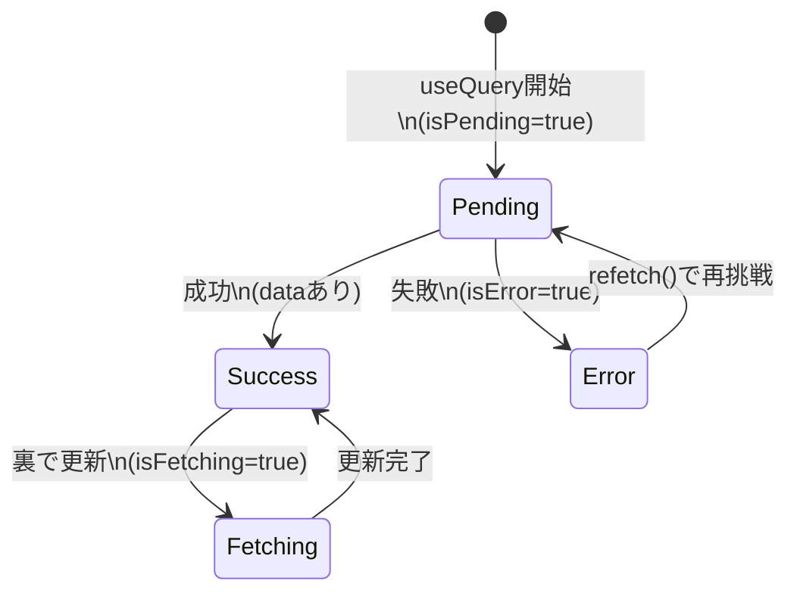

# 第169章：ロード画面とエラー画面のデラックス化

この章では、TanStack Query の状態フラグ（`isPending` / `isError`）を使って、

* ロード中に「それっぽい」画面を出す 🌀
* エラー時に「優しい」画面を出す 🧯
* 「再読み込み」ボタンで復活できるようにする 🔁

…っていう、アプリが一気に“プロっぽく見える”やつを作ります😎💖

---

## 1) まずは状態の全体像をつかむ 🧠✨（図解）

`useQuery` はだいたいこんな流れで状態が変わります👇



ポイントはこれ👇✨

* **`isPending`**：最初の取得中（まだ `data` が無い状態）🌀
* **`isError`**：失敗した状態（`error` がある）💥
* **`isFetching`**：**データはあるけど**裏で更新中（“更新中…”表示に便利）🔄

---

## 2) 今日作るUI（完成イメージ）🎁

* ロード中：スケルトン（キラッとするダミー表示）✨
* エラー：メッセージ＋再試行ボタン＋詳細（開閉）🧯
* 成功：一覧表示＋上に「更新中…」だけ小さく出す🔄

---

## 3) サンプルAPI取得関数を用意する 📡

### `src/api/articles.ts`

```tsx
export type Article = {
  id: number;
  title: string;
  body: string;
};

export async function fetchArticles(): Promise<Article[]> {
  // 例：JSONPlaceholder（練習用API）
  const res = await fetch("https://jsonplaceholder.typicode.com/posts");

  if (!res.ok) {
    throw new Error(`通信に失敗したよ（status: ${res.status}）`);
  }

  const data = (await res.json()) as Article[];
  return data.slice(0, 10); // 10件だけにしておく（見やすさ）
}
```

---

## 4) ロード中スケルトン部品を作る 🦴✨

### `src/components/ArticleListSkeleton.tsx`

```tsx
import styles from "./ArticleListSkeleton.module.css";

export function ArticleListSkeleton() {
  return (
    <div className={styles.wrapper}>
      <div className={styles.title} />
      <div className={styles.card} />
      <div className={styles.card} />
      <div className={styles.card} />
    </div>
  );
}
```

### `src/components/ArticleListSkeleton.module.css`

```css
.wrapper {
  display: grid;
  gap: 12px;
}

.title {
  height: 28px;
  border-radius: 10px;
  background: #eee;
  position: relative;
  overflow: hidden;
}

.card {
  height: 84px;
  border-radius: 14px;
  background: #eee;
  position: relative;
  overflow: hidden;
}

.title::before,
.card::before {
  content: "";
  position: absolute;
  inset: 0;
  transform: translateX(-100%);
  background: linear-gradient(
    90deg,
    rgba(255, 255, 255, 0) 0%,
    rgba(255, 255, 255, 0.7) 50%,
    rgba(255, 255, 255, 0) 100%
  );
  animation: shimmer 1.1s infinite;
}

@keyframes shimmer {
  100% {
    transform: translateX(100%);
  }
}
```

これだけで「待ってる感」が一気に良くなるよ〜！🥹✨

---

## 5) エラー画面（優しさMAX）を作る 🧯💗

エラーの型は `unknown` になりがちなので、**安全にメッセージ化**する関数を用意します👍

### `src/components/ErrorPanel.tsx`

```tsx
import styles from "./ErrorPanel.module.css";

function getErrorMessage(error: unknown): string {
  if (error instanceof Error) return error.message;
  return "原因不明のエラーだよ…🥲";
}

type Props = {
  error: unknown;
  onRetry: () => void;
};

export function ErrorPanel({ error, onRetry }: Props) {
  const message = getErrorMessage(error);

  return (
    <div className={styles.box} role="alert">
      <h2 className={styles.title}>読み込みに失敗しちゃった…💥</h2>
      <p className={styles.message}>もう一回やってみよ？🥺</p>

      <div className={styles.actions}>
        <button className={styles.button} onClick={onRetry}>
          🔁 再読み込み
        </button>
      </div>

      <details className={styles.details}>
        <summary>詳細を見る（開発者向け）🧪</summary>
        <pre className={styles.pre}>{message}</pre>
      </details>
    </div>
  );
}
```

### `src/components/ErrorPanel.module.css`

```css
.box {
  border: 1px solid #ffd1d1;
  background: #fff5f5;
  border-radius: 16px;
  padding: 16px;
  display: grid;
  gap: 10px;
}

.title {
  margin: 0;
  font-size: 18px;
}

.message {
  margin: 0;
  opacity: 0.85;
}

.actions {
  display: flex;
  gap: 10px;
}

.button {
  border: none;
  border-radius: 12px;
  padding: 10px 12px;
  background: #ff5a5f;
  color: white;
  cursor: pointer;
}

.button:active {
  transform: translateY(1px);
}

.details {
  opacity: 0.9;
}

.pre {
  white-space: pre-wrap;
  margin: 8px 0 0;
  background: white;
  border-radius: 12px;
  padding: 10px;
  border: 1px solid #eee;
}
```

---

## 6) 本体：`isPending` と `isError` で分岐する 🧩✨

### `src/pages/ArticlesPage.tsx`

```tsx
import { useQuery } from "@tanstack/react-query";
import { fetchArticles } from "../api/articles";
import { ArticleListSkeleton } from "../components/ArticleListSkeleton";
import { ErrorPanel } from "../components/ErrorPanel";

export function ArticlesPage() {
  const query = useQuery({
    queryKey: ["articles"],
    queryFn: fetchArticles,
  });

  // ① 最初の読み込み中（データまだ無い）
  if (query.isPending) {
    return (
      <div style={{ padding: 16 }}>
        <h1>記事一覧 📰</h1>
        <ArticleListSkeleton />
      </div>
    );
  }

  // ② エラー（失敗した）
  if (query.isError) {
    return (
      <div style={{ padding: 16 }}>
        <h1>記事一覧 📰</h1>
        <ErrorPanel error={query.error} onRetry={() => query.refetch()} />
      </div>
    );
  }

  // ③ 成功（data あり）
  return (
    <div style={{ padding: 16 }}>
      <h1>記事一覧 📰</h1>

      {/* データはあるけど裏で更新中のときだけ、さりげなく表示 */}
      {query.isFetching && (
        <p style={{ marginTop: 4, opacity: 0.7 }}>更新中…🔄</p>
      )}

      <ul style={{ display: "grid", gap: 12, paddingLeft: 16 }}>
        {query.data.map((a) => (
          <li key={a.id}>
            <strong>{a.title}</strong>
            <div style={{ opacity: 0.85 }}>{a.body}</div>
          </li>
        ))}
      </ul>
    </div>
  );
}
```

---

## 7) 動作チェック ✅（わざと失敗させるテク）😈

エラー画面がちゃんと出るか試したいときは、これが手っ取り早い👇

* `fetchArticles()` のURLをわざと壊す
  例：`/posts` → `/postss` にする 😇

そしたら **`isError` が true** になって、`ErrorPanel` が出ます💥
「再読み込み」押すと `refetch()` が走って復活できるよ🔁✨

---

## 8) 仕上げの小ワザ（プロっぽさUP）🪄✨

### ✅ `retry` を控えめにする（無限失敗しない）

```tsx
useQuery({
  queryKey: ["articles"],
  queryFn: fetchArticles,
  retry: 1, // 1回だけ再挑戦（好みで）
});
```

### ✅ ロード中でも“レイアウト崩れ”を減らす

スケルトンの高さを「だいたい本番に合わせる」と、ガタガタしなくて気持ちいいよ🧸✨

---

## 9) ミニ練習（5〜10分）💪💗

1. スケルトンを5枚表示にしてみよう 🦴✨
2. エラー画面に「トップへ戻る」ボタンを足してみよう 🏠
3. 成功時の一覧をカード風（枠＋影）にしてみよう 💳✨

---

ここまでできたら、通信まわりの画面が一気に“ちゃんとしてるアプリ”になるよ〜！🥰🎉
次の章で、さらに更新・追加系も強くしていくと超楽しくなるやつ👍🔄
