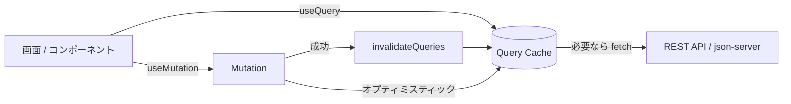
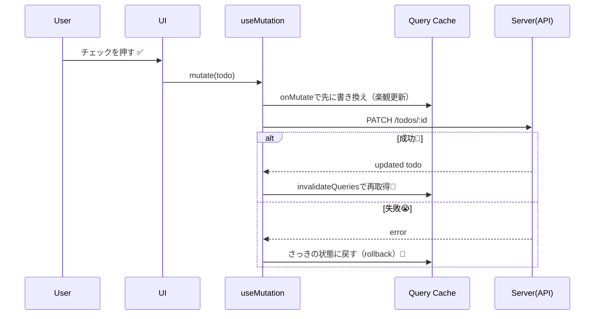

# 第170章：練習：TODOアプリを TanStack Query でリファクタリング

この章は「**TODOのデータ管理を、全部 TanStack Query に寄せて**、アプリをスッキリさせる」最終演習だよ〜！🥳💖
`useState + useEffect` で頑張ってた部分を、**`useQuery` / `useMutation` / キャッシュ**に置き換えていくよ🧠⚡

---

## この章でできるようになること 🎯

* TODO一覧の取得を `useQuery` にする 📥
* 追加・完了切り替え・削除を `useMutation` にする 🛠️
* 更新後に `invalidateQueries` で再取得する 🔄
* できれば「楽しい」最適化：**オプティミスティック更新**も入れる 😼✨

---

## まず全体イメージ（図解）🗺️



---

## 今回の構成（おすすめ）📁

こんな感じで分けると見通し良いよ〜✨

* `db.json`（仮APIのDB）
* `src/lib/todoApi.ts`（fetchまとめ）
* `src/main.tsx`（QueryClientProvider）
* `src/features/todos/TodoApp.tsx`（画面本体）

---

## 1) 仮API（json-server）を用意する 🧪🧰

### ① パッケージ入れる（プロジェクト直下で）

```bash
npm i @tanstack/react-query @tanstack/react-query-devtools
npm i -D json-server concurrently
```

### ② `db.json` を作る（プロジェクト直下）

```json
{
  "todos": [
    { "id": 1, "title": "React Query に移行する", "completed": false },
    { "id": 2, "title": "オプティミスティック更新を入れる", "completed": true }
  ]
}
```

### ③ `package.json` に scripts 追加

```json
{
  "scripts": {
    "dev": "concurrently \"vite\" \"npm run api\"",
    "api": "json-server --watch db.json --port 3001"
  }
}
```

### ④ 起動！

```bash
npm run dev
```

* フロント：Vite（たぶん `http://localhost:5173`）🌐
* API：json-server（`http://localhost:3001/todos`）🧃

---

## 2) APIアクセス関数を作る（fetchを1箇所に集約）📦

`src/lib/todoApi.ts`

```ts
export type Todo = {
  id: number;
  title: string;
  completed: boolean;
};

const BASE_URL = "http://localhost:3001";

async function http<T>(input: RequestInfo, init?: RequestInit): Promise<T> {
  const res = await fetch(input, {
    headers: { "Content-Type": "application/json" },
    ...init,
  });
  if (!res.ok) {
    throw new Error(`HTTP Error: ${res.status}`);
  }
  return (await res.json()) as T;
}

export function fetchTodos(): Promise<Todo[]> {
  return http<Todo[]>(`${BASE_URL}/todos`);
}

export function addTodo(title: string): Promise<Todo> {
  return http<Todo>(`${BASE_URL}/todos`, {
    method: "POST",
    body: JSON.stringify({ title, completed: false }),
  });
}

export function toggleTodo(todo: Todo): Promise<Todo> {
  return http<Todo>(`${BASE_URL}/todos/${todo.id}`, {
    method: "PATCH",
    body: JSON.stringify({ completed: !todo.completed }),
  });
}

export function deleteTodo(id: number): Promise<{}> {
  return http<{}>(`${BASE_URL}/todos/${id}`, {
    method: "DELETE",
  });
}
```

---

## 3) QueryClientProvider を設定する（超重要）👑

`src/main.tsx`

```tsx
import React from "react";
import ReactDOM from "react-dom/client";
import App from "./App.tsx";
import "./index.css";

import { QueryClient, QueryClientProvider } from "@tanstack/react-query";
import { ReactQueryDevtools } from "@tanstack/react-query-devtools";

const queryClient = new QueryClient({
  defaultOptions: {
    queries: {
      staleTime: 10_000, // 10秒は「新鮮」扱い🍓
      retry: 1,
    },
  },
});

ReactDOM.createRoot(document.getElementById("root")!).render(
  <React.StrictMode>
    <QueryClientProvider client={queryClient}>
      <App />
      <ReactQueryDevtools initialIsOpen={false} />
    </QueryClientProvider>
  </React.StrictMode>
);
```

DevTools入れると、「今キャッシュに何入ってる？」が見えてテンション上がるよ😆🔍✨

---

## 4) TODOアプリ本体を `useQuery` / `useMutation` で作る ✅🧩

`src/features/todos/TodoApp.tsx`

```tsx
import { useMemo, useState } from "react";
import { useMutation, useQuery, useQueryClient } from "@tanstack/react-query";
import { addTodo, deleteTodo, fetchTodos, toggleTodo, type Todo } from "../../lib/todoApi";

const TODOS_KEY = ["todos"] as const;

export function TodoApp() {
  const queryClient = useQueryClient();
  const [title, setTitle] = useState("");

  // ✅ 一覧取得：useQueryに全部まかせる
  const todosQuery = useQuery({
    queryKey: TODOS_KEY,
    queryFn: fetchTodos,
  });

  const todos = useMemo(() => todosQuery.data ?? [], [todosQuery.data]);

  // ✅ 追加：useMutation
  const addMutation = useMutation({
    mutationFn: (newTitle: string) => addTodo(newTitle),
    onSuccess: () => {
      queryClient.invalidateQueries({ queryKey: TODOS_KEY });
    },
  });

  // ✅ 完了切り替え：オプティミスティック更新つき（楽しい😼）
  const toggleMutation = useMutation({
    mutationFn: (todo: Todo) => toggleTodo(todo),
    onMutate: async (todo) => {
      await queryClient.cancelQueries({ queryKey: TODOS_KEY });

      const prev = queryClient.getQueryData<Todo[]>(TODOS_KEY);

      queryClient.setQueryData<Todo[]>(TODOS_KEY, (old) => {
        const current = old ?? [];
        return current.map((t) =>
          t.id === todo.id ? { ...t, completed: !t.completed } : t
        );
      });

      return { prev };
    },
    onError: (_err, _todo, ctx) => {
      if (ctx?.prev) queryClient.setQueryData(TODOS_KEY, ctx.prev);
    },
    onSettled: () => {
      queryClient.invalidateQueries({ queryKey: TODOS_KEY });
    },
  });

  // ✅ 削除：オプティミスティック更新つき
  const deleteMutation = useMutation({
    mutationFn: (id: number) => deleteTodo(id),
    onMutate: async (id) => {
      await queryClient.cancelQueries({ queryKey: TODOS_KEY });

      const prev = queryClient.getQueryData<Todo[]>(TODOS_KEY);

      queryClient.setQueryData<Todo[]>(TODOS_KEY, (old) => {
        const current = old ?? [];
        return current.filter((t) => t.id !== id);
      });

      return { prev };
    },
    onError: (_err, _id, ctx) => {
      if (ctx?.prev) queryClient.setQueryData(TODOS_KEY, ctx.prev);
    },
    onSettled: () => {
      queryClient.invalidateQueries({ queryKey: TODOS_KEY });
    },
  });

  function submit() {
    const trimmed = title.trim();
    if (!trimmed) return;

    addMutation.mutate(trimmed);
    setTitle("");
  }

  if (todosQuery.isPending) {
    return <p style={{ padding: 16 }}>読み込み中だよ〜⏳💭</p>;
  }

  if (todosQuery.isError) {
    return (
      <div style={{ padding: 16 }}>
        <p>エラー出ちゃった😭💥</p>
        <p style={{ opacity: 0.7 }}>{String(todosQuery.error)}</p>
      </div>
    );
  }

  return (
    <div style={{ padding: 16, maxWidth: 520 }}>
      <h1>TODO ✨</h1>

      <div style={{ display: "flex", gap: 8, marginBottom: 12 }}>
        <input
          value={title}
          onChange={(e) => setTitle(e.target.value)}
          placeholder="やること入れてね📝"
          style={{ flex: 1, padding: 8 }}
        />
        <button
          onClick={submit}
          disabled={addMutation.isPending}
          style={{ padding: "8px 12px" }}
        >
          {addMutation.isPending ? "追加中…⏳" : "追加➕"}
        </button>
      </div>

      <ul style={{ listStyle: "none", padding: 0, display: "grid", gap: 8 }}>
        {todos.map((t) => (
          <li
            key={t.id}
            style={{
              padding: 10,
              border: "1px solid #ddd",
              borderRadius: 8,
              display: "flex",
              alignItems: "center",
              justifyContent: "space-between",
              gap: 8,
            }}
          >
            <label style={{ display: "flex", alignItems: "center", gap: 8 }}>
              <input
                type="checkbox"
                checked={t.completed}
                onChange={() => toggleMutation.mutate(t)}
                disabled={toggleMutation.isPending}
              />
              <span style={{ textDecoration: t.completed ? "line-through" : "none" }}>
                {t.title}
              </span>
            </label>

            <button
              onClick={() => deleteMutation.mutate(t.id)}
              disabled={deleteMutation.isPending}
              style={{ padding: "6px 10px" }}
            >
              削除🗑️
            </button>
          </li>
        ))}
      </ul>

      <p style={{ marginTop: 12, opacity: 0.7 }}>
        データはキャッシュされてるよ🧠✨（DevToolsで覗いてみてね🔍）
      </p>
    </div>
  );
}
```

`src/App.tsx` はこれでOK🙆‍♀️

```tsx
import { TodoApp } from "./features/todos/TodoApp";

export default function App() {
  return <TodoApp />;
}
```

---

## 5) オプティミスティック更新の流れ（図解）😼⚡



---

## できたかチェック ✅💮

* [ ] `npm run dev` でフロントとAPIが両方動く
* [ ] 初回表示でTODO一覧が出る
* [ ] 追加できる（追加中はボタンが変わる）
* [ ] 完了チェックが即反映される（オプティミスティック）
* [ ] 削除も即消える（オプティミスティック）
* [ ] DevToolsで `todos` がキャッシュされてるのが見える🔍✨

---

## よくあるミス（ここだけ見て助かるやつ）🆘😵

* APIのポートが違う（`3001` になってる？）🔌
* `QueryClientProvider` で囲み忘れ（真っ白になりがち）🫠
* `queryKey` が毎回変わってる（配列を定数にするの大事！）🧷
* `onMutate` で `cancelQueries` しないと競合しやすい🏃‍♀️💥

---

## 追加チャレンジ（余力あったら）🌟

* フィルター（全て / 未完了 / 完了）を追加してみよ🎛️
* `staleTime` を変えて「更新されるタイミング」を体感しよ🍓
* `add` もオプティミスティックにしてみよ（TEMP ID で）🧪✨

---

必要なら、あなたの「リファクタ前のTODOコード（useEffect版）」を貼ってくれたら、**差分が分かる形で置き換え**もやるよ〜😆💖
