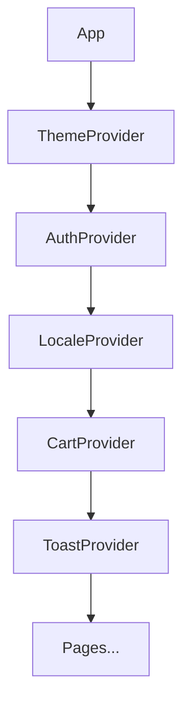
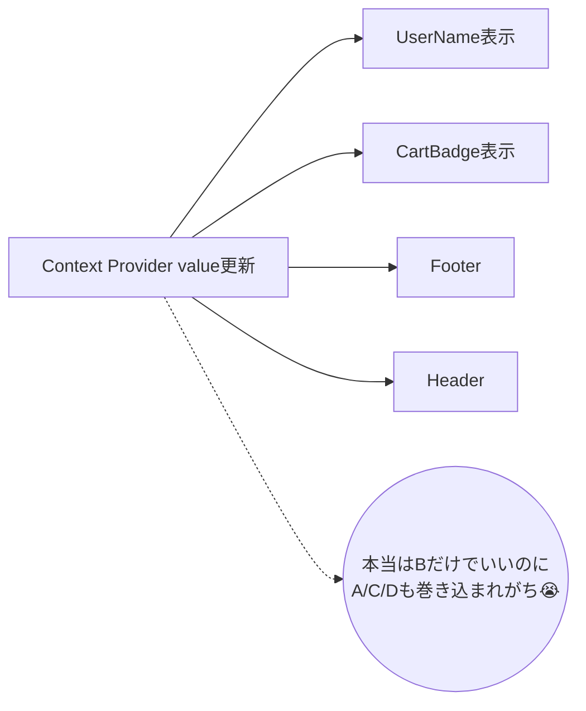
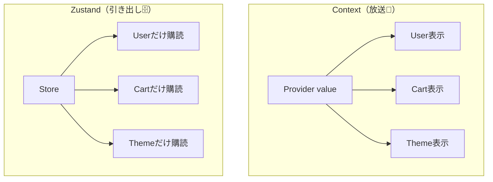

# 第171章：Context API の限界と Zustand の登場

今日は「**グローバル状態（みんなで共有するデータ）**」の話だよ〜！🎀
ReactにはContextがあるけど、アプリが育ってくると「うっ…しんどい…🥲」ってなる瞬間があるのね。そこで登場するのが **Zustand（ズースタンド）** 🐻💨

---

## この章でできるようになること 🎯

* Context API が「どこでつらくなるか」を説明できる🧠
* 「Contextはダメ」じゃなくて、**得意/不得意**を整理できる📌
* Zustandが「なにを解決するか」をイメージできる🐻✨

---

## まず「グローバル状態」って何？🌍

たとえばこういうやつ👇

* ログイン中のユーザー情報👤
* ダークモード🌙
* ショッピングカート🛒
* 通知（トースト）🔔
* 言語（日本語/英語）🌐

「どのページでも使いたい」「離れたコンポーネント同士で共有したい」データだね😊

---

## Context API はどんな時に気持ちいい？😇

Contextは **“配る”** のが得意🎁
例えば **あんまり頻繁に変わらない** ものに向いてるよ👇

* テーマ（色）🎨
* 言語設定🌍
* 認証クライアント（外部SDK）🔑
* 設定（読み取り中心）⚙️

「アプリ全体に設定を配る」みたいな用途は今でも超優秀！✨

---

## でも…Context のつらみポイント 😵‍💫

### つらみ①：Providerが増えて “ミルフィーユ地獄” 🍰💥

Contextを増やすほど `Provider` が積み重なっていくやつ…！

「もうどこで何が配られてるの…？😇」ってなるやつ。

---

### つらみ②：値が変わると “関係ない子” まで再レンダリングしがち 😭

Contextの大きめの弱点：
**Providerのvalueが変わる → そのContextを読んでる子が再レンダリング** しやすい。

特にありがちなのが👇

* `value={{ user, setUser }}` みたいに **オブジェクトを毎回新しく作ってる**
* 「カートの数」が変わっただけなのに、ユーザー名表示も一緒に更新される…🥲

イメージはこんな感じ👇

※ がんばれば `useMemo` や Context分割で軽くできるけど、設計とメンテが大変になりやすいの…🧩💦

---

### つらみ③：Contextを“状態管理”として使い始めると設計がムズくなる 🌀

Contextは本来「配る道具」🎁
それを「更新しまくる状態管理」に使うと、

* Context分割が増える📦📦📦
* `useMemo` / `useCallback` 祭りになる🎪
* どこが再レンダリングしてるか追いにくい🔍

って感じで、じわじわ疲れてくることがあるよ😵‍💫

---

## そこで Zustand の出番！🐻✨

### Zustandってなに？（ざっくり）🧁

* **グローバルなストア（データ置き場）** を作る
* コンポーネントは **“欲しいデータだけ”** を取りに行く
* そして **そのデータが変わった時だけ** 更新される（しやすい）💨

しかも嬉しいのが👇

* **Providerがいらない**（基本）🎉
* 書き方がシンプル🧼
* Reduxみたいな儀式が少ない🙏
* TypeScriptとも相性良い🧠✨

---

## Context と Zustand の違いをイメージでつかもう！📡 vs 🐻

### Context：放送📢（みんなが同じ放送を聞く）

* 放送内容が変わると、聞いてる人は影響を受けやすい

### Zustand：引き出し収納🗄️（必要な引き出しだけ開ける）

* 「この引き出し」だけ見てる子は、他が変わっても平気

---

## 「じゃあContextってもう使わないの？」👉 いいえ！使う！🙆‍♀️✨

### Contextが得意なこと 💚

* ほぼ固定の設定を配る（テーマ/言語/SDK）🎨🌍
* 「アプリの外側の仕組み」を渡す（DIっぽいやつ）🔌

### Zustandが得意なこと 💙

* **頻繁に変わるグローバル状態**（カート、通知、UI状態）🛒🔔
* 「どの画面でも使うけど、更新も多い」状態🔥
* 大きくなっていくアプリの状態管理🏗️

結論：
**ContextとZustandはライバルじゃなくて、役割分担が上手なコンビ**だよ🤝✨

---

## ミニ例：どんな時にZustandが気持ちいい？😆

たとえばショッピングサイトで👇

* ヘッダーにカート数🛒
* 商品一覧で「カートに追加」ボタン➕
* カートページで一覧編集🧾
* 決済ページでも参照💳

これ、いろんな場所で使うし更新も多い！
Contextで頑張ると、分割や最適化が増えがち。
Zustandだと「カートの引き出し」だけをみんなで共有できてラク〜🐻✨

---

## ちょいクイズ（サクッと）🧠💡

1. Contextが向いてるのはどっち？
   A. カートの中身（頻繁に変わる）🛒
   B. アプリの言語設定（たまにしか変わらない）🌍

2. Providerが何個もネストしていく問題、なんて呼びたくなる？🍰

（答え）

1. **B** ✅
2. **ミルフィーユ地獄**（って呼びたくなるやつ！）✅

---

## 次章の予告（ワクワク）🐻💨

次はついに **Zustandで最初のストアを作る**よ！🎉
`create` ひとつで「え、もうできたんだけど…？」ってなるはず😳✨

---

必要なら、この章の最後に「Contextで頑張った版 → Zustandに置き換える版」のミニ題材も用意できるよ🧁💖
