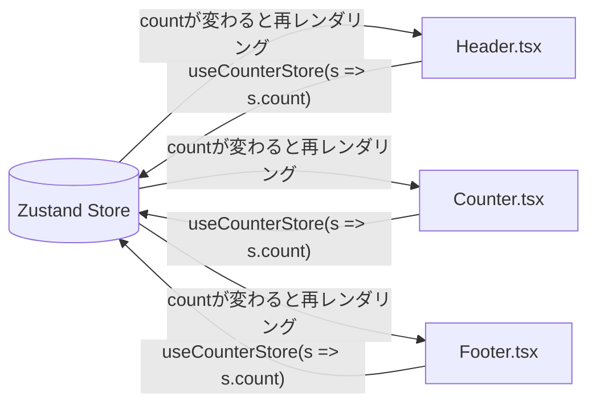

# 第173章：コンポーネントでストアの値を使う

この章はね、「作ったストアを、コンポーネントから読む」だけでOKです😆🎉
Zustandのストアは **“フックそのもの”** だから、コンポーネント内で呼び出すだけで使えます✅（Providerも基本いりません）([GitHub][1])

---

## 今日のゴール 🎯✨

* `useCounterStore(...)` をコンポーネントで呼ぶ ✅
* ストアの値（例：`count`）を表示できる ✅
* 複数コンポーネントで同じ値が同期されるのを体験する ✅

---

## イメージ図（Mermaid）🗺️💡



「同じストア」をみんなで見てるから、どこで更新しても表示がそろうよ〜📣✨

---

## 1) Zustand を入れる 🧩📦

プロジェクトのルートで👇（PowerShellでもOK）

```bash
npm i zustand
```

Zustandは「フックとして使う」前提のAPIで、コンポーネントからそのまま読めるのが強みだよ💪🐻([GitHub][1])

---

## 2) ストアを用意する（復習込み）🧠✨

`src/stores/counterStore.ts`

```ts
import { create } from "zustand";

type CounterStore = {
  count: number;

  // この章は「読む」が主役だけど、
  // 動きが分かりやすいように最低限の操作も置いとくね✨
  increment: () => void;
  reset: () => void;
};

export const useCounterStore = create<CounterStore>((set) => ({
  count: 0,
  increment: () => set((state) => ({ count: state.count + 1 })),
  reset: () => set({ count: 0 }),
}));
```

ポイントはこれ👇

* `useCounterStore` って名前の通り、**コンポーネントで呼べるフック**になるよ🐻✨([GitHub][1])

---

## 3) コンポーネントで「値を読む」👀✨

### Counter コンポーネントを作る 🔢🎉

`src/components/Counter.tsx`

```tsx
import { useCounterStore } from "../stores/counterStore";

export function Counter() {
  // ✅ 「値を読む」：countだけを選ぶ（セレクタ）
  const count = useCounterStore((s) => s.count);

  // （次章で詳しくやるけど、動き確認のために一旦使うね😌）
  const increment = useCounterStore((s) => s.increment);
  const reset = useCounterStore((s) => s.reset);

  return (
    <section style={{ padding: 12, border: "1px solid #ddd", borderRadius: 12 }}>
      <h2>カウンターだよ🐣</h2>
      <p>いまの数：<b>{count}</b> 🎀</p>

      <div style={{ display: "flex", gap: 8 }}>
        <button onClick={increment}>+1 ✨</button>
        <button onClick={reset}>リセット 🧼</button>
      </div>
    </section>
  );
}
```

ここが第173章の主役👇💖

* `useCounterStore((s) => s.count)` で **countだけ取り出して表示**
* 選んだ値が変わったときに、そのコンポーネントが再レンダリングされるよ🪄([GitHub][1])

---

## 4) 「別のコンポーネント」でも同じ値を表示する 🧡🧡

### Header を作る 🧢✨

`src/components/Header.tsx`

```tsx
import { useCounterStore } from "../stores/counterStore";

export function Header() {
  const count = useCounterStore((s) => s.count);

  return (
    <header style={{ padding: 12, background: "#f6f6f6", borderRadius: 12 }}>
      <b>ヘッダー</b>：いま <b>{count}</b> だよ〜🌸
    </header>
  );
}
```

### Footer も作る 👣✨

`src/components/Footer.tsx`

```tsx
import { useCounterStore } from "../stores/counterStore";

export function Footer() {
  const count = useCounterStore((s) => s.count);

  return (
    <footer style={{ padding: 12, background: "#f6f6f6", borderRadius: 12 }}>
      <b>フッター</b>：こっちも <b>{count}</b> 同期してる😳💫
    </footer>
  );
}
```

---

## 5) App.tsx で並べて確認しよ〜🧪🎀

`src/App.tsx`

```tsx
import { Header } from "./components/Header";
import { Counter } from "./components/Counter";
import { Footer } from "./components/Footer";

export default function App() {
  return (
    <div style={{ display: "grid", gap: 12, padding: 16, maxWidth: 520 }}>
      <Header />
      <Counter />
      <Footer />
    </div>
  );
}
```

`+1` を押したら、**ヘッダー・真ん中・フッター**が一緒に変われば成功〜🎉🎉🎉

---

## 大事ポイントまとめ 🧠✨（ここだけ覚えればOK！）

### ✅ 1) ストアは「フック」だから、そのまま呼ぶ

* `useCounterStore(...)` をコンポーネントで呼べばOK🐻
* Providerは基本いらないよ〜（必要なケースは後々でOK）([GitHub][1])

### ✅ 2) “必要な値だけ” 取るのが基本（セレクタ）

* `useCounterStore((s) => s.count)` みたいに、**必要なものだけ**選ぶと気持ちいい✨
* 逆に `useCounterStore()` で全部取ると、何かが変わるたび毎回更新されがち（注意）([GitHub][1])

---

## よくあるつまずき集 🥹🧯

* ❌ **イベントの中で `useCounterStore(...)` を呼ぶ**
  → フックはコンポーネントのトップレベルで呼ぶルールだよ⚠️

* ❌ **`src/stores/...` のimportパス間違い**
  → `../stores/counterStore` になってるか確認👀

* ❌ **全部まとめて取って重くなる**
  → まずは「必要な値だけ」取るクセをつけると勝ち🌟([GitHub][1])

---

## ミニ練習（3分）⏱️🌸

1. `Header` をもう1個増やしてみてね（上と下に2個）😊
2. それでも全部同じ数字で動いたら大成功🎉
3. 余裕あったら、`count` じゃなく `count * 2` を表示する場所を作ってみよ✨

   * ヒント：`const double = useCounterStore((s) => s.count * 2)` 😆

---

## 次（第174章）につながる一言 📣✨

今日は「読む」だけでOK！
次の章は **アクション（関数）でストアを更新**して、「状態管理っぽさ」を完成させるよ〜🐻🔥

[1]: https://github.com/pmndrs/zustand "GitHub - pmndrs/zustand:  Bear necessities for state management in React"
