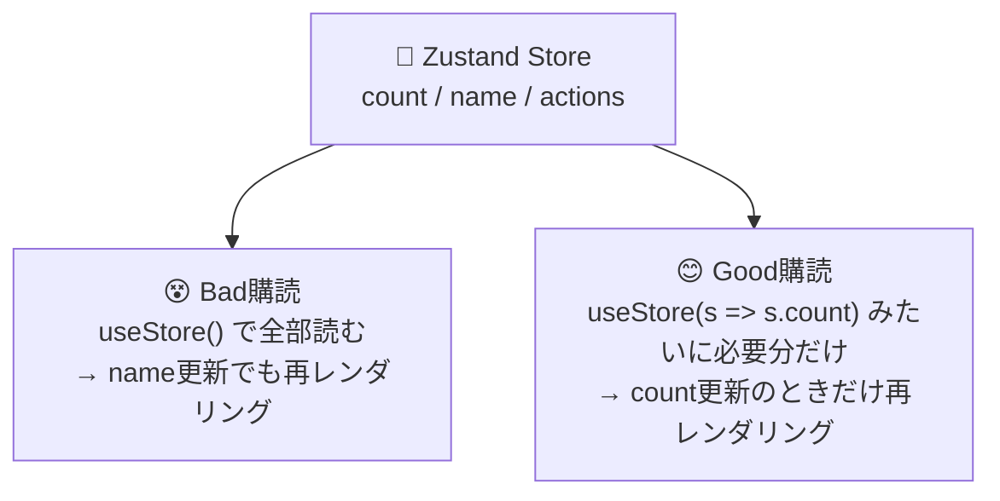
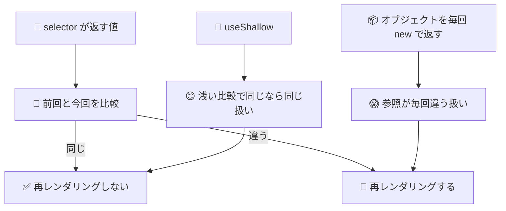

# 第175章：Zustand の「セレクター」

この章は「アプリが大きくなってもサクサク動かすためのコツ」だよ〜😊
Zustand の **セレクター（selector）** を使うと、**必要なデータが変わったときだけ**コンポーネントが再レンダリングされるようになるの！⚡

---

## 今日のゴール 🎯

* セレクターが「なにをしてるのか」をつかむ👀
* **ダメな購読（全部読む）** と **いい購読（必要な分だけ読む）** を比較できる👌
* 複数の値をまとめて取りたいときに `useShallow` を使えるようになる🧠✨（推奨されがち！） ([zustand.docs.pmnd.rs][1])

---

## セレクターってなに？🤔

Zustand は「ストア（状態の倉庫）」の中身を、コンポーネントが読めるんだけど…

* ✅ **セレクターあり**：`useStore((s) => s.count)` みたいに **必要なものだけ**選んで読む
* ❌ **セレクターなし**：`useStore()` で **ストア全部**を読む（＝関係ない更新でも巻き込まれやすい）

セレクターの正体はただの関数：
「ストアの state をもらって、欲しい形に切り出して返す」だけだよ〜✂️✨

---

## 図でイメージするよ 🗺️



---

## ハンズオン：わざと「ムダ再レンダリング」を起こして体験しよ 💥➡️✨

### 1) ストアを用意（すでにあるなら読み替えOK）🧩

`src/store/useCounterStore.ts`

```ts
import { create } from 'zustand'

type CounterState = {
  count: number
  name: string
  inc: () => void
  dec: () => void
  setName: (name: string) => void
}

export const useCounterStore = create<CounterState>((set) => ({
  count: 0,
  name: 'Hanako',
  inc: () => set((s) => ({ count: s.count + 1 })),
  dec: () => set((s) => ({ count: s.count - 1 })),
  setName: (name) => set({ name }),
}))
```

---

### 2) 「Bad」コンポーネント（ストア全部を読む）😵

`src/components/BadCounterPanel.tsx`

```tsx
import { useCounterStore } from '../store/useCounterStore'

export function BadCounterPanel() {
  console.log('😵 BadCounterPanel render')
  const store = useCounterStore() // ← ストア全部を購読（これが原因！）

  return (
    <section style={{ padding: 12, border: '1px solid #ccc', borderRadius: 8 }}>
      <h2>😵 Bad（全部読む）</h2>
      <p>count: {store.count}</p>
      <button onClick={store.inc}>+1</button>{' '}
      <button onClick={store.dec}>-1</button>
    </section>
  )
}
```

---

### 3) 「name を変えるだけ」のコンポーネント ✍️

`src/components/NameEditor.tsx`

```tsx
import { useCounterStore } from '../store/useCounterStore'

export function NameEditor() {
  console.log('✍️ NameEditor render')
  const name = useCounterStore((s) => s.name)
  const setName = useCounterStore((s) => s.setName)

  return (
    <section style={{ padding: 12, border: '1px solid #ccc', borderRadius: 8 }}>
      <h2>✍️ 名前編集</h2>
      <input
        value={name}
        onChange={(e) => setName(e.target.value)}
        placeholder="type your name..."
      />
      <p>今の名前: {name}</p>
    </section>
  )
}
```

---

### 4) 画面に並べる 🧱

`src/App.tsx`

```tsx
import { BadCounterPanel } from './components/BadCounterPanel'
import { NameEditor } from './components/NameEditor'

export default function App() {
  return (
    <main style={{ display: 'grid', gap: 12, padding: 16 }}>
      <h1>Chapter 175 🐻 Selector</h1>
      <NameEditor />
      <BadCounterPanel />
    </main>
  )
}
```

✅ ここで `input` に文字を打つと…
**count を触ってないのに BadCounterPanel が render される**はず！😵💦
（コンソール見てね👀）

---

## 改善：セレクターで「必要なものだけ」読む 😊✨

### 5) 「Good」コンポーネント（必要分だけ購読）✅

`src/components/GoodCounterPanel.tsx`

```tsx
import { useCounterStore } from '../store/useCounterStore'

export function GoodCounterPanel() {
  console.log('😊 GoodCounterPanel render')

  // ✅ 必要なものだけ取る
  const count = useCounterStore((s) => s.count)
  const inc = useCounterStore((s) => s.inc)
  const dec = useCounterStore((s) => s.dec)

  return (
    <section style={{ padding: 12, border: '1px solid #ccc', borderRadius: 8 }}>
      <h2>😊 Good（必要分だけ読む）</h2>
      <p>count: {count}</p>
      <button onClick={inc}>+1</button>{' '}
      <button onClick={dec}>-1</button>
    </section>
  )
}
```

`App.tsx` を置き換え：

```tsx
import { NameEditor } from './components/NameEditor'
import { BadCounterPanel } from './components/BadCounterPanel'
import { GoodCounterPanel } from './components/GoodCounterPanel'

export default function App() {
  return (
    <main style={{ display: 'grid', gap: 12, padding: 16 }}>
      <h1>Chapter 175 🐻 Selector</h1>
      <NameEditor />
      <BadCounterPanel />
      <GoodCounterPanel />
    </main>
  )
}
```

✅ これで、名前を打っても **GoodCounterPanel は render されにくくなる**よ〜🎉
（count が変わったときだけ動く👍）

---

## ちょい落とし穴：複数の値を「オブジェクトでまとめて返す」と…😱

こう書きたくなるんだけど👇

```tsx
// ❌ これ、毎回 { ... } が新しく作られるから「違う」と判定されやすい
const { count, inc } = useCounterStore((s) => ({ count: s.count, inc: s.inc }))
```

オブジェクトは毎回新規になるから、**実質同じでも再レンダリングが増える**ことがあるよ😵

---

## 解決：`useShallow` を使う（めっちゃ便利）🧡

Zustand の公式ドキュメントにもある定番テクだよ〜！
`useShallow` は「浅い比較（shallow）」で同じなら同じ扱いにしてくれるやつ✨ ([zustand.docs.pmnd.rs][1])

```tsx
import { useShallow } from 'zustand/react/shallow'
import { useCounterStore } from '../store/useCounterStore'

export function GoodCounterPanel() {
  console.log('😊 GoodCounterPanel render')

  // ✅ オブジェクトでまとめたいなら useShallow で包む！
  const { count, inc, dec } = useCounterStore(
    useShallow((s) => ({
      count: s.count,
      inc: s.inc,
      dec: s.dec,
    })),
  )

  return (
    <section style={{ padding: 12, border: '1px solid #ccc', borderRadius: 8 }}>
      <h2>😊 Good（useShallow でまとめ取り）</h2>
      <p>count: {count}</p>
      <button onClick={inc}>+1</button>{' '}
      <button onClick={dec}>-1</button>
    </section>
  )
}
```

※ `shallow`（比較関数）もあるけど、`useShallow` は「セレクター側をいい感じにメモ化」してくれる版、みたいなイメージでOKだよ〜🫶 ([zustand.docs.pmnd.rs][2])

---

## どうして速くなるの？（超ざっくり）⚡



---

## 開発中の注意（コンソールが2回出る問題）👀

Vite のテンプレだと `<React.StrictMode>` が有効で、**開発中だけ** `console.log` が2回出ることがあるよ〜！
「壊れた！😱」じゃなくて「開発中あるある」なので安心してね🙂✨

---

## 練習問題 🎮💪（5〜10分）

1. ストアに `theme: 'light' | 'dark'` を追加して、切り替えボタンを作ってみよう🌙☀️

   * Bad は theme 変更でも count パネルが動きがち
   * Good は theme を読んでないなら動かない…はず！🎉

2. ``const summary = useCounterStore((s) => `\${s.name}:\${s.count}`)`` を作って表示してみよう🧾

   * これも selector だよ！✨（返り値が文字列＝比較しやすい）

3. `name` と `count` を **まとめて**取りたいなら `useShallow` で包む練習🧡

---

## この章のまとめ 📌✨

* セレクターは「必要なものだけ選んで読む」ための関数✂️
* `useStore()` で全部読むと、関係ない更新でも巻き込まれやすい😵
* 複数値をまとめるなら `useShallow` が便利🧡（公式にも載ってる） ([zustand.docs.pmnd.rs][1])
* もっと細かい制御には equality function を使う手もある（発展） ([zustand.docs.pmnd.rs][3])

---

次の章（第176章）は、これを使って **Zustand カウンターを爆速で仕上げる練習**だね！🐻💨✨

[1]: https://zustand.docs.pmnd.rs/hooks/use-shallow?utm_source=chatgpt.com "useShallow ⚛️ - Zustand"
[2]: https://zustand.docs.pmnd.rs/apis/shallow?utm_source=chatgpt.com "shallow - Zustand"
[3]: https://zustand.docs.pmnd.rs/hooks/use-store-with-equality-fn?utm_source=chatgpt.com "useStoreWithEqualityFn ⚛️ - Zustand"
