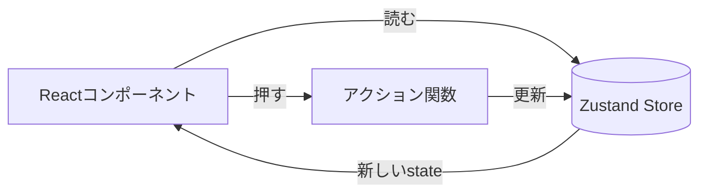
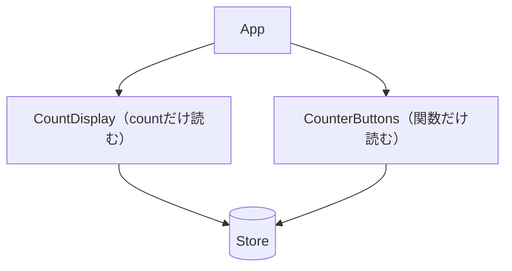

# 第176章：練習：カウンターアプリを Zustand で爆速作成

この章では、**Zustandで「状態（State）」をアプリの外に置く**練習をするよ〜！😊
完成したら、どのコンポーネントからでも同じカウントを使えるようになるよ💡

---

## 1) 今日作るもの 🎯🧁

* `+1` / `-1` / `Reset` のカウンター
* **Zustandストア**に `count` を保存
* ついでに「再レンダリングが増えない書き方（セレクター）」も体験👀✨

---

## 2) しくみの図（Zustandの流れ）🗺️



---

## 3) インストール（プロジェクトに追加）📦✨

プロジェクトのルートで👇（PowerShellでもOK）

```bash
npm i zustand
```

起動中なら一回止めて、また👇

```bash
npm run dev
```

---

## 4) ストアを作る（状態を外に出す）🐻🧠

`src/stores` フォルダを作って、その中に `counterStore.ts` を作るよ📁✨

**`src/stores/counterStore.ts`**

```ts
import { create } from "zustand";

type CounterState = {
  count: number;

  // アクション（更新するための関数）
  inc: () => void;
  dec: () => void;
  reset: () => void;
};

export const useCounterStore = create<CounterState>((set) => ({
  count: 0,

  inc: () => set((state) => ({ count: state.count + 1 })),
  dec: () => set((state) => ({ count: state.count - 1 })),
  reset: () => set({ count: 0 }),
}));
```

ポイントだよ📝✨

* `create<CounterState>(...)` で **型がバチッと効く**😎
* `set((state) => ...)` は **前の値を使って安全に更新**できるやつ！

---

## 5) UIを作る（まずはAppに全部置いてOK）🎨💕

**`src/App.tsx`** をこの形にしてみてね👇

```tsx
import "./App.css";
import { useCounterStore } from "./stores/counterStore";

export default function App() {
  // ✅ セレクター：必要なものだけ取る（後で効いてくる✨）
  const count = useCounterStore((s) => s.count);
  const inc = useCounterStore((s) => s.inc);
  const dec = useCounterStore((s) => s.dec);
  const reset = useCounterStore((s) => s.reset);

  return (
    <div style={{ maxWidth: 520, margin: "40px auto", padding: 16 }}>
      <h1>Zustand Counter 🐻✨</h1>

      <div
        style={{
          fontSize: 56,
          fontWeight: 800,
          padding: "20px 0",
        }}
      >
        {count}
      </div>

      <div style={{ display: "flex", gap: 12, flexWrap: "wrap" }}>
        <button onClick={dec} style={{ padding: "10px 16px" }}>
          -1 ➖
        </button>
        <button onClick={inc} style={{ padding: "10px 16px" }}>
          +1 ➕
        </button>
        <button onClick={reset} style={{ padding: "10px 16px" }}>
          Reset 🔁
        </button>
      </div>

      <p style={{ marginTop: 18, opacity: 0.75 }}>
        どのコンポーネントからでも同じcountを使えるよ〜！😊
      </p>
    </div>
  );
}
```

✅ これで動いたら成功！🎉🎉🎉
ボタン押して数字が変わればOKだよ🫶

---

## 6) 「爆速」っぽさ：コンポーネント分割しても共有できる 💨✨

Zustandの良さは、コンポーネントを分けても **同じ状態を共有できる**ところ！
ついでに、セレクターで「必要なものだけ購読」すると無駄に再描画しにくいよ👀

こんな分け方にしてみよう👇



### `src/components/CountDisplay.tsx`

```tsx
import { useCounterStore } from "../stores/counterStore";

export function CountDisplay() {
  const count = useCounterStore((s) => s.count);

  return (
    <div style={{ fontSize: 56, fontWeight: 800, padding: "20px 0" }}>
      {count}
    </div>
  );
}
```

### `src/components/CounterButtons.tsx`

```tsx
import { useCounterStore } from "../stores/counterStore";

export function CounterButtons() {
  const inc = useCounterStore((s) => s.inc);
  const dec = useCounterStore((s) => s.dec);
  const reset = useCounterStore((s) => s.reset);

  return (
    <div style={{ display: "flex", gap: 12, flexWrap: "wrap" }}>
      <button onClick={dec} style={{ padding: "10px 16px" }}>
        -1 ➖
      </button>
      <button onClick={inc} style={{ padding: "10px 16px" }}>
        +1 ➕
      </button>
      <button onClick={reset} style={{ padding: "10px 16px" }}>
        Reset 🔁
      </button>
    </div>
  );
}
```

### `src/App.tsx`（差し替え）

```tsx
import "./App.css";
import { CountDisplay } from "./components/CountDisplay";
import { CounterButtons } from "./components/CounterButtons";

export default function App() {
  return (
    <div style={{ maxWidth: 520, margin: "40px auto", padding: 16 }}>
      <h1>Zustand Counter 🐻✨</h1>

      <CountDisplay />
      <CounterButtons />

      <p style={{ marginTop: 18, opacity: 0.75 }}>
        分割しても状態はひとつ！いい感じ〜😊🫶
      </p>
    </div>
  );
}
```

---

## 7) よくあるつまずき集 🧯😵‍💫

* **`src/stores/counterStore.ts` のパス**が違う
  → importの相対パスを見直してね📍
* **`useCounterStore(...)` をコンポーネント外で呼んじゃった**
  → フックなので、基本はコンポーネントの中で呼ぶよ！
* **Reactの開発モードで「2回呼ばれた？」っぽい**
  → StrictModeの影響でそう見えることあるよ〜（本番は基本OK）🙆‍♀️

---

## 8) ミニ課題（できたら超つよい）💪🌟

1. `+5` ボタンを追加してみよ ➕5️⃣
2. `count` が `0` 未満にならないようにしてみよ（ガード）🛡️
3. `incBy(amount: number)` を作って、好きな数字で増やせるようにしよ🎮

---

必要なら、この次（第177章の「非同期アクション」）につながる形で、**擬似APIでカウント初期値を取得**みたいな練習にも発展させられるよ😊📡
