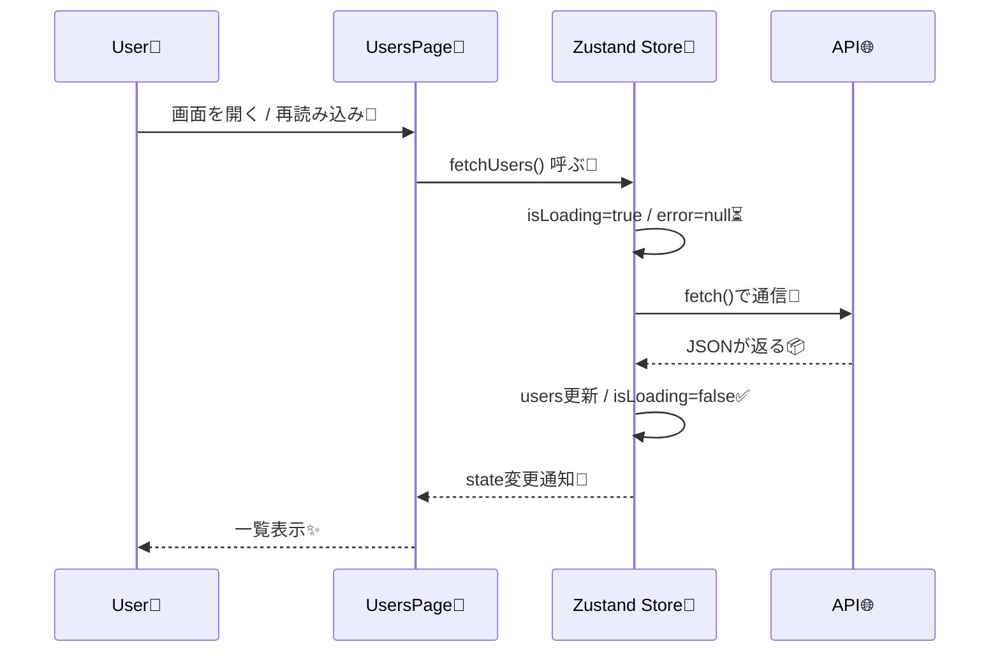
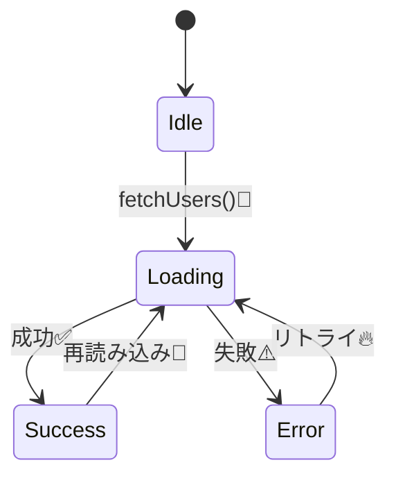

# 第177章：非同期アクション

## 今日のゴール🎯

API通信の結果を **Zustandストアに入れる** 流れを作るよ〜！😆💨
しかも👇までやっちゃう✨

* ローディング表示⏳
* エラー表示⚠️
* 「再読み込み」ボタン🔁
* 通信連打で **古い結果が上書きされない** 工夫🛡️

---

## まず結論：ZustandのアクションはasyncでOK🙆‍♀️✨

Zustandは「アクションがasyncかどうか」を気にしないので、**awaitしてからsetすればOK**だよ〜🐻💡 ([GitHub][1])

---

## 全体の流れ（図解）🗺️✨



---

## 1) まずはストア設計しよっ🧠✨

今回のストアはこんな感じにするよ👇

* `users`: 取得したユーザー配列👥
* `isLoading`: 通信中かどうか⏳
* `error`: 失敗したときのメッセージ⚠️
* `requestId`: 通信の「通し番号」🔢（古い結果の上書きを防ぐ🛡️）
* `fetchUsers`: 非同期アクション（通信して入れる）📡

---

## 2) ストア実装：`src/store/useUserStore.ts` 🧩🐻

```tsx
// src/store/useUserStore.ts
import { create } from "zustand";

export type User = {
  id: number;
  name: string;
  email: string;
};

type UserStore = {
  users: User[];
  isLoading: boolean;
  error: string | null;

  // 古い通信結果で上書きされないようにするための通し番号
  requestId: number;

  fetchUsers: () => Promise<void>;
};

export const useUserStore = create<UserStore>()((set, get) => ({
  users: [],
  isLoading: false,
  error: null,
  requestId: 0,

  fetchUsers: async () => {
    // ✅ 通し番号を1つ進めて「今回の通信ID」を確定
    const currentRequestId = get().requestId + 1;

    // 先に「通信開始状態」にする
    set({
      isLoading: true,
      error: null,
      requestId: currentRequestId,
    });

    try {
      // 例：JSONPlaceholder（デモ用の無料API）
      const res = await fetch("https://jsonplaceholder.typicode.com/users");
      if (!res.ok) throw new Error(`HTTP Error: ${res.status}`);

      const data = (await res.json()) as User[];

      // ✅ もし途中で次の通信が始まってたら、古い結果は捨てる！
      if (get().requestId !== currentRequestId) return;

      set({ users: data });
    } catch (e) {
      if (get().requestId !== currentRequestId) return;

      const message = e instanceof Error ? e.message : "Unknown error";
      set({ error: message });
    } finally {
      // ✅ ローディング解除も「同じ通信IDのときだけ」
      if (get().requestId === currentRequestId) {
        set({ isLoading: false });
      }
    }
  },
}));
```

> 「asyncでOK」「準備ができたらset」って考え方が公式でも紹介されてるよ🐻✨ ([GitHub][1])

---

## 3) 画面側：`src/UsersPage.tsx` を作ろう💻✨

```tsx
// src/UsersPage.tsx
import { useEffect } from "react";
import { useUserStore } from "./store/useUserStore";

export function UsersPage() {
  const users = useUserStore((s) => s.users);
  const isLoading = useUserStore((s) => s.isLoading);
  const error = useUserStore((s) => s.error);
  const fetchUsers = useUserStore((s) => s.fetchUsers);

  useEffect(() => {
    void fetchUsers(); // 最初に1回だけ取る📡
  }, [fetchUsers]);

  return (
    <div style={{ padding: 16 }}>
      <h1>ユーザー一覧👥✨</h1>

      <button onClick={() => void fetchUsers()} disabled={isLoading}>
        {isLoading ? "読み込み中…⏳" : "再読み込み🔁"}
      </button>

      {error && (
        <p style={{ marginTop: 12 }}>
          ⚠️ 失敗しちゃった…：{error}
        </p>
      )}

      {isLoading && <p style={{ marginTop: 12 }}>通信中だよ〜📡⏳</p>}

      <ul style={{ marginTop: 12 }}>
        {users.map((u) => (
          <li key={u.id}>
            {u.name} ✉️ {u.email}
          </li>
        ))}
      </ul>
    </div>
  );
}
```

### `App.tsx` で表示してみよ〜😆✨

```tsx
// src/App.tsx
import { UsersPage } from "./UsersPage";

export default function App() {
  return <UsersPage />;
}
```

---

## 4) 状態遷移（図解）🔄✨



---

## 5) よくあるミス集⚠️（ここで沼回避！🫶）

* **setにPromiseを直接入れない**（`set({ users: fetch(...) })` みたいなのはNG🙅‍♀️）
  → `await`してから `set` だよ〜✨ ([GitHub][1])
* ローディング解除を忘れて永遠に`isLoading=true`⏳♾️
  → `finally`で戻すのが安心😌
* 通信連打で「遅い通信が勝って上書き」😱
  → 今回の`requestId`方式で回避できるよ🛡️✨

---

## 6) ミニ課題（5〜15分）📝💪✨

1. 「再読み込み🔁」ボタンを連打しても、表示が変にならないのを確認してね😆
2. `users`の表示を「名前だけ」→「名前 + メール」→「IDも」みたいに増やしてみよ📈✨
3. 余裕があれば：`fetchUsers`の先頭で「すでに`isLoading`ならreturn」も入れてみてね🚧
   （通信の二重発行を減らせる✨）

---

必要なら次の章（第178章の`persist`）につながる形で、「取得したusersをリロードしても残す」まで一気に整える例も作れるよ〜💾🐻✨

[1]: https://github.com/pmndrs/zustand "GitHub - pmndrs/zustand:  Bear necessities for state management in React"
