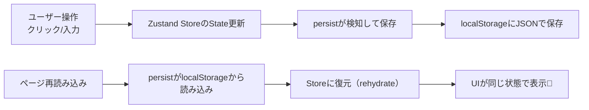

# 第178章：`persist` ミドルウェア

今回やることはこれ👇

* ZustandのStateを **localStorageに自動保存** して、**リロードしても残る** ようにする🪄
* 「保存するもの／しないもの」を選んだり、バージョン管理も少しだけやる🔧

---

## 1) `persist`ってなに？🧠💡

ふつうのZustandは、ページを更新（F5）するとStateが消えます🥲
でも `persist` を付けると…

* Stateが保存される（localStorageに）✅
* 次回起動時に復元される✅

って感じになります✨

---

## 2) ざっくり全体図（復元の流れ）🗺️



---

## 3) まずは最小サンプル：ダークモードを永続化🌙☀️

### (1) ストア作成：`src/stores/useUiStore.ts`

```ts
import { create } from "zustand";
import { persist, createJSONStorage } from "zustand/middleware";

type UiState = {
  darkMode: boolean;
  toggleDarkMode: () => void;
};

export const useUiStore = create<UiState>()(
  persist(
    (set) => ({
      darkMode: false,
      toggleDarkMode: () => set((s) => ({ darkMode: !s.darkMode })),
    }),
    {
      name: "ui-store", // localStorageのキー名
      storage: createJSONStorage(() => localStorage),
    }
  )
);
```

ポイント👇

* `name` が保存先のキーになるよ🔑（localStorageで見える）
* `storage` は基本このままでOK（ブラウザならlocalStorage）👌

---

### (2) 使う側：`src/App.tsx`

```tsx
import "./App.css";
import { useUiStore } from "./stores/useUiStore";

export default function App() {
  const darkMode = useUiStore((s) => s.darkMode);
  const toggleDarkMode = useUiStore((s) => s.toggleDarkMode);

  return (
    <div style={{ padding: 24, background: darkMode ? "#111" : "#fff", color: darkMode ? "#fff" : "#111" }}>
      <h1>persistテスト💾</h1>
      <p>今は：{darkMode ? "🌙 ダーク" : "☀️ ライト"}</p>

      <button onClick={toggleDarkMode}>
        切り替える🔁
      </button>

      <p style={{ marginTop: 16 }}>
        F5で更新しても、状態が残ってたら成功だよ🎉
      </p>
    </div>
  );
}
```

---

## 4) 保存されてるか確認しよう🔍（Chrome/Edge）

1. 画面で切り替える🔁
2. DevTools（F12）を開く🛠️
3. **Application** → **Local Storage** → 対象ドメイン
4. `ui-store` があればOK💯

消したいときはそのキーを削除すればリセットできるよ🧹✨

---

## 5) “保存するもの”を選ぶ：`partialize`（超よく使う）🎯

例えば「一時的なフラグは保存したくない」って時あるよね？😌
`partialize`で **保存対象だけ** 選べます✅

```ts
import { create } from "zustand";
import { persist, createJSONStorage } from "zustand/middleware";

type State = {
  token: string;          // 保存しない方が安全なこと多い⚠️
  darkMode: boolean;      // 保存したい
  setToken: (t: string) => void;
  toggleDarkMode: () => void;
};

export const useAppStore = create<State>()(
  persist(
    (set) => ({
      token: "",
      darkMode: false,
      setToken: (t) => set({ token: t }),
      toggleDarkMode: () => set((s) => ({ darkMode: !s.darkMode })),
    }),
    {
      name: "app-store",
      storage: createJSONStorage(() => localStorage),
      partialize: (state) => ({ darkMode: state.darkMode }), // ←これだけ保存✨
    }
  )
);
```

※ログイン系（tokenなど）は保存すると危ないこともあるから注意だよ⚠️🔐

---

## 6) バージョン管理：`version` と `migrate` 🧬

アプリが成長すると、保存するStateの形が変わることあるよね？
そのときに「古い保存データを新しい形に変換」できます✨

```ts
import { create } from "zustand";
import { persist, createJSONStorage } from "zustand/middleware";

type StateV2 = {
  theme: "light" | "dark"; // v2では darkMode を theme に変更したい！
  setTheme: (t: "light" | "dark") => void;
};

export const useThemeStore = create<StateV2>()(
  persist(
    (set) => ({
      theme: "light",
      setTheme: (t) => set({ theme: t }),
    }),
    {
      name: "theme-store",
      storage: createJSONStorage(() => localStorage),
      version: 2,
      migrate: (persisted, version) => {
        // versionが1のデータを2に変換するイメージ🛠️
        if (version === 1) {
          const old = persisted as { darkMode?: boolean };
          return { theme: old.darkMode ? "dark" : "light" };
        }
        return persisted as StateV2;
      },
    }
  )
);
```

---

## 7) ありがちなつまずきポイント🥺👉✅

* **関数は保存されない**（JSONだから）🧊
  → 保存されるのは「値」だけ。アクション関数は毎回ストア定義から復元されるよ👌
* **保存できないものがある**（Date/Map/Setなど）📦
  → 文字列や配列、オブジェクト中心にしよ！必要なら文字列化して保存✨
* **localStorage容量**（多すぎると入らない）🧯
  → 大きい配列を全部保存…は控えめに！`partialize`で絞るのが正義🎯

---

## 8) ミニ練習✍️（5分）🎓✨

**TODOリストをpersistしてみよう！**

* State：`todos: { id: string; text: string }[]`
* アクション：`addTodo(text)` / `removeTodo(id)`
* `persist`で保存
* F5しても残ってたら勝ち🏆🎉

ヒント：保存したいのは `todos` だけにして、`partialize`使うとキレイだよ🧼✨

---

次の第179章は「`immer`ミドルウェアとの合体」だね🐻🧠
`persist + immer` で「永続化しつつ、深いオブジェクトを楽に更新」できてめっちゃ強いよ💪✨
