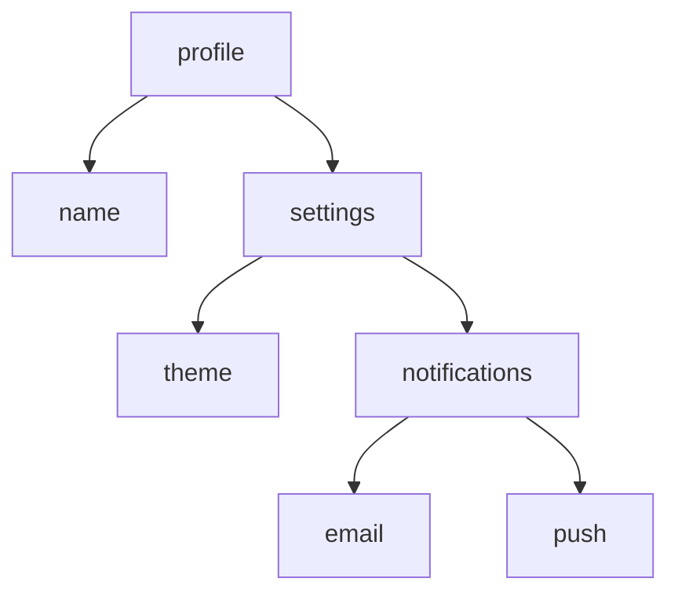
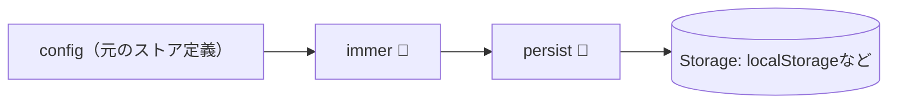

# 第179章：`immer` ミドルウェアとの合体

この章では、Zustandのストアに **`immer` ミドルウェア** を足して、**ネストが深いオブジェクトの更新をめちゃラク**にします🙌💕
（前の章の `persist` と合体させて「リロードしても残る + 更新はラク」の最強セットにするよ💾🧪）

---

## 1) まず「何がつらいの？」😵‍💫➡️😆

たとえば、こんな **深いネスト** を持つ状態があるとするね👇



### ❌ immer無し（つらい…）

「email通知だけON/OFFしたい」だけなのに、`...` が増えがち…😵‍💫

```tsx
// 例：email通知を切り替える（immer無し）
set((state) => ({
  profile: {
    ...state.profile,
    settings: {
      ...state.profile.settings,
      notifications: {
        ...state.profile.settings.notifications,
        email: !state.profile.settings.notifications.email,
      },
    },
  },
}));
```

### ✅ immer有り（最高…）

「触りたいところだけ」書けばOK！✨（見た目はミューテートっぽいけど、中身はちゃんとイミュータブル🧪）

```tsx
// 例：email通知を切り替える（immer有り）
set((state) => {
  state.profile.settings.notifications.email =
    !state.profile.settings.notifications.email;
});
```

Zustand公式のREADMEでも、`immer` ミドルウェアを使うと `set((state) => { state.xxx += 1 })` みたいに書ける例が出てるよ🐻🧪 ([GitHub][1])

---

## 2) インストール（Windows / PowerShellでOK）💻✨

```bash
npm i zustand immer
```

※ Zustand自体は最新だと v5 系（例：v5.0.9）になってるよ🐻 ([npm][2])

---

## 3) `persist + immer` 合体ストアを作る 💾🧪

`src/stores/useProfileStore.ts` を作って、ここに書くよ👇

ポイントは **`persist(immer(...), options)`** の形にすること！
（イメージ的には「更新をラクにする🧪」→「保存する💾」の順で包む感じ🫶）



### ✅ 完成コード（コピペOK）🧡

```tsx
// src/stores/useProfileStore.ts
import { create } from "zustand";
import { persist, createJSONStorage } from "zustand/middleware";
import { immer } from "zustand/middleware/immer";

type Theme = "light" | "dark";

type ProfileState = {
  profile: {
    name: string;
    settings: {
      theme: Theme;
      notifications: {
        email: boolean;
        push: boolean;
      };
    };
  };

  // actions（操作）
  setName: (name: string) => void;
  setTheme: (theme: Theme) => void;
  toggleEmail: () => void;
  togglePush: () => void;
  resetSettings: () => void;
};

const initialSettings = {
  theme: "light" as Theme,
  notifications: {
    email: true,
    push: false,
  },
};

export const useProfileStore = create<ProfileState>()(
  persist(
    immer((set) => ({
      profile: {
        name: "あきくん",
        settings: initialSettings,
      },

      setName: (name) =>
        set((state) => {
          state.profile.name = name;
        }),

      setTheme: (theme) =>
        set((state) => {
          state.profile.settings.theme = theme;
        }),

      toggleEmail: () =>
        set((state) => {
          state.profile.settings.notifications.email =
            !state.profile.settings.notifications.email;
        }),

      togglePush: () =>
        set((state) => {
          state.profile.settings.notifications.push =
            !state.profile.settings.notifications.push;
        }),

      resetSettings: () =>
        set((state) => {
          state.profile.settings = initialSettings;
        }),
    })),
    {
      name: "profile-storage",
      // ここを指定すると、保存形式がJSONになって安全✨
      storage: createJSONStorage(() => localStorage),
    },
  ),
);
```

`persist` の基本形（`name` や `createJSONStorage`）は公式READMEにも載ってるよ💾 ([GitHub][1])
`immer` ミドルウェアの基本形（`set((state)=>{ state.xxx += 1 })`）も同じく載ってるよ🧪 ([GitHub][1])

---

## 4) 画面から使ってみよ〜！😺🖱️✨

`src/components/SettingsPanel.tsx` を作る（または `App.tsx` に直書きでもOK）👇

```tsx
// src/components/SettingsPanel.tsx
import { useProfileStore } from "../stores/useProfileStore";

export function SettingsPanel() {
  const name = useProfileStore((s) => s.profile.name);
  const theme = useProfileStore((s) => s.profile.settings.theme);
  const email = useProfileStore((s) => s.profile.settings.notifications.email);
  const push = useProfileStore((s) => s.profile.settings.notifications.push);

  const setName = useProfileStore((s) => s.setName);
  const setTheme = useProfileStore((s) => s.setTheme);
  const toggleEmail = useProfileStore((s) => s.toggleEmail);
  const togglePush = useProfileStore((s) => s.togglePush);
  const resetSettings = useProfileStore((s) => s.resetSettings);

  return (
    <div style={{ padding: 16, display: "grid", gap: 12, maxWidth: 520 }}>
      <h2>設定パネル⚙️✨</h2>

      <label style={{ display: "grid", gap: 6 }}>
        <span>名前🧡</span>
        <input
          value={name}
          onChange={(e) => setName(e.target.value)}
          style={{ padding: 8 }}
        />
      </label>

      <div style={{ display: "flex", gap: 8, alignItems: "center" }}>
        <span>テーマ🎨</span>
        <button onClick={() => setTheme("light")}>🌞 Light</button>
        <button onClick={() => setTheme("dark")}>🌙 Dark</button>
        <span>いま：{theme}</span>
      </div>

      <div style={{ display: "grid", gap: 8 }}>
        <label>
          <input type="checkbox" checked={email} onChange={toggleEmail} />{" "}
          メール通知📧
        </label>

        <label>
          <input type="checkbox" checked={push} onChange={togglePush} />{" "}
          プッシュ通知📱
        </label>
      </div>

      <button onClick={resetSettings}>リセット🔁</button>

      <p style={{ opacity: 0.8 }}>
        💾 リロードしても設定が残ってたら成功だよ〜！
      </p>
    </div>
  );
}
```

`App.tsx` で表示👇

```tsx
// src/App.tsx
import { SettingsPanel } from "./components/SettingsPanel";

export default function App() {
  return <SettingsPanel />;
}
```

---

## 5) よくあるハマりどころ🕳️😵‍💫（ここだけ注意！）

* **`immer` をインストールし忘れる**と、型エラーや実行エラーで詰まりやすいよ⚠️（「`npm install immer`忘れてた！」系の話も実際ある🥺） ([GitHub][3])
* **深い更新が多いストア**ほど、`immer` の恩恵がデカい💖（スプレッド地獄から解放🙌）

---

## 6) ミニ課題（5〜10分）📝✨

1. `setTheme` を「同じテーマを押したら何もしない」ようにしてみてね🎯
2. `resetSettings` を「確認ダイアログ出してから」実行してみてね🫣（`confirm()`でOK）
3. 余裕があれば、`persist` のオプションで「保存する項目を絞る（partialize）」も挑戦💾✨

---

## 今日のまとめ🎉

* `immer` を入れると、**ネスト更新がめちゃ短く書ける**🧪✨
* `persist` と合体させると、**リロードしても残る + 更新もラク**の完成💾🧡
* 次の章（第180章）で「ショッピングカート」作ると、`immer` の強さがさらに刺さるよ🛒🔥

[1]: https://github.com/pmndrs/zustand "GitHub - pmndrs/zustand:  Bear necessities for state management in React"
[2]: https://www.npmjs.com/package/zustand?utm_source=chatgpt.com "zustand"
[3]: https://github.com/pmndrs/zustand/discussions/2346?utm_source=chatgpt.com "Immer set typescript issue #2346 - pmndrs zustand"
