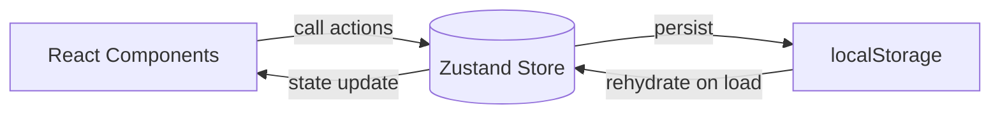
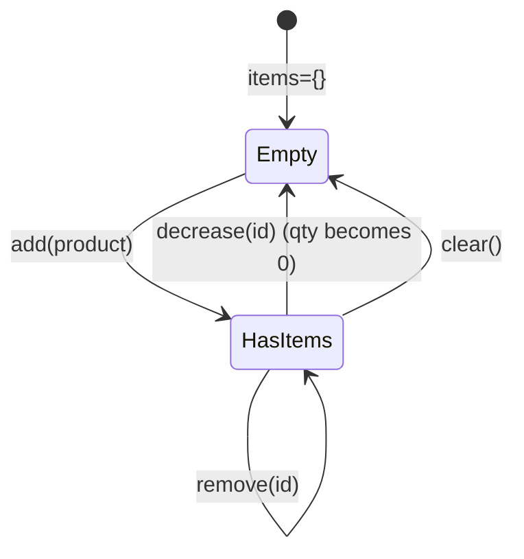

# 第180章：練習：Zustand で作る「ショッピングカート」機能

今日は **「カート機能」**を完成させるよ〜！🎉
「商品を追加→数量変更→削除→合計金額」まで、ちゃんと動くやつを作ろうね💪😺

---

## 今日作るもの（完成イメージ）🧁🛍️

* 商品一覧が表示される 📦
* 「カートに入れる」できる ➕
* カート内で数量を + / - できる 🔼🔽
* 0になったら削除（or 削除ボタン）🗑️
* 合計金額・合計点数が出る 💰
* ついでに：リロードしてもカートが残る（persist）🔁✨（便利！）

---

## 図解：データの流れ（Zustandの気持ち）🧠🌈



> ✅ UIは「表示」担当、Storeは「状態」担当って分けるとめっちゃラクになるよ☺️

---

## 1) 依存パッケージを入れる（Windows）📦💻

Vite + React + TS のプロジェクトで、ターミナルを開いて👇

```bash
npm i zustand immer
```

* `immer` は「ネストしたstate更新を楽にする」ために使うよ
* ZustandのImmerミドルウェアは `zustand/middleware/immer` を使う形が公式に案内されてるよ📌 ([zustand.docs.pmnd.rs][1])

---

## 2) 商品データを用意する 📃🍓

`src/data/products.ts` を作ってね👇

```ts
// src/data/products.ts
export type Product = {
  id: string;
  name: string;
  price: number;
};

export const products: Product[] = [
  { id: "p1", name: "いちごタルト", price: 520 },
  { id: "p2", name: "抹茶ラテ", price: 460 },
  { id: "p3", name: "チョコドーナツ", price: 280 },
  { id: "p4", name: "カヌレ", price: 330 },
];
```

---

## 3) Zustandストアを作る（カートの本体）🛒🧩

`src/stores/cartStore.ts` を作ってね👇
ポイントはこの3つ💡

* `items` は **Record（辞書）**で管理（探すの速い！）⚡
* `immer` で更新が書きやすい ✍️
* `persist` でリロードしても残す 🔁（`createJSONStorage` 推奨） ([GitHub][2])

```ts
// src/stores/cartStore.ts
import { create } from "zustand";
import { persist, createJSONStorage } from "zustand/middleware";
import { immer } from "zustand/middleware/immer";
import type { Product } from "../data/products";

type CartItem = {
  product: Product;
  quantity: number;
};

type CartState = {
  items: Record<string, CartItem>;
};

type CartActions = {
  add: (product: Product) => void;
  increase: (productId: string) => void;
  decrease: (productId: string) => void;
  remove: (productId: string) => void;
  clear: () => void;
};

export const useCartStore = create<CartState & CartActions>()(
  persist(
    immer((set) => ({
      items: {},

      add: (product) =>
        set((state) => {
          const id = product.id;
          const existing = state.items[id];
          if (existing) {
            existing.quantity += 1;
          } else {
            state.items[id] = { product, quantity: 1 };
          }
        }),

      increase: (productId) =>
        set((state) => {
          const item = state.items[productId];
          if (!item) return;
          item.quantity += 1;
        }),

      decrease: (productId) =>
        set((state) => {
          const item = state.items[productId];
          if (!item) return;

          item.quantity -= 1;
          if (item.quantity <= 0) {
            delete state.items[productId];
          }
        }),

      remove: (productId) =>
        set((state) => {
          delete state.items[productId];
        }),

      clear: () =>
        set((state) => {
          state.items = {};
        }),
    })),
    {
      name: "cart-storage",
      storage: createJSONStorage(() => localStorage),
      partialize: (state) => ({ items: state.items }), // 必要なものだけ保存✨
      version: 1,
    }
  )
);
```

---

## 4) UIを作る：商品一覧（追加ボタン付き）🍩➕

`src/components/ProductList.tsx` を作ってね👇

```tsx
// src/components/ProductList.tsx
import { products } from "../data/products";
import { useCartStore } from "../stores/cartStore";

export function ProductList() {
  const add = useCartStore((s) => s.add); // actionだけ取る（軽い✨）

  return (
    <section>
      <h2>商品一覧 🧁</h2>

      <ul style={{ display: "grid", gap: 12, padding: 0, listStyle: "none" }}>
        {products.map((p) => (
          <li
            key={p.id}
            style={{
              border: "1px solid #ddd",
              borderRadius: 12,
              padding: 12,
              display: "flex",
              justifyContent: "space-between",
              alignItems: "center",
            }}
          >
            <div>
              <div style={{ fontWeight: 700 }}>{p.name}</div>
              <div>{p.price.toLocaleString()}円 💰</div>
            </div>

            <button onClick={() => add(p)} style={{ padding: "8px 12px" }}>
              カートに入れる ➕
            </button>
          </li>
        ))}
      </ul>
    </section>
  );
}
```

---

## 5) UIを作る：カート表示（数量変更・合計）🛒💕

`src/components/CartPanel.tsx` を作ってね👇

```tsx
// src/components/CartPanel.tsx
import { useMemo } from "react";
import { useCartStore } from "../stores/cartStore";

export function CartPanel() {
  const itemsObj = useCartStore((s) => s.items);
  const increase = useCartStore((s) => s.increase);
  const decrease = useCartStore((s) => s.decrease);
  const remove = useCartStore((s) => s.remove);
  const clear = useCartStore((s) => s.clear);

  const items = useMemo(() => Object.values(itemsObj), [itemsObj]);

  const totalCount = items.reduce((sum, x) => sum + x.quantity, 0);
  const totalPrice = items.reduce(
    (sum, x) => sum + x.product.price * x.quantity,
    0
  );

  return (
    <aside style={{ border: "1px solid #ddd", borderRadius: 12, padding: 12 }}>
      <h2>
        カート 🛒 <span style={{ fontSize: 14 }}>({totalCount}点)</span>
      </h2>

      {items.length === 0 ? (
        <p>まだ空っぽだよ〜🍃 商品を入れてみてね😊</p>
      ) : (
        <>
          <ul style={{ padding: 0, listStyle: "none", display: "grid", gap: 10 }}>
            {items.map(({ product, quantity }) => (
              <li
                key={product.id}
                style={{
                  border: "1px solid #eee",
                  borderRadius: 12,
                  padding: 10,
                  display: "grid",
                  gap: 6,
                }}
              >
                <div style={{ display: "flex", justifyContent: "space-between" }}>
                  <strong>{product.name}</strong>
                  <span>{(product.price * quantity).toLocaleString()}円</span>
                </div>

                <div style={{ display: "flex", gap: 8, alignItems: "center" }}>
                  <button onClick={() => decrease(product.id)}>−</button>
                  <span>数量：{quantity} 🧺</span>
                  <button onClick={() => increase(product.id)}>＋</button>

                  <div style={{ marginLeft: "auto", display: "flex", gap: 8 }}>
                    <button onClick={() => remove(product.id)}>削除 🗑️</button>
                  </div>
                </div>
              </li>
            ))}
          </ul>

          <hr />

          <div style={{ display: "flex", justifyContent: "space-between" }}>
            <strong>合計</strong>
            <strong>{totalPrice.toLocaleString()}円 💰</strong>
          </div>

          <div style={{ display: "flex", gap: 8, marginTop: 10 }}>
            <button onClick={clear} style={{ padding: "8px 12px" }}>
              カートを空にする 🧹
            </button>
            <button
              onClick={() => alert("購入処理は次章でね😉🧾")}
              style={{ padding: "8px 12px" }}
            >
              購入へ進む ✅
            </button>
          </div>
        </>
      )}
    </aside>
  );
}
```

---

## 6) Appに配置して完成〜！🎉🎀

`src/App.tsx` をこんな感じにしてね👇

```tsx
// src/App.tsx
import { CartPanel } from "./components/CartPanel";
import { ProductList } from "./components/ProductList";

export default function App() {
  return (
    <div style={{ maxWidth: 900, margin: "24px auto", padding: 16 }}>
      <h1>ミニショップ 🍰✨</h1>

      <div style={{ display: "grid", gridTemplateColumns: "2fr 1fr", gap: 16 }}>
        <ProductList />
        <CartPanel />
      </div>
    </div>
  );
}
```

起動して確認👇

```bash
npm run dev
```

---

## 図解：カート操作の状態変化（超だいじ）🧠🔁



---

## つまづきポイント救急箱 🚑🥺

### ✅ 「セレクター」どう使えばいいの？

Zustandは **必要なものだけ選んで取る**のが基本だよ✨
例：`useCartStore(s => s.add)` みたいに「関数だけ」取ると軽い💨

※React 19系の最適化（Compilerまわり）では、パターンによって不具合報告もあるので、まずはこの章みたいに **素直なselector関数**で使うのが安心だよ〜😺 ([GitHub][3])

---

## 理解チェック（3問）📝💡

1. `items` を配列じゃなく `Record` にしてる理由、何がうれしい？🗂️
2. `persist` の `partialize` は何のため？✂️
3. コンポーネント側で `useCartStore(s => s.items)` みたいに書くメリットは？🎯

---

## 発展課題（できたらプロっぽい✨）🚀💎

* クーポンコードで割引（合計金額に反映）🎫
* 在庫数を持って「在庫切れ」表示📦
* `CartPanel` を右からスライドするDrawerにする🧊
* 「カートに追加しました」トースト通知🔔

---

必要なら、このカートを **Zustandのセレクター最適化**（再レンダリングをもっと減らすやつ）で“ヌルヌル”にする改造も一緒にやろ〜😺✨

[1]: https://zustand.docs.pmnd.rs/integrations/immer-middleware?utm_source=chatgpt.com "Immer middleware - Zustand"
[2]: https://github.com/pmndrs/zustand?utm_source=chatgpt.com "pmndrs/zustand: 🐻 Bear necessities for state management ..."
[3]: https://github.com/pmndrs/zustand/discussions/2562?utm_source=chatgpt.com "Will React Compiler (from React 19) affect Zustand in any ..."
