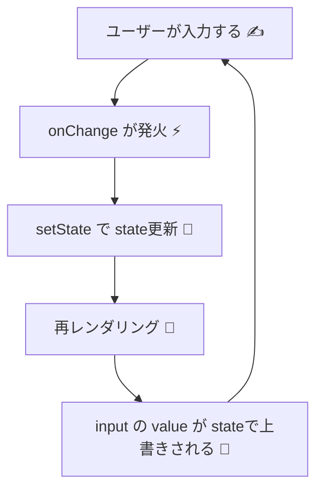
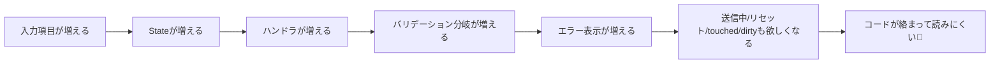

# 第181章：React のフォーム管理、ここがしんどい

この章は「Reactでフォームを素直に作ると、だんだんツラくなる理由」を体験して、**次章（RHF）に気持ちよく進むための“前フリ”**だよ〜！🌸✨

---

## 今日のゴール 🎯

* Reactのフォームが**なぜしんどくなりやすいのか**を説明できる
* 「うわ、これ手作業で増やしていくの無理…」っていう**気持ちを正しく味わう**（大事）😂
* 次章の **React Hook Form（RHF）** が「救世主」に見える状態になる 🙌✨

---

## まず：Reactのフォームって基本は「全部Stateで管理」になりがち 🧠🔧

Reactでよくあるのはこの形👇
入力欄の `value` を **Stateに結びつける（controlled）** ってやつ！

```tsx
import { useState } from "react";

export function SimpleLoginForm() {
  const [email, setEmail] = useState("");
  const [password, setPassword] = useState("");

  function onSubmit(e: React.FormEvent<HTMLFormElement>) {
    e.preventDefault(); // ← これ忘れるとページがリロードされがち😇
    console.log({ email, password });
  }

  return (
    <form onSubmit={onSubmit}>
      <label>
        Email
        <input
          value={email}
          onChange={(e) => setEmail(e.target.value)}
          placeholder="mail@example.com"
        />
      </label>

      <label>
        Password
        <input
          value={password}
          onChange={(e) => setPassword(e.target.value)}
          type="password"
          placeholder="********"
        />
      </label>

      <button type="submit">ログイン</button>
    </form>
  );
}
```

---

## 図で見る：Reactフォームの基本ループ 🔁✨（controlled）



これ自体は「わかりやすい」んだけどね…
**項目が増えた瞬間に地獄の入口が見えてくる**よ…😵‍💫🚪🔥

---

## しんどくなるポイント集 😭📌（あるあるフルコース）

フォームでよく欲しくなる機能、挙げるね👇（全部「手作業」だと重い…）

* 入力欄が増えるたびに `useState` が増える ➕➕➕
* `onChange` が増える（コピペ大会）📄🏟️
* バリデーション（必須、文字数、形式…）が増えるほど条件分岐が増える 🌪️
* エラーメッセージを出し分けたい（未入力/形式違いなど）😢
* 「送信中…」の制御（ボタン無効化とか）⏳
* `touched`（触ったか）/ `dirty`（変更したか）管理したくなる 🧼
* リセットしたい（初期値に戻す）🔄
* **入力するたびに再レンダリング**が走って、フォームが重くなりがち 🐢
* 入力欄が動的に増える（配列フォーム）で爆発 💥（住所が複数とか、経歴とか）

---

## “地獄の拡張”をちょっと体験しよう 😇🧪

さっきのフォームに「エラー表示」を足してみると…一気に増える！

### 例：必須チェック＋最低文字数チェック（手作業版）

```tsx
import { useState } from "react";

type Errors = {
  email?: string;
  password?: string;
};

export function PainfulLoginForm() {
  const [email, setEmail] = useState("");
  const [password, setPassword] = useState("");

  const [errors, setErrors] = useState<Errors>({});
  const [isSubmitting, setIsSubmitting] = useState(false);

  function validate(): Errors {
    const e: Errors = {};

    if (!email.trim()) e.email = "メールアドレスは必須だよ🥺";
    else if (!email.includes("@")) e.email = "@ が入ってないかも！📧";

    if (!password.trim()) e.password = "パスワードは必須だよ🥺";
    else if (password.length < 8) e.password = "8文字以上にしてね🔒";

    return e;
  }

  async function onSubmit(e: React.FormEvent<HTMLFormElement>) {
    e.preventDefault();

    const e2 = validate();
    setErrors(e2);
    if (Object.keys(e2).length > 0) return;

    setIsSubmitting(true);
    try {
      // 送信処理のつもり（擬似）
      await new Promise((r) => setTimeout(r, 800));
      alert("ログイン送信したよ🎉");
    } finally {
      setIsSubmitting(false);
    }
  }

  return (
    <form onSubmit={onSubmit} style={{ display: "grid", gap: 12, maxWidth: 360 }}>
      <label style={{ display: "grid", gap: 6 }}>
        Email
        <input
          value={email}
          onChange={(e) => setEmail(e.target.value)}
          placeholder="mail@example.com"
        />
        {errors.email && <span style={{ color: "crimson" }}>{errors.email}</span>}
      </label>

      <label style={{ display: "grid", gap: 6 }}>
        Password
        <input
          value={password}
          onChange={(e) => setPassword(e.target.value)}
          type="password"
          placeholder="********"
        />
        {errors.password && <span style={{ color: "crimson" }}>{errors.password}</span>}
      </label>

      <button type="submit" disabled={isSubmitting}>
        {isSubmitting ? "送信中..." : "ログイン"}
      </button>
    </form>
  );
}
```

### ここでの気づき（超大事）💡

* **入力欄 2つ**でこの量…😇
* これが「名前」「年齢」「住所」「規約チェック」…って増えたら…？
  → **爆発する未来が見える**よね💥👀

---

## しんどさが増えていく構造（イメージ）📈😵‍💫



---

## じゃあ、Reactのフォームって「本質的に何が面倒」なの？🤔💬

**一言でいうと：フォームは“状態”が多すぎる**の！📦📦📦

フォームには、最低でもこういう“状態”が混ざる👇

* 入力値（values）✍️
* エラー（errors）😢
* 送信中（isSubmitting）⏳
* 触ったか（touched）👆
* 変更したか（dirty）🧼
* 初期値（defaultValues）🏁
* 動的増減（配列）➕➖

これを全部「自力でキレイに管理」しようとすると、だんだん手に負えなくなるんだよね…😭

---

## この章のまとめ 🧁✨

* Reactのフォームを素直に作ると、だいたい **controlled + useState** になりがち
* 項目が増えると、**State/ハンドラ/バリデーション/表示**が雪だるま式に増える ⛄
* さらに **touched/dirty/配列フォーム** まで来ると、かなり修行🧘‍♀️🔥

---

## 次章の予告 🎁😎

次は **React Hook Form (RHF)** で、

* `register` で入力欄を“紐付けるだけ”✨
* `handleSubmit` で送信がスッキリ✨
* エラーも性能も「いい感じ」に✨

…っていう「え、今までの苦労なに？😳」をやるよ〜！💖

準備OK？次いこっか！🚀✨
