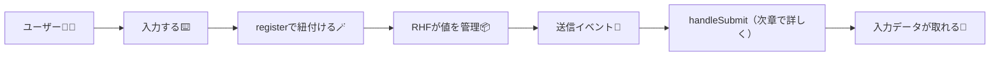

# 第182章：React Hook Form (RHF) の基本

この章は「**入力欄とフォームを、RHFに“接続”する**」がテーマだよ〜！😊
いちばん大事なのは **`register`**（レジスター）です✍️💖

---

### 1) まずはインストールしよ〜📦✨

プロジェクトのフォルダで👇

```bash
npm i react-hook-form
```

---

### 2) RHFの超ざっくり全体像（図解）🗺️👀

「入力欄がRHFに登録されて、送信時にまとめてデータが取れる」イメージ！



※この章は **`register`中心** だから、`handleSubmit`は「動かすために最低限だけ」使うよ😉

---

### 3) いちばん小さい実装（まず動かす）🧪✨

`src/App.tsx` をこうしてみてね👇（TypeScriptで型もつけるよ💪）

```tsx
import { useForm } from "react-hook-form";

type FormValues = {
  name: string;
  email: string;
};

export default function App() {
  const { register, handleSubmit } = useForm<FormValues>();

  const onSubmit = (data: FormValues) => {
    alert(`送信できたよ〜🎉\nname: ${data.name}\nemail: ${data.email}`);
  };

  return (
    <div style={{ padding: 24, fontFamily: "system-ui" }}>
      <h1>RHF はじめの一歩🪄</h1>

      <form onSubmit={handleSubmit(onSubmit)} style={{ display: "grid", gap: 12, maxWidth: 360 }}>
        <label style={{ display: "grid", gap: 6 }}>
          おなまえ🙂
          <input
            placeholder="例）さくら"
            {...register("name")}
            style={{ padding: 10, border: "1px solid #ccc", borderRadius: 8 }}
          />
        </label>

        <label style={{ display: "grid", gap: 6 }}>
          メール📩
          <input
            placeholder="例）sakura@example.com"
            {...register("email")}
            style={{ padding: 10, border: "1px solid #ccc", borderRadius: 8 }}
          />
        </label>

        <button type="submit" style={{ padding: 10, borderRadius: 8 }}>
          送信する🚀
        </button>
      </form>

      <p style={{ marginTop: 16, color: "#666" }}>
        ポイント：<code>...register("name")</code> みたいに “スプレッド” で input にくっつけるよ🧷✨
      </p>
    </div>
  );
}
```

✅ これで「入力 → 送信 → アラートで値が見える」になったら勝ち！🎉🎉🎉

---

### 4) `register`って結局なに？🤔🪄

`register("name")` は、ざっくり言うと👇を input に渡してる感じ！

* 「この入力欄は `name` だよ〜」という登録名🏷️
* 値を拾うための仕組み（イベントやrefなど）🔌

だから input はこうなるのが基本形👇

```tsx
<input {...register("name")} />
```

**`...`（スプレッド）**なのは、RHFが必要なものをまとめて渡してるからだよ〜😊✨

---

### 5) ちょいだけ便利：`register`で簡単バリデーション（おまけ）✅💡

「必須」とか「最小文字数」くらいなら、`register`の第2引数でサクッと書けるよ！

```tsx
<input {...register("name", { required: "名前は必須だよ🥺" })} />
```

※エラー表示の作り込みは次章以降で気持ちよくやろう〜🫶

---

### 6) つまずきポイントあるある😵‍💫➡️😄

* `register("name")` を書いたのに `...` を付け忘れる
  👉 `{...register("name")}` が正解だよ✨
* `"name"` と型定義のキーがズレる
  👉 `FormValues` のキーと同じ文字にしよう🏷️
* input に `value={...}` をベタ書きして動かなくなる
  👉 まずは **RHFに任せる**（必要になったら後でコントロールする）でOK🙆‍♀️

---

### 7) ミニ練習🎯✨（3分でできる）

上のフォームに、もう1個「年齢」を足してみてね🎂

* `FormValues` に `age: number` を追加
* input を追加（`type="number"`）
* `register("age", { valueAsNumber: true })` を付ける（数値にしてくれるやつ）🔢✨

ヒント👇

```tsx
<input type="number" {...register("age", { valueAsNumber: true })} />
```

---

### まとめ🧡

* RHFの第一歩は **`register`で入力欄を“接続”する**こと🪄
* 基本形はこれ👇

  * `const { register } = useForm()`
  * `<input {...register("fieldName")} />`

次の第183章で、`handleSubmit` をちゃんと使って「送信処理」を気持ちよく完成させよ〜！🚀💖
