# 第183章：`handleSubmit` で送信処理

この章では、React Hook Form（RHF）の **`handleSubmit`** を使って
「✅入力OKなら送信」「❌入力NGなら送信しない」をキレイに作れるようになります🎀

---

## 1) `handleSubmit` って何者？🧙‍♀️✨

`handleSubmit` は、ざっくり言うと…

* 入力チェック（バリデーション）する ✅
* OKなら `onValid(data)` を呼ぶ ✅
* NGなら `onInvalid(errors)` を呼ぶ（任意）❌
* ついでに `event.preventDefault()` も面倒見てくれる感じ ✋📨

---

## 2) 動きのイメージ（図解）🗺️✨

```mermaid
sequenceDiagram
  participant U as ユーザー🙂
  participant F as <form>🧾
  participant H as handleSubmit🛡️
  participant V as バリデーション✅/❌
  participant OK as onValid(data)🚀
  participant NG as onInvalid(errors)🧯

  U->>F: 送信ボタンを押す🖱️
  F->>H: onSubmit={handleSubmit(...)} 実行
  H->>V: 入力をチェックする🔎
  alt OK（全部OK）
    V-->>H: ✅OK
    H->>OK: data を渡して実行📦
  else NG（どこかNG）
    V-->>H: ❌NG（errors）
    H->>NG: errors を渡して実行⚠️
  end
```



---

## 3) まずは最小の型付きフォーム（必須チェック付き）🌱✨

### ✅ やること

* `register` で input を登録
* `handleSubmit(onSubmit)` を `<form onSubmit=...>` に渡す
* 成功時だけ `onSubmit(data)` が動く🎉

```tsx
import { useForm, type SubmitHandler } from "react-hook-form";

type LoginFormValues = {
  email: string;
  password: string;
};

export default function App() {
  const {
    register,
    handleSubmit,
    formState: { errors },
  } = useForm<LoginFormValues>({
    defaultValues: {
      email: "",
      password: "",
    },
  });

  const onSubmit: SubmitHandler<LoginFormValues> = (data) => {
    // ✅ バリデーションが通った時だけここに来る！
    console.log("送信データ📨", data);
    alert(`ログイン送信！\n${data.email}`);
  };

  return (
    <div style={{ maxWidth: 420, margin: "40px auto", padding: 16 }}>
      <h1>ログイン🍰</h1>

      <form onSubmit={handleSubmit(onSubmit)}>
        <label>
          メール📧
          <input
            type="email"
            {...register("email", {
              required: "メールは必須だよ💦",
            })}
            style={{ display: "block", width: "100%", marginTop: 6 }}
          />
        </label>
        {errors.email && (
          <p style={{ color: "crimson" }}>{errors.email.message}</p>
        )}

        <label style={{ display: "block", marginTop: 12 }}>
          パスワード🔑
          <input
            type="password"
            {...register("password", {
              required: "パスワードは必須だよ💦",
              minLength: { value: 6, message: "6文字以上にしてね🙂" },
            })}
            style={{ display: "block", width: "100%", marginTop: 6 }}
          />
        </label>
        {errors.password && (
          <p style={{ color: "crimson" }}>{errors.password.message}</p>
        )}

        <button type="submit" style={{ marginTop: 16, width: "100%" }}>
          送信する📨✨
        </button>
      </form>
    </div>
  );
}
```

### ここが超重要ポイント🧠✨

* ✅ **`onSubmit={handleSubmit(onSubmit)}`** ←これが正解！
* ❌ **`onSubmit={onSubmit}`** にしちゃうと、RHFのチェックを通らずに実行されちゃう😵‍💫

---

## 4) 失敗した時も受け取りたい（`onInvalid`）🧯⚠️

「どこがダメだったか」をまとめてログに出したい時に便利だよ〜📌

```tsx
import { useForm, type SubmitHandler, type SubmitErrorHandler } from "react-hook-form";

type LoginFormValues = {
  email: string;
  password: string;
};

export default function App() {
  const { register, handleSubmit, formState: { errors } } = useForm<LoginFormValues>();

  const onValid: SubmitHandler<LoginFormValues> = (data) => {
    console.log("✅OK", data);
  };

  const onInvalid: SubmitErrorHandler<LoginFormValues> = (formErrors) => {
    console.log("❌NG", formErrors);
    alert("入力にミスがあるよ〜😵 画面の赤い文字を見てね！");
  };

  return (
    <form onSubmit={handleSubmit(onValid, onInvalid)}>
      <input
        placeholder="email"
        {...register("email", { required: "必須だよ📧" })}
      />
      {errors.email && <p>{errors.email.message}</p>}

      <input
        placeholder="password"
        type="password"
        {...register("password", { required: "必須だよ🔑" })}
      />
      {errors.password && <p>{errors.password.message}</p>}

      <button type="submit">送信📨</button>
    </form>
  );
}
```

---

## 5) 送信中を作る（`isSubmitting`）⏳✨

「送信中…」って出せると、それっぽさ爆上がり！💎
二重送信防止にもなるよ🙆‍♀️

```tsx
import { useForm, type SubmitHandler } from "react-hook-form";

type LoginFormValues = {
  email: string;
  password: string;
};

const sleep = (ms: number) => new Promise((r) => setTimeout(r, ms));

export default function App() {
  const {
    register,
    handleSubmit,
    formState: { errors, isSubmitting },
  } = useForm<LoginFormValues>();

  const onSubmit: SubmitHandler<LoginFormValues> = async (data) => {
    // ✅ ここは入力OKの時だけ来る
    await sleep(1200); // 通信っぽい演出📡
    alert(`ログインできた体で進むよ〜😆\n${data.email}`);
  };

  return (
    <form onSubmit={handleSubmit(onSubmit)} style={{ maxWidth: 420, margin: "40px auto" }}>
      <h2>ログイン🍩</h2>

      <input
        placeholder="メール📧"
        {...register("email", { required: "メールは必須だよ💦" })}
        style={{ display: "block", width: "100%", marginBottom: 6 }}
      />
      {errors.email && <p style={{ color: "crimson" }}>{errors.email.message}</p>}

      <input
        placeholder="パスワード🔑"
        type="password"
        {...register("password", { required: "パスワードは必須だよ💦" })}
        style={{ display: "block", width: "100%", marginBottom: 6 }}
      />
      {errors.password && <p style={{ color: "crimson" }}>{errors.password.message}</p>}

      <button type="submit" disabled={isSubmitting} style={{ width: "100%", marginTop: 10 }}>
        {isSubmitting ? "送信中…⏳" : "送信する📨✨"}
      </button>
    </form>
  );
}
```

---

## 6) ありがちなミス集（先に潰す！）💥🐣

* **ミス①：`handleSubmit` を呼ばずに渡してる**

  * ❌ `onSubmit={handleSubmit}`
  * ✅ `onSubmit={handleSubmit(onSubmit)}`
* **ミス②：ボタンが `type="button"` になってる**

  * 送信したいなら ✅ `type="submit"`！
* **ミス③：`register("email")` の名前がズレてる**

  * `type LoginFormValues` のキーと一致させる📌

---

## 7) ミニ課題🎯✨（5〜10分）

### 課題A：送信成功で「フォームを初期化」🧼

* `useForm` から `reset` を取り出して
  `onSubmit` の最後で `reset()` してみてね😊

### 課題B：`onInvalid` で一番上に「まとめエラー」🧯

* `onInvalid` で `alert("入力を確認してね！")` を出すだけでもOK🙆‍♀️

---

## 8) 今日のまとめ🍓✨

* `handleSubmit` は **「チェックしてOKなら実行」**の門番🛡️
* `handleSubmit(onValid, onInvalid)` で成功/失敗を分けられる🎚️
* `isSubmitting` で **送信中UI** と **二重送信防止**ができる⏳✅

---

次の第184章は「Zodってなに？」で、ここからフォームが一気にプロっぽくなるよ〜😆💖
