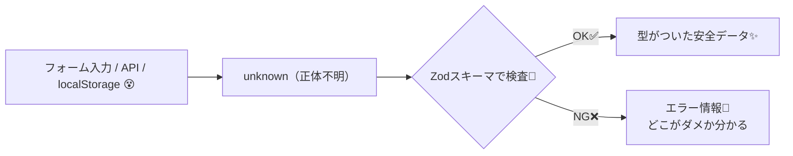

# 第184章：Zod ってなに？

## この章のゴール🎯

* **Zod が何者か**をつかむ🙂
* **TypeScriptだけじゃ守れないところ**を、Zodで守れるようになる🛡️
* `parse` / `safeParse` / `z.infer` を**超ざっくり使える**ようになる🚀

---

## Zodを一言でいうと？🧁

Zodは、**「このデータはこういう形！」っていう“ルール（スキーマ）”を1つ書くだけで**
✅ 実行時にチェック（バリデーション）できて
✅ しかもTypeScriptの型もついてくる
…っていう、TSと相性抜群のライブラリだよ✨
([Zod][1])

---

## なんで TypeScript だけじゃ足りないの？🤔

TypeScriptの型チェックって、基本は **開発中（コンパイル時）** に効くものなのね🧠
でも現実には…

* フォーム入力（ユーザーが何入れるか不明😇）
* APIレスポンス（サーバーが壊れてたり仕様ズレたり😇）
* `localStorage`（中身が古い・壊れてる😇）

みたいに、**実行時に「怪しいデータ」が入ってくる**ことがあるの！
そこでZodの出番✨「実行時にちゃんと確認してから使う」ってできる🛡️
([Zod][2])

---

## ざっくり図でイメージ（Marmaid）🗺️✨



---

## まずは超ミニ体験💡（Zodの基本3点セット）

### 1) インストール（PowerShellでOK）💻

```bash
npm i zod
```

### 2) スキーマを書く📝

`src/validation/userSchema.ts` を作ってみよ👇

```ts
import { z } from "zod";

export const UserSchema = z.object({
  name: z.string().min(1, "名前は必須だよ🙂"),
  age: z.number().int().min(0, "年齢は0以上だよ🙂"),
});
```

### 3) `parse` と `safeParse` を知る👀

* `parse()`：**OKなら返す / ダメなら例外で落ちる**💥
* `safeParse()`：**落ちない**で `{ success: boolean, ... }` が返る🧯
  ([Zod][1])

---

## Reactで「チェックしてから表示」してみる🎮✨

今回はまだRHFと合体しないよ！（次章で合体🔥）
まずは **Zod単体** を触って感覚つかも〜😊

`src/App.tsx` をこんな感じに👇

```tsx
import { useState } from "react";
import { z } from "zod";

const LoginSchema = z.object({
  email: z.string().email("メールの形じゃないかも！📧"),
  password: z.string().min(8, "パスワードは8文字以上だよ🔐"),
});

// ✅ スキーマから型を作れる（ズレないのが最高！）
type LoginData = z.infer<typeof LoginSchema>;

export default function App() {
  const [email, setEmail] = useState("");
  const [password, setPassword] = useState("");
  const [message, setMessage] = useState<string>("");

  const onSubmit = (e: React.FormEvent) => {
    e.preventDefault();

    const input = { email, password };
    const result = LoginSchema.safeParse(input);

    if (!result.success) {
      // どこがダメか、情報がまとまってる✨
      const first = result.error.issues[0];
      setMessage(`❌ ${first.path.join(".")}：${first.message}`);
      return;
    }

    // ここに来た時点で input は「正しい形」って保証された🎉
    const data: LoginData = result.data;
    setMessage(`✅ OK！ようこそ ${data.email} さん🎉`);
  };

  return (
    <div style={{ maxWidth: 520, margin: "40px auto", fontFamily: "sans-serif" }}>
      <h1>Zodミニ体験🧩✨</h1>

      <form onSubmit={onSubmit} style={{ display: "grid", gap: 12 }}>
        <label>
          メール📧
          <input
            value={email}
            onChange={(e) => setEmail(e.target.value)}
            placeholder="test@example.com"
            style={{ width: "100%", padding: 8 }}
          />
        </label>

        <label>
          パスワード🔐
          <input
            value={password}
            onChange={(e) => setPassword(e.target.value)}
            placeholder="8文字以上"
            type="password"
            style={{ width: "100%", padding: 8 }}
          />
        </label>

        <button type="submit" style={{ padding: 10, cursor: "pointer" }}>
          送信する🚀
        </button>
      </form>

      {message && (
        <p style={{ marginTop: 16, padding: 12, border: "1px solid #ddd" }}>
          {message}
        </p>
      )}
    </div>
  );
}
```

---

## Zodの「よく使うやつ」まとめ🌟

* 文字列系🧵

  * `z.string().min(1)`（必須っぽく）
  * `z.string().email()`（メール📧）
  * `z.string().url()`（URL🔗）
* 数字系🔢

  * `z.number().int()`（整数）
  * `min / max`（範囲）
* よくあるオプション🧩

  * `.optional()`（あってもなくてもOK）
  * `.nullable()`（null許可）
* ちょい上級スパイス🌶️

  * `.refine((v) => 条件, "メッセージ")`（独自ルール追加）

スキーマ定義は「小さいレゴ」みたいに組み立てる感じだよ🧱✨
([Zod][2])

---

## ミニ練習問題📝✨

### お題：年齢を「文字列で」入力してもOKにして、数字に変換したい😺

たとえば `"20"` って入ってきたら **20（number）にして使いたい**！

ヒント💡：Zodには **変換**もできる仕組みがあるよ（`.transform` とか）🎩✨
「入力は string でも、最終的に number にしたい」って時に便利！

---

## まとめ🎁

* Zodは **“実行時”のデータ検査**ができる🛡️
* しかも **スキーマから型が作れる**（`z.infer`）ので、ズレにくい✨
* 次の章（第185章）で、React Hook Formと **最強タッグ**（`zodResolver`）を組むよ🔥💪

続けて第185章の内容も、この流れでそのまま作ろっか？😊✨

[1]: https://zod.dev/?utm_source=chatgpt.com "Zod: Intro"
[2]: https://zod.dev/api?utm_source=chatgpt.com "Defining schemas"
