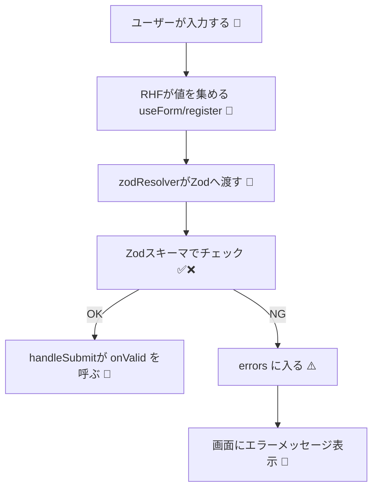

# 第185章：RHF と Zod を合体させる

## この章でできるようになること 🧠🎯

* **Zodで書いたルール（スキーマ）**を、**React Hook Form（RHF）**にそのまま接続できるようになるよ ✅
* フォームの入力値が **「型」＋「バリデーション」**で一気に安全になるよ 🛡️✨
* エラーメッセージも `errors.xxx?.message` でスッと表示できるようになるよ 🧸💬

---

## まずは入れるもの（WindowsのターミナルでOK）💻📦

プロジェクトのルート（`package.json`がある場所）で👇

```bash
npm i react-hook-form zod @hookform/resolvers
```

`@hookform/resolvers` は Zod を RHF に繋ぐ“橋渡し”だよ 🌉✨ ([npm][1])

---

## 全体の流れを図でイメージしよ 🗺️✨（Mermaid）



---

## 実装してみよう！🎮✨（最小で理解する版）

### 1) Zodで「入力ルール」を作る 🧩

たとえば「メール＋パスワード」の超基本でいくね📧🔑
（ここでは**“合体”**が主役だから、ルールはシンプルでOK🙆‍♀️）

`src/components/RhfZodDemo.tsx` を作って👇

```tsx
import { useForm } from "react-hook-form";
import { z } from "zod";
import { zodResolver } from "@hookform/resolvers/zod";

// ① Zodスキーマ（＝入力ルール表）
const schema = z.object({
  email: z.string().email("メールの形がちがうよ 📧"),
  password: z.string().min(8, "パスワードは8文字以上だよ 🔑"),
});

// ② スキーマから型を自動生成（ここ超気持ちいい✨）
type FormValues = z.infer<typeof schema>;

export function RhfZodDemo() {
  // ③ resolver に zodResolver(schema) を渡すだけ！
  const {
    register,
    handleSubmit,
    formState: { errors, isSubmitting },
  } = useForm<FormValues>({
    resolver: zodResolver(schema),
    mode: "onSubmit",
  });

  const onSubmit = async (data: FormValues) => {
    // 送信中っぽく見せる（デモ用）
    await new Promise((r) => setTimeout(r, 400));
    alert(`OK! 🎉\nemail: ${data.email}`);
  };

  return (
    <form onSubmit={handleSubmit(onSubmit)} noValidate style={{ maxWidth: 420 }}>
      <h2>RHF × Zod 合体デモ ✨</h2>

      <div style={{ marginTop: 12 }}>
        <label>
          メール 📧
          <input
            type="email"
            autoComplete="email"
            {...register("email")}
            style={{ display: "block", width: "100%", padding: 8, marginTop: 6 }}
          />
        </label>
        {errors.email?.message && (
          <p style={{ margin: "6px 0 0" }}>{errors.email.message}</p>
        )}
      </div>

      <div style={{ marginTop: 12 }}>
        <label>
          パスワード 🔑
          <input
            type="password"
            autoComplete="current-password"
            {...register("password")}
            style={{ display: "block", width: "100%", padding: 8, marginTop: 6 }}
          />
        </label>
        {errors.password?.message && (
          <p style={{ margin: "6px 0 0" }}>{errors.password.message}</p>
        )}
      </div>

      <button
        type="submit"
        disabled={isSubmitting}
        style={{ marginTop: 16, padding: "8px 12px" }}
      >
        {isSubmitting ? "送信中… 🌀" : "送信する 🚀"}
      </button>
    </form>
  );
}
```

ポイントはこの3つだけだよ👇🥳

* `resolver: zodResolver(schema)` を渡す ([POCKETSIGN TECH BLOG][2])
* `type FormValues = z.infer<typeof schema>` で型が勝手にできる ✨
* `errors.email?.message` を表示するだけでエラーUI完成 💬

※ `z.string().email()` のメール判定は Zodの標準だよ 📧 ([Zod][3])

---

### 2) `App.tsx` に表示して動作確認 👀✨

`src/App.tsx` をこんな感じに👇

```tsx
import { RhfZodDemo } from "./components/RhfZodDemo";

export default function App() {
  return (
    <div style={{ padding: 24 }}>
      <RhfZodDemo />
    </div>
  );
}
```

起動して確認👇🚀

```bash
npm run dev
```

* 変なメール（`aaa`とか）で送信 → エラー出る ⚠️
* パスワード7文字 → エラー出る ⚠️
* 正しく入れる → `alert` 出る 🎉

---

## つまずきがちなところ（ここ大事）🧯💥

### ✅ `zodResolver` の import がコケる／バージョン相性が悪い

Zod と `@hookform/resolvers` の組み合わせで、**バージョン差**が原因のエラーが出ることがあるよ💦
（例：`zod/v4/core` が無い系） ([GitHub][4])

困ったらまずこれでOK👇✨

```bash
npm i zod@latest @hookform/resolvers@latest
```

あと、Zod v4 対応は `@hookform/resolvers` を新しめ（v5.1.0以降）にするのが目安だよ🔧 ([Zenn][5])

---

## ミニ練習（30分で終わるやつ）⏱️🍓

1. `schema` に次を追加してみて👇

* `password` に「数字を1個以上」ルール（`.regex(...)`）を足す 🔢

2. 送信成功したら `alert` じゃなくて画面に「ログイン成功🎉」って表示してみて✨
   （`useState` でOK！）

---

## 次の章につながる一言 📚➡️✨

この章で **「RHFにZodを合体させる配線」**は完璧〜！🎉
次の **第186章**は、ここに **文字種チェック付きのログインフォーム**を作って「実戦」にするよ🔥😆

[1]: https://www.npmjs.com/package/%40hookform/resolvers?utm_source=chatgpt.com "hookform/resolvers"
[2]: https://tech.pocketsign.co.jp/entry/2025/09/29/183342?utm_source=chatgpt.com "React Hook Form で動的にバリデーションスキーマを切り替える"
[3]: https://zod.dev/api?utm_source=chatgpt.com "Defining schemas"
[4]: https://github.com/react-hook-form/resolvers/issues/811?utm_source=chatgpt.com "\"module not found\" when importing zodResolver under Zod ..."
[5]: https://zenn.dev/aprender/articles/5bfa30fd37f99c?utm_source=chatgpt.com "React Hook FormがZod v4に公式対応しました🎉"
