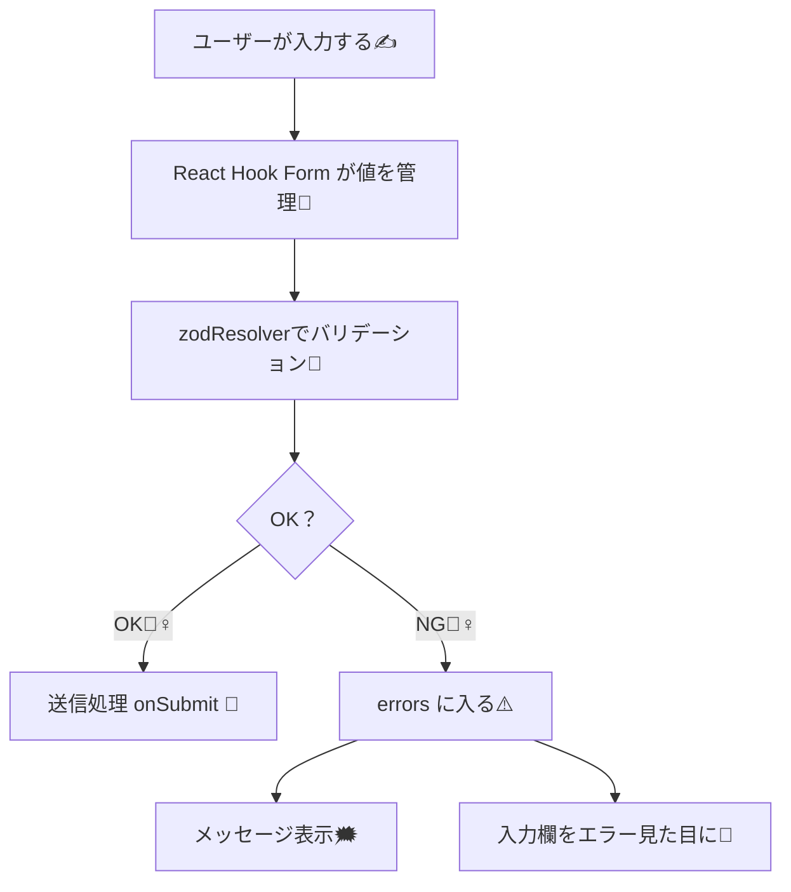

# 第187章：エラーメッセージの出し分けとスタイリング

この章は「ログインフォーム（第186章の続き）」を、**“ちゃんと親切で見やすい”** UIに進化させる回だよ〜😊💕

---

## 今日できるようになること✅

* エラーを **「いつ」「どこに」「何を」** 出すかを決められる🧠✨
* **入力欄の見た目（枠色・背景・メッセージ）** をエラー時だけ変えられる🎨
* **1つだけ表示 / 複数まとめて表示** を切り替えられる📌
* サーバー側の失敗（ログイン失敗など）も「それっぽく」表示できる🧯

---

## エラー表示の全体の流れ（図解）🗺️



---

## 1) “出し分け”の考え方：いつ出す？どこに出す？⏰📍

よく使うパターンはこれだよ👇✨

* **入力中にずっとエラー出す** → ちょっと怖い😵（初心者向けにはキツい）
* **入力欄からフォーカス外れたら出す（onBlur）** → 優しい😊
* **送信ボタン押したときにまとめて出す（onSubmit）** → スッキリ😌

今回は使いやすい **onBlur + 入力中に更新** の組み合わせにするよ💕

---

## 2) 実装：エラーメッセージを「キレイに」出すフォーム✨

### 使うファイル構成📁

* `src/components/LoginForm.tsx`
* `src/components/LoginForm.module.css`
* `src/App.tsx`

---

## 3) LoginForm.tsx（エラー出し分け + サーバーエラーも）🧩

ポイントはここ👇

* `mode: "onBlur"`：フォーカス外れたらエラー出す
* `reValidateMode: "onChange"`：直し始めたら即更新
* `criteriaMode: "all"`：**1項目に複数エラー** を集められる（パスワードとかに便利）🔒
* `setError("root.server", ...)`：ログイン失敗などをフォーム下部に表示できる🔥

```tsx
// src/components/LoginForm.tsx
import { useMemo } from "react";
import { useForm, type FieldError } from "react-hook-form";
import { z } from "zod";
import { zodResolver } from "@hookform/resolvers/zod";
import styles from "./LoginForm.module.css";

const loginSchema = z.object({
  email: z
    .string()
    .min(1, "メールアドレスは必須だよ📧")
    .email("メールアドレスの形がちょっと変かも😵"),
  password: z
    .string()
    .min(8, "8文字以上にしてね🔒")
    .regex(/[A-Z]/, "大文字を1つ入れてね🔠")
    .regex(/[a-z]/, "小文字を1つ入れてね🔡")
    .regex(/[0-9]/, "数字を1つ入れてね🔢"),
});

type LoginFormValues = z.infer<typeof loginSchema>;

// FieldError から「表示したい文言リスト」を取り出す関数✨
function getErrorMessages(error?: FieldError): string[] {
  if (!error) return [];

  // criteriaMode: "all" のときは error.types に複数入ることがある
  if (error.types) {
    return Object.values(error.types).flatMap((v) => (Array.isArray(v) ? v : [v]));
  }

  if (typeof error.message === "string") return [error.message];
  return [];
}

// ダミーのログインAPI（わざと失敗させる例）
async function fakeLoginApi(values: LoginFormValues): Promise<void> {
  await new Promise((r) => setTimeout(r, 700));
  if (values.email !== "test@example.com" || values.password !== "Password1") {
    throw new Error("メールアドレスかパスワードが違うよ😢");
  }
}

export function LoginForm() {
  const {
    register,
    handleSubmit,
    formState: { errors, isSubmitting, touchedFields },
    setError,
    clearErrors,
  } = useForm<LoginFormValues>({
    resolver: zodResolver(loginSchema),
    mode: "onBlur",
    reValidateMode: "onChange",
    criteriaMode: "all",
    defaultValues: { email: "", password: "" },
  });

  const emailMessages = useMemo(() => getErrorMessages(errors.email), [errors.email]);
  const passwordMessages = useMemo(() => getErrorMessages(errors.password), [errors.password]);

  const onSubmit = async (values: LoginFormValues) => {
    clearErrors("root"); // 前回のサーバーエラーを消す🧼
    try {
      await fakeLoginApi(values);
      alert("ログイン成功🎉（ダミー）");
    } catch (e) {
      const message = e instanceof Error ? e.message : "ログイン失敗😢";
      setError("root.server", { type: "server", message });
    }
  };

  // 「まだ触ってないのに赤いのは怖い」問題を避けるためのフラグ✨
  const showEmailError = touchedFields.email && emailMessages.length > 0;
  const showPasswordError = touchedFields.password && passwordMessages.length > 0;

  return (
    <form className={styles.form} onSubmit={handleSubmit(onSubmit)} noValidate>
      <h2 className={styles.title}>ログイン🔐</h2>

      {/* Email */}
      <div className={styles.field}>
        <label className={styles.label} htmlFor="email">
          メールアドレス📧
        </label>

        <input
          id="email"
          type="email"
          autoComplete="email"
          className={`${styles.input} ${showEmailError ? styles.inputError : ""}`}
          aria-invalid={showEmailError}
          aria-describedby={showEmailError ? "email-error" : undefined}
          placeholder="test@example.com"
          {...register("email")}
        />

        {/* エラー：1つだけ表示したいなら emailMessages[0] でもOK👌 */}
        {showEmailError && (
          <ul id="email-error" className={styles.errorList} role="alert">
            {emailMessages.map((m) => (
              <li key={m} className={styles.errorText}>
                {m}
              </li>
            ))}
          </ul>
        )}
      </div>

      {/* Password */}
      <div className={styles.field}>
        <label className={styles.label} htmlFor="password">
          パスワード🔒
        </label>

        <input
          id="password"
          type="password"
          autoComplete="current-password"
          className={`${styles.input} ${showPasswordError ? styles.inputError : ""}`}
          aria-invalid={showPasswordError}
          aria-describedby={showPasswordError ? "password-error" : "password-hint"}
          placeholder="Password1"
          {...register("password")}
        />

        {/* ヒント：エラーがない時だけ出す（優しいやつ😊） */}
        {!showPasswordError && (
          <p id="password-hint" className={styles.hintText}>
            例：<b>Password1</b>（8文字以上・英大文字/小文字/数字）🧩
          </p>
        )}

        {/* 複数エラーを出す */}
        {showPasswordError && (
          <ul id="password-error" className={styles.errorList} role="alert">
            {passwordMessages.map((m) => (
              <li key={m} className={styles.errorText}>
                {m}
              </li>
            ))}
          </ul>
        )}
      </div>

      {/* サーバーエラー（ログイン失敗など） */}
      {"server" in (errors.root ?? {}) && errors.root?.server?.message && (
        <div className={styles.serverError} role="alert">
          {errors.root.server.message}
        </div>
      )}

      <button className={styles.button} type="submit" disabled={isSubmitting}>
        {isSubmitting ? "送信中…⏳" : "ログインする🚀"}
      </button>

      <p className={styles.note}>
        ※ ダミーだよ：<b>test@example.com</b> と <b>Password1</b> で成功🎉
      </p>
    </form>
  );
}
```

---

## 4) LoginForm.module.css（エラー時だけ“それっぽく”する💄）

* 枠を赤くする
* 背景をうっすら赤くする
* エラーメッセージは小さめ＆読みやすく
* サーバーエラーは「箱」で目立たせる📦

```css
/* src/components/LoginForm.module.css */
.form {
  width: min(420px, 92vw);
  margin: 40px auto;
  padding: 20px;
  border: 1px solid #e9e9e9;
  border-radius: 14px;
  background: #fff;
}

.title {
  margin: 0 0 14px;
  font-size: 20px;
}

.field {
  margin-bottom: 14px;
}

.label {
  display: block;
  font-size: 14px;
  margin-bottom: 6px;
}

.input {
  width: 100%;
  padding: 10px 12px;
  border: 1px solid #d6d6d6;
  border-radius: 10px;
  outline: none;
}

.input:focus {
  border-color: #999;
}

.inputError {
  border-color: #e05252;
  background: #fff5f5;
}

.hintText {
  margin: 8px 0 0;
  font-size: 12px;
  color: #666;
}

.errorList {
  margin: 8px 0 0;
  padding-left: 18px;
}

.errorText {
  font-size: 12px;
  color: #d83b3b;
  line-height: 1.4;
}

.serverError {
  margin: 10px 0 14px;
  padding: 10px 12px;
  border-radius: 10px;
  border: 1px solid #e05252;
  background: #fff5f5;
  color: #b82626;
  font-size: 13px;
}

.button {
  width: 100%;
  padding: 10px 12px;
  border: 0;
  border-radius: 12px;
  background: #111;
  color: #fff;
  cursor: pointer;
}

.button:disabled {
  opacity: 0.6;
  cursor: not-allowed;
}

.note {
  margin: 10px 0 0;
  font-size: 12px;
  color: #666;
}
```

---

## 5) App.tsx（表示するだけ）🧷

```tsx
// src/App.tsx
import { LoginForm } from "./components/LoginForm";

export default function App() {
  return <LoginForm />;
}
```

---

## 6) ここが“出し分け”の核心だよ💡✨

### ✅「触ってからエラー出す」

今回のこれが優しいポイント👇

* `touchedFields.email` が `true` のときだけ表示
* つまり **初見で真っ赤にならない** 😌

### ✅「1つだけ出す」or「全部出す」

* **1つだけ（シンプル）**

  * `errors.email?.message` を出すだけ
* **全部（パスワード条件など）**

  * `criteriaMode: "all"` → `error.types` をリストで表示

---

## 7) ちょい大事：アクセシビリティ（やさしさポイント）🫶

* `aria-invalid`：エラー状態だよって機械にも伝える
* `aria-describedby`：どの文章が説明（エラー）か結びつける
* `role="alert"`：エラーを「重要」扱いにして読み上げにも強い📣

これ、地味だけどプロっぽい✨

---

## 8) 練習問題✍️🎯

### 練習1：メールのエラーを「1つだけ」にしてみよう😊

* `emailMessages.map(...)` をやめて
* `emailMessages[0]` だけ表示にする（UIがスッキリ！）

### 練習2：パスワードのエラーを「上から順」に固定してみよう🔒

* 今は `Object.values` だから順番が環境でブレることがあるかも
* `min → 大文字 → 小文字 → 数字` の順で表示するロジックに挑戦💪

### 練習3：ログイン失敗のとき、パスワード欄だけ赤くしてみよう😈

* サーバーエラー時に `setError("password", ...)` を使ってみる
* でもメッセージは「フォーム下」に出す、みたいな出し分けもアリ✨

---

## 9) まとめ📌🎀

* エラーは **「タイミング（touched / onBlur）」** が超大事⏰
* **1つだけ** か **全部** かはフォームの性格で決める🧠
* スタイルは「入力欄」と「メッセージ」をセットで変えると分かりやすい💄
* サーバーエラーは `setError("root.server")` が便利🔥

---

次の第188章は `useFieldArray` で「入力欄が増えるフォーム」いくよ〜➕📝
